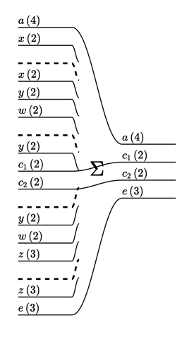
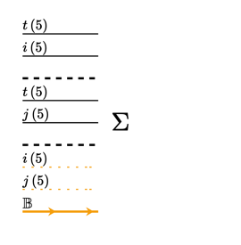
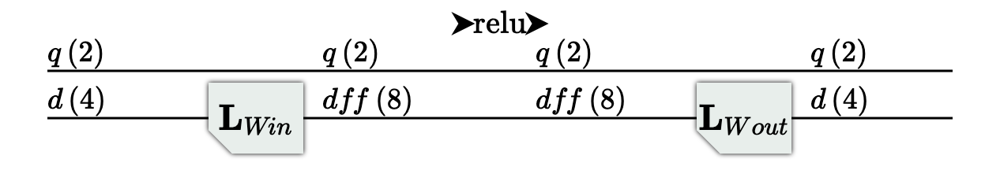
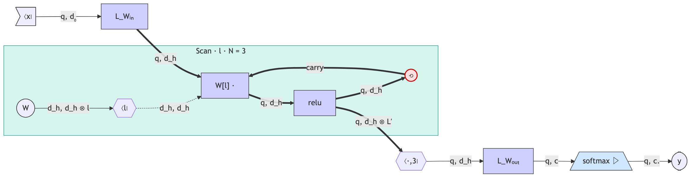

<!-- markdownlint-disable MD024 -->
# Tensor Logic DSL — Worked Examples

Each example is shown five ways:

1. **Mathematical description** — the tensor-logic / einsum form.
2. **PyRel** — the equivalent [PyRel](https://docs.relational.ai) program. PyRel is a
   Datalog extension that subsumes tensor logic; tensors are relations and contraction is
   `sum(product).per(output_indices)`. See [tensor_logic_in_pyrel.md](../papers/tensor_logic_in_pyrel.md).
3. **TL DSL** — the equivalent `data_structure/TensorDSL.py` program (runnable as-is).
4. **Visualization** — the string diagram. pyncd's text renderer (`display.print_category`)
   draws the same node graph that the tsncd TypeScript frontend renders as an interactive
   SVG; the ASCII form is shown here, with a note on launching the live graphical view.
5. **Generated PyTorch** — pyncd does **not** emit `.py` source; `ConstructedModule.construct`
   builds an `nn.Module`. The faithful artifacts are that module's structure (`repr`), the
   `einops.einsum` signature strings its `forward` runs, and its buffers/parameters.

All captured output below is real (produced by running the code, not hand-written).

For the DSL itself see [tensor_logic_dsl.md](tensor_logic_dsl.md); for the Boolean
semiring / rendering see [bool_semiring_extension.md](bool_semiring_extension.md).

---

## Example 1 — Basic Factor Graph Contraction

A factor graph over five binary factors with the topology:

```text
A – B – C
    |
    D – E
```

Factors A and E are rank-2; B, C, and D are rank-3. Shared variables — the edges — are
contracted; four external variables (`a`, `c_1`, `c_2`, `e`) are retained.

### 1. Mathematical description

Label the variables: `x` is shared by A and B; `y` is shared by B, C, and D; `w` is
shared by B and D; `z` is shared by D and E.

$$
\text{Result}[a, c_1, c_2, e] = A[a, x]\; B[x, y, w]\; C[y, c_1, c_2]\; D[y, w, z]\; E[z, e]
$$

`x`, `y`, `w`, `z` are absent from the left-hand side and therefore contracted; `a`, `c_1`, `c_2`, `e`
appear on both sides and are retained.

### 2. PyRel

Each factor is declared as a `Relationship`; shared index variables are unified across
patterns in `where(...)`. All four contracted indices are summed by `.per(a, c1, c2, e)`.

```python
from relationalai.semantics import Model, Float, Integer, where
from relationalai.semantics.std.aggregates import sum

model = Model("factor_graph")

A      = model.Relationship(f"{Integer:a} {Integer:x} {Float:val}")
B      = model.Relationship(f"{Integer:x} {Integer:y} {Integer:w} {Float:val}")
C      = model.Relationship(f"{Integer:y} {Integer:c1} {Integer:c2} {Float:val}")
D      = model.Relationship(f"{Integer:y} {Integer:w} {Integer:z} {Float:val}")
E      = model.Relationship(f"{Integer:z} {Integer:e} {Float:val}")
Result = model.Concept("result")

a, x, y, w, z = Integer.ref(), Integer.ref(), Integer.ref(), Integer.ref(), Integer.ref()
c1, c2, e = Integer.ref(), Integer.ref(), Integer.ref()
va, vb, vc, vd, ve = Float.ref(), Float.ref(), Float.ref(), Float.ref(), Float.ref()

where(
    A(a, x, va), B(x, y, w, vb), C(y, c1, c2, vc), D(y, w, z, vd), E(z, e, ve)
).define(
    Result.new(a=a, c1=c1, c2=c2, e=e, val=sum(va*vb*vc*vd*ve).per(a, c1, c2, e))
)
```

### 3. TL DSL

```python
import torch
from data_structure.TensorDSL import TL, real_axis
from torch_compile.torch_compile import ConstructedModule

a  = real_axis('a', 4)
c1 = real_axis('c_1', 2)
c2 = real_axis('c_2', 2)
e  = real_axis('e', 3)
x  = real_axis('x', 2)   # shared: A–B
y  = real_axis('y', 2)   # shared: B–C and B–D
w  = real_axis('w', 2)   # shared: B–D
z  = real_axis('z', 3)   # shared: D–E

tl = TL()
tl.A.tensor(a, x)
tl.B.tensor(x, y, w)
tl.C.tensor(y, c1, c2)
tl.D.tensor(y, w, z)
tl.E.tensor(z, e)
tl.Result[a, c1, c2, e] = tl.A[a, x] * tl.B[x, y, w] * tl.C[y, c1, c2] * tl.D[y, w, z] * tl.E[z, e]

morph = tl.to_morphism()
module = ConstructedModule.construct(morph)

A_t = torch.randn(4, 2)      # a  x
B_t = torch.randn(2, 2, 2)   # x  y  w
C_t = torch.randn(2, 2, 2)   # y  c1 c2
D_t = torch.randn(2, 2, 3)   # y  w  z
E_t = torch.randn(3, 3)      # z  e
out = module(A_t, B_t, C_t, D_t, E_t)
out = out[0] if isinstance(out, tuple) else out
assert out.shape == (4, 2, 2, 3)
```

### 4. Visualization

Read the diagram left-to-right. Five input factor groups enter from the left, each
labelled by their two axes. The **`Σ`** box contracts all shared variables simultaneously,
producing the four retained output wires `a(4)`, `c_1(2)`, `c_2(2)`, `e(3)`. Dashed separators
delimit the five factor inputs.



### 5. Generated PyTorch

The whole contraction compiles to a single `ConstructedTensorEquation`:

```text
ConstructedThreadedComposed(
  (chain): ModuleList(
    (0): ConstructedTensorEquation()
  )
)
```

Its `forward` runs one `einops.einsum` call whose signature reflects the five factors and
four retained axes:

```python
module.chain[0].signature
# '... y0 x0, ... x0 x1 x2, ... x1 y1 y2, ... x1 x2 x3, ... x3 y3 -> ... y0 y1 y2 y3'
# i.e.  a  x ,   x   y   w ,   y  c1 c2  ,   y   w   z ,   z   e   ->  a  c1 c2  e
```

The module has no learned parameters — all five factors are caller inputs.

---

## Example 2 — Predicates for Masked Aggregation

A rank-2 feature table F (table × node) on a 5-node graph. F is used twice in the
equation — once for source nodes and once for target nodes. An `edge(i, j)` predicate
selects which pairs contribute. All indices are contracted, yielding a scalar.

### 1. Mathematical description

`F[t, n]` stores a scalar feature for each (table, node) pair. All three indices —
table `t`, source node `i`, and target node `j` — are contracted:

$$
\text{Result} = F[t, i]\; F[t, j]\; [\text{edge}(i, j)]
$$

`t`, `i`, and `j` are all absent from the left-hand side and are therefore contracted.
The Iverson bracket $[\text{edge}(i,j)]$ restricts the sum to pairs where an edge exists.

### 2. PyRel

`F` is joined against itself on shared table index `t`. Including `edge(i, j)` in the
`where(...)` clause acts as the Iverson bracket. No output indices → scalar aggregate.

```python
from relationalai.semantics import Model, Float, Integer, where
from relationalai.semantics.std.aggregates import sum

model = Model("graph_aggregation")

F      = model.Relationship(f"{Integer:t} {Integer:n} {Float:val}")
edge   = model.Relationship(f"{Integer:i} {Integer:j}")   # presence = True
Result = model.Concept("result")

t, i, j = Integer.ref(), Integer.ref(), Integer.ref()
vfi, vfj = Float.ref(), Float.ref()

where(edge(i, j), F(t, i, vfi), F(t, j, vfj)).define(
    Result.new(val=sum(vfi*vfj).per())
)
```

### 3. TL DSL

All three indices are contracted. The empty subscript `[()]` on the LHS declares
`Result` as a scalar (zero free axes).

```python
import torch
from data_structure.TensorDSL import TL, real_axis
from torch_compile.torch_compile import ConstructedModule

t = real_axis('t', 5)   # table id (contracted)
n = real_axis('n', 5)   # node domain — used for F declaration
i = real_axis('i', 5)   # source node (contracted)
j = real_axis('j', 5)   # target node (contracted)

tl = TL()
tl.F.tensor(t, n)
tl.edge.predicate(n, n)   # Bool-typed 5×5 adjacency matrix

tl.Result[()] = tl.F[t, i] * tl.F[t, j] * tl.edge[i, j]

morph = tl.to_morphism()
module = ConstructedModule.construct(morph)

F_t = torch.randn(5, 5)
adj = (torch.rand(5, 5) > 0.6).float()
out = module(F_t, F_t, adj)   # F passed twice: once as F[t,i], once as F[t,j]
out = out[0] if isinstance(out, tuple) else out
assert out.shape == torch.Size([])
```

### 4. Visualization

Read the diagram left-to-right. The three input groups are the two F instances
(axes `t(5)` and `i(5)` / `j(5)`) and the edge predicate (orange **𝔹** wire,
axes `i(5) × j(5)`). The **`Σ`** box contracts over all three indices `t`, `i`, and `j`,
producing a scalar output (no output wire). The orange colour distinguishes Bool-typed
wires from real-valued ones.



### 5. Generated PyTorch

```text
ConstructedThreadedComposed(
  (chain): ModuleList(
    (0): ConstructedTensorEquation()
  )
)
```

```python
module.chain[0].signature
# '... x0 x1, ... x0 x2, ... x1 x2 -> ...'
# i.e.  t   i ,   t   j ,   i   j  -> (scalar)
```

The module has no learned parameters — F and the adjacency matrix are caller inputs.

---

## Example 3 — Multi-Layer Perceptron

A two-layer MLP (one hidden layer with a ReLU): project the input up to a hidden
dimension, apply ReLU, project back down.

### 1. Mathematical description

With batch/position index `q`, model dimension `d`, and hidden dimension `f`,
in **tensor-logic (Einstein) notation** — a repeated index on the right that
does not appear on the left is implicitly summed:

$$
H[q, f] = \mathrm{relu}\!\big( W_{\text{in}}[f, d]\; X[q, d] \big)
\qquad
\mathrm{Out}[q, d] = W_{\text{out}}[d, f]\; H[q, f]
$$

So `d` (repeated on the right, absent on the left of the first equation) is
contracted, and likewise `f` in the second; the left-hand indices are retained.
This implicit-summation convention is exactly the DSL's rule — contraction is
read from axis (UID) identity, never written as an explicit `Σ`.

### 2. PyRel

Two rules, one per equation. Shared index `d` is contracted in the first rule via
`.per(q, f)`; shared `f` is contracted in the second. The intermediate `H` is a
`Concept` populated by the first rule and queried by the second.

```python
from relationalai.semantics import Model, Float, Integer, where
from relationalai.semantics.std.aggregates import sum
from relationalai.semantics.std.math import relu

model = Model("mlp")

# W_in / W_out are supplied relations as PyRel has no learned
# relations. 
W_in  = model.Relationship(f"{Integer:f} {Integer:d} {Float:val}")
W_out = model.Relationship(f"{Integer:d} {Integer:f} {Float:val}")
X     = model.Relationship(f"{Integer:q} {Integer:d} {Float:val}")
H     = model.Concept("H")
Out   = model.Concept("Out")

q, d, f = Integer.ref(), Integer.ref(), Integer.ref()
vw, vx, vh = Float.ref(), Float.ref(), Float.ref()

where(W_in(f, d, vw), X(q, d, vx)).define(
    H.new(q=q, f=f, val=relu(sum(vw*vx).per(q, f)))
)

where(W_out(d, f, vw), H(q, f, vh)).define(
    Out.new(q=q, d=d, val=sum(vw*vh).per(q, d))
)
```

### 3. TL DSL

We build it from `.linear()` layers (§4 of [tensor_logic_dsl.md](tensor_logic_dsl.md)):
each weight is declared a Linear layer, so the weight-multiplies become `Linear`
operators whose weights are the layers' **internal parameters** — you pass only `X`.

```python
import torch
from data_structure.TensorDSL import TL, real_axis, relu
from torch_compile.torch_compile import ConstructedModule

q   = real_axis('q', 2)      # batch / sequence position
d   = real_axis('d', 4)      # model dimension
dff = real_axis('dff', 8)    # hidden dimension

tl = TL()
tl.W_in.linear(out_axes=(dff,), in_axes=(d,))     # Linear layer  d -> dff
tl.W_out.linear(out_axes=(d,), in_axes=(dff,))    # Linear layer  dff -> d
tl.H[q, dff] = relu(tl.W_in[dff, d] * tl.X[q, d])
tl.Out[q, d] = tl.W_out[d, dff] * tl.H[q, dff]

morph = tl.to_morphism()                  # ThreadedComposed (two layers, H threaded)
module = ConstructedModule.construct(morph)

out = module(torch.randn(2, 4))           # only X; weights live inside as parameters
out = out[0] if isinstance(out, tuple) else out
assert out.shape == (2, 4)
```

> **Alternative — explicit contraction (weights as data).** Drop the two `.linear()`
> declarations and the *same* equations express plain tensor contractions, where
> `W_in`/`W_out` are ordinary input tensors you supply: `module(W_in, X, W_out)`. That
> form draws `Σ` (einsum) boxes with the weights as input wires instead of `L` boxes —
> the tensor-logic philosophy of weights-as-explicit-data. `.linear()` is the opt-in
> that reframes a weight as a trainable layer.

### 4. Visualization

Read the diagram left-to-right. Wires are labelled `axis(size)` and carry tensors
between boxes. **`L`** boxes (subscripted by weight name) are learned linear layers.
**`▶relu▶`** is a pointwise nonlinearity. The
upper wire (`q`) is the batch dimension, which passes through unchanged; the lower wire
(`d`/`dff`) is the feature dimension transformed by each layer.



### 5. Generated PyTorch

The compiled module is a `ThreadedComposed` of the two layers; the ReLU is folded into
the first as a `Lambda`. Each layer is a `ConstructedLinear` wrapping a `Multilinear`
(the learned weight):

```text
ConstructedThreadedComposed(
  (chain): ModuleList(
    (0): ConstructedComposed(
      (chain): Sequential(
        (0): ConstructedLinear(
          (module): Multilinear((4,) -> (8,) (weights): Weights(size=(4, 8)))
        )
        (1): Lambda(ReLU(name=DynamicName(body='\\mathrm{relu}', ...), operator='relu'))
      )
    )
    (1): ConstructedLinear(
      (module): Multilinear((8,) -> (4,) (weights): Weights(size=(8, 4)))
    )
  )
)
```

Unlike the explicit-contraction form, the weights here **are learned parameters**, not
caller inputs — one per layer:

```python
[(n, tuple(p.shape)) for n, p in module.named_parameters()]
# [('chain.0.chain.0.module.weights.weight', (4, 8)),   # W_in : d -> dff
#  ('chain.1.module.weights.weight',         (8, 4))]   # W_out: dff -> d
```

(`bias=True` on a `.linear()` declaration adds a matching bias parameter; multi-axis
feature blocks like `out_axes=(h, k)` give a weight whose shape is `in_size + out_size`.)

---

## Example 4 — Deep MLP

A 5-layer MLP expressed as a scan over layer depth: input projection followed by a
3-step recurrence with an independent weight matrix at each step, then a softmax
output projection.

| Axis  | Size | Meaning                                                             |
|-------|------|---------------------------------------------------------------------|
| `q`   | 8    | batch / sequence position                                           |
| `d_0` | 100  | input feature dimension                                             |
| `d_h` | 64   | hidden dimension (uniform across all layers)                        |
| `c`   | 10   | output class labels                                                 |
| `l`   | 3    | recurrence depth; `l=0` is base state, `l=3` is final hidden state  |

### 1. Mathematical description

**Base case** — input projection (no activation):

$$h[q,\, d_h,\, 0] = W_{\mathrm{in}}[d_0,\, d_h]\; x[q,\, d_0]$$

**Recurrence** ($l = 0, 1, 2$) — independent weight matrix at each step:

$$h[q,\, d_h,\, l{+}1] = \mathrm{relu}\!\left(W[l,\, \tilde{d},\, d_h]\; h[q,\, \tilde{d},\, l]\right)$$

**Output** — linear projection followed by softmax:

$$y[q,\, c.] = \mathrm{softmax}\!\left(W_{\mathrm{out}}[d_h,\, c]\; h[q,\, d_h,\, 3]\right)$$

The dot suffix on an axis label (here `c.`) marks that axis as the normalisation
axis of `softmax`; the result is a probability distribution over `c` for every `q`.
This convention replaces the traditional subscript `softmax_c`.

$W[l,\,\cdot,\,\cdot]$ is a **stack of independent weight matrices** — one per
step, not shared across depth. Total learned parameters:
$W_{\mathrm{in}}$ ($d_0 \times d_h$), $W$ ($3 \times d_h \times d_h$),
$W_{\mathrm{out}}$ ($d_h \times c$); 5 linear applications.

### 2. PyRel

Each recurrence step is a separate `where(...).define(...)` rule that joins the
hidden state at depth `l` with the weight relation for that step. PyRel evaluates
all facts simultaneously, so each step rule fires independently on the depth-indexed
`H` concept.

```python
from relationalai.semantics import Model, Float, Integer, where
from relationalai.semantics.std.aggregates import sum

model = Model("deep_mlp")

x     = model.Relationship(f"{Integer:q} {Integer:d0} {Float:val}")
W_in  = model.Relationship(f"{Integer:d0} {Integer:dh} {Float:val}")
W1    = model.Relationship(f"{Integer:dh_in} {Integer:dh_out} {Float:val}")
W2    = model.Relationship(f"{Integer:dh_in} {Integer:dh_out} {Float:val}")
W3    = model.Relationship(f"{Integer:dh_in} {Integer:dh_out} {Float:val}")
W_out = model.Relationship(f"{Integer:dh} {Integer:c} {Float:val}")
H     = model.Concept("hidden")
Y     = model.Concept("output")

q, d0, dh, dh_in, dh_out, c = (Integer.ref() for _ in range(6))
vx, win, w1, w2, w3, wout, vh = (Float.ref() for _ in range(7))

# Input projection → h_0
where(x(q, d0, vx), W_in(d0, dh, win)).define(
    H.new(q=q, dh=dh, l=0, val=sum(vx*win).per(q, dh))
)

# Hidden layer 1: h_0 → h_1
where(H(q, dh_in, 0, vh), W1(dh_in, dh_out, w1)).define(
    H.new(q=q, dh=dh_out, l=1, val=relu(sum(vh*w1).per(q, dh_out)))
)

# Hidden layer 2: h_1 → h_2
where(H(q, dh_in, 1, vh), W2(dh_in, dh_out, w2)).define(
    H.new(q=q, dh=dh_out, l=2, val=relu(sum(vh*w2).per(q, dh_out)))
)

# Hidden layer 3: h_2 → h_3
where(H(q, dh_in, 2, vh), W3(dh_in, dh_out, w3)).define(
    H.new(q=q, dh=dh_out, l=3, val=relu(sum(vh*w3).per(q, dh_out)))
)

# Output: h_3 → y (softmax over c)
where(H(q, dh, 3, vh), W_out(dh, c, wout)).define(
    Y.new(q=q, c=c, val=softmax(sum(vh*wout).per(q)))
)
```

### 3. TL DSL

`iteration_axis(l)` declares `l` as the scan counter; the base case and step
equation together define how `h[q, dh, l]` evolves. `W` is a 3D weight stack
of shape `(3, d_h, d_h)`; `dh_in` (same size as `dh`) names the contracted
hidden dimension inside the step equation to distinguish it from the free output
axis `dh`.

```python
import torch
from data_structure.TensorDSL import TL, real_axis, relu, softmax
from torch_compile.torch_compile import ConstructedModule

q     = real_axis('q',     8)
d0    = real_axis('d0',  100)
dh    = real_axis('dh',   64)
dh_in = real_axis('dh_in', 64)   # contracted dim in step equation
c     = real_axis('c',    10)
l     = real_axis('l',     3)    # 3 recurrent steps

tl = TL()
tl.W_in.linear(out_axes=(dh,), in_axes=(d0,))
tl.W_out.linear(out_axes=(c,), in_axes=(dh,))

tl.h[q, dh, 0]   = tl.W_in[dh, d0] * tl.x[q, d0]
tl.h[q, dh, l+1] = relu(tl.W[l, dh_in, dh] * tl.h[q, dh_in, l])
tl.iteration_axis(l)
tl.y[q, c]        = softmax(tl.W_out[c, dh] * tl.h[q, dh, 3])

morph  = tl.to_morphism()
module = ConstructedModule.construct(morph)

x_in = torch.randn(8, 100)
W    = torch.randn(3, 64, 64)    # one 64×64 matrix per step

y    = module(x_in, W)
y    = y[0] if isinstance(y, tuple) else y   # (8, 10)
assert y.shape == (8, 10)
assert torch.allclose(y.sum(-1), torch.ones(8), atol=1e-5)
```

`W` is passed as an external input, not a module parameter. In practice wrap it in
an `nn.Parameter` and pass it at each forward call.

### 4. Visualization

The recurrence is drawn with the **rolled `ScanBox`** notation of
[iteration.md § 7](../papers/iteration.md#7-diagrammatic-notation-a-string-diagram-realization-of-the-scanbox),
in the string-diagram grammar of
[weavesWiresMorphisms.pdf](../papers/weavesWiresMorphisms.pdf): wires carry axis
types, named morphisms (`L_Wᵢₙ`, `W[l] ·`, `relu`, `L_Wₒᵤₜ`) are solid boxes, slices
are reindexing hexagons (`⟨l∣`, `⟨·,3∣`), the input is an element flag (`⟨x∣`), and
the `Scan` is a **Block** (the paper's container for repeated structure). The one
non-standard mark is the **carry** — the `⟲` feedback (a *trace*, §7.1) that hands the
state `(q, d_h)` from step `l` to `l+1`. `L_Wᵢₙ` injects the carry at `l=0`; the block
emits the full history over `L′` (`scanl`, §6.4), and the hexagon `⟨·,3∣` selects the
final slice `h³` for `L_Wₒᵤₜ ▸ softmax`.



See [iteration.md § 7](../papers/iteration.md#7-diagrammatic-notation-a-string-diagram-realization-of-the-scanbox)
for the unrolled semantics and the mapping onto `ConstructedScan`.

### 5. Generated PyTorch

```text
ConstructedThreadedComposed(
  (chain): ModuleList(
    (0): ConstructedLinear(module: Multilinear((100,) -> (64,)))   # W_in
    (1): ConstructedScan(
      (step_module): ConstructedComposed(
        (chain): Sequential(
          (0): ConstructedBroadcasted(operator=Multilinear((64,) -> (64,)))
          (1): Lambda(ReLU(...))
        )
      )
      (base_module): ConstructedTensorEquation()
    )
    (2): ConstructedComposed(
      (chain): Sequential(
        (0): ConstructedLinear(module: Multilinear((64,) -> (10,)))  # W_out
        (1): Lambda(SoftMax(...))
      )
    )
  )
)
```

```python
[(n, tuple(p.shape)) for n, p in module.named_parameters()]
# [('chain.0.module.weights.weight',           (100, 64)),  # W_in
#  ('chain.2.chain.0.module.weights.weight',   ( 64, 10))]  # W_out
# W (shape 3×64×64) is an external input — not tracked as a module parameter
```
