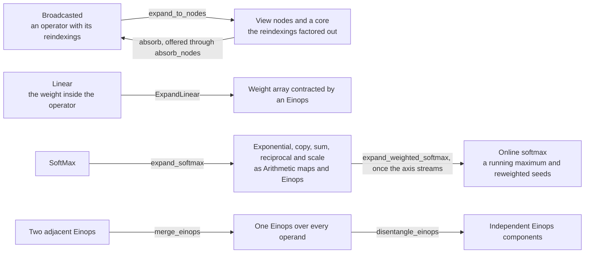

# Expression Simplification

## What it is

Two rewrites that make a derived expression readable, and one search they share.

A derivation writes expressions no one writes by hand. [[Derivatives]] expands every
`Broadcasted` to nodes before differentiating it, because a reindexing and an operator have
duals of completely different kinds, so the reverse pass comes out as a crowd of `View`
morphisms with rank-3 intermediates between them. The backward pass of a matmul is eight
morphisms where the textbook has two.

Both rewrites are the same move:

> **A morphism read exactly once disappears into its reader.**

A node is admitted one step further:

> **A node read several times is copied over the fan-out, and each reader absorbs its own
> copy.**

A repetition therefore stands at the last point each branch needs it, so the array it
repeats is carried no further than it has to be. A contraction is never copied, because a
copied contraction is computed twice.

| | what merges into what |
|---|---|
| `algebra.reindexing_absorption.absorb` | a **node**, meaning a `View` carrying nothing but a reindexing, into its reader's reindexing for that operand. A **repeat**, which is what a sum dualises to, is a node: a `View` whose reindexing drops the repeated axis |
| `algebra.einops_rearrange.merge_rule` | one einsum into the next, with the merged form then disentangled |

Only the first is new. [[Einops Rearrangement]] has merged adjacent contractions since long
before this note. What is new is that its rule can now be driven by the same search as the
node rule.

Applied together, the backward pass of attention goes from 10 `Einops` and 4 `View` down to
6 `Einops`, and every rank-3 intermediate disappears. What is left is the FlashAttention
backward as it is written on paper.

## The expansions and the rewrites that undo them

A derivation expands an operator into pieces, and a later pass puts the pieces back where
it can. The pairs below are the forms and the passes between them.



`ExpandLinear` and `expand_softmax` have no inverse pass. An expansion is a modelling
choice, and the two rewrites of this note remove the scaffolding a derivation writes
around it. The expanded forms are covered in [[Linear Expansion]] and [[Derivatives]].

## Where it lives

| | |
|---|---|
| `algebra/merge_into_consumer.py` | `merge_producers_into_consumers(morphism, *rules)`, the search for a producer read once, and `merge_producers_into_every_consumer(morphism, *rules)`, the search that copies a producer over its fan-out. Each has an `_in_graph` form, for a caller already holding one |
| `algebra/reindexing_absorption.py` | `absorb`, `is_node`, `absorb_nodes`. `absorb_nodes` offers `absorb` to the fan-out search |
| `algebra/einops_rearrange.py` | `merge_reindexings_and_einops`, which alternates `absorb` on the fan-out search with `merge_rule` on the read-once search until neither changes the graph. `validate_backward` applies it to each pass. The module sits beside `merge_into_consumer`, the search both rules are offered to |
| `para/data_structure/contraction.py` | `contract`, which is `einsum` under the name the reverse pass uses, and `Zero` |
| `algebra/einops_simplification.py` | `einsum`, an einsum as a function of its shapes written in index variables; `IndexVariable`, `index_shapes` and `positional_shape`, which read the variables off a morphism or an array. It performs no merge, which belongs to `einops_rearrange` |
| `algebra/operator_expansion.py` | `expand_normalize` and `expand_normalizes`, writing a `Normalize` out as copy ; square ; sum ; `x^{-1/2}` ; scale ; gain, at its own degree, with the gain kept on the operand wire it arrived on |
| `algebra/operator_expansion.py` | `expand_softmax` and `expand_softmaxes`, writing a `SoftMax` out as `e^{x}` ; copy ; sum ; `x^{-1}` ; scale, at its own degree, with the two maps being `Arithmetic`s. `normaliser_first` picks which operand of the scale carries `1/z` |
| `algebra/einops_rearrange.py` | `merge_einops`, `disentangle_einops`, `rearrange_einops`, which is the sweep over a whole graph, and `merge_rule`, which is the same two rules written as a `local_rewrite` rule |
| `algebra/validate_simplification.py` | the numeric check, against `torch_compile` |

A rule is a function `(producer, consumer, port) -> merged | None`. `None` states that this
pair does not match, and it is the ordinary answer rather than an error. Each search takes
several rules and applies whichever fits, to a fixed point. The two searches differ in one
condition. `merge_producers_into_consumers` admits a producer whose output wire has one
use. `merge_producers_into_every_consumer` admits a producer whatever the use count, keeps
the producer in place while any use remains, and removes it when the last reader absorbs
it. An output of the graph, a reader inside a block and a reader that takes no rule are
all uses that keep the producer in place.

## Why the search runs on the graph

`algebra/` did not depend on [[Hypergraphs|graphs]] before this rewrite. It does now,
because *read exactly once, and by that one reader* is a question about wires, and a
morphism has no wires. It has positions in a product, a `Rearrangement` away from meaning
anything. In the graph a wire is a `HypergraphObject`, a consumer is a root that names it in its
`dom`, and counting them is a `Counter`. `graphs` sits on `data_structure` alone, so the
dependency adds nothing to what the package can reach.

Two consequences follow.

- **Only siblings merge.** A wire that crosses into a block is named on the block's domain
  or codomain as well, so the use count records it twice and the pair is left alone. Merging
  across the block would mean rewriting the block's domain and codomain.
- **Counting is deliberately generous.** A block's outputs, a nested scope's outputs and the
  whole graph's outputs all count as reads. Over-counting costs a legal merge, and
  under-counting drops a consumer.

## The mathematics

### Absorbing a node

A node's output array is its degree, in order, with every position tiled, as
[[Weaves and Degree]] describes. The reader's weave for that operand is therefore indexed by
the degree positions, and the node's reindexing $\rho$ states which of those positions each
axis of the node's input is. Selecting the weave's entries through $\rho$ is therefore the
new weave, and it names the same axes either way. An entry is either an axis the operator
consumes, carried over untouched, or a TILED slot whose axis both sides already agree on.
The new reindexing follows the same route, and the composite index map is $\rho \circ
\sigma$, which is affine because both parts are.

### A repeat is a node

A **repeat**, meaning the dual of a contraction and what a sum over $x$ transposes to, is not
an operator. A reindexing maps the output's degree to an operand's degree, so a degree axis
the reindexing does not name is one the operand is broadcast along. An output broadcast along
$x$ from an input that has no $x$ is exactly the input repeated along $x$. A repeat is
therefore a `View` at degree $(q, x)$ whose one reindexing reads $(q)$, which is a node, and
`absorb` takes it with no rule of its own. The sum and the repeat are the two readings of the
same missing column, one in each direction. Reading the repeat as a node is what removes the
last dangling axis from the backward pass of the expanded softmax:

```
%8  = View(%7[q])                      : R[q, x]          before
%11 = AdditionOp(%8[q, x], %10[q, x])  : R[q, x]

%10 = AdditionOp(%7[q], %9[q, x])      : R[q, x]          after
```

Until 2026-08-21 `para` carried a `Broadcast` operator for the repeat, holding the repeated
axes as target positions of its output weave, with its own `repeat_rule` for absorbing it.
The belief behind it was that a reindexing could not produce an axis. It can.

### A node is copied over a fan-out

A copy of an array commutes with a reindexing of it. Copying $a$ and reindexing each copy
by $\rho$ reads the same elements as reindexing $a$ by $\rho$ and copying the result, which
is the naturality of the copy in the array it copies. A node whose output is read by $k$
morphisms is therefore $k$ nodes, one on the input of each reader, and each of those is
read once and absorbs by the rule above. The search performs the copy one reader at a
time. The node stays while another reader remains, and the reader that absorbed it reads
the node's input directly. A tensor-parallel MLP
is the worked case. Its backward pass repeats the output cotangent along `tensor_rank`,
and the repeat is read by the two transposes of the down projection. Before the fan-out
search the repeat stood as a `View` read twice and absorbed by neither. After it, each
transpose broadcasts the cotangent in its own reindexing and the listing carries no `View`.

The same naturality does not extend to a contraction. A contraction read twice and
absorbed into both readers is computed twice, so `merge_rule` is offered only to the
read-once search.

The refusals are the cases where the substitution is not a substitution.

1. The producer is not a node, per `is_node`. Its own weaves already draw the line between
   the degree and the operator somewhere the mapping cannot move it.
2. Either reindexing is genuinely strided rather than a rearrangement, so there is no
   position-to-position mapping to compose. The same limit stops [[Derivatives]] transposing
   a convolution window, for the same reason.
3. An axis the consumer's operator reads is not an axis of the producer's input, or is not
   uniquely one. The producer broadcast it into existence, or read the same axis twice. A sum
   over an axis the producer broadcast along is a multiplication by that axis's size, which is
   arithmetic rather than a rewrite.

### Composing two einsums

The second rewrite belongs to [[Einops Rearrangement]], which is the primary source for it.
Two einsums in a row are one einsum by distributivity:

$$\sum_v \Big(\mathrm{d}y_{qv}\, b_{dv}\Big) \;=\; \mathrm{d}A_{qd}$$

where the producer is the outer product at degree $(q,v,d)$ and the consumer is the sum over
$v$. `merge_einops` inlines the producer into the consumer's feed slot position for position,
which is why it requires the producer's output weave to be TILED throughout, and
`disentangle_einops` then splits the merged einsum back into its independent components.
Always unify, then always disentangle. Neither step searches over costs.

### An einsum as its shapes

What does belong here is `einsum(inputs, output)`. An `Einops` `Broadcasted` is a function of
shapes alone, meaning which index each operand runs over at each position and which the
result keeps, so the weaves, the reindexings and the contraction groups are all
recoverable from them. A shape is a tuple of `IndexVariable`s, each carrying the axis that
sizes it, and two variables are equal when their labels are. `index_shapes` is the
direction back: it reads a morphism's operands and result as variables, one per degree
position and one per contraction group of an `Einops`, and one per target axis of an
operator that states no grouping. `positional_shape` writes an array with one variable per
position, for a map applied to it pointwise. A shape may also be given as axes, in which
case each axis is its own variable, which is the reading `Einops.template` gives a fresh
expression and the one a rewrite of an existing morphism must not use, per the invariant
on manipulating a `Broadcasted` by position in `CLAUDE.md`.

The construction sits here rather than in `para` because two callers need it.
`para.data_structure.contraction.contract` is `einsum` under the name the reverse pass uses,
and anything stating a rewrite in terms of operands and results needs the same reading. An
axis is either absorbed, meaning it is in an operand and not in the result, or degree,
meaning it is in the result. There is no third case, because an axis that is in the result
alone is a degree axis no reindexing names, which is a repeat, and the operator for a repeat
is `View`. `einsum` performs no merge, because a rebuild from shapes carries one datatype
where `merge_einops` carries each operand's own.

## The rules

> [!important] There are two passes, and they are not interchangeable
> `rearrange_einops` runs over a whole graph. It makes one sweep over the leaves present
> when it starts, and rebuilds the graph flat.
> `merge_into_consumer.merge_producers_into_consumers(morphism, merge_rule)` runs the same
> two rules to a
> fixed point and leaves the blocks standing. A reverse pass needs the second, because the
> reverse of a `SoftMax` is a block, and the block is the marker saying where that reverse
> came from, which flattening loses. A pass over a whole graph needs the first.

> [!warning] Unifying two contractions can leave a form nothing benefits from
> $(AB)C$ merged is a three-operand einsum naming no evaluation order, and
> `disentangle_einops` can split it only when the operands fall into independent components.
> $Q$, $K$ and $V$ do not, because they share $d$ and $x$ pairwise. By the counting in
> [[Einops Rearrangement]], the merged form is worse. It does not arise in a
> derived attention, where a `SoftMax` sits between the two contractions, and deciding it in
> general is the einsum-path problem, per [[Open Gaps]].

> [!tip] The direction that is always good
> A producer that only broadcasts and multiplies materialises an array carrying every axis of
> every operand, which the consumer then sums back down. Merged, that array is never built.
> Never building it is the reason attention runs at all at the sequence lengths in use.

> [!note] What it cannot do: reassemble
> Every rule is linear, whether it is a node, a repeat or a pair of einsums, and an
> `Elementwise` is a wall none of them crosses. An expanded softmax, meaning
> `exp ; sum ; 1/z ; scale`, keeps its primitives through `simplify`. Only the derivation's
> scaffolding is removed, being the broadcast node and the repeat, and the expansion itself
> is never removed, because the expansion is a modelling choice. The checks cell of
> `para/validate_backward.py` asserts it on both passes.

## Gaps

- **Choosing when to merge two contractions is the einsum-path problem**, and it needs an
  estimate of what each order costs rather than an algebra, per [[Open Gaps]]. The house
  rule unifies unconditionally and relies on disentangling to undo what it should not have
  done, which is correct until the merged form is one connected component.
- **The rewrite is applied to a derived pair and nowhere else.** Whether a later pass
  benefits from the simplified form as its input is untested.
- **A strided node is never absorbed**, for the same reason it is never transposed. That
  limit is where `Scatter` would go, per [[Selection and the Reverse Pass]].

## See also

- [[Derivatives]] — writes the expanded form these rewrites undo, and why it has to
- [[Backpropagation]] — the passes the rewrites are applied to
- [[Weaves and Degree]] — the weave surgery `absorb` performs, and the invariant it keeps
- [[Linear Expansion]] — the other consumer of `algebra.node_expansion`
- [[Hypergraphs]] — the wires the search reads
- [[Einops Rearrangement]] — the einsum merge itself
- [[Sparse Expansion]] — the other rewrite phrased as a graph pass
- [[Pathway Collapse|pathway collapse]] — builds on this, since the simplified pass is the one whose chains unify
- [[Validation]] — `algebra/validate_simplification.py`
