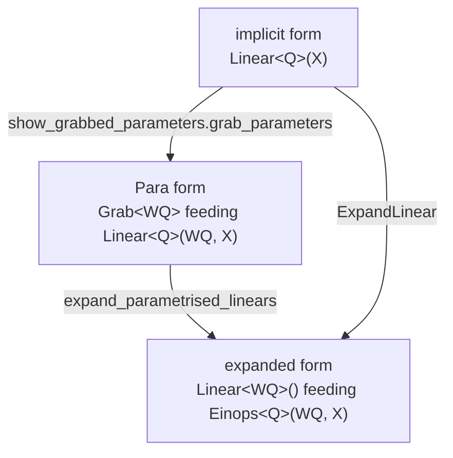

# Linear Expansion

Written by Claude Opus 5 (1M context), effort high.

## What it is

`ops.Linear` is an opaque operator. It declares that N inputs map to M outputs, with a
trivial, empty reindexing, so nothing about its output ever appears when the graph is read
for the dependency between its axes. Its output axes come from nowhere.

This pass expands a `Linear` into its explicit form:

```
Linear                 ->     a weight array, which is a Linear with no inputs,
                              contracted against the real input by an Einops
```

The output axes are then wired in through a real reindexing like everything else, and the
graph states where the weights are read from.

A `Linear` that selects is returned unchanged. `ops.selects_weights` is the condition, and
[[Operators]] states the two readings a `Linear`'s input can have. The expansion writes the
contraction `dom_target, dom_target x cod_target -> cod_target`, and an index operand is not
one of the axes being summed over, so expanding a selecting `Linear` would give an average of
every weight where one weight was meant. The expert `Linear` of a mixture of experts is the
case.

A `Linear` with no inputs and a `Linear` with several inputs are also returned unchanged by
`expand_linear_root`. The first is a weight array already. The second is the parametrised
form of [[Show Grabbed Parameters]], whose weight is an operand on a wire, and the
`Transpose` of a derived backward pass has the same form. Neither has an implicit weight
to move out.

## The forms of a weight

A `Linear` is a weight and a contraction. The expression can state the weight in three
forms, and two routes lead from the first to the last.



The Para form shows the read. The `Linear` in it performs a plain contraction of two
operands, and it is still drawn as a `Linear` so that the reader sees the same operator
in both forms. Once the weight is an array with no inputs, the `Linear` is replaced by the
`Einops` that contracts the weight operand, which is the expansion this note describes.
`expand_parametrised_linear_root` performs that step on a parametrised `Linear`, and gives
the `Einops` the `Linear`'s name, so that the contraction keeps the name of the projection
it performs. A parametrised `Linear` with a bias reads `(W, b, x)`, and since 2026-09-17
the rule writes it as the same `Einops` of `W` and `x` followed by an `AdditionOp` that
reads the bias at the produced axes alone, so one bias value is added at every index of the
degree. Until then the rule returned a biased `Linear` unchanged, and an inspection box
drew it as a `Linear` where it drew every other map as a contraction. `ExpandLinear` reaches
the same expression from the implicit form in one step, with each weight array named after
the operator rather than after the parameter.

An inspection box draws the expanded form, and `DiagramSettings.expanded_parameters`
chooses how the weight array is drawn, per [[Advanced Display]]. Under `WEIGHT_ARRAYS`,
the default since 2026-09-17, `show_grabbed_parameters.weight_array_in_place_of` writes the
weight array as a `Linear` with no operands named after the parameter, so the figure shows
a box labelled with the weight and the `Einops` after it. Under `READ_FROM_THE_TAPE`,
`show_grabbed_parameters.weight_box_fed_by` writes the weight array as a `Linear` whose one
operand is the grabbed array, per [[Show Grabbed Parameters]], so the figure shows a box
labelled with the weight, a tape running down onto it, and the `Einops` after it.

## Why it is optional

A pass that reads an expression for what each operation computes needs neither form in
particular. The implicit `Linear` states the contraction and states that the weight is
simply there, and the expanded form states the same contraction with the weight on a wire.
The expansion is therefore run where the weight has to be an operand, and left alone
otherwise. The default is off, because the shorter route needs nothing extra.

## The subtlety about broadcasting

A `Linear` embedded in a larger expression is usually broadcast over extra degree axes it does
not itself consume. In a convolution, built as a reindexing followed by a `k, cin -> cout`
Linear, it is broadcast over the output-position axis.

> [!warning] `target.dom()` and `.cod()` report the lifted shape, degree axes included
> The pre-broadcast input and output shape has to come from each weave's own `.target()`. The
> replacement is then re-lifted over the same degree through `construction_helpers.lift`, so
> that it broadcasts exactly like the `Linear` it replaced.

## Ordering

Expansion has to run after [[Einops Rearrangement]]. Run first, the normaliser folds a
projection into the score and produces a three-operand contraction, which no pair of
operands can be read off, and the two contractions can no longer be told apart. It was
found the hard way.

## The pieces

The module is `algebra/linear_expansion.py`. It sits in the general `algebra/` package
because a `Linear` written out as a weight and a contraction is a change of presentation
rather than a derivation. Importing the module
registers the standard expansion of a `Linear`, which the display reads to offer that
expansion in a figure, per [[Advanced Display]].

| name | what it does |
|---|---|
| `expand_to_nodes` | factor the reindexings out into `View` nodes, leaving a core whose own reindexings are the degree identity. It lives in `algebra/node_expansion.py` since 2026-08-20, because [[Derivatives]] needs it for the opposite half, meaning the nodes, and it is re-exported here under the old name |
| `expand_linear_root` | one leaf. A `Linear` that selects, that has no inputs or that has several inputs comes back unchanged |
| `ExpandLinear` | the `Endofunctor` over a whole expression |
| `is_parametrised_linear` | whether a `Linear` reads its weight from its first operand, its bias from its second where it has one, and one data operand after them, the form [[Show Grabbed Parameters]] writes |
| `expand_parametrised_linear_root` | one parametrised leaf as the `Einops` that contracts its weight operand, named after the `Linear`, followed by the addition of its bias operand where it has one |
| `contract_weight_against_data`, `add_bias_over_produced_axes` | the two morphisms that rule composes |
| `ExpandParametrisedLinear`, `expand_parametrised_linears` | the `Endofunctor` over a whole expression, and its call |
| `contains_linear(graph)` | whether the graph still holds one |
| `is_fusable(block)` | the predicate a pass that merges neighbouring operations is given for the expanded form. A weight block is an isolated parameter array, so merging it into a real computation gains nothing and it stays standalone, reconnecting by node identity |

## See also

- [[Operators]] — what a `Linear` is
- [[Functors]] — `ExpandLinear` is one
- [[Derivatives]] — the other consumer of `expand_to_nodes`
- [[Expression Simplification]] — the move back, and the einsum builder `contract` now shares
- [[Show Grabbed Parameters]] — the Para form, and how a weight array is drawn
