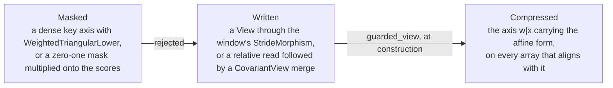

# Padding and Masks as Sparse Axes

## What it is

A padded convolution, a causal attention and a windowed attention each read positions
that hold no value. The pad of a convolution lies outside the input. The keys after a
query lie outside what a causal query may read. The keys before a window lie outside the
window. In every case the array read is one whose positions hold either a real or the
universal unit of [[The Universal Unit]], and an axis some of whose positions hold the
unit is a [[Sparse Axes|sparse axis]]. Padding and masking therefore produce sparse axes,
in the way a `TopK` does, and the plan is to write them as such.

The difference from a selection is in what states which positions are active. A `TopK`
decides the active set of each slice at runtime, so its expanded form carries an index
wire, $[\mathrm{Nat}(n),\, x, k]$, naming the $k$ positions of each slice, per
[[Sparse Expansion]]. A pad or a mask decides the active set by the position alone. Under
a causal mask the query $q$ reads the keys $x \le q$, and under a window of width $w$ it
reads the keys with $q - w + 1 \le x \le q$. Both are affine in $q$, so the active set is
stated by a `StrideMorphism`, per [[Stride Category]], and no index wire is needed. The
expansion of a padding-generated sparse axis is a reindexing.

The compressed form exists since 2026-09-14. `AffineGuards.AffineSparseAxis` in
`advanced_axis_dynamics/data_structure/AffineGuards.py` is the axis,
`mark_sparse_domains.mark_sparse_domain` derives it from a reindexing, and
`notebooks/sota/DeepSeekV41Flash.ipynb` writes its window, its reachable entries, its
reachable blocks and its selections with it. The code moved out of
`data_structure/StrideCategory.py` into `advanced_axis_dynamics/` on 2026-09-15, per
[[Advanced Axis Dynamics]], which states the derivation. This note states the three reads
that produce a form, the design they rest on, the facts in the code that carry it, and the
checks that remain.

## The three cases

**A padded convolution.** A convolution with $t$ taps and a pad of $p$ reads, at output
position $x$ and tap $j$, the input position $x + j - p$. That position lies outside
$[0, n)$ for $p$ taps at each edge, and a zero pad puts a real $0$ there. Under the unit
the padded input is an array on an axis of $n + 2p$ positions, of which $n$ hold a real,
and the tap contraction reads the unit as $0$ by the table in [[The Universal Unit]]. The
active set is the same for every slice, being the middle $n$ positions, so a pad is the
sparse axis whose activity does not vary with the other axes. A padded convolution
writes the padded window as a `StrideMorphism` whose codomain names the grid axes of its
own domain with a shift of $-1$, per rule 8 of [[Representing Models]], and that shift is
the pad. A reflected or replicated pad is a different construction. Replication clamps
the index, which is not affine, and reflection is affine on each side separately, so
neither is a unit and neither is covered here.

**A windowed attention.** The sliding window of `notebooks/sota/DeepSeekV41Flash.ipynb`
reads, for query $x$, the keys $x + j + 1 - w$ for $j$ in $[0, w)$, through `window_view`
in its ninth cell. The window ends at the current token and reads no later key, so it is
causal by its shift alone, and the notebook draws no mask. For $x < w - 1$ the window
reaches before the first key, and those positions are a pad. Since 2026-09-14 the view's
output carries the slot axis as `w|x`, live where $x + j + 1 - w \geq 0$. The score array is
$[h, x, j]$ and has the width $w$ of the window rather than the length $x$ of the
sequence. The attention is a convolution whose taps are the keys and whose contraction
over $j$ is the attention sum.

**A causal attention.** A causal mask is the window whose width is the whole sequence.
Query $q$ reads $q + 1$ keys, so on the key axis each slice along $q$ holds $q + 1$ active
positions, and the activity varies with the slice as the guarantee in [[Sparse Axes]]
allows. Written as a window it is $x' = q + j + 1 - x$ for $j$ in $[0, x)$, padded on the
left by $x - 1$ positions, and half of the score array is pad. `ops.WeightedTriangularLower`
in `data_structure/Operators.py` states the mask as an operator today, and nothing in the
algebra reads it. [[DeepSeek-V3 Backward Pass]] records that it has no derivative rule. The V4.1 notebook
writes the staircase a compressed cache needs, where a query sees an entry once it has
passed the entry's last token, as the relative read and merge of the next section, and
the operator is superseded.

## The compressed form: `AffineSparseAxis`

A codomain index of a `StrideMorphism` outside `[0, size)` of its axis names no position,
and a read there yields the unit. The requester ruled on 2026-09-14 that this is the whole
mechanism. A negative index is the unit, always, an index at or past the size is the unit
as well, and no separate guard exists. `AffineGuards.AffineSparseAxis` records the
consequence on the array read. Position $j$ of the axis, at positions $i$ of its `guides`, holds a value
where

$$0 \le \sum_k \sigma_k\, i_k + \sigma\, j + \beta < \text{extent},$$

and the unit elsewhere. The axis stood in `data_structure/StrideCategory.py` as
`cat.AffineSparseAxis` until 2026-09-15. The form is the row of the
stride morphism whose read produced the axis, and the extent is the size of the axis that row indexed where that axis also
stands in the row's domain. A row onto a fresh codomain axis sizes that axis, so the form
never reaches its end and the sparse axis carries no extent. `guard_form` returns
the form at symbolic positions, `empty_end` says which end of the axis holds the unit,
`FIRST` for a positive stride crossing zero and `LAST` for a negative one, and
`live_positions` lists the live positions at concrete positions and sizes. The count of
live positions is a floor of the form and is not affine, so the axis carries the form and
derives the count. A `SparseAxis` states an activity decided by data. This axis states an
active set decided by position alone. It prints as `w|x`, the axis letter, a bar and the
guide letters.

`mark_sparse_domains.mark_sparse_domain` derives the axis. For every row of a reindexing
that reads outside its axis, per [[Stride Category]], the last domain axis the row reads
is replaced by the `AffineSparseAxis` the row states, guided by the other axes the row
reads, and `mark_sparse_domains.guarded_view` is the `ops.View` that applies it. The
window view $x' = i_x + j_w + 1 - |w|$ therefore produces `[x, w|x, c]`, and composition
carries `w|x` into the scores, the exponential, the denominator and the value
contraction, because a sparse axis outranks a `RawAxis` in `align_axis`.
`ops.Elementwise.template` applied the marking to every reindexing it built until
2026-09-15 and marks nothing now, so a model asks for the form by calling
`guarded_view`.

A condition no single read states is written as a relative read followed by a merge, and
the relative read is on the array the condition restricts. The reachability of a
compressed entry from a query is $i_x - |a|\, i_b - (|a| - 1) \ge 0$, the query having
passed the entry's last token, and the reference's `compress_lens` fill admits exactly
that set at ratio $|a|$. The condition restricts the entries, so the indexer of the V4.1
notebook reads its keys at $i_b - i_r$, entry $r$ back from every entry, and
`mark_sparse_domain` marks the slot axis `r|b`, live where $i_b - i_r \ge 0$, because a
slot counting back past the first entry is a negative index and reads the unit. One
`aops.CovariantView` then writes each entry's slots onto every query whose newest
reachable entry that entry is. Group $b$ holds the $|a|$ queries from $|a| b + |a| - 1$ to
$|a| b + 2|a| - 2$, so the merge's row is $i_x = |a|\, i_b + i_a + (|a| - 1)$. Its input
carries the entries and not the offsets, so
`aops.CovariantView.broadcast_over_absent_axes_and_merge` broadcasts the input over the
offsets and the $|a|$ queries of a group all read the same entry at the same distance. The
merge is an injection from its domain box, a codomain position it does not write holds the
unit, and the slots are guided by the entries the merge consumes, so
`mark_sparse_codomain` re-guides them: the output carries `r|x`, live where
$i_x - |a|\, i_r - (|a| - 1) \ge 0$, derived from the range of the merge and the form of
`r|b`. The query axis stays dense, by the rule under *A merge marks the codomain axes its
image does not fill* below. The query low rank and the hidden state are read as they
arrive, the einops run over the query axis, and the scoring is one box computed once per
query. Every array of selected entries holds distances back from the query's newest
reachable entry, the gather reads the entries through the same chain and selects over the
distances, and the decoder's block table splits the distances.

From 2026-09-14 to 2026-09-15 the notebook wrote the same form with a `reach` view whose
reindexing copied the query, computed the distance onto an axis of the sequence's length
and deleted that axis. The requester rejected it on 2026-09-15. The stride category is
Cartesian, meaning that copying a position, computing a map on the copy and deleting the
result is the identity on the position, so an algebra that composes reindexings may
erase the row that carried the causality, and the codomain axis would then carry a form
no read justifies. The relative read is a read the algebra keeps, and the merge is an
injection whose image the codomain axis records. The user's first design read
$i_x = |a|\, i_{b_0} + i_a + (1 - |a|)$, and the check against `compress_lens` at ratio
2 showed the shift has to put group $b_0$ at $[|a| b_0 + |a| - 1, |a| b_0 + 2|a| - 2]$:
with $1 - |a|$ every query pairs with the entry after its newest reachable one. A
second row of the merge writing the entry $i_{b_0} - i_r$, so that the output held
absolute entries, was written and then rejected on the same day, because the Top-k
reads the slots as they are.

The relative read was on the queries as well as on the keys until later that day. The
`grp` views read the query low rank and the hidden state at
$i_x = |a|\, i_{b_0} - i_a + 2|a| - 2$, the `back` view read the keys $r$ entries back
from the group's newest reachable entry, the heads were contracted at $(b_0, a, r)$ and
the merge wrote the scores back to the queries. The offsets of the last group read past
the end of the query axis, which sized the query axis $|a|\,|b|$ and marked the offset
axis `a|b0`. The requester then asked for the condition to sit on the keys alone, and
the indexer now reads the keys back from every entry. Reading the keys back from every entry
states the same form, reads one array where the group views read three, needs no guard on
the query axis's end and leaves every operation after the merge per query.

Four rules follow from the unit's laws. Each is a function in
`advanced_axis_dynamics/`, with a check in
`advanced_axis_dynamics/validate_advanced_axis_dynamics.py`.

- **A read of a sparse axis pulls its form back.** A row whose codomain axis is an
  `AffineSparseAxis` substitutes its own form for the axis's position, and the row of
  every guide it also produces for that guide's position, and marks the last domain axis
  the result reads. The block split $i_B = |u|\, i_P + i_u$ reading `B|x`, live where
  $i_x - i_B \ge 0$, marks its offsets `u|x,P`, live where $i_x - |u|\, i_P - i_u \ge 0$.
  `mark_sparse_domains.pulled_back_sparse_axis` performs it and `mark_sparse_domain`
  applies it. A pulled-back
  form that stays in range at every position is dropped, which is what a relative read
  undone by the read that made it gives: the scores read relative to the query at
  $j = i_x - i_B$ carry `j|x`, and reading them back at $B = i_x - j$ pulls that form back
  to $i_B \ge 0$, so only the row's own fall below zero marks `B|x`.
- **A fold over a sparse axis leaves the form at the axis's most favourable position.**
  A fold ignores the unit, so its result holds a value where some position of the folded
  axis does, which is where the form holds at the first position for a negative stride
  and at the last for a positive one. The maximum over `u|x,P` leaves `P|x`, live where
  $i_x - |u|\, i_P \ge 0$, with the stride $-|u|$ on the block axis.
  `mark_sparse_domains.sparse_axis_after_fold` performs it. No pass applies it, and the
  V4.1 notebook hands the derived `P|x` to its Top-2048 and lets composition carry it.
- **A merge marks the codomain axes its image does not fill.** Read covariantly, a
  stride morphism writes each live domain position to one codomain position, and a
  codomain position no live domain position writes holds the unit. `merge_groups` finds
  the order in which each row writes its own axes as a signed mixed-radix number, with a
  shift, beside the axes earlier rows determine, which is the condition for the read to
  be a function on positions. `mark_sparse_codomain` writes every constraint on the
  domain, the range of each group and the form of each domain sparse axis, over the
  codomain. A constraint reading a group's digits in proportion to their radices reads a
  multiple of the group's number exactly, and a constraint reading the coarsest digit
  alone at plus or minus one reads a floor of it, and $\lfloor y \rfloor \ge m$ is
  $y \ge m$ for an integer $m$. A codomain position the image misses is left dense where a
  re-guided broadcast axis's form is negative throughout that position, because every
  slot at that position is already empty and the emptiness belongs to the slot axis. The
  merge `(b, a) \to x` of the indexer, broadcast over `r|b`, therefore leaves `x` dense:
  the row writes no query below $|a| - 1$, and the slots of those queries are empty at
  every distance. The rule is the constraint the image states being dropped for the
  constraint the slots state, which implies it.
  The axes a merge is broadcast over enter the marking through `merge_carrying`, which
  writes each onto itself at unit stride, and a broadcast axis guided by an axis the
  merge consumes onto a fresh axis of its body, so `r|b` leaves as `r|x` through the
  degree reindexing that pairs the two, and `s|x`, guided by the codomain, is kept as
  the same object. A domain form of any other shape is dropped and its codomain axis
  stays dense, which is the candidate axis `C` of the pool, whose kept blocks `p|x`
  enter the layout at the stride $|u|$. `aops.CovariantView.template` applies the rule.
- **A selection over a prefix-live axis fills a prefix of its slots.** Where the live
  positions run from the first one, a Top-k fills as many slots as there are live
  positions, so slot $j$ is live where position $j$ is and the form carries over onto the
  slot axis. Where the live positions run to the last one, slot $j$ is live where
  position $|b| - 1 - j$ is. `AffineSparseAxis.selected_slots` performs it and
  `deepseek.TopK.template` applies it in the dense forms, so the Top-512 over `b|x` hands out `Nat(b)[x, s|x]`. The
  reference sorts its picks into position order and writes $-1$ into every pick past the
  reachable count, which is the unit in an integer array, and its `sparse_attn` gives such
  a slot a zero key and a score of $-\infty$.

Two things the notebook writes by hand. A view that reads a sparse axis names that axis
in its codomain, and a `Rearrangement` that declares the array names the sparse axis the
array carries, because composition identifies a `RawAxis` with the sparse axis it meets
and the sparse one wins canonicality, so a raw declaration spreads the sparse axis onto
every array carrying the raw one. The entries `[B, c]` became `[B|x, c]` in the decoder
until the block split and the routes named `B|x`. And the candidate axis `C` stays dense.
The empty candidates of an early query are the offsets of its empty kept blocks, whose
count is not an affine form of a candidate's own position, and the Reindex layer reads the
unit at them through its `IndexSelect`.

## The two forms

A padded or masked axis has the same two presentations a selection has, and a third form
that the notebooks use today.

| form | what states the active set | where it exists today |
|---|---|---|
| masked | an operator, or a multiplied mask | `ops.WeightedTriangularLower`, read by nothing and superseded. The pool of the V4.1 notebook was a multiplied mask until 2026-09-11 and is an array of positions since |
| compressed | the sparse axis, with an affine active set | `AffineGuards.AffineSparseAxis`, derived by `mark_sparse_domain` from the view that reads outside its axis, since 2026-09-14. Two axes carrying two forms are concatenated instead, per [[Advanced Axis Dynamics]] |
| written | a `StrideMorphism` view, or a relative read and a merge | the sliding window and the indexer of the V4.1 notebook, the padded window of the diffusion UNet, and an unpadded convolution |

A selection's index wire and a window's `StrideMorphism` are the two ways an active set is
stated, and the first is data where the second is affine. [[Sparse Axes]] draws a
selection compressed and expands it by rewriting. A window is written as its view and
the compressed form is derived from the view at construction, so the two forms are one
object, the view with its output axis marked, and no rewrite between them exists or is
needed. The compressed form states which positions hold a value without running the
model.

## Checks an implementation owes

Every output of an implementation needs two kinds of check, and a result that passes one
and fails the other is wrong. Done on 2026-09-14, in
`advanced_axis_dynamics/validate_advanced_axis_dynamics.py`, which held the checks in
`deepseek/validate_sparse.py` until 2026-09-15, and in the V4.1 notebook: the window axis, the entry axes, the offset and block axes and the
slot axes carry the forms written by hand, the live sets they give at concrete sizes
equal the sets the reference's `get_window_topk_idxs`, `compress_lens` and
`select_candidate_blocks` admit, an unshifted group view and block split mark nothing,
and both sparse expansions leave a model holding the axes unchanged. Everything below
remains.

**Mathematical coherence.**

- The two laws of [[The Universal Unit]] hold at every operator a padded or masked
  position reaches. The value read at a pad is $0$ under a contraction and $-\infty$
  under a softmax, and both are derived from the operator rather than written into the
  array.
- The compressed form and the expanded form of a window compute the same function,
  checked against `torch` on the dense array with an explicit mask. `deepseek/validate_sparse.py`
  checks a selection's two forms structurally and `para/validate_backward.py` checks a
  derivative numerically, and a check of a window follows the second.
- A fold that reads the size of its axis, meaning a mean or an `ops.Normalize`, reads the
  activity and never the extent, so a normalisation over a padded axis divides by the
  number of active positions.
- The transposed convolution of a padded convolution, derived by `transpose_reindexing`
  in `para/data_structure/transpose.py` per [[Derivatives]], crops what the forward pad
  added.
- A fold that receives a partial result over positions holding only the unit is
  unchanged, and a residual addition at a padded token leaves the token empty. The two
  readings of `AdditionOp` in [[The Universal Unit]] are both exercised.

## Gaps

- ~~None of the three cases is written as a sparse axis~~. Closed 2026-09-14 for the
  window. The window, the reachable entries, the reachable blocks and the selections of
  the V4.1 notebook carry `AffineGuards.AffineSparseAxis`es, per *The compressed form*
  above.
- **The pad of a convolution and the shift of a prediction head carry no form.** They did
  between 2026-09-14 and 2026-09-15, through `ops.Elementwise.template`, which marked
  every reindexing it built. Since the marking became opt-in, the padded window of
  a padded convolution, the multi-token-prediction shift of GLM-5.2 and the
  sliding windows of Kimi-K3 and DeepSeek-V4-Flash read the unit as they always did and
  state no form, because each calls `ops.View.template`. Calling
  `mark_sparse_domains.guarded_view` instead gives each of them its form back, and
  [[Advanced Axis Dynamics]] records why they were left dense.
- **The unit is not in the datatype**, per [[The Universal Unit]].
- **No pass applies the fold rule.** `mark_sparse_domains.sparse_axis_after_fold` exists
  and the notebook hands its result to the Top-2048 by hand.
- **A pool mask that is data is a selection.** The candidate pool of the V4.1 notebook is
  computed by a top-k over blocks of entries and broadcast back to the entries, so its
  active set is runtime data. It expands to an index wire in the way a `TopK` does, and
  the affine reading of this note does not apply to it. Since 2026-09-11 the notebook
  draws it as `Nat(B)[x, C]`, the positions of every entry of a kept block, handed out by
  a `TopK` in the `ONLY_SELECTION` form and read by an `IndexSelect`, per [[Sparse Axes]].
  Since 2026-09-14 the kept blocks are `p|x`, and the candidate axis `C` stays dense
  because the empty candidates' count is not an affine form of a candidate's position.
- ~~The causal staircase of a compressed cache is not drawn~~. Closed 2026-09-14. It was
  the `reach` view until 2026-09-15 and is the indexer's relative read and `pos` merge
  since. The reference implementation of DeepSeek-V4.1-Flash, read on
  2026-09-14 at commit `dba1be0a40aa`, fills the score of an entry the query cannot reach
  with `-inf`
  ([model.py L563-L565](https://huggingface.co/deepseek-ai/DeepSeek-V4.1-Flash/blob/dba1be0a40aa45a94ad051997016db3960a90277/inference/model.py#L563-L565))
  and replaces a pick of such an entry with `-1` after its Top-512
  ([model.py L577-L580](https://huggingface.co/deepseek-ai/DeepSeek-V4.1-Flash/blob/dba1be0a40aa45a94ad051997016db3960a90277/inference/model.py#L577-L580)),
  and its `sparse_attn` gives a `-1` slot a zero key and a score of `-inf`
  ([kernel.py L362-L364](https://huggingface.co/deepseek-ai/DeepSeek-V4.1-Flash/blob/dba1be0a40aa45a94ad051997016db3960a90277/inference/kernel.py#L362-L364)).
  The `-1` is the unit in an integer array, and the slot axis `s|x` carries it.
- **The pinned newest block is not drawn.** The reference pins the block holding the
  query's newest reachable entry with $+\infty$
  ([model.py L603-L605](https://huggingface.co/deepseek-ai/DeepSeek-V4.1-Flash/blob/dba1be0a40aa45a94ad051997016db3960a90277/inference/model.py#L603-L605)),
  which is two floors of the query's position and no affine form.
- **`ops.WeightedTriangularLower` is superseded and not deleted.**

## See also

- [[Advanced Axis Dynamics]] — the code that derives a form, carries it and restores it
- [[The Universal Unit]] — what an empty position holds, and what each operator reads it as
- [[Sparse Axes]] — the axis, and the selection whose active set is data
- [[Sparse Expansion]] — the rewrite that carries an index wire, which a window does without
- [[Stride Category]] — the affine reindexing that states a window
- [[Representing Models]] — rules 7 to 9, on writing a window
- [[SOTA Model Notebooks]] — the sliding window and the pool mask of V4.1
