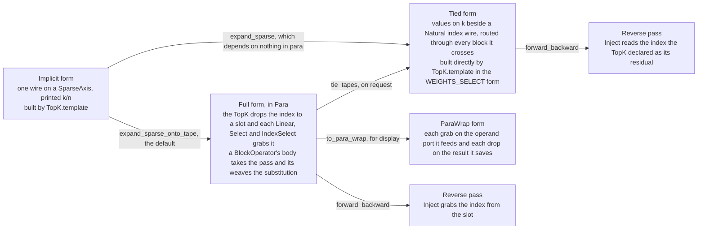

# Sparse Axes

## What it is

A `SparseAxis` carries two sizes. The extent it is drawn from is `_size`, taken from the axis
it replaces, and the activity is `k`, the number of those that are live. It prints as `k/n`.
`deepseek.TopK` produces one, and so does the merge of one, per *Merging a selection
into a wider axis* below. A pad and a mask
produce a sparse axis of a second kind, `AffineGuards.AffineSparseAxis`, whose active set
is the affine form of the reindexing that read outside its axis rather than an index wire,
per [[Padding and Masks as Sparse Axes]] and [[Advanced Axis Dynamics]].

**A sparse axis is an axis whose slots may be empty.** It has `_size` positions, and
`activity` of them hold a value at any one time. The remaining `_size - activity` hold
nothing, so an operation broadcast over the axis works on `k` values where the axis is `n`
wide. Which `k` of the `n` are live is decided per index of the degree, meaning per token in
a mixture of experts, so the axis cannot name them.

An empty slot holds the universal unit of [[The Universal Unit]], and every operation
reads it by that note's two laws: a fold over the axis ignores it and a pointwise
operation preserves it. The guarantee is made per slice. On $[\mathbb{R},\, x, k/n]$
every slice along $x$ holds $k$ active positions of the $n$, and the active set of one
slice says nothing about the active set of another. The index wire that names the
active set therefore carries one `Natural(n)` entry per slot per slice,
$[\mathrm{Nat}(n),\, x, k]$, and the selection is the isomorphism
$[\mathbb{R},\, x, k/n] \cong [\mathbb{R},\, x, k] \otimes [\mathrm{Nat}(n),\, x, k]$
with the slice axis carried along. `para/algebra/para_sparse_expansion.py` writes that
wire onto the tape, with the `TopK` dropping it and each consumer grabbing it, per
[[Selection and the Reverse Pass]].

The empty slots are what the expansion removes. Naming which `k` positions are live takes one
`Natural(n)` value per live slot, so the axis splits into a dense axis of `k` carrying the
values and a selector array on that axis carrying the positions they came from. *The
mathematics* below states the split, and `deepseek/sparse_expansion.py` performs it through
`expand_sparse`, per [[Sparse Expansion]].

Because the extent stays the parent's, an array on `k/n` and an array on `n` hold the same
number of entries. [[Selection and the Reverse Pass]] records the one place that has cost
something.

A `SparseAxis` is a compressed notation rather than a new kind of thing. The same algorithm
written without it needs two wires where the compressed form needs one. The compressed
form is the default, because it is one wire rather than two
through every consumer, and the smaller picture is the point of drawing one at all. The
expanded form is what a graph rewrite produces on demand, per *The rules* below.

## The three forms

A selection has three forms. The implicit form is the compressed one, with one wire on a
`SparseAxis`. The full form is the Para morphism the taped expansion produces, with the
values on a dense `k` and the index on a tape slot that the `TopK` drops and each consumer
grabs. The tied form has the index on a wire. Two expansions and one tying pass move
between them, and the wrap is how the full form is drawn.



The taped expansion is the default, ruled on 2026-09-11. Going through Para represents the
expression as a partially connected graph, each seed rewritten on its own with the slot as
the only coupling between the pieces, and tying it is compiling that graph. The wired pass
reaches the tied form directly and exists to state that the expansion depends on nothing
in `para`. The two agree line for line, which
`deepseek/validate_sparse.py` asserts. As with the other
expansions into Para, such as `grab_parameters` writing out the parameters an operator
reads, the implicit form is the one a model is written in and can be worked in, and the
full form is the complete statement. The tied form is available and is not worked in. A
figure shows the implicit form or the wrapped form, and the tied form only when it is
asked for.

A morphism that already holds a `Grab` or a `Drop` is in Para and expands on the tape
alone. `expand_sparse` has no case for a tape operation, and the six runtime slots of
`notebooks/sota/DeepSeekV41Flash.ipynb` are the case that settled it. The tape crosses a
`BlockOperator` without a wire, so a `TopK` inside one boxed layer and a `Select` inside
another expand on the tape where the wired pass refuses the sparse axis on the box, and
the whole boxed model of that notebook expands. The taped expansion is also what a
derived backward pass reads, per [[Selection and the Reverse Pass]].

**Complete.** A selection wire `R[k/n]` is really a pair: the surviving values on `k`, and
which of the `n` each of them came from. In the V3 notebook `TopK` has two codomains and
states
so:

```
%2       = Linear<L>(%0[{m}]) : R[{n}]              the router scores all n
%3, %4   = TopK(%2[{n}]) : R[{k}], Nat[{k}]         values, and indices into n
%6       = Linear<W_in>(%4[k], %0[{m}]) : R[k, {f}] the index is an operand
%10      = Linear<W_out>(%4[k], %9[k, {f}]) : R[k, {m}]
%1       = Einops(%5[{k}], %10[{k}, m]) : R[m]      gates contract k: the combine
```

The pair is exactly what `torch.topk` returns. The second wire has datatype `cat.Natural(n)`,
which is an index type, per [[Broadcasted Category]], on the `k` axis, giving `[n, k]`, or
`(n, k)` if it is written densely as a one-hot.

**Compressed.** `TopK` emits one wire on the sparse axis, and the payload rides the same axis.
`deepseek.TopK.template` builds this form.

One constructor builds every form. `TopK.template(k=, axis=, name=, form=)` takes a
`SelectionForm`, an enum in `deepseek/data_structure.py` with four members.

| form | outputs | what it states |
|---|---|---|
| `WEIGHTS` | `[R; k/n]` | the values on a `SparseAxis`, with the positions implicit in the axis. The compressed form, and the default. `name` labels the sparse axis, and without it every selection in an expression draws as `k/n` |
| `WEIGHTS_SELECT` | `[R; k], [Nat(n); k]` | the values on a dense `k` beside the positions, which is the pair `torch.topk` returns and the V3 construction lifted out of the notebook |
| `ONLY_WEIGHTS` | `[R; k]` | the values on a dense `k`, with the positions discarded |
| `ONLY_SELECTION` | `[Nat(n); k]` | the positions alone, for a selection whose values are never read. A candidate pool that needs which blocks were kept and not their scores is the case, and `notebooks/sota/DeepSeekV41Flash.ipynb` writes its pool in this form, per *Merging a selection into a wider axis* below. The same notebook writes its entry selections in this form since 2026-09-14, read by an `IndexSelect` broadcast over the slot axis, per *Reading a payload at a selection's positions* below |

The two expansions rewrite a `WEIGHTS` `TopK` into the `WEIGHTS_SELECT` form and leave
the two dense forms alone, because they hold no sparse axis. The reverse pass has a rule
for the first two forms and none for the dense ones, per [[Open Gaps]]. The form was
added on 2026-09-11, where the two forms had
been the two constructors `template` and `complete`.

## Consuming a compressed selection

There are exactly two spellings, and the one used settles how far the `k/n` annotation
travels.

**`Select`**, in `deepseek/data_structure.py`, takes the sparse axis and its parent as
separate targets: `(k/n), (n) -> (k/n)`, or expanded, `[R, k], [n, k], [R, n] -> [R, k]`. The
operator is the map between the two axes, so nothing merges. The payload keeps its dense axis
and `TopK` keeps a visible `n -> k/n`. Attention's gather is a `Select`, and nothing else
expresses it. An `Einops` signature describes a contraction and a selection is not one, and a
reindexing cannot express it because reindexings are affine while `k/n -> n` is a runtime
value.

**A reindexing pairing `k/n` with its parent** identifies the two axes. For a mixture the
identification is the selection, because "this slot's expert" is the statement that the slot
axis and the expert axis are one. Everything touching the axis then prints `k/n`.

## Reading a payload at a selection's positions

A model writes a read of a payload at a selection's positions as an `IndexSelect`
broadcast over the selection axis. A gather reads one entry per slot, so it is elementwise
in the slot: the targets are a rank-0 `Nat(n)` index and the payload's `n`, and the
selection axis `k` sits in the degree beside every other broadcast axis. The reason is what
a figure says. A wire that passes through an operator says the operator is broadcast over
that axis, and a wire that ends at an operator says the axis is part of a target the
operator consumes, so the selection axis in a target draws the slots as a wire the gather
consumes and a fresh wire it emits. The ruling is in [[Representing Models]].

`Select.at_positions` writes the same gather the other way, taking the positions
`[Nat(n); k]` and the payload `[R; n]` and handing out `[R; k]` with `k` in the target of
the positions and of the result. The two compute the same values. No value multiplies the
payload in either and no sparse axis is involved, so neither expansion rewrites either of
them, and `IndexSelect` is also what the expansion of a compressed `Select` writes.

A `TopK` followed by `[x > 0]` reads the sign of each surviving value and keeps at most `k`
entries, those among the top `k` whose value is positive. It is written in this form only
where the reference reads the positions alone, per [[Representing Models]]. The entry
selections of `notebooks/sota/DeepSeekV41Flash.ipynb` were a `TopK` on `s/b` whose scores
an indicator turned into ones for a compressed `Select` to multiply back in, until
2026-09-14. The reference reads every entry its Top-512 returns whatever the entry's
score, so they are now `TopK`s in the `ONLY_SELECTION` form handing out `Nat(b)[x, s|x]`
and `Nat(B)[x, s|x]`. The entry gather
read them with a `Select` at positions until 2026-09-16 and reads them with an
`IndexSelect` over the degree `(x, s|x, c)` now.

## Drawing a selection as a copy of an axis

tsncd draws a `Select` as it draws a reindexing that copies an axis. Every wire of every
operand runs to one dot and the result leaves that dot, so the figure says that the
selection axis and the parent axis it selects from are one index. A copy in an einops is
the diagonal. *The mathematics* below reads the positions of a selection as their one-hot
matrix, and the read is then a contraction against that diagonal, so the copy and the
selection relate their two axes in the same way.

Two marks separate the two figures. The dot of a selection is filled in the selection
family's green where a copy's dot is black, because a copy identifies the two axes outright
and a selection relates them by the positions it reads. The positions of a `Select` at
positions arrive at the dot on their own `Natural` wire, and a copy has no such wire. A
`Select` on a sparse axis reads no positions from a wire, and the sparse axis printing
`k of n` at the dot is what says that the identification is a selection.

`SelectOnSparseAxisBox` in tsncd's `src/deepseek/display_deepseek.ts` links every anchor of
every operand to the first anchor of the result and draws the dot over the point they meet
at. The dot is pinned with `allow_skip = false`, so the wires end inside the box and no
wire is carried across it. The box replaced a green rectangle labelled `Select` on
2026-09-14, and was split off from the
box for a `Select` at positions on 2026-09-15.

The `TopK` that mints the sparse axis is drawn as a green diamond with nothing crossing it.
A wire drawn across an operator says that the operator is broadcast over the axis the wire
carries, and a selection reads the axis it selects over, so the operand's axis ends at the
left point of the diamond and each result's axis starts from the right point. The two are
never linked. `TopKBox` linked them from 2026-09-15 until 2026-09-16, when the user
rejected the reading that `n` before the selection and `k/n` after it are one wire read
twice. The degree axes go on
crossing the box, which is what `BroadcastDisplayType.NODE` draws into the glyph.

## Merging a selection into a wider axis

A selection over blocks of an axis becomes a selection over the axis by the merge of the
block split. The split is a `StrideMorphism` from `(P, u)` onto `B`, `i_B = |u| i_P + i_u`,
which a `View` reads contravariantly. `aops.CovariantView` reads the same morphism
covariantly, so the output at `|u| i_P + i_u` is the input at `(i_P, i_u)`. That reading is
a function because a mixed-radix split is a bijection, and
`mark_sparse_codomains.merge_groups` admits nothing that is not an injection from the
domain box, per [[Advanced Axis Dynamics]]. `deepseek.merge_selected_axis` builds the covariant view over the selected
axes. Applied to `[R; p/P, u]` it hands out `[R; c/B]`, a `SparseAxis` over `B` whose
activity is `p · |u|`, because every offset of an active block is active. A `Select` then
reads a payload on `B` at those positions, and a `TopK` over `c/B` hands out `s/B`, a
selection over `B` made among the candidates. The candidate pool of
`notebooks/sota/DeepSeekV41Flash.ipynb` was written that way for part of 2026-09-11, and `deepseek/validate_sparse.py`
keeps the shape as `merged_selection`. Before that the pool was a constant table of block
numbers read by an `IndexSelect`, and the table was the inverse of the split.

The merge and the selection over the merged axis are chained producers. Each consumes one
sparse axis and produces another, and [[Sparse Expansion]] has a rule for each. The merge
computes the positions of the merged axis from the block numbers with
`deepseek.MergedPositions`, which is the split applied to index data, and the selection
over a selection composes the positions it chose with the inner axis's positions through
an `IndexSelect` on a `Natural` payload. A chain whose first axis has no producer in scope
stays compressed, as a lone consumer does.

The same merge is applied to positions where the selection is in the `ONLY_SELECTION`
form. `deepseek.merge_selected_positions` composes `MergedPositions` with a covariant view
that lays the block-and-offset pairs out along a dense candidate axis, so `Nat(P)[x, p]`
becomes `Nat(B)[x, C]` and no sparse axis is involved. A consumer reads a payload at those
positions with an `IndexSelect`, and a selection made among them takes the positions as a
second operand, `TopK.template(positions_of=B)`, so that it hands out `s/B` over the
parent. [[Sparse Expansion]] expands that selection by composing the positions it chose
with the operand, as it composes a selection over a selection with the inner index. The
candidate pool of `notebooks/sota/DeepSeekV41Flash.ipynb` is written this way since
2026-09-11. Its block scores are never
read, and in the `WEIGHTS` form they had to be replaced by ones before the merge so that
the `Select` reading the scores multiplied an indicator. The pool in the positions form is
the array the merge rule computes for the index wire of a merged sparse axis, written as
the model.

`MergedPositions` reads one block number and writes an array of positions, so its operand
and its result are two arrays over two datatypes. The operand is a rank-0 `Natural`
counting the `P` blocks, broadcast over the degree and over the slots the selection
filled. The result is a `Natural` counting the `B` entries of the axis the split was taken
from, and it carries the offset axes as its target, because each position it holds is a
function of an offset. `deepseek/validate_sparse.py` asserts both weaves and the composite
`Nat(P)[degree, p] -> Nat(B)[degree, C]` in `check_merged_positions_weaves`. tsncd draws
the operator as a rectangle in the selection family's green, with the stride of the block
number at the edge it arrives at and the stride of each offset at the edge it leaves at. The pentagon it drew until
2026-09-15 is the glyph a reindexing is drawn as, and `aops.CovariantView` keeps that
glyph because it moves each value without changing it.

## The mathematics

$$[\mathbb{R},\, k/n] \;\cong\; [\mathbb{R},\, k] \;\otimes\; [\mathrm{Nat}(n),\, k]$$

- **The index is an operand rather than a reindexing.** The first input weave of `W_in` is
  `(TILED,)` over `Natural(n)`: a rank-0 target whose value ranges over `n`, broadcast over
  `k`. The expert axis rides the implicit weight tensor and the index selects the slice, which
  is the `[n, 1]` column reoriented into the Linear's target. Selection is therefore
  expressible with the operators that already exist, because the dependence on data sits in
  the datatype, where nothing demands affineness, rather than in the reindexing, where
  [[Stride Category|St]] does.
- Equivalently, the index wire can be read as its one-hot `(n, k)` matrix, and the selection is
  then an ordinary contraction against the weight's `n` axis. The index form and the one-hot
  form are the same morphism written two ways, and the index form is the one that does not
  materialise `n·k`.
- In the complete form, `n` is consumed in the router's score target and never appears
  downstream. There is no axis left for a sparsity annotation to spread along.
- Compressing is what identifies `k/n` with its parent, because `SparseAxis` outranks `RawAxis`
  in `align_axis`, so the sparse one wins canonicality. Everything touching the axis then
  prints `k/n`. The spread is a property of the compression rather than of the algorithm, which
  is the whole reason the compression is acceptable: the expanded form is on hand, and in it
  `n` stays dense.
- **A `Block` confines the merge** when the parent axis does not appear in the block's domain
  or codomain. Put the consumer that does the identifying inside a block whose `dom` and `cod`
  do not mention `n`, and the rewriting stops there. An `Experts` box takes a token and returns
  `(k/e, m)`, so the merge happens inside it and the router outside keeps a dense `e`, printing
  `%4 = TopK(%3[x, {e}]) : R[x, {k/e}]`, with the selection visibly doing its job. All three
  mixtures under `notebooks/sota/` are drawn that way, and K3's is drawn in the MoE latent, as
  `(k/e, l)`. It works only when the block's domain and codomain allow it. CSA's gather takes
  the cache on `b` as an argument, so there is nowhere to put the merge that the block does not
  already expose, which is what `Select` is for.
- **How costly the merge is depends on what the selection selects over.** Over an axis the
  model invented for the purpose, such as DeepSeek's compressed entries `b` or a mixture's
  expert axis `e`, the identification costs one sub-block. Over the model's own sequence axis,
  as GLM-5.2's DSA selects, it costs everything: `s/x` then prints on the embedding, on every
  residual, through the MoE and out of the unembedding, because 2048 tokens are read by one
  attention head. The construction is the same and it is equally sound, and the picture is
  unreadable. The choice of spelling is therefore more than presentational bookkeeping. For a
  selection over an axis the whole model carries, `Select` is the only usable compressed form.

## The rules

- **Draw compressed, and expand by rewriting.** Every selection in the notebooks under
  `notebooks/sota/` is built with `TopK.template`. The expanded form is neither a different
  model nor a different construction. It is the same graph after
  `deepseek.sparse_expansion.expand_sparse`, per [[Sparse Expansion]], applied when something
  downstream needs the scored axis dense. Writing it by hand at construction time hard-codes a
  choice of presentation into the model.
- **Reach for `Select` when the payload is data on a wire, and identify when the payload is a
  weight.** Reading a cache at selected positions is a `Select`, which keeps the axes apart and
  keeps the dense pass above the selection dense. Choosing per-slot weights is an
  identification: the expert `Linear`s produce `e`, and merging `e` with `k/e` is what states
  that the slot uses that expert. Both expand. `Select.complete` takes the index wire as an
  operand, and an expanded mixture takes it into each `Linear`.
- **A merge reaches no further than its block**, per the mathematics above.
- **A gather is a `Select` and not an `Einops`.** The weave layout, with the sparse axis and
  its parent as two targets, was right all along. What was wrong was calling the operator an
  `Einops`, whose signature can describe only a contraction. `Select` is that operator. It is
  the `SparseApply` sketched and rejected on 2026-08-18, under the name the requester chose,
  and what was rejected was adding it in place of the two presentations rather than adding it
  at all.
- **A gate is a dot product.** Where the payload already rides the sparse axis, applying the
  gate values and summing is one `Einops.template('k, k m -> m')`, and not a mask followed by a
  contraction.
- **Pass `TopK.template(axis=...)`** so that the caller's axis is consumed, rather than a fresh
  `'n'` that would win canonicality and erase the caller's name, per [[UIDs and Names]].
- **A per-index weight needs the index somewhere.** Compressed, the axis is in the Linear's
  target. It is produced going up, as `(m) -> (e, f)`, and going down it is either consumed
  whole, as `(k/e, f) -> (m)`, which folds in the combine, or produced again, as
  `(f) -> (e, m)`, and then diagonalised by a copy-`Rearrangement` reindexing
  `(x, k/e, m) -> (x, k/e, k/e, m)` that keeps the entries where the produced expert and the
  slot's expert agree. The diagonal form leaves the combine as an explicit contraction,
  where the folded form hides it inside the weight. Expanded, no assertion is needed at
  all, because the same index wire feeds every projection.

## Gaps

- ~~The two forms are constructors rather than a rewrite~~. Closed 2026-08-20. The rewrite is
  [[Sparse Expansion]], in `deepseek/sparse_expansion.py`, applied to the [[Hypergraphs|graph]]
  so that a model is written down once, compressed, and unpacked on demand. It dispatches on
  how each consumer consumes the axis: an expert `Linear` absorbs the index, a `Select` becomes
  an `IndexSelect`, and the diagonal is spliced away.
- **Both forms reverse through `Inject`, and the index has to come from a slot.** Sending a
  gradient back to the parent axis requires knowing which of the `n` each of the `k` came
  from, which is what compressing hides, so the compressed rule reads the index from the slot
  the taped expansion wrote and the complete rule declares the index output as its residual.
  The dual of `IndexSelect` is the same `Inject` at the payload's degree, and no rule writes it
  yet. [[Selection and the Reverse Pass]] covers it.
- ~~A pad and a mask are not sparse axes yet~~. Closed 2026-09-14.
  `AffineGuards.AffineSparseAxis`
  carries the affine form, `mark_sparse_domains.mark_sparse_domain` derives it from the
  reindexing that read outside its axis, and neither expansion touches it, because the reindexing is its
  expansion, per [[Padding and Masks as Sparse Axes]].

## See also

- [[Sparse Expansion]] — the rewrite between the two forms
- [[The Universal Unit]] — what an empty slot holds, and what each operator reads it as
- [[Padding and Masks as Sparse Axes]] — the sparse axes a pad, a causal mask and a window produce
- [[Selection and the Reverse Pass]] — what a reverse pass needs from the two forms
- [[Operators]] — the `TopK` tip, and where a `Natural` array comes from
- [[Representing Models]] — the modelling rules built on this note
- [[Broadcasted Category]] — `Natural(max_value)` as an index datatype
- [[Compound Axis Labels]] — how the activity and the extent are drawn once a configuration has sized them
- [[Notebooks]] — the notebooks that build a selection, and what each asserts
