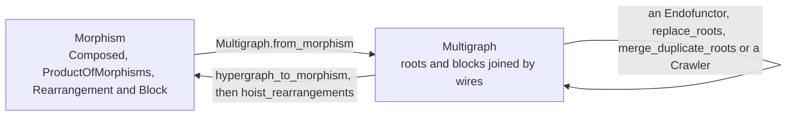

# Hypergraphs

## What it is

A morphism is the form an expression is read in, and a hypergraph is the form it is
rewritten in. The conversion is the standard one, in which
[a morphism in a symmetric monoidal category becomes a hypergraph](https://arxiv.org/pdf/2305.08768),
and it buys flexible local rewriting. In a morphism, inserting an operation means
restructuring the nesting of `Composed` and `ProductOfMorphisms` around it. In a hypergraph
it means adding a node and renaming a wire.

```python
import graphs.data_structure.Hypergraph as hg
import graphs.processing.Hypergraph2Morphism as h2m

g = hg.Multigraph.from_morphism(m)   # morphism -> graph
m = h2m.hypergraph_to_morphism(g)    # graph -> morphism
m = h2m.recycle(m)                   # normalise by round-tripping
```



`recycle` is the two conversions run in turn. Every rewrite in the package runs on the
`Multigraph`, per [[Functors]] and [[Crawlers]], and [[Agent Display]] lists either form.

## A wire is a `HypergraphObject`, identified by its uid

The identification is the central fact of the form.

```python
HypergraphObject(uid: UID, obj: L)
```

Equality and hashing read the uid alone, so two `HypergraphObject`s with the same uid are
the same wire, even when their `.obj` differs, which happens constantly, because a functor
pass rewrites `.obj` while the wiring stands still. The class is the one deliberate
exception to the rule that a term never compares by uid alone, and its dicts, sets and
dedups all key by wire on account of it.

Every splice in this codebase works by renaming wire identity:

```python
fd.Context([fd.UIDRenaming.set_canonical(new, old)]).apply(region)
```

A `UIDRenaming` keeps each occurrence's `.obj` and replaces its uid, where an
`EqualityClass` replaces the whole term, per [[Rewriting]]. Inserting an operation into a
graph means renaming which wire its neighbours name.

An earlier form paired each object with a bare `ObjectNode` term carrying the identity,
and splices replaced the node term through an `EqualityClass`. The node was the degenerate
term for which replacement and renaming coincide, so folding it into the object's own uid
required `UIDRenaming` and nothing else. The fold was made on 2026-09-01.

## The three kinds of graph

| | |
|---|---|
| `HypergraphRoot` | wraps one morphism, in `.wraps`, and is a leaf |
| `HypergraphBlock` | a body with a `BlockTag`, which carries `repetition`, denoting a loop, and `aesthetics`, saying how the block is drawn |
| `Multigraph` | a set of subgraphs with a `dom` and a `cod` |

All three subclass `Hypergraph[L, M]`, which carries `dom` and `cod` as
`Prod[HypergraphObject]`.

Earlier versions paired each `Multigraph` subgraph with an annotation. An
`AuxiliaryGraph[L, M, A]` carried one value of type `A` per subgraph, and a
`StructuredHypergraph` annotated each subgraph with its `Location` in the source
morphism. No pass ever read an annotation back out of a graph, because
`hypergraph_to_morphism` rebuilds the nesting from the wiring alone. The annotation slot
was removed on 2026-09-01, collapsing the three classes into `Multigraph`.

## Traversal

```python
hg.flat_subgraphs(g, remove_blocks=True)
```

> [!warning] `flat_subgraphs` does not remove every block
> It descends through a block only when `repetition == 1`. A loop block comes back as a
> `HypergraphBlock` with no `.wraps`, so a walk that assumes it has reached a leaf will
> raise. Recurse into `.body` directly. `leaf_splicing.all_leaves` is the version that
> does, per [[Leaf Splicing]].

`flatten` and `flatten_blocks` are the other structural helpers.

## Diagnostics

> [!warning] `ValueError: HypergraphObject(...) is not in list` from `hypergraph_to_morphism` means the wiring is wrong
> The conversion is correct. Some node is required on the right of a branch and nothing on
> the left produces it. Two real bugs in a splicing pass surfaced exactly that way.
> Look at what was spliced and at which container's `dom` or `cod` went unrebuilt.
> `leaf_splicing.rescope` exists because a loop that gains a domain wire needs the
> containers around it rebuilt, and nothing else works that out.

## See also

- [[Hypergraph to Morphism]] — the conversion back, and why it is the hard direction
- [[Hypergraph Analysis]] — connectivity questions
- [[Leaf Splicing]] — the leaf walk, the splice and the rebuild of a container
- [[Functors]] and [[Crawlers]] — the two ways to walk one
- [[Product Categories]] — the form this converts from
