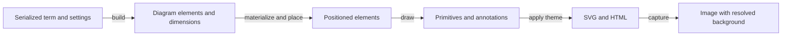

# Diagram Themes

A diagram theme changes the colors and surfaces used to display a term. The dark theme
uses a charcoal canvas, light wires and labels, and outlined enclosures. It preserves
the hue of semantic colors, including processor colors and named tape slots. The light
theme retains the existing colored surfaces.

## Both themes use one layout and draw pass

The term determines the diagram's connections and geometry. A theme is applied after
those choices, when a drawing backend receives a line, polygon, circle or annotation.
Keeping the color conversion at that point means that an operator added through a
registry receives the theme without a second implementation of its drawing method.
Attribute changes made during hover use the same conversion, so a highlighted object
stays consistent with the rest of the diagram.

The implementation lives in tsncd's `src/display/Render/DiagramTheme.ts`. Its geometry
builders remain in `src/display/Framework/`. Reusable color parsing, blending and
luminance adjustments live in `src/utilities/Color.ts`, so other display processors can
derive colors using the same operations.

## Surfaces and marks carry different meanings

A filled enclosure groups a set of operations. In dark mode, a dotted outline expresses
the grouping without painting a bright area behind its wires. A filled junction or
arrowhead is a mark that must remain visible. The backend therefore distinguishes
enclosures from marks, and the mask glyph identifies its two contrasting surfaces.
These roles preserve meaning when the theme changes.

Colored foregrounds are blended toward white when their luminance is too low for the
dark canvas. A hue remains recognizable across the two themes. Colored outlines
belong only to BlockOperators. Their default outline is 1px and their highlighted
outline is 1.5px. A block and its associated operator share the same hover fill.
The `blockHoverIntensity` setting defaults to 12% through the shared color operations.
Annotation text remains unfiltered. Related blocks and tape slots share a highlight
group within one rendered diagram.

## Dark block backgrounds have selectable intensity

`blockBackground` accepts `none`, `subtle`, `medium` and `strong`. The default is
`subtle`, which blends 4.5% of the block's fill color into the charcoal canvas.
The medium and strong levels use 8% and 14%. The subtle level leaves wires readable
while distinguishing enclosed regions. Light mode retains its existing fills.

Tape hover adds a separate translucent stroke in the tape's own color. The stroke
disappears after the pointer leaves the visible tape, arrow or label. SVG path hit
testing uses the visible stroke so the empty area inside a curve cannot retain hover.
Grab slot annotations reserve space above their target box. Drop slot annotations
reserve space below their target box. Each row leaves clearance from the operation.
The tape arrows retain their direction and their side of the operation.

## An unspecified Python mode uses renderer defaults

Python accepts `ColorMode.DARK`, `ColorMode.LIGHT`, existing boolean arguments and
`None`. The default is `None`, which omits `darkMode` from the message. The TypeScript
renderer then supplies its setting, currently dark mode. The enum is converted to the
existing wire boolean, so the protocol remains compatible with callers that send
booleans.

The image background is a separate choice. `background='auto'` follows the resolved
diagram theme. An explicit CSS color sets the image background. `background=None`
requests a transparent image. Keeping those choices separate allows a dark diagram
to be placed over another document's background without changing its geometry or
foreground colors.

## Text dimensions are estimated before layout

An annotation's expected width and height can be computed before the browser creates
its elements. The estimate reserves room for scripts, fractions and names inside boxes,
and for grab and drop labels above or below their operation. The browser still renders
the final text with KaTeX. Estimates are conservative layout inputs and are checked
against the rendered full diagram.

## Visual verification uses the server's full term

tsncd's capture command polls the held term and requests an off-screen render from a
connected page. The capture leaves the displayed diagram and server settings intact.
The full term exercises nested blocks, tapes and broadcasting that a small example can
miss. Both themes should be checked with identical settings. Image bounds must respect
clipping inside annotations because KaTeX uses oversized SVG paths for stretchable
symbols such as square roots.

## See also

- [[Diagram Display]]
- [[Diagram Wire Format]]

