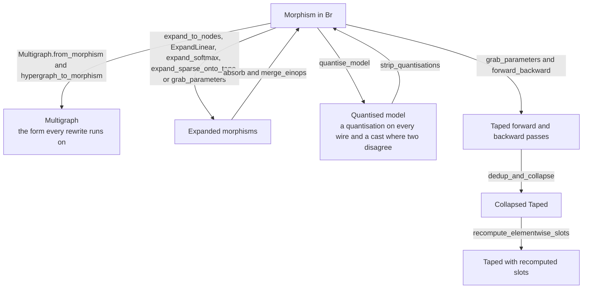
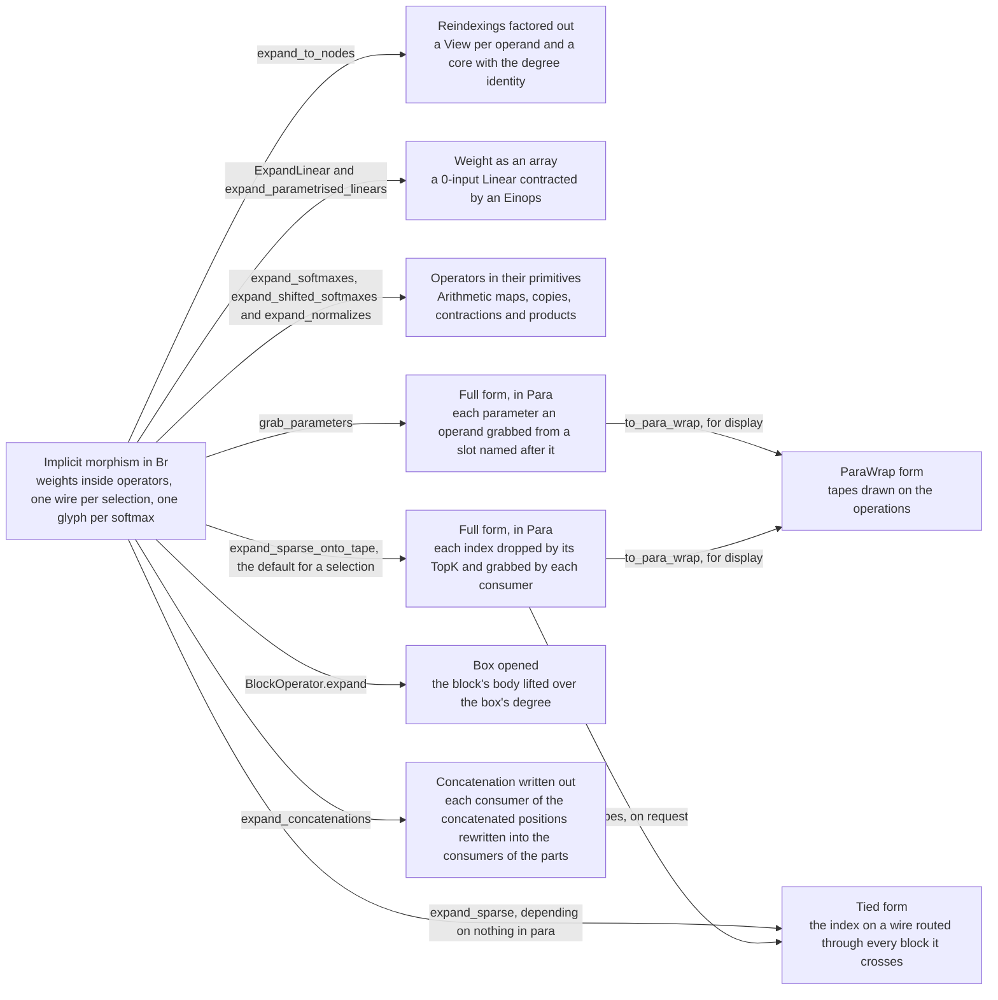

# Forms of an Expression

Written by Claude Opus 5 (1M context), effort high.

## What it is

One expression passes through several forms on its way to a diagram, a training pair or a
quantised model, and each pass reads one form and writes the next. The notes listed below
each carry a Mermaid graph whose boxes are the forms and whose edges are the passes. This
note indexes those graphs and draws how the pipelines feed one another.

## The pipelines

| pipeline | the note holding its graph |
|---|---|
| the expansions, and the form each writes out | *The expansions*, below |
| a morphism and its hypergraph | [[Hypergraphs]] |
| the expansions of an operator and the rewrites that undo them | [[Expression Simplification]] |
| the three forms of a selection | [[Sparse Axes]] |
| the forms of a padded or masked axis | [[Padding and Masks as Sparse Axes]] |
| the three forms of a weight | [[Linear Expansion]] |
| a quantised model, and the model under it | [[Quantization]], [[Stripping Quantisations]] |
| training, from a morphism to a checked pair | [[Training]] |
| the collapse of a backward pass | [[Pathway Collapse]] |

## The expansions

Every expansion writes out something an operator or a wire held implicitly. The implicit
form is the one a model is written in and can be worked in. The full form is the complete
statement, and where it is in Para the tape is the only coupling between its pieces. A
figure shows the implicit form or, for a form in Para, the wrapped form. The tied form is
reached on request and is not worked in.

| expansion | what it writes out | module |
|---|---|---|
| reindexings out of a `Broadcasted` | a `View` per operand and a core | `algebra/node_expansion.py`, per [[Expression Simplification]] |
| a `Linear`'s weight | a 0-input array contracted by an `Einops` | `algebra/linear_expansion.py`, per [[Linear Expansion]] |
| a `SoftMax` or a `Normalize` | its primitives | `algebra/operator_expansion.py`, per [[Expression Simplification]] |
| the parameters an operator reads | a grabbed operand per parameter | `para/processing/show_grabbed_parameters.py`, per [[Show Grabbed Parameters]] |
| a selection, onto the tape | a dropped and grabbed index per selection | `para/algebra/para_sparse_expansion.py`, per [[Sparse Axes]] |
| a selection, onto a wire | the same index as a wire | `deepseek/sparse_expansion.py`, per [[Sparse Expansion]] |
| a box | the block's body over the box's degree | `data_structure/Operators.py` |
| a concatenation of two axes | the consumers of the parts | `advanced_axis_dynamics/algebra/concatenation_expansion.py`, per [[Advanced Axis Dynamics]] |

## See also

- [[Home]] — the layer diagram
- [[Repository Map]] — where each pipeline's code sits
