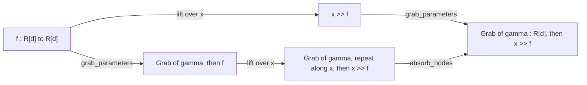

# Outer and Inner Tape Slots

## What it is

The user stated the category on 2026-09-26 as $\mathbf{Para}[\mathbf{BorelStoch}; A]$. An expression is a morphism of $\mathbf{BorelStoch}$, the category whose objects are measurable spaces and whose morphisms send each point of the domain, measurably, to a probability measure on the codomain. $A$ stands for the arrays and the lifting built inside that category, which are [[Broadcasted Category|Br]] and the lift `>>` of [[Construction Helpers]]. The Para construction of [[Para Category]] is applied after both. A grab or a drop moves a part of the expression onto the tape.

The Para construction appears twice in $\mathbf{Para}[\mathbf{BorelStoch}; A]$. A tape slot is outer or inner according to which of the two its grabs and drops belong to.

An **outer tape slot** belongs to the Para applied outside the arrays and the lift. The weight of a learned linear map is held in an outer slot. The grab of the weight stands for loading a variable, and a drop onto its slot stands for storing one. Broadcasting the expression over a batch axis `x` does not change how much data is loaded or stored, because every index of `x` reads the same weight. An outer slot therefore holds one array however many axes the expression is lifted over. `Para.OuterTapeSlot` is the class.

An **inner tape slot** belongs to a Para inside $\mathbf{BorelStoch}$ itself. The package writes a stochastic morphism as a seed of randomness beside an identity, followed by a deterministic function. In symbols $f = (\sigma \otimes \mathrm{id}_X) \mathbin{;} g$, where $\sigma : I \to \Omega$ is a probability measure and $g : \Omega \times X \to Y$ is a measurable function. The randomness of such a morphism can always be moved out of the expression as a grab of $\Omega$. The morphisms written this way form a subcategory close to $\mathbf{Para}_X \subset \mathbf{BorelStoch}$, and the slot holding their randomness is inner. Lifting $f$ over `x` draws an independent sample at every index of `x`, so the lift of $\sigma$ is $\sigma^{\otimes \lvert x \rvert} : I \to \Omega^{x}$, and the array read by the grab carries `x`. A dropout is the example. It reads a uniform sample $u$ at every element and returns $x \cdot [u > p] / (1 - p)$.

A cache is held in an inner slot as well. A cache broadcast over an axis saves and loads that axis with its entries, and so does a cached array that carries axes beside the cached tokens. The residuals taped for the reverse pass, the loop variables of a stream loop and the partials exchanged in a reduction are also held in inner slots. A plain `Para.TapeSlot` is inner.

## Where it lives

| | |
|---|---|
| `para/data_structure/Para.py` | `TapeSlot`, `OuterTapeSlot` and `new_slot_like`. A `TapeSlot` of no subclass is inner |
| `para/registries/object_lift.py` | `lift_tape_seed_over_axes`, which lifts a seed according to the kind of its slot, with `repeat_along` and `transposed_repeat_along` |
| `para/processing/show_grabbed_parameters.py` | `grab_parameters`, which grabs every weight, bias and gain from an outer slot, and `write_grabs_as_weight_arrays` and `box_grabbed_weights`, which rewrite the grab of an outer slot alone, through `is_grab_of_a_parameter` |
| `para/processing/backprop.py` | `gradient_slot`, whose slot is outer where the slot of the parameter is outer |
| `para/data_structure/ParaBlockOperator.py` | `broadcast_para_block_over_axes`, which reads an outer grab at no position of the degree and raises `OuterDropInBroadcastBox` for an outer drop |
| `para/algebra/detape.py` | `detape`, whose extra inputs carry no record of the kind of their slot |
| `algebra/factor_out_lift.py` | `factor_out_lift`, the inverse of the lift, which returns a `FactoredLift` |
| `notebooks/display/expand_with_parameters.py` | the write-out of an inspection box, which expands the factored operator |
| `caching/registries/standard_expansions.py` | `slot_of_cache`, which makes the inner slot that holds a cache |
| `notebooks/sota/DeepSeekV41Flash/construction_idioms.py` | `named_slot`, which makes the inner slot of a value passed by a model between its layers or its passes |

`tsncd` mirrors `OuterTapeSlot` in `src/para/data_structure/Para.ts` as a subclass of `TapeSlot` with no fields of its own, and draws it as it draws a plain slot, per [[Terms Mirrored in tsncd]].

## A lift of a seed depends on the kind of its slot

`lift_tape_seed_over_axes` states three lifts over an axis `x`. A seed of an inner slot reads or writes the lifted array.

$$x \gg \mathrm{Grab}\langle s \rangle_{A} = \mathrm{Grab}\langle s \rangle_{xA}$$

A grab of an outer slot reads its own array, and a repeat $\Delta_x : A \to xA$ follows it. The repeat is a `View` whose reindexing does not name `x`, and `algebra.reindexing_absorption` folds it into the operations that read it.

$$x \gg \mathrm{Grab}\langle s \rangle_{A} = \mathrm{Grab}\langle s \rangle_{A} \mathbin{;} \Delta_x$$

A drop of an outer slot sums over `x` with an `Einops` $\Sigma_x : xA \to A$ and drops the sum.

$$x \gg \mathrm{Drop}\langle s \rangle_{A} = \Sigma_x \mathbin{;} \mathrm{Drop}\langle s \rangle_{A}$$

The sum follows from the reverse derivative. The reverse of a grab is the drop of its cotangent, $R[\mathrm{Grab}\langle s \rangle] = \mathrm{Drop}\langle ds \rangle$, and the reverse of a repeat is a sum, $R[\Delta_x] = \Sigma_x$. Composing the two gives $R[x \gg \mathrm{Grab}\langle s \rangle] = \Sigma_x \mathbin{;} \mathrm{Drop}\langle ds \rangle$. The lift of an outer drop has to be that morphism for the lift to commute with $R$.

`gradient_slot` makes the slot $ds$ outer when $s$ is outer. The cotangent of a parameter is the only outer drop written by the package. Over a batch axis the sum accumulates the gradient of a shared weight over the batch, $dW = \sum_{i_x \in x} dW[i_x]$. [[Training]] states the same rule for a tied weight, whose two writes to one gradient slot add. An optimiser that wrote a new weight onto an outer slot would stand outside the model and would not be lifted over the batch.

## Grabbing parameters and lifting commute

Before 2026-09-26 a slot had no kind. `grab_parameters` already treated a parameter as outer, because the weave of a grabbed weight has no tiled entry and its reindexing deletes the whole degree. The lift rule for a seed treated every slot as inner, because it prepended the lifted axes to every grab. A model that grabbed its parameters and was then lifted over `x` therefore read one weight per token, and a model lifted first read one weight.

With the kind on the slot the two orders agree. For an RMSNorm and for a linear map, the two paths of the graph below reach one morphism, once the slots minted by two separate calls of `grab_parameters` are given one name.

| form | note |
|---|---|
| `x >> f` | [[Construction Helpers]] |
| Grab of gamma, then f | [[Show Grabbed Parameters]] |
| Grab of gamma, repeat along x, then x >> f | [[Expression Simplification]], which states `absorb_nodes` |

## An inspection box writes out the operator at one index of its lift

`factor_out_lift` takes a lift off a `Broadcasted`. It counts the leading positions of the degree that are tiled by every weave at its own leading positions and carried straight through by every reindexing. A reindexing carries a position straight through when that position reads the same position of the operand and no other position of the operand reads it. The function returns the axes at those positions beside the `Broadcasted` with those positions removed, and lifting the second over the first gives back the original. It reads a reindexing by its structure. A reindexing of an unrecognised form carries no position, so the count never exceeds the true count.

An operator of **Br** never reads the index of its degree, so the operator at one index of the factored axes is the whole of what it computes. `expand_with_parameters` writes out the factored operator for the inspection box of [[Advanced Display]], and the figure around the box states the broadcast. The gain and the weight are grabbed from outer slots, and the lift does not enlarge an outer slot. The expansion in the box, lifted over the factored axes, is therefore the expansion of the operator held by the figure. On the website page of DeepSeek-V4.1-Flash, per [[Website Notebooks]], the box over an RMSNorm of the residual stream draws the normalisation of one token, `R[m] -> R[m]`, with its gain $\gamma$ over `m`. Before 2026-09-26 the box drew every step over `x`. The box over `W^{Qa}` draws the map applied to one token.

The expansion of an operator holding an inner slot also lifts to the operator held by the figure, because the lift enlarges the array of the inner slot. The box over a `Caching` broadcast over the heads draws the cache of one head, and the cache of every head is loaded once the expansion is lifted, per [[Caching Between Passes]]. A weight array in a box stands for a parameter, so the write-out replaces the grab of an outer slot alone. The box over a `Caching` therefore draws its load and its append on the tape. Until 2026-09-26 every grab was replaced, and the load of a cache was drawn as a weight array.

## The rules

- A parameter is grabbed from an outer slot, and `grab_parameters` grabs every weight, bias and gain that way. A model that writes the grab of a parameter by hand captures the name of the parameter onto `Para.OuterTapeSlot()`. `check_every_matrix_is_grabbed_from_a_slot_named_after_it` in `notebooks/website/tutorial/validate_attention_with_weights_and_residual.py` checks that the tutorial's attention grabs its four matrices from outer slots named `W^{Q}`, `W^{K}`, `W^{V}` and `W^{O}`.
- A random sample, a residual, the entries of a cache, a loop variable and an exchanged partial are grabbed from a plain `Para.TapeSlot`. `slot_of_cache` in `caching/registries/standard_expansions.py` and `named_slot` in `notebooks/sota/DeepSeekV41Flash/construction_idioms.py` both make inner slots.
- Every seed class reads and writes a slot of either kind. A `LoopGrab` of an outer slot is the weight read by one layer of a stack, and the stack lifted over the tokens reads that weight once.
- Make a slot derived from an existing slot, such as the slot of its cotangent, with `Para.new_slot_like`, so that the new slot keeps the kind of the existing one.
- Lift a pass before it is detaped. `detape` makes each grab an extra input, and an extra input carries no record of the kind of its slot. A lift of the detaped pass would lift the input of an outer slot as it lifts every other input, where the lift of the grab would have kept one array.
- A loop is not a broadcast. `para.processing.tape_members` indexes the members of a slot by the loops around a seed alone, so the weight of a layer in a stack is one member per iteration whatever the kind of its slot.

## Gaps

- **An outer drop inside a broadcast box has no port to sum at.** `broadcast_para_block_over_axes` raises `OuterDropInBroadcastBox`. The sum would have to stand between the trailing result of the box and the drop of the wrap.
- **Dropout is not written as a grab of a uniform sample.** `ops.Dropout` is an elementwise operator with the randomness inside it, so no expression in the package yet holds an inner slot that carries randomness. The docstring of `ops.Dropout` in `data_structure/Operators.py` states the grab and the function that would replace the operator.

## See also

- [[Para Category]] — the seeds, each of which reads and writes a slot of either kind
- [[Show Grabbed Parameters]] — the grab of every parameter
- [[Para Block Operator]] — a boxed block whose grabs stand at its ports
- [[Construction Helpers]] — the lift `>>` and its registry of rules for seeds
- [[Advanced Display]] — the inspection boxes
- [[Caching Between Passes]] — a cache, whose slot is inner
- [[Training]] — the writers of a parameter slot
- [[Derivatives]] — the reverse derivative, with which the lift of an outer drop commutes
