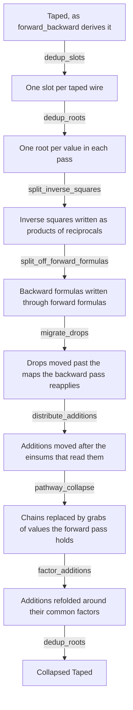

# Pathway Collapse

The note was called *Forward Recall* until 2026-08-21. It was renamed because what
happens is that a pathway through the backward pass collapses onto a value the forward
pass holds. The module is `para/algebra/pathway_collapse.py` and the function is
`pathway_collapse`.

## What it is

A rewrite on a `Taped` pair. A chain the backward pass is about to compute is recognised
as a value the forward pass already computed, and is grabbed from the tape instead.

The FlashAttention D-trick is the motivating case, and the module derives it rather than
declaring it. It is the first of the rewrites that optimise a backward pass, and the
template for the others: state the algebraic fact, search for its shape, and let the tape
carry the value between the two passes.

The module holds four rewrites that run around the collapse, and `collapse(taped)` runs
all five in order.



`collapse` is the six middle edges. `dedup_and_collapse` is the whole graph.
`recompute_elementwise_slots` is a policy the caller runs afterwards, and
`collapse` does not run it.

**`split_inverse_squares`**, added 2026-08-22, handles $x^{-2}$. `Arithmetic<c·x^{-2}>`,
which is the derivative the reciprocal rule writes, becomes $x^{-1}$, copied, with one
copy scaled by $c$ through a linear `Arithmetic<c·x>` and multiplied back together.

As a map of $z$ the square is opaque to every rewrite here. As a product of reciprocals
it is built from the map the forward pass already applies to the same wire, so
`migrate_drops` puts each copy on the tape and the collapse regroups them.

The rewrite is the output-form derivative $g' = \gamma\circ g$, instantiated by hand for the one
atom where $\gamma$ is itself a product. The general solver rule, $h = f'\circ f^{-1}$,
remains open.

**`split_off_forward_formulas`**, added 2026-09-11, handles a backward formula that is a
function of a forward one. The backward pass applies `Arithmetic<f>` to a grab of a wire
the forward pass taped, and the forward pass applies `Arithmetic<g>` to the same wire.
Where $f = h \circ g$, the backward root becomes the forward root's own morphism on the
grab followed by `Arithmetic<h>`, and `migrate_drops` then replaces the recomputed $g$
with a grab of its value. The sigmoid's derivative $\sigma(x)(1 - \sigma(x))$ becomes
$x(1 - x)$ applied to the taped $\sigma(x)$.

`nm.outer_function` finds $h$ by replacing $g$ with a fresh symbol and requiring that the
free input appear nowhere else. The formulas are compared as written first. Only when no
forward formula matches are both sides expanded through `nm.expand_every_expandable`, per
[[Numerics#Expandable numerics]], and a backward formula that matches neither way keeps
its `Sigmoid` and `RectifiedLinear` terms. The rewrite uses a forward value only when it
is already taped or is a forward output, which is the gate the collapse applies below,
because the rewrite adds a recomputation that `migrate_drops` then turns into a read of
the tape.

The rewrite is the output-form derivative $g' = \gamma \circ g$ in the cases where
substitution finds $\gamma$. It does not find the ReLU's, because $[x > 0]$ equals
$[\mathrm{ReLU}(x) > 0]$ without containing $\mathrm{ReLU}(x)$. It does not find the
RMSNorm's inverse root either, which is described under the gaps below.

**`migrate_drops`** moves the tape through a deterministic map. The forward pass copies
$X$ to $F$ and to `Drop<s>`, and the backward pass applies the same $F$ to `Grab<s>`,
which is a recomputation. The derived softmax backward rebuilds $\mathrm{e}^{x}$ from
`s0` that way.

Copying commutes with any map in a Cartesian category, since
$\mathrm{copy}\,;(F\times F) = F\,;\mathrm{copy}$, so the drop may sit after $F$. The
forward pass tapes $F(X)$, reusing its slot where it already does, the backward pass
grabs it where it recomputed, and the sweep removes `s` if nothing else reads it.

The rewrite assumes no linearity, which makes it the most general of the three.
Randomness would break its premise, and for backpropagation randomness is abstracted into
generators.

The premise that the two maps are the same $F$ is checked structurally. The backward
root's morphism is `==` the forward's, which holds because the derivative rule rebuilds
the map through `einops_simplification.einsum` on the same arrays, so its
`Arithmetic<e^{x}>` compares equal. Every operand is a grab of the corresponding forward
operand.

**`distribute_additions`** moves every addition an einsum reads to after the einsum,
rewriting `einsum(p, a + b)` as `einsum(p, a) + einsum(p, b)`.

An addition ends a tangent chain, so a backward pass that adds first and multiplies after
conceals its chains. Distributed, each summand's chain runs back to its seed and the
collapse is offered the most general form.

The rewrite does not apply when the einsum reads the sum twice, which would be quadratic,
and when an operand the sum broadcast would be contracted unaccompanied, because its
multiplicity would vanish. A sum with other readers stays for them. The rewrite costs
einsums on its own, which is what `factor_additions` repairs.

**`pathway_collapse`** finds and rewrites the chains. The procedure is below.

**`factor_additions`**, added 2026-08-22, undoes the distribution once there are no more
chains to expose. Every addition of einsums sharing a common factor is refolded,
rewriting `einsum(p, a) + einsum(p, b)` as `einsum(p, a + b)`, and only when that
strictly reduces the einsum count.

Linear scalings sink through their einsums onto a strictly smaller operand first, turning
`-(einsum(s, y))` into `einsum(-s, y)`, which shrinks the pointwise work and exposes the
common factor. Residues keep the axes they share with the factor or with the output and
pre-contract the rest, and the refolded addition broadcasts residues of different shapes.

The rewrite applies to the backward pass only. It makes `collapse` idempotent only up to
wire identity, because a second run redistributes and refactors the same additions, so a
fixed-point check compares listings rather than objects.

## Four further uses of linearity

Since 2026-08-22 the chain machinery uses linearity harder, in four ways that are all
instances of one fact: scaling and regrouping commute with a multilinear chain.

A linear `Arithmetic<c·x>` is part of a chain. The unifier passes through it on the
tangent path and past it on a primal, collects the constant, and reapplies it once
as a single `Arithmetic<c·x>` after the rewritten einsum.

A link that cannot join ends the chain rather than causing a refusal. That covers a
fan-in, a nonlinearity, and an axis the chain already uses. The wire above the link
becomes the seed, and the chain below it still regroups.

A primal made by an einsum of primals is flattened into its factors, which is Fubini's
theorem on the primal side, so `r·(-r)` offers each `r` to the match separately.

The rewrite hoists factors carrying no contracted axis out of the contraction into a
second einsum, so a later round can regroup them with what sits above the chain.

## Three related passes

`dedup_slots` runs before everything else and gives each wire one slot. `backprop` tapes a
residual once per consumer, because each seed declares its own with no view of the others,
and attention therefore drops the softmax output twice.

The duplication is invisible in the morphism, because `cat.Array` compares structurally. The
graph can. `Drop`s of the same wire merge into the lowest-numbered slot, and the backward
pass's `Grab` of a removed slot is deleted with its node canonicalised onto the kept
grab's node, so consumers follow it wherever they sit. A grab whose kept twin sits in
another block is pointed at the kept slot instead, so after `dedup_slots` a slot is grabbed
once per block that reads it.

`dedup_roots` runs after `dedup_slots` and gives each value one root in each pass. It
applies `graphs/processing/merge_duplicate_roots.py`, described under [[Functors]], to both
passes. Two roots wrapping equal morphisms on the same wires are merged into the first,
placed in the innermost block enclosing every reader, and a loop block is a boundary. On the
expanded DeepSeek-V3 layer of [[DeepSeek-V3 Backward Pass]] it merges the forward pass's
three grabs of the index into one inside `Experts`, and the backward pass's four grabs of
the index and five grabs of the normalised tokens into one each, hoisted to
`R[Mixture of Experts]`. Attention, expanded attention and the parametrised feed-forward
layer hold no duplicate roots, so the pass returns them unchanged. `validate_backward`
checks the pass on an input copied into two equal exponentials, whose forward pass keeps
one exponential and whose gradients agree with `torch.autograd`.

The order against `reindexing_absorption.absorb` no longer matters for a node. Until
2026-09-06 `absorb` folded only a node whose result was read once, so `dedup_roots` run
before absorption on the DeepSeek-V3 backward pass merged the two `View` broadcasts of the
token input into one `View` with two readers, absorbed by neither. `absorb_nodes` now
copies a node over its fan-out and folds a copy into each reader, per
[[Expression Simplification]], so a deduplicated `View` is absorbed as two separate ones
were.

`recompute_elementwise_slots` is the opposite policy to `migrate_drops`, on the same
pattern of two taped values a deterministic map apart. `migrate_drops` spends memory to
remove a recomputation, by moving the save after the map. This pass spends a recomputation
to remove a slot. The earlier value stays taped, the later value's `Drop` is deleted, and
every backward `Grab` of it becomes `Grab<s> ; f`, with the map re-run at the point of
use.

The trade is selective activation recomputation as it is practised elsewhere. Megatron-LM
recomputes the pointwise pieces, and FlashAttention applies the same idea to a value that
is not elementwise.

Which policy is correct is a question of bytes against operations per slot, which is a
cost question, so the pass is explicit and `collapse` does not run it.

A `View` is excluded, because it is a reindexing rather than a computation, and a
`Dropout` is excluded too. Introducing a recomputation requires determinism, and a re-run
dropout draws a fresh mask, where `migrate_drops` only ever removes a recomputation the
derivation had already written.

The parametrised feed-forward layer in [[Show Grabbed Parameters]] goes from three
residual slots to two, with gradients unchanged against `torch.autograd`, checked in
`validate_backward` for both variants.

`dedup_and_collapse` runs `dedup_slots`, `dedup_roots`, `collapse` and `dedup_roots` again,
which is the sequence a derived attention pair is simplified with. The second
`dedup_roots` merges the chains `collapse` built once per reader.

## The mathematics

**A backward pass is linear in its cotangents.** Every rule in [[Derivatives]] is linear
in the incoming tangent. An einsum contracts the cotangent against residuals, which is
multilinearity. An addition adds tangents. A reindexing transposes to a reindexing or a
sum. The nonlinear pieces, meaning `e'`, `/z'` and a softmax's `y`, enter only as primal
factors multiplied into a tangent.

The tangent dataflow is therefore a directed acyclic graph of linear maps, and any tangent
value is a sum over paths of composed linear maps applied to a cotangent seed. A fan-in,
which is an `AdditionOp`, bounds a path. Along one path there is exactly one tangent wire
at every step, because tangents never multiply tangents.

**A path segment of einsum links is one einsum.** For a chain

    t₁ = einsum(dY, A)        t₂ = einsum(t₁, B)

nesting the sums and flattening them is Fubini's theorem:

    t₂ = einsum(dY, A, B)

It is valid because t₁ enters t₂ once, giving one tangent operand per link, and because no
wire writes a diagonal, since a wire read at one index variable twice is skipped. Iterated,
a whole chain is a single einsum `einsum(seed; P₁ … Pₖ)` over the seed and the
chain's primal operands.

**Regrouping costs nothing, and a regrouped factor may already exist.** Any subset G of
the primal operands can be contracted first:

    einsum(seed; P₁ … Pₖ)  =  einsum(seed; M, rest)      M = einsum(G)

where M keeps exactly the axes of G that are shared with anything outside G. If the
forward pass computed M, with the same operand values and the same surviving axes, the
backward pass should read it rather than rebuild it.

Identity is checkable structurally. Operands cross between the two passes through slots,
because a backward `Grab` and a forward `Drop` share a `TapeSlot` term. Every shape is
written in index variables rather than axes. A root's variables come from
`einops_simplification.index_shapes`, one per degree position and one per contraction
group, and a chain renames each link's variables into its own as it inlines the link, so
a variable a link contracts is fresh to the chain and one token axis at both positions of
the scores is two variables. `_pattern_key` then writes an einsum over operand wires and
surviving variables in a canonical form, the same for any naming of the variables and any
order of the operands, and that key is looked up on both sides. It determines the einsum
completely, because an einsum is a function of its shapes. [[Expression Simplification]]
covers that reading, and records the
change from axes to variables.

**The D-trick follows as a corollary.** When the chain is a full pairing, meaning
everything is contracted down to the degree, regrouping is the adjoint identity iterated:

    ⟨dY·Wᵀ, X⟩ = ⟨dY, X·W⟩

A pairing of a cotangent with a primal moves through a linear map to either end. Attention
instantiates it once, with X as P and W as V, giving ⟨dP, P⟩ₓ = ⟨dO, O⟩ᵥ. With an output
projection it instantiates twice and the pairing lands on the model output, which the
collapse reaches in two rounds, each grabbing the next taped value along the chain.

## The procedure

`pathway_collapse(taped)` iterates to a fixed point. Each round runs catalogue, unify,
match and rewrite, all on the [[Hypergraphs|graph]], where a wire has identity.

**Catalogue the forward pass.** Take every wire outside a loop block that is one einsum
over taped wires, at any block depth, unifying chains by inlining producers until a wire is
taped, is an input, or is made by something other than an einsum. Those stops are where a nonlinearity or the tape cuts
the chain. In attention the catalogue is exactly `S = QKᵀ` and `O = P·V`.

**Unify a backward chain.** For each einsum with a tangent output, inline the tangent
operand's einsum producers back to a seed, which is a pass input or a fan-in, pooling the
primal operands. There is one tangent operand per link and no repeated axes.

**Match.** Map each primal operand to its forward wire through its slot, and try subsets,
largest first, keyed as above.

The match is gated. The matched wire must be already taped or a forward output. Anything
else would materialise an array the forward pass never stored, and recalling `S` through a
fresh `q×x` slot is what FlashAttention exists to avoid.

**Rewrite both passes.** The forward pass gains `Drop(M)` when M was untaped. The backward
pass's final einsum in the chain is rebuilt as `einsum(seed; kept, Grab(M))` onto the same
output node, so consumers never move.

A candidate inside a block is hoisted out first. Since 2026-08-21 that happens only when
the forward pass was in a block, because a rule writes no block of its own. Its operands
come from outside the block in any case, and the hoisted statistic is FlashAttention's
separate preprocessing kernel, which is how it is drawn. The block then reads the statistic
as an input.

Existing grabs of a slot are reused, and a final sweep removes grabs orphaned by later
rounds and drops that nothing reads.

On cost: einsums dominate compute and the gate makes the memory side free, so a collapse
cannot lose. The recalled pairing is over the axes of an array the forward pass kept,
`q×v` against `q×x`, and the chain feeding it loses a reader, which is what allows
single-pass streaming over `x` in the kernel.

## What it does to the expanded softmax

`collapse` applied to `exp ; copy ; sum ; 1/z ; scale`, which is the hand expansion in
[[Notebooks|ForwardAndBackward]], gives the closed-form softmax rule itself, operation for
operation, as of 2026-08-22:

$$\mathrm{d}x = y\odot(\mathrm{d}y - \langle\mathrm{d}y, y\rangle)$$

Only $y$ is taped. The residual, written `Residual(outputs=(0,))`, the formula, and the
operation counts of `1x AdditionOp, 1x Arithmetic, 2x Einops` are what `SoftMax` declares a-priori,
all derived here from the primitives.

The cascade runs as follows. The inverse-square rewrite writes
$-z^{-2} = r\cdot(-1\cdot r)$. `migrate_drops` makes each $r$ a grab of the forward pass's
reciprocal at `s2`, and $e$ a grab of `s3`, so `s0` dies.

The chain $e\odot(r\,\mathrm{d}y)$ regroups $\{e,r\}$ to the output $y$, taped as `s4`,
which costs nothing because it is an output.

The inner chain of the second term is $\mathrm{einsum}(\mathrm{d}y; e, r, -r)$ after
flattening, and $\{e,r\}$ regroups to $y$ again, giving
$\langle\mathrm{d}y,e\rangle r = \langle\mathrm{d}y,y\rangle$, with $-r$ hoisted out of
the contraction.

The one-shape rule ends the outer chain at the pairing instead of dropping it, and
regroups $e$ with the $r$ seen through the scaling to $y$ a third time, with the $-1$
emerging as the one `Arithmetic<-x>`.

Everything else is swept. `s1`, `s2` and `s3` all lose their last reader, and the pass
closes over $\{y\}$ where the derived one closed over $\{x, e, z, r\}$.

`factor_additions` then sinks the $-1$ onto the scalar and refolds the addition around the
common $y$, so the collapse's distributed $y\odot\mathrm{d}y - y(\cdots)$ becomes the
declared rule's broadcast subtraction followed by one multiply.

On expanded attention the same cascade tapes $P$ and $O$, derives
$D = \langle\mathrm{d}O, O\rangle$ from the primitives, and drops $z$ and $r$ from the
tape. The factoring restores $\mathrm{d}Q$ and $\mathrm{d}K$ to one contraction each,
taking nine einsums to seven.

`collapse` builds $\mathrm{d}S = \mathrm{d}P\odot P - D\,P$ once per consumer, giving two
`AdditionOp`s, and `dedup_roots` run after it merges the two. `dedup_and_collapse` is that
sequence. Both results are checked numerically in `validate_backward`, under
`expanded softmax, all rewrites` and `attention, expanded, all rewrites`.

## What it does to attention

```
forward   + = Drop<s5>(%3)                                      O taped
backward    %11 = Einops(%0[q, {v}], %9[q, {v}]) : R[q]         D = ⟨dO, O⟩
            R[SoftMax] { negate, add, multiply }                 reads D
```

`dP` keeps its other reader, which is the subtraction. P stays taped for the `dS` multiply
and for `dV`. Eliminating those is the gap on recomputing from statistics rather than
anything this rule addresses.

## Validation

`para/validate_backward.py` checks the passes themselves against `torch.autograd`, rather
than checking the rewrites against each other.

`detape` turns each pass into a pure function, making a `Drop` an extra output and a `Grab`
an extra input, in slot order, which is what a training loop does with saved activations.
Both passes are compiled with [[Torch Compile]] and run on random tensors.

The cases checked are matmul, softmax, the expanded softmax, attention simplified,
attention collapsed, and attention with a projection collapsed, which is the two-round
transport. The file also checks that the collapse fired, that it preserves both the domain
and the codomain, and that it is a fixed point.

Since 2026-09-11 it also checks the rectified linear numeric, a clamp on both sides, and
three pointwise formulas through every rewrite. The sigmoid's backward pass reads its
taped output and applies `Arithmetic<x * (1 - x)>`. The SiLU keeps its `\sigma(x)`,
because its derivative is not a function of the SiLU's value. A log-sigmoid beside a
sigmoid spelled in primitives reads the spelled sigmoid off the tape, which only the
expansion matches.

It registers real semantics for the named elementwise maps, being `e`, `/z`, their primes
and the negate. `torch_compile` maps every `Elementwise` to `torch.relu` by default, which
is a placeholder that would otherwise report a false pass.

## Two things the softmax example established

**The unifier reads each wire at one shape.** A link that would read a wire the chain
already reads, at another shape, ends the chain, because the two reads are one value
under two indexings and the forward pass computed it once. In
$e[q,x]\cdot\langle\mathrm{d}y, e\rangle_x$ the product reads $e$ free and the pairing
reads it contracted, so the pairing ends the chain.

Before 2026-09-05 the same link was ended by a guard on axis identity, since inlining then
pooled every operand into one einsum over shared axis objects and the two occurrences of
$x$ would have been conflated. Nothing checked for that before 2026-08-21, and no match
happened to fire on such a chain. Since 2026-08-22 the link ends the chain, making its
output the seed, rather than refusing it. Ending the chain is what allows the outer softmax
regrouping to fire with $\langle\mathrm{d}y,y\rangle$ as its seed, and on the DeepSeek-V3
layer the one-shape rule produces the same five matches the axis guard produced.

The other direction, where an outer link sums an axis the inner link produces, is an
ordinary chain, and is what the D-trick is. Renaming the bound axis, which is the fully
general answer, does not exist yet.

**`_collect_dead_roots` removes every dead top-level root, to a fixed point**, rather than
grabs alone. A collapsed chain whose inner link had one reader leaves that link orphaned,
and an orphaned root makes `hypergraph_to_morphism` fail with `is not in list`. It surfaced
on expanded attention, where $\mathrm{d}P\cdot r$ was read once.

## Gaps

An addition ending a chain is closed. `distribute_additions`, added 2026-08-21, moves the
addition after the einsum, and `factor_additions`, added 2026-08-22, refolds it. The
twin roots are closed too, on 2026-09-05. A factored sum wanted by two consumers, such as
$\mathrm{d}S$ by $\mathrm{d}Q$ and $\mathrm{d}K$, is built once per consumer, because each
factoring refolds its own addition, and `dedup_roots` run after `collapse` merges the two
roots. `dedup_and_collapse` is that sequence.

`Arithmetic` outputs being opaque to the collapse is closed for the reciprocal's
derivative, by `split_inverse_squares` together with the linearity admissions. What remains is the general output-form
derivative: a solver rule $h = f'\circ f^{-1}$ for the other invertible atoms. Nothing in
the current expressions requires one.

~~`migrate_drops` and `distribute_additions` act on top-level roots only, and the catalogue
reads top-level roots~~. Closed 2026-09-04. Every rewrite indexes roots through every block
whose repetition is 1, edits them in place through `replace_roots`, places new roots in a
chosen scope through `rewire_blocks.insert_roots`, and calls
`rewire_blocks.recompute_block_boundaries` once, per [[Functors]]. A rewritten chain is
hoisted one block out of its root's block only when every wire it reads is produced outside
that block, because a root outside a block reading its output and feeding its input is a
cycle. A loop block stays a boundary, so a forward pass inside one still contributes
nothing, and a chain inside one is not rewritten.

`distribute_additions` leaves a sum with another reader alone. Distributing it keeps the sum
for that reader and copies each summand into the einsum beside it, and `factor_additions`
cannot fold the copies back while the original stands. On the DeepSeek-V3 layer the
cotangent entering each RMSNorm is a sum the gain gradient reads as well, and distributing
it left 89 einsums where there had been 61. With the guard the layer collapses to 60
einsums and 14 arithmetics from 61 and 15, and its tape from 45 residual slots to 39: the
softmax's four and the gate normalisation's two, per [[DeepSeek-V3 Backward Pass]]. The
same guard takes bare expanded attention from 7 einsums and two additions after the
collapse to 6 and one.

The derivative of an inverse root is opaque. An RMSNorm writes its normaliser as
$r = (\epsilon + z/|m|)^{-1/2}$ and the numeric derivative writes $r'$ as a formula in $z$,
$-\tfrac{1}{2|m|}(\epsilon + z/|m|)^{-3/2}$. `split_inverse_squares` reads through the one
power $x^{-2}$ and no other, so the RMSNorm blocks keep four residuals each, $x$, $z$, $r$
and $\hat{x}$, where writing $r' = -\tfrac{1}{2|m|} r^{3}$ would let the chain collapse onto
the saved $r$ and keep two. The general rule is the output-form derivative
$h = f' \circ f^{-1}$ already recorded above. `split_off_forward_formulas` does not reach
it, because $(\epsilon + z/|m|)^{-3/2}$ does not contain $r = (\epsilon + z/|m|)^{-1/2}$,
and writing the one as $r^{3}$ is power algebra that substitution does not do.

Recomputing from statistics is a different rule. FlashAttention also avoids taping P by
rebuilding it from the row statistics, which is a rematerialisation policy on the tape.
[[Recomputing the Exponent in the Backward Pass]] states the trade-off.

Only einsum links are handled. A reindexing in the middle of a chain stops it, and
absorbing the reindexing first, described in [[Expression Simplification]], is the current
answer.

A wire read at one index variable twice, meaning a written diagonal, is skipped
throughout. A wire carrying one axis at two positions is not a diagonal, and self-attention
from one copied input collapses like attention on two axes.

## See also

- [[Backpropagation]] — the pairs this rewrites
- [[Recomputing the Exponent in the Backward Pass]] — the store-against-recompute trade-off
  behind the one $[q, x]$ slot the collapse leaves on attention's tape
- [[Expression Simplification]] — the rewrites that run first, and the reading of an
  einsum as a function of its shapes in index variables that the match rests on
- [[Derivatives]] — why every rule is linear in the tangent
- [[Validation]] — where `validate_backward` sits among the harnesses
- [[Open Gaps]] — the D-trick entry this closes, and what it leaves open
- [[Notebooks]] — what each notebook of the repository demonstrates
