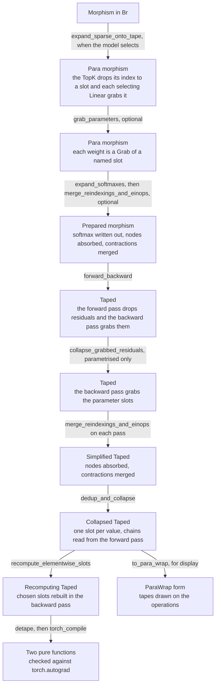

# Training

## What it is

Everything else in this vault derives something from a model: a diagram, a kernel, a cost.
Training is the first thing that derives a second morphism, the reverse pass, and then has
to couple it back to the first. [[Para Category]] is where the coupling lives, as a slotted
tape written by one pass and read by the other, with no wire crossing between them.

This note states what the algebra has to provide for the coupling to work, and classifies
the parameter updates real models use. Only some of them are gradients, and the ones that
are not are what fix the shape of the construction.

## Where it lives

`para/data_structure/Para.py`, as a sketch. A `TapeSlot` is a `UTerm`. `Grab` loads from a
slot and `Drop` saves to one:

$$\mathrm{Grab}_s : I \to A \qquad\qquad \mathrm{Drop}_s : A \to I$$

and `Para[L, M]` is the ordinary [[Product Categories|product category]] over the model's
morphisms together with those two. Both are composition-neutral, meaning they add nothing to
the domain or the codomain, so a taped morphism has the same `dom` and `cod` as the untaped
one. Composition-neutrality is what lets a tape be threaded through a `Block` without
changing its type, and therefore what makes the reverse of a block a block.

The reference construction is the $\mathbf{Para}(\mathbf{Lens})$ of Cruttwell, Gavranović,
Ghani, Wilson and Zanasi, over a reverse derivative category, at
[arXiv:2103.01931](https://arxiv.org/abs/2103.01931), covered in [[Para Category]]. One
difference matters here. In a lens the residual is a component of the morphism, so it is
written and read exactly once, by that morphism's own two halves. Here it is a named slot,
which can be read twice, read stale, or written by the forward pass with nothing in the
reverse pass reading it at all. Every case in *The four writers* below that is not ordinary
backpropagation needs one of those freedoms.

## The forms a trained model passes through

Each box is one form of the model, and each edge is the pass that produces the next form.
The passes marked optional depend on what the model contains.

| form | note |
|---|---|
| Para morphism with the index on a slot | [[Sparse Expansion]], [[Selection and the Reverse Pass]] |
| Para morphism with grabbed parameters | [[Show Grabbed Parameters]] |
| Prepared morphism, Simplified Taped | [[Expression Simplification]] |
| Taped | [[Backpropagation]], [[Derivatives]] |
| Collapsed Taped | [[Pathway Collapse]] |
| Recomputing Taped | [[Recomputing the Exponent in the Backward Pass]] |
| Two pure functions | [[Validation]], [[Torch Compile]] |
| ParaWrap form | [[Para Wrap]] |

`para/validate_backward.py` runs the chain in this order on attention and on
self-attention and checks each derived pair against `torch.autograd`.

## The mathematics

**`Grab` and `Drop` are transpose.** Their signatures force it. $I \to A$ and $A \to I$ are
each other's dual, so the reverse functor $R$, which reverses the composition order and
dualises each seed morphism, acts on the tape by swapping the two:

$$R(\mathrm{Grab}_s) = \mathrm{Drop}_s \qquad\qquad R(\mathrm{Drop}_s) = \mathrm{Grab}_s$$

The tape is self-dual, and that is the whole of the coupling between the forward and reverse
passes. Nothing further is needed for residuals: a value saved going forward is a value
loaded coming back, at the same slot.

It is implemented, since 2026-08-22, in `backprop._para_seed`, with one refinement. The swap
lands on the gradient slot: $R(\mathrm{Grab}_{W}) = \mathrm{Drop}_{dW}$, which is the
cotangent tape's slot for the same parameter, built by `gradient_slot` and memoised so that a
tied weight's writes accumulate on one slot. The slot pair $(W, dW)$ is what this note calls
the same place, written with two names, because a parameter and its gradient are different values
with different lifetimes. [[Show Grabbed Parameters]] covers it.

**A parameter is a `Grab` from a persistent slot.** [[Representing Models]] already carries
the rule that a `Linear` with no inputs is a parameter array, because a linear map out of the
empty product is a constant tensor. `Para` states what that constant is: the weight enters the
expression through a `Grab`, and its gradient leaves through the `Drop` that $R$ puts in the
same place. A weight and an activation checkpoint are then the same construction at different
slot lifetimes.

**Duplication dualises to accumulation.** A slot grabbed $n$ times becomes $n$ drops onto one
slot under $R$, so a slot's write is `+=` rather than `=`. It is the comonoid identity, since
copying is a comonoid and its dual is addition, and it is not a detail of an autodiff library.
It is why the backward pass of an MoE has to sum a token's contributions from its $k$ experts,
and why the backward pass of a sparse attention accumulates into KV positions at all.
DeepSeek-V4 does that with `atomicAdd`, then replaces it with per-SM buffers and a
deterministic global sum, because floating-point addition is not associative, per arXiv
2606.19348 section 3.3. In this algebra the accumulation is one operation of the
expression, and where it is performed is a separate question.

**Not every object has a dual.** $R$ is defined on datatypes rather than on shapes alone. A
`Reals` wire dualises to a `Reals` wire. A `Natural(n)` wire, which is an index, per
[[Broadcasted Category]], has no cotangent, so it does not appear in the reverse graph at all.
The partiality is the integer-inputs edge case, and stating it this way disposes of it:
there is no special rule for indices, there is a functor that is partial on objects. It is
also the whole of the top-k problem, structurally, since the value output of `TopK` dualises
and its index output does not. [[Selection and the Reverse Pass]] carries what follows.

## The four writers of a parameter slot

The useful classification is by which pass writes a parameter rather than by what the
parameter is. All four occur in DeepSeek-V4, at arXiv 2606.19348, which is why it is the
worked example.

| | written by | example | needs |
|---|---|---|---|
| **1. Reverse-written** | the `Drop` that $R$ puts in | every backbone weight | $\mathbf{Para}(\mathbf{Lens})$ |
| **2. Forward-written** | a `Drop` in the forward pass | the auxiliary-loss-free routing bias, BatchNorm's running statistics, Adam's moment buffers | a slot no reverse pass reads |
| **3. Never written** | nothing | hash routing, in V4's first 3 MoE layers | $P = I$, so a plain morphism |
| **4. Read stale** | the `Drop` that $R$ puts in, read from an earlier step | anticipatory routing, target networks | one slot, two read times |

Class 2 is what justifies the generality. The auxiliary-loss-free load-balancing bias is added
to the routing score for the selection alone and excluded from the gate value, so the loss is
not a function of it and $\partial L / \partial b$ does not exist. It is updated instead by a
sign rule against the observed expert load, at speed 0.001. That update is a morphism from the
tape to a slot rather than from a gradient, because the load histogram is a forward statistic.
A lens has no port for it, and a tape does.

Class 4 is a copy of the parameter slot with a delay on one leg and no dual on that leg.
Anticipatory routing computes the routing indices from $\theta_{t-\Delta t}$ while the
features come from $\theta_t$, which is DeepSeek's fix for loss spikes and is structurally a
target network. Stop-gradient is the degenerate case: a forward `Drop` with no matching `Grab`
in the reverse. The detached input of a sparse-attention indexer is one.

## The worked example: what trains a router

For a token $u$ with router weight $W \in \mathbb{R}^{384 \times d}$, DeepSeek-V4's mixture is

$$s_i = \varphi(\langle u, W_i \rangle), \quad S = \mathrm{TopK}_6(s_i + b_i), \quad
g_i = s_i \big/ \textstyle\sum_{j \in S} s_j, \quad y = u + \sum_{i \in S} g_i E_i(u)$$

with $\varphi = \sqrt{\mathrm{softplus}}$ in V4, where V3 used a sigmoid and is otherwise what
V4 inherits. Three consequences follow, and the algebra has to be able to state all three.

- **The gradient is an outer product on 6 rows of 384.** A row outside $S$ receives nothing,
  structurally rather than as a small value, because the index wire carrying $S$ has no dual
  and the rows it did not name are not in the reverse graph.
- **The scalar is a softmax Jacobian over the selected set alone.** The router can reweight the
  six it chose, and no term states that a seventh would have been better.
- **The signal is $\langle \partial L / \partial y,\; E_i(u) \rangle$**, which is a bandit
  reward on the arm that was pulled, with no counterfactual and no exploration. The absence is why
  class 2 exists: balance cannot be learned on this path, so it is imposed off it.

## The rules

- **The tape is the only coupling.** No wire crosses from the forward morphism to the reverse
  one. If something appears to need one, it needs a slot.
- **`Grab` and `Drop` have to stay composition-neutral.** The moment a tape operation changes a
  `dom` or a `cod`, the reverse of a block stops being a block and every rewrite in
  [[Hypergraphs]] has to gain a case for tapes.
- **A slot's write is `+=`**, per *Duplication dualises to accumulation* above. A slot read
  once is the special case.
- **A forward `Drop` is not a gradient.** Keep the two writers of a slot distinguishable,
  because a controller reading load counts is not an optimiser step and must not compose with
  one.
- **Ask which pass writes a parameter**, rather than whether it is learned. A class 2 and a
  class 3 parameter are both learned in the ordinary English sense, and neither is a lens.
- ~~`para.Grab` and `deepseek.Grab` are different things~~. Resolved 2026-08-20, the same day.
  The gather was renamed `deepseek.IndexSelect`, after `torch.index_select`, so `Grab` now
  names the tape load alone. The rename mattered beyond the prose, because both classes
  register in the `TermDirectory` by qualname, which asserts uniqueness, so importing `para`
  and `deepseek` together would have crashed. A log from 2026-08-20 that writes `Grab` in the
  context of a gather means `IndexSelect`, per [[Sparse Expansion]].

## Gaps

- ~~**$R$ does not exist**~~. Resolved 2026-08-20. `backprop.forward_backward` computes both
  passes and [[Backpropagation]] states how. Seven operators have duals, and the domain,
  codomain and wiring of each derivation are checked. `Para.py` is no longer only vocabulary.
  What is still missing is a numeric check, because the arithmetic is untested.
- **The operator set is not closed under $R$**, per [[Selection and the Reverse Pass]]. It is
  the sharpest of these, because it is a statement about [[Operators]] rather than about code
  that has not been written.
- **The loss and the optimiser have no representation.** In the reference construction both are
  morphisms in the same category. Here neither is anything yet.

## See also

- [[Training Mixture of Experts Gates]] — the literature the four writers were classified against
- [[Para Category]] — the construction, and the probabilistic lifts
- [[Derivatives]] — the method: node expansion, the tangent functor, the residual
- [[Backpropagation]] — the transform that performs it, and the notebook that shows it
- [[Selection and the Reverse Pass]] — what top-k does to $R$
- [[Sparse Axes]] and [[Sparse Expansion]] — the two presentations of a selection
- [[Operators]] — what $R$ would have to be defined on
- [[Representing Models]] — the rule that a `Linear` with no inputs is a parameter
- [[Open Gaps]] — item 2, and *Smaller and local*
