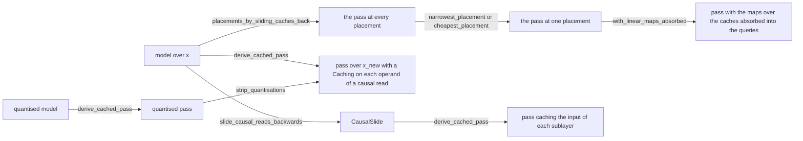

# Deriving Caches by Dragging the New Tokens

The user proposed on 2026-09-26 that a cache is a re-expression of the model, and that it
can therefore be derived from the model. The token axis is split into the tokens of the
earlier passes and the new tokens, the split is dragged backwards through the model, and
an array over the earlier tokens is loaded from a cache wherever the derivation meets
one. This note states the mathematics of that derivation and proves that the derived
pass computes the model's results for the new tokens. It then records what the
derivation gives on the public models.

The derivation reproduces the caches of four released implementations from their
uncached models. The transformer of *Attention Is All You Need* caches the keys and the
values of its masked self-attention, as tensor2tensor does. Mixtral-8x7B caches the
turned keys and the values, as mistral-inference does. DeepSeek-V3 caches the normalised
latent and the turned key, and with its up-projections absorbed into the queries the
derived pass is the absorb mode of the released inference code. GLM-5.3 caches the
47,616 values per token cached by `transformers`. [[Caching Between Passes]] states the
`Caching` operator used by the derived passes. `caching/validate_caching.py` checks the
derivation on causal attention, a sliding window and a model mixing the two, and the
validators of [[Website Notebooks]] check every number below about a released model
that is not a calculation from stated sizes.

## The forms of a derivation

| form | note |
|---|---|
| model over `x`, CausalSlide | [[Yoneda and Cartesian Tricks]], [[Advanced Axis Dynamics]] |
| a pass with caches | [[Caching Between Passes]] |
| quantised model and quantised pass | [[Quantization]], [[Stripping Quantisations]] |
| the absorbed pass | [[Einops Rearrangement]] |

## A pass of generation reads the model's results at the new tokens

A model $F$ over a token axis $x$ computes one result per token. A pass of generation appends the new tokens $x_{\mathrm{new}}$ after the tokens $x_{\mathrm{old}}$ of the earlier passes. [[Caching Between Passes]] calls the same two axes $P$ and $x$, and the derived passes name them `xold` and `xnew`. The pass needs the model's results at the new tokens alone, which are the results at the positions $\lvert x_{\mathrm{old}} \rvert + i_{\mathrm{new}}$.

The positions of the new tokens within the sequence are given by one stride morphism of [[Stride Category]], written $\iota_{\mathrm{new}} : x_{\mathrm{new}} \to x$, whose one row is $i_x = \lvert x_{\mathrm{old}} \rvert + i_{\mathrm{new}}$. The earlier tokens are given by $\iota_{\mathrm{old}} : x_{\mathrm{old}} \to x$, whose row is $i_x = i_{\mathrm{old}}$. The sequence has $\lvert x \rvert = \lvert x_{\mathrm{old}} \rvert + \lvert x_{\mathrm{new}} \rvert$ positions, and each is the image of exactly one of the two maps. The axis $x$ is therefore the concatenation $x_{\mathrm{old}} + x_{\mathrm{new}}$ of [[Advanced Axis Dynamics]], and every array $a$ over $x$ is the concatenation of its two reads.

$$a = \mathrm{Concat}(a \circ \iota_{\mathrm{old}},\ a \circ \iota_{\mathrm{new}})$$

The pass computes $F(z) \circ \iota_{\mathrm{new}}$, where $z$ is the whole sequence of input tokens.

## An operator broadcast over the tokens computes the new tokens from the new tokens

A `Broadcasted` operator lifted over the tokens computes the same function at every token. Its reindexing reads the operand at the token of its result. Reading its result through $\iota_{\mathrm{new}}$ therefore gives the same operator computed on the operand read through $\iota_{\mathrm{new}}$.

$$[f; x](a) \circ \iota_{\mathrm{new}} = [f; x_{\mathrm{new}}](a \circ \iota_{\mathrm{new}}) \qquad \text{(Lemma 1)}$$

The rule is the rule stated by [[Advanced Axis Dynamics]] for one index, $[F; x](z)[t] = F(z[t])$, with the map $\iota_{\mathrm{new}}$ in place of the index $t$. An index $t$ is a stride morphism from the empty product to $x$, and it states a pass over one new token. The map $\iota_{\mathrm{new}}$ keeps the axis $x_{\mathrm{new}}$, so one derivation covers a decoding step, a draft of several tokens in speculative decoding, and one chunk of a prefill. In categorical terms $\iota_{\mathrm{new}}$ is a generalised element of $x$ at the stage $x_{\mathrm{new}}$. An operator is natural in its degree, so it is determined by its action on generalised elements, and one read carried through the model is therefore enough. The argument is the Yoneda trick of [[Yoneda and Cartesian Tricks]]. `move_reads_backwards.ReadCrawler` carries the read, and every operator passed by the read is rebuilt over $x_{\mathrm{new}}$ in place of $x$.

An operator that reads the position of a token, such as a rotary table, reads it through $\iota_{\mathrm{new}}$ at $\lvert x_{\mathrm{old}} \rvert + i_{\mathrm{new}}$ (Lemma 2). The read crawl writes that read as a view after the table, or, where the table is written out by its expansion, as the arrangement of $x_{\mathrm{new}}$ followed by the affine map of the row. The reference implementations add the count of cached tokens to every position of a pass, and the derivation produces that addition without being told. `validate_deepseek_v3.py` checks that the rotary table of the cached DeepSeek-V3 is read at the new tokens.

## A causal read reaches the earlier tokens

The causal mask of a decoder is written in this repository as a read. `notebooks/classic/shared_mechanisms.read_back_from_every_position` reads token $i_x - i_w$ for every slot $i_w$, and `mark_sparse_domains.guarded_view` marks the slot axis as holding a value where $i_x - i_w \ge 0$, per [[Padding and Masks as Sparse Axes]]. The read of the new tokens composes with the mask into the row $\lvert x_{\mathrm{old}} \rvert + i_{\mathrm{new}} - i_w$. That row reads earlier tokens as well as new ones, so the operand of the mask is demanded at every position of $x$.

The crawl sorts every row that reads the token axis into one of three kinds.

- A new-token row reads $\lvert x_{\mathrm{old}} \rvert + i_{\mathrm{new}}$. The read continues backwards.
- An earlier-token row reads the new token $i_{\mathrm{new}}$ at stride one and every other axis at a stride of zero or less, and has a shift of at most $\lvert x_{\mathrm{old}} \rvert$. It never reads a token later than the token of its result. The operand is cached.
- Any other row reads a later token, or reads tokens without reference to the token of its result. The crawl raises `ReadsALaterToken`.

An operator that reads the token axis whole, with no causal read bounding which tokens it reads, raises `ReadsTheTokenAxisWhole`. Attention without a mask is the case, and so is a mask written as an additive array of $-\infty$ above the diagonal. The released code of DeepSeek-V3 adds such an array to the scores (`scores += mask.unsqueeze(1)`). The repository writes the mask as a read, and the derivation depends on that choice, because only a read states which tokens are reached. `validate_deepseek_v3.py` checks that the model holds no mask operator.

## A cache supplies the earlier tokens that a causal read demands

The operand $a$ of a causal read is demanded at every token of $x$, which is $\mathrm{Concat}(a \circ \iota_{\mathrm{old}}, a \circ \iota_{\mathrm{new}})$. The read of the new tokens computes the second part when it is dragged into the producer of $a$. The first part is loaded. The operator `Caching` states that decomposition.

$$\mathrm{Caching}(a \circ \iota_{\mathrm{new}}) = \mathrm{Concat}(\mathrm{cache}_a,\ a \circ \iota_{\mathrm{new}})$$

The crawl writes the causal read as a view on the result of the `Caching`, reading $\lvert x_{\mathrm{old}} \rvert + i_{\mathrm{new}} - i_w$ of the cached axis $x_{\mathrm{old}} + x_{\mathrm{new}}$. It then carries the read of the new tokens on into the producer of $a$. At the copy that feeds the queries and the keys, every branch then asks for the new tokens. The read therefore passes the copy and reaches the layer before, and the whole model runs over $x_{\mathrm{new}}$. On Mixtral-8x7B `derive_cached_pass` places one `Caching` after the rotary box of the keys and one after `W^{V}`, the mask reads position $\lvert x_{\mathrm{old}} \rvert + i_{\mathrm{new}} - i_w$ of each, and no operation of the pass carries the token axis of the model. `validate_mixtral_8x7b.py` checks all three facts.

The standard expansion of a `Caching` states the memory traffic. A `Para.CacheGrab` loads the $\lvert x_{\mathrm{old}} \rvert$ entries held by the cache, and a `Para.CacheDrop` appends the $\lvert x_{\mathrm{new}} \rvert$ entries of this pass, per [[Caching Between Passes]].

## Every wire of a derived pass is a read of the token axis

The user asked on 2026-09-26 for the tricks of caching to share one mathematical approach, and every result of this note is stated with one kind of object. A read of the token axis is a stride morphism $\rho : D \to x$ from some domain $D$. A wire of the derived pass is a wire $a$ of the model read through one, $a \circ \rho$, and the operators of the model carry reads by Lemma 1. The derivation is therefore the choice of a read for every wire, and two reads carry a pass.

- The read of the new tokens is $\iota_{\mathrm{new}} : x_{\mathrm{new}} \to x$, with $i \mapsto \lvert x_{\mathrm{old}} \rvert + i$.
- The read of a cached axis $C = K + x_{\mathrm{new}}$, whose first $\lvert K \rvert$ positions are the kept earlier tokens, is $\iota_C : C \to x$, with $i \mapsto i + \lvert x_{\mathrm{old}} \rvert - \lvert K \rvert$.

The image of $\iota_C$ holds the image of $\iota_{\mathrm{new}}$ as its last $\lvert x_{\mathrm{new}} \rvert$ positions. A `Caching` of $a$ maps $a \circ \iota_{\mathrm{new}}$ to $a \circ \iota_C$, and the cache supplies the positions of the image of $\iota_C$ missing from the image of $\iota_{\mathrm{new}}$, which are the $\lvert K \rvert$ kept earlier tokens.

The crawl names $\iota_{\mathrm{new}}$ `New` and $\iota_C$ `Cached`, as `derive_cached_pass.NEW_TOKENS_READ_NAME` and `CACHED_TOKENS_READ_NAME`, so a view written where a read stops carries the word, as the view reading a rotary table at the new tokens does. `notebooks/display/explain_cached_reads.py` gives both names a row of the table read by an inspection box. The kept earlier tokens $K$ take the code form of the earlier tokens with `kept` joined before it, so a legend names them in generated code.

A causal read composed with the read of the new tokens reaches the positions $\lvert x_{\mathrm{old}} \rvert + i_{\mathrm{new}} + \sum_j s_j i_j + c$, where every stride $s_j$ and the offset $c$ are at most zero. Its reach $R$ is the number of earlier tokens read before the first new token, which is $R = -\sum_j s_j (\lvert a_j \rvert - 1) - c$ for the axes $a_j$ read by its row. The read factors through $\iota_C$ exactly when $\lvert K \rvert \ge \min(R, \lvert x_{\mathrm{old}} \rvert)$, so the smallest cached axis serving the read keeps that many earlier tokens. Two cases occur.

- The reach grows with the past. The causal mask has as many slots as the sequence has tokens, so $R = \lvert x_{\mathrm{old}} \rvert + \lvert x_{\mathrm{new}} \rvert - 1$ and $K$ is every earlier token. Every public model is this case.
- The reach is fixed. A sliding window of $\lvert w \rvert$ slots has $R = \lvert w \rvert - 1$, and $K$ is the last $\lvert w \rvert - 1$ earlier tokens. In the first passes, where fewer earlier tokens exist, the missing positions of $K$ hold the universal unit, and the mask reads the universal unit before the first token of the sequence.

`NewTokenCrawler.reach` computes $R$ from the row, and `cached_axis_for` keeps every earlier token where $R$, with the length of the sequence written as $\lvert x_{\mathrm{old}} \rvert + \lvert x_{\mathrm{new}} \rvert$, holds $\lvert x_{\mathrm{old}} \rvert$, and keeps $R$ tokens otherwise. The causal read is written on the cached axis as the same row rebased by the shift of $\iota_C$, reading position $\lvert K \rvert + i_{\mathrm{new}} + \sum_j s_j i_j + c$ of $C$. The crawl asks each wire for the read of the new tokens or the read of a cached axis, and holds no other kind of demand.

The other results of this note are stated with the same object. The CausalSlide carries the causal read back in place of the read of the new tokens. A placement is the point on a path where the read changes from $\iota_C$ to $\iota_{\mathrm{new}}$. Dragging the split drags the pair $(\iota_{\mathrm{old}}, \iota_{\mathrm{new}})$, whose images cover $x$. A trick added to the derivation is stated as a choice of reads of the token axis and the containment of their images, and the theorem below proves it correct.

## Dragging both halves of the split gives the same pass

The user's proposal drags the pair $(\iota_{\mathrm{old}}, \iota_{\mathrm{new}})$, where the crawl drags $\iota_{\mathrm{new}}$ alone. Every operator broadcast over the tokens then splits into two copies, one over $x_{\mathrm{old}}$ and one over $x_{\mathrm{new}}$. That split is the concatenation expansion $F(\mathrm{Concat}(u, v)) = B_F(F(u), F(v))$ of [[Advanced Axis Dynamics]], and it creates two expressions.

The model's result is demanded at $x_{\mathrm{new}}$ alone, so the half of the result over $x_{\mathrm{old}}$ is not demanded. An operator's half over $x_{\mathrm{old}}$ is demanded only where a demanded result reads it, and the following two cases cover every operator.

- At an operator broadcast over the tokens, the new half of the result reads the new half
  of the operand alone, by Lemma 1. The old half of the operand is not demanded.
- At a causal read, the new half of the result reads both halves of the operand. The old
  half of the operand is demanded, and a causal read is the one place it is.

The old half of a causal read's result reads the old half of its operand alone, because $i_x - i_w \le i_x < \lvert x_{\mathrm{old}} \rvert$ for every old token $i_x$. The old expression therefore never needs a new token, and an earlier pass computed exactly the same values. Of the two expressions created by the split, the old one survives only at the operands of the causal reads, and there it is loaded. `derive_cached_pass` carries $\iota_{\mathrm{new}}$ alone and writes those loads, which gives the same pass.

The consumer of the cached array can be split as well. Over $x_{\mathrm{old}} + x_{\mathrm{new}}$ the attention core is the two-branch core, a softmax over each part merged by the parts' maxima and sums, which `validate_advanced_axis_dynamics.py` checks against a core written by hand. With the core split, the cached tokens and the new tokens become two attentions whose results are merged. Attention implementations that treat a shared prefix apart from the rest of the sequence take that form. The derivation does not write the split.

## The derived pass computes the model's results for the new tokens

For a wire $a$ of the model, write $a(z)$ for its value on the input sequence $z$ over $x$. The wire is prefix-stable when $a(z) \circ \iota_{\mathrm{old}} = a(z \circ \iota_{\mathrm{old}})$ for every sequence $z$ and every split of $x$. Its entries at the earlier tokens then do not change when later tokens are appended.

Lemma 3 states that every wire is prefix-stable in a model whose every read of the token
axis is a new-token row or an earlier-token row.

The proof of Lemma 3 is by induction over the model, following the composition of its operators. The input tokens are prefix-stable. An operator broadcast over the tokens preserves the property, by Lemma 1 applied to $\iota_{\mathrm{old}}$, and an operator reading the position of a token preserves it by Lemma 2. At a causal read of a prefix-stable operand $b$, the result at an earlier token $i_x < \lvert x_{\mathrm{old}} \rvert$ reads $b$ at $i_x - i_w \le i_x$, which is an earlier token. The old entries of the result therefore depend on the old entries of $b$ alone, and those depend on $z \circ \iota_{\mathrm{old}}$ alone. A copy and a deletion preserve the property. An operator reading the token axis whole is excluded by hypothesis, and it is exactly the operator that breaks the property. ∎

The theorem of this note states the following. Let the passes append $x_{\mathrm{new}}^{(1)}, x_{\mathrm{new}}^{(2)}, \dots$, and let $x_{\mathrm{old}}^{(k)}$ be the tokens before pass $k$. Suppose that at the start of pass $k$ the cache of every cached wire $a$ holds $a(z \circ \iota_{\mathrm{old}}^{(k)})$, the wire computed on the earlier tokens alone. Then pass $k$ returns $F(z) \circ \iota_{\mathrm{new}}^{(k)}$, and after the pass the cache of $a$ holds $a(z \circ \iota_{\mathrm{old}}^{(k+1)})$.

The proof of the theorem is by induction on $k$. In the first pass $x_{\mathrm{old}}$ is empty, every cache is empty, and a `Caching` of an empty past is the identity, so the pass is the model on $x_{\mathrm{new}}^{(1)}$. For the step, every wire of the derived pass is one of four kinds, by induction over the pass from the result backwards, as the crawl built it.

1. The wire is $b \circ \iota_{\mathrm{new}}$ for a wire $b$ of the model. The claim follows from Lemmas 1 and 2 at every operator passed by the read of the new tokens.
2. The wire is the result of a `Caching` of $a$. It equals $\mathrm{Concat}(a(z \circ \iota_{\mathrm{old}}), a(z) \circ \iota_{\mathrm{new}})$ by the hypothesis on the cache. By Lemma 3 the concatenation is $\mathrm{Concat}(a(z) \circ \iota_{\mathrm{old}}, a(z) \circ \iota_{\mathrm{new}})$, which is $a(z)$ by the split.
3. The wire is a causal read of a wire of the second kind, and it equals the model's causal read of $a(z)$ followed by $\iota_{\mathrm{new}}$.
4. The wire is over the whole cached axis and is computed from wires of the second kind by operators computed over the cache. It equals the model's wire, by Lemma 1 applied to the identity on $x$.

The result of the pass is a wire of the first kind for the model's result, which is $F(z) \circ \iota_{\mathrm{new}}$. The drop appends $a(z) \circ \iota_{\mathrm{new}}$ to the cache, which then holds $\mathrm{Concat}(a(z \circ \iota_{\mathrm{old}}), a(z) \circ \iota_{\mathrm{new}})$. Because $x_{\mathrm{old}}^{(k+1)} = x_{\mathrm{old}}^{(k)} + x_{\mathrm{new}}^{(k)}$, Lemma 3 makes that concatenation $a(z \circ \iota_{\mathrm{old}}^{(k+1)})$. ∎

The theorem holds with a kept axis $K$ in place of every earlier token. The cache of $a$ then holds the last $\lvert K \rvert$ entries of $a(z \circ \iota_{\mathrm{old}})$, with the universal unit before the first token of the sequence, and the second kind of wire equals $a(z) \circ \iota_C$ by the same argument. By the definition of the reach, the causal read reads $a(z) \circ \iota_C$ only within the image of $\iota_C$, so it reads the values the model reads. After the pass the kept tokens of the next pass are the last $\lvert K \rvert$ entries of $a(z) \circ \iota_C$, and the drop appends to those entries and the next grab loads them.

The theorem answers the question of what is needed to compute the new tokens once the
earlier tokens have been computed. The pass needs the arrays read by the causal reads,
at every earlier token, and nothing else about the earlier tokens. It needs neither
their hidden states, nor the outputs of the other sublayers, nor their results. The
induction hypothesis is exactly the content of the caches.

## A cache can stand anywhere on the path of the causal read

The operators between the copy feeding the queries and the causal read are broadcast over the tokens. For such an operator $f$ the split gives $[f; x](\mathrm{Concat}(u, v)) = \mathrm{Concat}([f; x_{\mathrm{old}}](u), [f; x_{\mathrm{new}}](v))$. Caching the operand of $f$ and computing $f$ at every cached token therefore gives the same pass as computing $f$ at the new tokens and caching its result. A placement is a set $U$ of operators computed over the cache that is closed towards the causal read, and the arrays cached are the arrays read by the operators of $U$. `derive_cached_pass` takes $U$ as `computed_over_the_cache`, and `cost_cache_placements.placements_by_sliding_caches_back` moves one cache at a time back past the operator before it, deriving the pass again each time, until every set reached by the moves has been derived.

| model | placements | checked by |
|---|---|---|
| causal attention, and the same attention over a sliding window | 4 each | `caching/validate_caching.py` |
| one decoder layer of the transformer of *Attention Is All You Need* | 4 | `notebooks/website/classic/validate_attention_is_all_you_need.py` |
| one layer of Mixtral-8x7B | 6 | `notebooks/website/classic/validate_mixtral_8x7b.py` |
| the attention of DeepSeek-V3 | 26 | `notebooks/website/classic/validate_deepseek_v3.py` |
| the whole GLM-5.3 | 104 | `notebooks/website/modern/validate_glm53.py` |

The CausalSlide of [[Yoneda and Cartesian Tricks]] is the same family read in the other direction. `slide_causal_reads_backwards` moves every causal read back to the copy whose other branches read its operand unmasked, and `slide_causal_reads_back_past` moves it back past a given set of operators alone. The operators passed by the read then compute once for every token and slot, and the operators before it compute once for every token. Deriving the pass from a model whose causal reads were slid back past $U$ places the caches on the operand of the read, which is where the placement $U$ places them. With $\lvert x_{\mathrm{new}} \rvert$ new tokens the slid form computes $U$ for every token and slot, $\lvert x_{\mathrm{new}} \rvert (\lvert x_{\mathrm{old}} \rvert + \lvert x_{\mathrm{new}} \rvert)$ times, where the placement computes it $\lvert x_{\mathrm{old}} \rvert + \lvert x_{\mathrm{new}} \rvert$ times. Every placement is the causal read standing at one position of its path, and the CausalSlide is the read standing at the copy, where the cache holds the input of the sublayer. The pass derived from the CausalSlide of Mixtral-8x7B caches the normalised state once in each layer, 4,096 values per token, which is the last placement of its table.

## A placement is costed by the bytes moved and the operations recomputed

`cost_cache_placements.cost_of_a_pass` reads three quantities off a derived pass at bound sizes, and returns them as a `PassCost`. The first is the entries held per token by its caches, summed over every cache run by the pass. The second is the operations of every linear map and contraction of the pass, counted by `count_pass_operations` at two operations per multiply-add, per [[Operation Counts and Machine Rates]]. The third is the bytes moved by the caches. A cache holding $e_a$ entries per token on a cached axis $C_a = K_a + x_{\mathrm{new}}$ loads the $\lvert K_a \rvert$ kept earlier tokens and stores the $\lvert x_{\mathrm{new}} \rvert$ new ones, so it moves $\lvert C_a \rvert$ tokens of $e_a$ entries of $b$ bytes each in one pass. For a cache of every earlier token $\lvert C_a \rvert$ is $\lvert x_{\mathrm{old}} \rvert + \lvert x_{\mathrm{new}} \rvert$. The seconds are the operations at the matrix rate $F$ of a `MachineRates` added to the bytes at its memory bandwidth $B$.

$$t = \frac{\mathrm{ops}}{F} + \frac{b \sum_a e_a \lvert C_a \rvert}{B}$$

Every placement reads the same weights and the same arrays of the new tokens, so the cost leaves them out. The cost counts linear maps and contractions alone, so a normalisation or a rotation recomputed over the cache costs nothing in it, and `cheapest_placement` breaks a tie towards fewer operators computed over the cache for that reason. `narrowest_placement` takes the placement whose caches hold the fewest entries per token, and `first_linear_placement` takes the one caching the result of the first linear map on every path from the copy to a causal read.

For one projection from $m$ channels to $e$ entries, recomputing it for an earlier token takes $2 m e$ operations and saves loading $e$ entries of $b$ bytes. Recomputing is cheaper when $2 m e / F < e b / B$, which is when $m < b F / (2B)$. `performance_modeling/registries/machine_rates.py` gives an H100 SXM5 989 TFLOP/s of dense BF16 arithmetic and 3.35 TB/s of memory bandwidth, so with $b = 2$ the threshold is $m < 295$. Every model width in practical use exceeds that threshold, so the output of a projection is cheaper to load than to recompute. `validate_caching.py` checks the consequence on causal attention at $m = 4096$ after 4,096 earlier tokens: the cheapest pass caches the keys and the values, and the narrowest placement caches the state once, at $\lvert m \rvert$ entries per token. The placements of one layer of Mixtral-8x7B show the consequence at one new token after 32,767 earlier ones. The cache of the reference, the turned keys and the values at 2,048 values per token, gives the cheapest pass. Caching the keys before the rotation keeps as many values and takes longer, and every placement that caches the normalised state, at 4,096 values per token, takes several times as long.

## Absorbing the up-projections into the queries makes the latent the cheapest cache

Multi-head latent attention caches a latent $\mathrm{lat}$ of $\ell$ channels per token and expands it into a key with $W^{UK}$ and into a value with $W^{UV}$. The narrowest placement of DeepSeek-V3's attention caches the normalised latent (512) and the turned key (64), 576 values per token, and computes $W^{UK}$, $W^{UV}$, the repeat of the turned key over the heads and the join of the two parts of the key over the cache. In the order the model is written, that placement recomputes $2 \ell h (d_n + d_v) = 33.5$ million operations for every cached token in every pass, at the sizes of `config_671B.json`, since $W^{UK}$ and $W^{UV}$ expand every cached latent. Placement alone therefore does not derive the decode form of multi-head latent attention.

The score contracts the query with $W^{UK}$ applied to the latent, $\sum_{i_{d_n} \in d_n} q[i_{d_n}] \sum_{i_{\ell} \in \ell} W^{UK}[i_{\ell}, i_{d_n}]\, \mathrm{lat}[i_{\ell}]$, and the sum can be taken in the other order, $\sum_{i_{\ell} \in \ell} (\sum_{i_{d_n} \in d_n} q[i_{d_n}] W^{UK}[i_{\ell}, i_{d_n}])\, \mathrm{lat}[i_{\ell}]$. The value contraction can likewise sum over the slots before $W^{UV}$ is applied. `advanced_axis_dynamics.algebra.absorb_linear_maps` finds such a chain of two contractions, reached directly or through a view. It carries the view back onto the operands of the first contraction with the read crawl, merges the two contractions with `einops_rearrange.merge_einops`, per [[Einops Rearrangement]], and splits the result again with a chosen pair contracted first, through `contract_pair_first`. It keeps the order with the fewest operations at bound sizes, and rewrites a chain only where another order costs fewer operations than the written order. No rewrite before it split a connected contraction into a chosen pairwise order.

`caching.algebra.absorb_into_the_queries.with_linear_maps_absorbed` prepares a derived pass for the rewrite and applies it at the sizes of the pass. It writes out every block whose repetition is one, reads every strided view through one stride morphism, splits every contraction over a concatenated axis into one contraction per part with `concatenation_expansion`, and writes every `ops.Linear` computed over the cache as its weight contracted against its operand, per [[Linear Expansion]]. Applied to the narrowest placement at one new token, it multiplies the queries by $W^{UK}$, contracts the result with the cached latent read through the mask, contracts the weights with the cached latent over the slots, and applies $W^{UV}$ last. That order is the absorb mode of the released code, which caches `self.kv_norm(kv)` and the turned `k_pe` and runs by default. At one new token after 32,768 earlier tokens one layer drops from $1.10 \times 10^{12}$ operations to $9.50 \times 10^{9}$. `validate_deepseek_v3.py` checks both counts and checks that no linear map of the pass reads an array over the cached tokens. `cheapest_pass_in_either_order` costs every placement in both orders and returns the cheapest.

The rewrite runs inside one scope of the hypergraph, and every layer of the released DeepSeek-V3 runs one attention box, so `cached_deepseek_v3.absorbed_inside_the_attention` applies it to the body of the box. The 61 layers then cache 35,136 values per token.

The choice between the orders is made on the derived pass. In the uncached model the slot axis is as long as the query axis, so every query meets every token once, and the written order takes fewer operations whenever $\ell > d_n$. The rewrite leaves the uncached attention at DeepSeek-V3's sizes unchanged. The derived pass puts the queries on $x_{\mathrm{new}}$ and the keys on $x_{\mathrm{old}} + x_{\mathrm{new}}$, and the absorbed order is cheaper there when $\lvert x_{\mathrm{new}} \rvert$ is small.

The number of new tokens at which the orders change places follows from the sizes. The placement caching $K^C$ over $[h, d_n]$, $V$ over $[h, d_v]$ and the turned key over $[d_r]$ holds 32,832 values per token and computes no linear map over the cache. Per earlier token the absorbed latent loads $32{,}256 \cdot 2 = 64{,}512$ bytes fewer than that placement and computes $2h(\ell - d_n) + 2h(\ell - d_v) = 196{,}608$ operations more for every new token. The two cost the same at $\lvert x_{\mathrm{new}} \rvert = \frac{64{,}512 / B}{196{,}608 / F} \approx 97$ on an H100, whatever the number of earlier tokens. Past that the written pass over $K^C$, $V$ and the turned key is faster, at 57 times the entries per token.

The content of a cache is fixed for the whole generation, because every later pass loads
the entries appended by one pass. The order is chosen again in every pass. The latent serves both
orders, so a server can cache the latent and choose the order per pass. A prefill with
no earlier tokens takes the same operations in every placement, and the latent moves
the fewest bytes.

## The narrowest placement of GLM-5.3 is the cache of the reference

`placements_by_sliding_caches_back` derives 80 placements of the whole uncached GLM-5.3
of `notebooks/sota/GLM53/`. The placement on the operands of the causal reads holds
2,558,592 values per token over the 78 layers. The narrowest holds 47,616. Every layer
caches the normalised latent (512) and the turned key (64), and every Full layer also
caches the indexer key (128). These arrays are the cache of `modeling_glm_moe_dsa.py` and of the
pass written by hand in [[Caching Between Passes]], derived from the uncached expression.
`derive_cached_glm53.py` names the three operators computed over the cache by the
reference, the two expansions of the latent and the join of the key, which reads the one
turned key of a token at every head, and derives the pass with them. The placements
numbered 104 until 2026-09-29, when the repeat of the turned key over the heads was
absorbed into the join, per [[Representing Models]]. The selection passed from a Full layer
to the Shared layers of its group is not cached. It travels on the tape slot `sel` within
one pass, and the crawl requires that the grab of a slot reads the new tokens written by
its drop.

## The cases the derivation handles and the cases it does not

The derivation handles the following cases:

- a decoder whose layers repeat, and a copy feeding several projections, where one cache
  of a wire serves every branch, as in the decoder of the transformer of *Attention Is
  All You Need* and in Mixtral-8x7B;
- DeepSeek-V3's attention in both orders, and the released DeepSeek-V3 of
  `config_671B.json`, whose 61 layers share one box of the attention;
- GLM-5.3, including its boxes holding tape seeds and its indexer;
- rotary tables, which are computed over the whole cached axis because they read no
  token, and read at the new tokens;
- more than one new token per pass, since the causal read among the new tokens is part
  of the earlier-token row;
- a sliding window, whose cache keeps the last $\lvert w \rvert - 1$ earlier tokens and moves the same bytes after 4,096 earlier tokens and after 131,072, and a model whose layers alternate between a window and the full mask, which keeps one cached axis of each kind. `validate_caching.py` checks all three.

The derivation does not handle the following cases:

- A state carried from one token to the next, such as the running sums of linear
  attention or the state of a scan, is not derived. On a block repeated over the tokens
  the crawl raises `ReadsTheTokenAxisWhole`.
- Attention with no causal read, which raises `ReadsTheTokenAxisWhole`, and a read of
  the next token, which raises `ReadsALaterToken`. `validate_caching.py` checks both.
- A strided read, such as the compressor of DeepSeek-V4, which reads $4 i_b + i_w$. A row whose stride on the new tokens is not one is rejected.
- An additive mask, for the reason given above.
- An array holding the token axis at two positions, which raises
  `CachedArrayHasTwoTokenPositions`.
- A box broadcast over the tokens at an operand cached by its body.
- A static buffer, paging and eviction. These belong to the server that runs the model.
- A value computed once per sequence. An operation that reads no token of the token axis
  is left as written by the model, so it runs in every pass. The encoder of the
  transformer of *Attention Is All You Need* reads the source sentence alone, and the
  pass of the whole model runs it in every step, where tensor2tensor runs it once per
  sentence and computes the keys and the values of every cross-attention once. The
  decoder, derived on its own over the target axis, caches the keys and the values of
  its masked self-attention directly after $W^{K}$ and $W^{V}$, which is the cache of
  tensor2tensor. `validate_attention_is_all_you_need.py` checks both facts.

## The modules

| name | what it is |
|---|---|
| `derive_cached_pass.derive_cached_pass`, `NewTokenCrawler`, `CachedPass` | the crawl carrying $\iota_{\mathrm{new}}$ and the reads of the cached axes, and placing a `Caching` at every earlier-token read on the axis required by its reach, through `NewTokenCrawler.reach` and `cached_axis_for` |
| `cost_cache_placements.placements_by_sliding_caches_back`, `cost_of_a_pass`, `cheapest_placement`, `narrowest_placement`, `first_linear_placement`, `cheapest_pass_in_either_order` | the placements and their costs |
| `absorb_into_the_queries.with_linear_maps_absorbed` | a derived pass with the linear maps over its caches absorbed into the queries |
| `count_pass_operations.operations_of_a_pass`, `operations_at_sizes` | the operations of every linear map and contraction of a pass |
| `move_reads_backwards.ReadCrawler` | the crawl that carries a read from the result of an expression towards its inputs |
| `slide_causal_reads_backwards`, `slide_causal_reads_back_past` | the CausalSlide |
| `absorb_linear_maps.absorb_linear_maps` | the choice of order of a chain of two contractions |
| `Para.CacheGrab`, `Para.CacheDrop`, `Para.CacheTapeSlot` | the load of the earlier tokens, the append of the new ones, and their entry in a wrap |

The classic models call the derivation from `notebooks/classic/cached_attention_is_all_you_need.py`, `cached_mixtral_8x7b.py` and `cached_deepseek_v3.py`, and GLM-5.3 from `notebooks/caching/CachedGLM53/derive_cached_glm53.py`. Each derives the quantised pass from the quantised model, so every cache carries the quantisation of the value held there, and each validator checks that `strip_quantisations` turns the quantised pass into the pass derived from the model in the reals.

## Gaps

- No derived pass is checked by value against its model. `torch_compile` compiles a
  guarded view as the identity and has no rule for a `Caching`. [[Open Gaps]] records it.
- The state carried between passes and the split core above are not derived.
- `absorb_linear_maps` chooses an order from bound sizes. The symbolic region in which
  each order is cheaper is not solved for. The absorbed pass reads the cached latent
  through two equal views, which nothing merges.
- The cost counts linear maps and contractions alone, so a normalisation or a rotation
  recomputed over the cache costs nothing in it.

## See also

- [[Caching Between Passes]] — the `Caching` operator and the caches of the public models
- [[Operation Counts and Machine Rates]] — the operation count and the machine rates read by the cost
- [[Advanced Axis Dynamics]] — the concatenated axis, the read crawl and the absorption of linear maps
- [[Yoneda and Cartesian Tricks]] — the CausalSlide and the Yoneda trick
- [[Para Category]] — the cache seeds
- [[Representing Models]] — the mask written as a read
- [[Website Notebooks]] — the pages that draw each derived pass
