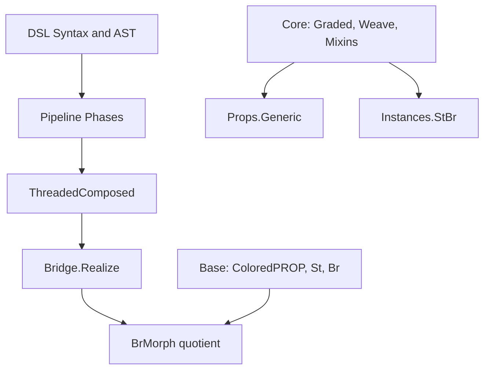
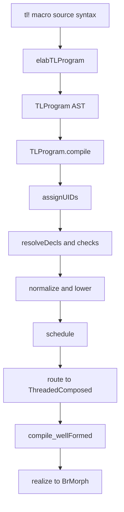
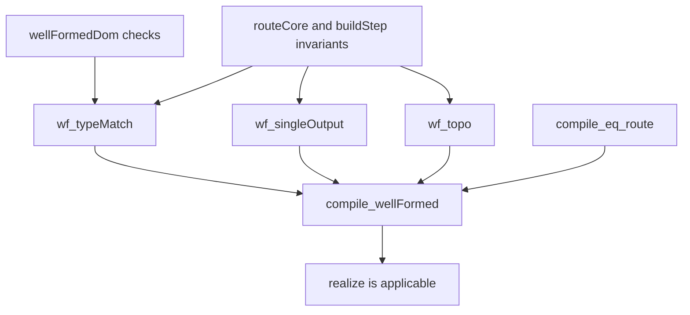

# LeanNCD Code Walkthrough: Compilation Pipeline, Category Theory, and Proofs

This document is a guided walkthrough of the Lean 4 code in `leanncd/`, aimed at programmers who know functional programming but are new to Lean.

The central story is:

1. parse tensor-logic syntax,
2. compile through a staged pipeline,
3. produce a routed presentation ([`ThreadedComposed`](https://github.com/william-macready/pyncd/blob/agents/tutorial-lean4-compilation-guide/leanncd/LeanNCD/DSL/Target.lean#L114-L118)),
4. realize it as a formal [`BrMorph`](https://github.com/william-macready/pyncd/blob/agents/tutorial-lean4-compilation-guide/leanncd/LeanNCD/Base/Br.lean#L141-L141) in the categorical model.

---

## 1) How to read this guide

Use this in two passes:

- **Pass A (systems view):** read Sections 2–5 quickly to understand the architecture and dataflow.
- **Pass B (proof/category view):** read Sections 6–8 and follow the file pointers.

Two running examples are threaded throughout:

- **Example A (matmul):** `Y[i,j] := W[i,k] · X[k,j]`
- **Example B (scan recurrence):**
  - affine: `S[j, 0] := X[j] ; S[j, l +1] := S[j, l] · A[j, k]`
  - nonlinear: `S[j, l +1] := relu(S[j, l] · A[j, k])`

Primary test anchors:

- `leanncd/test/DSL/CompileExamplesTest.lean`
- `leanncd/test/DSL/Pipeline/ScanAffineTest.lean`
- `leanncd/test/DSL/Pipeline/RouteWeaveTest.lean`

---

## 2) Codebase structure (where things live)

Start with `leanncd/LeanNCD.lean`. Its top-level comment explains the major split:

- **Track 1:** categorical/noncomputable math tower
- **Track 2:** executable/computable DSL + pipeline
- **Bridge:** converts executable presentation to formal categorical morphism

### 2.1 Directory map



How to interpret the non-pipeline boxes:

- [`Core`](https://github.com/william-macready/pyncd/tree/agents/tutorial-lean4-compilation-guide/leanncd/LeanNCD/Core) ([`Graded`](https://github.com/william-macready/pyncd/blob/agents/tutorial-lean4-compilation-guide/leanncd/LeanNCD/Core/Graded.lean), [`Weave`](https://github.com/william-macready/pyncd/blob/agents/tutorial-lean4-compilation-guide/leanncd/LeanNCD/Core/Weave.lean), [`Mixins`](https://github.com/william-macready/pyncd/tree/agents/tutorial-lean4-compilation-guide/leanncd/LeanNCD/Mixins)) is the abstraction layer on top of categorical foundations ([`Base`](https://github.com/william-macready/pyncd/tree/agents/tutorial-lean4-compilation-guide/leanncd/LeanNCD/Base)).
- [`Props.Generic`](https://github.com/william-macready/pyncd/blob/agents/tutorial-lean4-compilation-guide/leanncd/LeanNCD/Props/Generic.lean) proves reusable theorems parameterized by those `Core` abstractions.
- [`Instances.StBr`](https://github.com/william-macready/pyncd/blob/agents/tutorial-lean4-compilation-guide/leanncd/LeanNCD/Instances/StBr.lean) supplies the concrete flagship instance (`D = St`, `C = Br`) so those generic theorems can specialize to this project.

So these three boxes are primarily a **theory stack** (`Base -> Core -> Props/Instances`), while the `DSL -> ThreadedComposed -> Bridge.Realize` path is the **executable compiler path**.

### 2.2 What each main directory does

| Directory | Role | Key files to start with |
|---|---|---|
| `LeanNCD/DSL` | surface syntax, AST, elaboration, compile entrypoint | [`Syntax.lean`](https://github.com/william-macready/pyncd/blob/agents/tutorial-lean4-compilation-guide/leanncd/LeanNCD/DSL/Syntax.lean), [`Elab.lean`](https://github.com/william-macready/pyncd/blob/agents/tutorial-lean4-compilation-guide/leanncd/LeanNCD/DSL/Elab.lean), [`Ast.lean`](https://github.com/william-macready/pyncd/blob/agents/tutorial-lean4-compilation-guide/leanncd/LeanNCD/DSL/Ast.lean), [`Compile.lean`](https://github.com/william-macready/pyncd/blob/agents/tutorial-lean4-compilation-guide/leanncd/LeanNCD/DSL/Compile.lean), [`Target.lean`](https://github.com/william-macready/pyncd/blob/agents/tutorial-lean4-compilation-guide/leanncd/LeanNCD/DSL/Target.lean) |
| `LeanNCD/DSL/Pipeline` | phase-by-phase lowering/routing | [`Types.lean`](https://github.com/william-macready/pyncd/blob/agents/tutorial-lean4-compilation-guide/leanncd/LeanNCD/DSL/Pipeline/Types.lean), [`Structural.lean`](https://github.com/william-macready/pyncd/blob/agents/tutorial-lean4-compilation-guide/leanncd/LeanNCD/DSL/Pipeline/Structural.lean), [`Lowering.lean`](https://github.com/william-macready/pyncd/blob/agents/tutorial-lean4-compilation-guide/leanncd/LeanNCD/DSL/Pipeline/Lowering.lean), [`RouteSpec.lean`](https://github.com/william-macready/pyncd/blob/agents/tutorial-lean4-compilation-guide/leanncd/LeanNCD/DSL/Pipeline/RouteSpec.lean) |
| `LeanNCD/Base` | categorical foundations (ColoredPROP, St, Br) | [`ColoredPROP.lean`](https://github.com/william-macready/pyncd/blob/agents/tutorial-lean4-compilation-guide/leanncd/LeanNCD/Base/ColoredPROP.lean), [`St.lean`](https://github.com/william-macready/pyncd/blob/agents/tutorial-lean4-compilation-guide/leanncd/LeanNCD/Base/St.lean), [`Br.lean`](https://github.com/william-macready/pyncd/blob/agents/tutorial-lean4-compilation-guide/leanncd/LeanNCD/Base/Br.lean) |
| `LeanNCD/Bridge` | convert routed presentation to formal morphisms; agreement results | [`Realize.lean`](https://github.com/william-macready/pyncd/blob/agents/tutorial-lean4-compilation-guide/leanncd/LeanNCD/Bridge/Realize.lean), [`Agreement.lean`](https://github.com/william-macready/pyncd/blob/agents/tutorial-lean4-compilation-guide/leanncd/LeanNCD/Bridge/Agreement.lean), [`SBr.lean`](https://github.com/william-macready/pyncd/blob/agents/tutorial-lean4-compilation-guide/leanncd/LeanNCD/Bridge/SBr.lean), [`AcsetCodec.lean`](https://github.com/william-macready/pyncd/blob/agents/tutorial-lean4-compilation-guide/leanncd/LeanNCD/Bridge/AcsetCodec.lean) |
| `LeanNCD/Core`, `Mixins`, `Props`, `Instances` | graded structure, temporal mixins, generic propositions, flagship instance | [`Graded.lean`](https://github.com/william-macready/pyncd/blob/agents/tutorial-lean4-compilation-guide/leanncd/LeanNCD/Core/Graded.lean), [`Weave.lean`](https://github.com/william-macready/pyncd/blob/agents/tutorial-lean4-compilation-guide/leanncd/LeanNCD/Core/Weave.lean), [`Temporal.lean`](https://github.com/william-macready/pyncd/blob/agents/tutorial-lean4-compilation-guide/leanncd/LeanNCD/Mixins/Temporal.lean), [`Generic.lean`](https://github.com/william-macready/pyncd/blob/agents/tutorial-lean4-compilation-guide/leanncd/LeanNCD/Props/Generic.lean), [`StBr.lean`](https://github.com/william-macready/pyncd/blob/agents/tutorial-lean4-compilation-guide/leanncd/LeanNCD/Instances/StBr.lean) |
| `LeanNCD/Eval` | reference evaluator path over scheduled program | [`Eval.lean`](https://github.com/william-macready/pyncd/blob/agents/tutorial-lean4-compilation-guide/leanncd/LeanNCD/Eval/Eval.lean), [`Scan.lean`](https://github.com/william-macready/pyncd/blob/agents/tutorial-lean4-compilation-guide/leanncd/LeanNCD/Eval/Scan.lean), [`Contract.lean`](https://github.com/william-macready/pyncd/blob/agents/tutorial-lean4-compilation-guide/leanncd/LeanNCD/Eval/Contract.lean) |
| `leanncd/test` | executable spec of intended behavior | [`test/DSL/`](https://github.com/william-macready/pyncd/tree/agents/tutorial-lean4-compilation-guide/leanncd/test/DSL), [`test/Bridge/`](https://github.com/william-macready/pyncd/tree/agents/tutorial-lean4-compilation-guide/leanncd/test/Bridge), [`test/Base/`](https://github.com/william-macready/pyncd/tree/agents/tutorial-lean4-compilation-guide/leanncd/test/Base), [`test/Core/`](https://github.com/william-macready/pyncd/tree/agents/tutorial-lean4-compilation-guide/leanncd/test/Core) |

### 2.3 High-value files and their primary jobs

| File | Primary functions/types |
|---|---|
| `DSL/Syntax.lean` | declares grammar categories ([`tl_program`](https://github.com/william-macready/pyncd/blob/agents/tutorial-lean4-compilation-guide/leanncd/LeanNCD/DSL/Syntax.lean#L175-L175), [`tl_stmt`](https://github.com/william-macready/pyncd/blob/agents/tutorial-lean4-compilation-guide/leanncd/LeanNCD/DSL/Syntax.lean#L164-L164), [`tl_rhs`](https://github.com/william-macready/pyncd/blob/agents/tutorial-lean4-compilation-guide/leanncd/LeanNCD/DSL/Syntax.lean#L159-L161), etc.) |
| `DSL/Elab.lean` | syntax-to-value elaborators ([`elabTLProgram`](https://github.com/william-macready/pyncd/blob/agents/tutorial-lean4-compilation-guide/leanncd/LeanNCD/DSL/Elab.lean#L259-L284), [`elabTLStmt`](https://github.com/william-macready/pyncd/blob/agents/tutorial-lean4-compilation-guide/leanncd/LeanNCD/DSL/Elab.lean#L246-L250), [`elabTLRHS`](https://github.com/william-macready/pyncd/blob/agents/tutorial-lean4-compilation-guide/leanncd/LeanNCD/DSL/Elab.lean#L200-L207), [`elabTLIdxExpr`](https://github.com/william-macready/pyncd/blob/agents/tutorial-lean4-compilation-guide/leanncd/LeanNCD/DSL/Elab.lean#L110-L118)) |
| `DSL/Ast.lean` | IR data types ([`TLProgram`](https://github.com/william-macready/pyncd/blob/agents/tutorial-lean4-compilation-guide/leanncd/LeanNCD/DSL/Ast.lean#L123-L126), [`Stmt`](https://github.com/william-macready/pyncd/blob/agents/tutorial-lean4-compilation-guide/leanncd/LeanNCD/DSL/Ast.lean#L116-L121), [`RHSExpr`](https://github.com/william-macready/pyncd/blob/agents/tutorial-lean4-compilation-guide/leanncd/LeanNCD/DSL/Ast.lean#L97-L101), [`IdxExpr`](https://github.com/william-macready/pyncd/blob/agents/tutorial-lean4-compilation-guide/leanncd/LeanNCD/DSL/Ast.lean#L25-L31), [`Nonlin`](https://github.com/william-macready/pyncd/blob/agents/tutorial-lean4-compilation-guide/leanncd/LeanNCD/DSL/Ast.lean#L66-L76), [`LHSSlot`](https://github.com/william-macready/pyncd/blob/agents/tutorial-lean4-compilation-guide/leanncd/LeanNCD/DSL/Ast.lean#L103-L109)) |
| `DSL/Compile.lean` | [`TLProgram.compile`](https://github.com/william-macready/pyncd/blob/agents/tutorial-lean4-compilation-guide/leanncd/LeanNCD/DSL/Compile.lean#L19-L29), [`TLProgram.compileToScheduled`](https://github.com/william-macready/pyncd/blob/agents/tutorial-lean4-compilation-guide/leanncd/LeanNCD/DSL/Compile.lean#L34-L35), [`tl!{...}`](https://github.com/william-macready/pyncd/blob/agents/tutorial-lean4-compilation-guide/leanncd/LeanNCD/DSL/Compile.lean#L39-L43) macro |
| `DSL/Pipeline/Structural.lean` | early phases: UID assignment, decl/rank/dtype checks, axis unification, arithmetic lowering prep |
| `DSL/Pipeline/Lowering.lean` | nonlinearity split, scheduling, routing ([`buildExtIndex`](https://github.com/william-macready/pyncd/blob/agents/tutorial-lean4-compilation-guide/leanncd/LeanNCD/DSL/Pipeline/Lowering.lean#L340-L362), [`buildNameToStep`](https://github.com/william-macready/pyncd/blob/agents/tutorial-lean4-compilation-guide/leanncd/LeanNCD/DSL/Pipeline/Lowering.lean#L474-L480), [`buildStep`](https://github.com/william-macready/pyncd/blob/agents/tutorial-lean4-compilation-guide/leanncd/LeanNCD/DSL/Pipeline/Lowering.lean#L482-L553), [`routeCore`](https://github.com/william-macready/pyncd/blob/agents/tutorial-lean4-compilation-guide/leanncd/LeanNCD/DSL/Pipeline/Lowering.lean#L573-L579), [`route`](https://github.com/william-macready/pyncd/blob/agents/tutorial-lean4-compilation-guide/leanncd/LeanNCD/DSL/Pipeline/Lowering.lean#L583-L588)) |
| `DSL/Target.lean` | computable presentation types: [`BrBaseP`](https://github.com/william-macready/pyncd/blob/agents/tutorial-lean4-compilation-guide/leanncd/LeanNCD/DSL/Target.lean#L93-L99), [`StMatP`](https://github.com/william-macready/pyncd/blob/agents/tutorial-lean4-compilation-guide/leanncd/LeanNCD/DSL/Target.lean#L12-L17), [`Wire`](https://github.com/william-macready/pyncd/blob/agents/tutorial-lean4-compilation-guide/leanncd/LeanNCD/DSL/Target.lean#L106-L109), [`ThreadedComposed`](https://github.com/william-macready/pyncd/blob/agents/tutorial-lean4-compilation-guide/leanncd/LeanNCD/DSL/Target.lean#L114-L118) + well-formedness predicates |
| `Bridge/Realize.lean` | presentation-to-formal bridge: [`realizeBrBaseP`](https://github.com/william-macready/pyncd/blob/agents/tutorial-lean4-compilation-guide/leanncd/LeanNCD/Bridge/Realize.lean#L50-L61), [`realizeDom`](https://github.com/william-macready/pyncd/blob/agents/tutorial-lean4-compilation-guide/leanncd/LeanNCD/Bridge/Realize.lean#L68-L73), [`realize`](https://github.com/william-macready/pyncd/blob/agents/tutorial-lean4-compilation-guide/leanncd/LeanNCD/Bridge/Realize.lean#L250-L253) |
| `Bridge/Agreement.lean` | compilation correctness bridge theorem: [`compile_wellFormed`](https://github.com/william-macready/pyncd/blob/agents/tutorial-lean4-compilation-guide/leanncd/LeanNCD/Bridge/Agreement.lean#L379-L383) |
| `Base/St.lean` | affine index morphisms ([`StMat`](https://github.com/william-macready/pyncd/blob/agents/tutorial-lean4-compilation-guide/leanncd/LeanNCD/Base/St.lean#L28-L30)) + [`ColoredPROP`](https://github.com/william-macready/pyncd/blob/agents/tutorial-lean4-compilation-guide/leanncd/LeanNCD/Base/ColoredPROP.lean#L10-L67) instance for shape/index maps |
| `Base/Br.lean` | free strict SMC (raw [`Hom`](https://github.com/william-macready/pyncd/blob/agents/tutorial-lean4-compilation-guide/leanncd/LeanNCD/Base/Br.lean#L53-L63) + quotient [`Rel`](https://github.com/william-macready/pyncd/blob/agents/tutorial-lean4-compilation-guide/leanncd/LeanNCD/Base/Br.lean#L64-L135)) and [`BrMorph`](https://github.com/william-macready/pyncd/blob/agents/tutorial-lean4-compilation-guide/leanncd/LeanNCD/Base/Br.lean#L141-L141) laws |

---

## 3) Lean concepts you will see immediately

As concepts first appear below, they are linked again in context. Keep these references handy:

- inductive and constructor-driven data modeling:
  - [Inductive Types (TPiL4)](https://leanprover.github.io/theorem_proving_in_lean4/Inductive-Types/)
  - [Lean reference: inductive declarations](https://lean-lang.org/doc/reference/latest/)
- structure and record types:
  - [Structures and Records (FPiL)](https://leanprover.github.io/functional_programming_in_lean/)
- pattern matching:
  - [Pattern Matching](https://lean-lang.org/doc/reference/latest/Terms/Pattern-Matching/)
- macros + syntax categories:
  - [Defining New Syntax](https://lean-lang.org/doc/reference/latest/Notations-and-Macros/Defining-New-Syntax/)
  - [Macros](https://lean-lang.org/doc/reference/latest/Notations-and-Macros/Macros/)
- elaboration stages:
  - [Elaboration and Compilation](https://lean-lang.org/doc/reference/latest/Elaboration-and-Compilation/)
- typeclasses:
  - [Type Classes](https://lean-lang.org/doc/reference/latest/Type-Classes/)
- quotients:
  - [Quotients](https://lean-lang.org/doc/reference/latest/The-Type-System/Quotients/)
- tactic-oriented proofs:
  - [Tactic Proofs](https://lean-lang.org/doc/reference/latest/Tactic-Proofs/)
  - [Tactic Reference](https://lean-lang.org/doc/reference/latest/Tactic-Proofs/Tactic-Reference/)

---

## 4) Compilation pipeline walkthrough (stagewise)

This is the core “source to routed/formal morphism” path.

### 4.1 Big-picture flow



### 4.2 Stage 0-1: grammar and elaboration

- Syntax categories are declared in
  [`DSL/Syntax.lean`](https://github.com/william-macready/pyncd/blob/agents/tutorial-lean4-compilation-guide/leanncd/LeanNCD/DSL/Syntax.lean#L21-L40).
- Parsing/elaboration functions in
  [`DSL/Elab.lean`](https://github.com/william-macready/pyncd/blob/agents/tutorial-lean4-compilation-guide/leanncd/LeanNCD/DSL/Elab.lean#L110-L284) build [`TLProgram`](https://github.com/william-macready/pyncd/blob/agents/tutorial-lean4-compilation-guide/leanncd/LeanNCD/DSL/Ast.lean#L123-L126) values from syntax.

In Lean 4, *parsing* and *elaboration* are two distinct phases. The **parser** turns raw text into an untyped `Syntax` tree — a lightweight, generic tree of tokens and node kinds. An **elaborator** is then a function that walks that `Syntax` tree and produces a typed Lean value (or expression). Elaborators run inside the `MetaM` / `TermElabM` monad, which gives them access to the type environment, unification, and fresh-name generation.

For this DSL the flow is:

```
text: "Y[i,j] := W[i,k] · X[k,j]"
  → parser (via syntax rules in Syntax.lean)
  → Syntax tree (untyped)
  → elaborator (functions in Elab.lean)
  → TLProgram value (typed Lean data)
```

The `elab` keyword registers a function as the elaborator for a particular syntax category. So when Lean encounters `tl!{ ... }`, it dispatches to the registered elaborator, which recursively calls helpers like [`elabTLStmt`](https://github.com/william-macready/pyncd/blob/agents/tutorial-lean4-compilation-guide/leanncd/LeanNCD/DSL/Elab.lean#L246-L250) and [`elabTLIdxExpr`](https://github.com/william-macready/pyncd/blob/agents/tutorial-lean4-compilation-guide/leanncd/LeanNCD/DSL/Elab.lean#L110-L118) to convert each sub-tree fragment into the corresponding [`Stmt`](https://github.com/william-macready/pyncd/blob/agents/tutorial-lean4-compilation-guide/leanncd/LeanNCD/DSL/Ast.lean#L116-L121) or [`IdxExpr`](https://github.com/william-macready/pyncd/blob/agents/tutorial-lean4-compilation-guide/leanncd/LeanNCD/DSL/Ast.lean#L25-L31) constructor. This is why the functions are named `elab*`: they are the elaboration handlers for each grammar non-terminal.

**Reference:** [Elaboration and Compilation](https://lean-lang.org/doc/reference/latest/Elaboration-and-Compilation/)

Code anchors:

- Grammar entrypoint for programs:
  [`tl_program` rule](https://github.com/william-macready/pyncd/blob/agents/tutorial-lean4-compilation-guide/leanncd/LeanNCD/DSL/Syntax.lean#L175-L175)
- Elaborators:
  [`elabTLIdxExpr`](https://github.com/william-macready/pyncd/blob/agents/tutorial-lean4-compilation-guide/leanncd/LeanNCD/DSL/Elab.lean#L110-L118),
  [`elabTLStmt`](https://github.com/william-macready/pyncd/blob/agents/tutorial-lean4-compilation-guide/leanncd/LeanNCD/DSL/Elab.lean#L246-L250),
  [`elabTLProgram`](https://github.com/william-macready/pyncd/blob/agents/tutorial-lean4-compilation-guide/leanncd/LeanNCD/DSL/Elab.lean#L259-L284)

What the code actually does:

- [`declare_syntax_cat ...`](https://github.com/william-macready/pyncd/blob/agents/tutorial-lean4-compilation-guide/leanncd/LeanNCD/DSL/Syntax.lean#L21-L40) introduces the DSL grammar categories ([`tl_program`](https://github.com/william-macready/pyncd/blob/agents/tutorial-lean4-compilation-guide/leanncd/LeanNCD/DSL/Syntax.lean#L175-L175), [`tl_stmt`](https://github.com/william-macready/pyncd/blob/agents/tutorial-lean4-compilation-guide/leanncd/LeanNCD/DSL/Syntax.lean#L164-L164), [`tl_rhs`](https://github.com/william-macready/pyncd/blob/agents/tutorial-lean4-compilation-guide/leanncd/LeanNCD/DSL/Syntax.lean#L159-L161), etc.).
- [`syntax ... : tl_*`](https://github.com/william-macready/pyncd/blob/agents/tutorial-lean4-compilation-guide/leanncd/LeanNCD/DSL/Syntax.lean#L45-L175) rules encode precedence/associativity for arithmetic, boolean predicates, products/sums, and statement syntax.
- [`elabTLProgram`](https://github.com/william-macready/pyncd/blob/agents/tutorial-lean4-compilation-guide/leanncd/LeanNCD/DSL/Elab.lean#L259-L284) iterates over parsed children and dispatches each child to declaration or statement elaboration.
- [`elabTLStmt`](https://github.com/william-macready/pyncd/blob/agents/tutorial-lean4-compilation-guide/leanncd/LeanNCD/DSL/Elab.lean#L246-L250) lowers `name[slots] := rhs` into [`Stmt.assign`](https://github.com/william-macready/pyncd/blob/agents/tutorial-lean4-compilation-guide/leanncd/LeanNCD/DSL/Ast.lean#L117-L118) (scatter classification is deferred to lowering).
- [`elabTLIdxExpr`](https://github.com/william-macready/pyncd/blob/agents/tutorial-lean4-compilation-guide/leanncd/LeanNCD/DSL/Elab.lean#L110-L118) canonicalizes index arithmetic into [`IdxExpr`](https://github.com/william-macready/pyncd/blob/agents/tutorial-lean4-compilation-guide/leanncd/LeanNCD/DSL/Ast.lean#L25-L31) constructors (axis, const, scale, shift, affine).

**Lean concept:** syntax quotations and elaboration (`Syntax -> MetaM α`)  
**Where:** [`elabTLProgram`](https://github.com/william-macready/pyncd/blob/agents/tutorial-lean4-compilation-guide/leanncd/LeanNCD/DSL/Elab.lean#L259-L284), [`elabTLStmt`](https://github.com/william-macready/pyncd/blob/agents/tutorial-lean4-compilation-guide/leanncd/LeanNCD/DSL/Elab.lean#L246-L250), [`elabTLRHS`](https://github.com/william-macready/pyncd/blob/agents/tutorial-lean4-compilation-guide/leanncd/LeanNCD/DSL/Elab.lean#L200-L207)  
**Docs:** [Defining New Syntax](https://lean-lang.org/doc/reference/latest/Notations-and-Macros/Defining-New-Syntax/), [Macros](https://lean-lang.org/doc/reference/latest/Notations-and-Macros/Macros/)

You will notice that every function in [`DSL/Elab.lean`](https://github.com/william-macready/pyncd/blob/agents/tutorial-lean4-compilation-guide/leanncd/LeanNCD/DSL/Elab.lean) is declared with `partial def` rather than plain `def`. In Lean 4, all definitions must be provably terminating by default — the kernel checks that every recursive call visits a structurally smaller input. This requirement exists because Lean is simultaneously a theorem prover: a function that could loop forever would let you "prove" anything by never returning a proof term. `partial def` lifts that requirement, telling Lean to trust the programmer rather than verify termination. The trade-off is that a `partial def` is opaque to the proof kernel and cannot be used in theorems.

The elaborators need `partial def` for two reasons. First, they recurse over untyped `Syntax` nodes — a generic tree whose children are accessed by index at runtime — so the termination checker cannot see that each call visits a strictly smaller subtree. Second, elaborators only need to *run* at compile time; no theorem ever reasons about what `elabTLProgram` returns, so losing proof-usability is an acceptable cost. See [partial definitions](https://lean-lang.org/doc/reference/latest/Definitions/#partial-defs) in the Lean reference.

### 4.3 Stage 2: AST model

[`DSL/Ast.lean`](https://github.com/william-macready/pyncd/blob/agents/tutorial-lean4-compilation-guide/leanncd/LeanNCD/DSL/Ast.lean#L12-L127) defines the compiler's intermediate representation (IR) — the typed data structures that the elaborator produces and that all subsequent pipeline phases consume. At the top level, the AST has two layers:

- **Declarations** describe the *shape* of the program: what tensors exist, what axes they range over, and what their kinds (real, nat) and sizes are.
- **Statements** describe the *computation*: assignments from a right-hand side expression to a named output tensor.

Every statement's right-hand side decomposes as a sum of products of tensor reads (`SumExpr`), an optional nonlinearity applied to the result (`Nonlin`), and a reduction/contraction operation (`AggOp`). The left-hand side decomposes into a list of `LHSSlot`s — one per output axis — which distinguish free output axes, recurrence iteration axes (scan step / next), and affine scatter destinations.

Axes are tracked uniformly as [`AxisSpec`](https://github.com/william-macready/pyncd/blob/agents/tutorial-lean4-compilation-guide/leanncd/LeanNCD/DSL/Ast.lean#L12-L16) values (name + unique ID + kind) throughout the AST. The pipeline assigns these UIDs in the first phase ([`assignUIDs`](https://github.com/william-macready/pyncd/blob/agents/tutorial-lean4-compilation-guide/leanncd/LeanNCD/DSL/Pipeline/Structural.lean#L87-L98)) so that later passes can identify the same axis by UID regardless of how it was spelled in the source.

The types in the AST are:

- [`TLProgram`](https://github.com/william-macready/pyncd/blob/agents/tutorial-lean4-compilation-guide/leanncd/LeanNCD/DSL/Ast.lean#L123-L126) (decls + stmts),
- [`Stmt`](https://github.com/william-macready/pyncd/blob/agents/tutorial-lean4-compilation-guide/leanncd/LeanNCD/DSL/Ast.lean#L116-L121) (assign, scatter, recurMorphism),
- [`IdxExpr`](https://github.com/william-macready/pyncd/blob/agents/tutorial-lean4-compilation-guide/leanncd/LeanNCD/DSL/Ast.lean#L25-L31), [`RHSExpr`](https://github.com/william-macready/pyncd/blob/agents/tutorial-lean4-compilation-guide/leanncd/LeanNCD/DSL/Ast.lean#L97-L101), [`Nonlin`](https://github.com/william-macready/pyncd/blob/agents/tutorial-lean4-compilation-guide/leanncd/LeanNCD/DSL/Ast.lean#L66-L76), [`AggOp`](https://github.com/william-macready/pyncd/blob/agents/tutorial-lean4-compilation-guide/leanncd/LeanNCD/DSL/Ast.lean#L79-L80), [`LHSSlot`](https://github.com/william-macready/pyncd/blob/agents/tutorial-lean4-compilation-guide/leanncd/LeanNCD/DSL/Ast.lean#L103-L109), etc.

Code anchors:

- [`AxisSpec`](https://github.com/william-macready/pyncd/blob/agents/tutorial-lean4-compilation-guide/leanncd/LeanNCD/DSL/Ast.lean#L12-L16),
  [`Decl`](https://github.com/william-macready/pyncd/blob/agents/tutorial-lean4-compilation-guide/leanncd/LeanNCD/DSL/Ast.lean#L18-L23),
  [`RHSExpr`](https://github.com/william-macready/pyncd/blob/agents/tutorial-lean4-compilation-guide/leanncd/LeanNCD/DSL/Ast.lean#L97-L101),
  [`LHSSlot`](https://github.com/william-macready/pyncd/blob/agents/tutorial-lean4-compilation-guide/leanncd/LeanNCD/DSL/Ast.lean#L103-L109),
  [`Stmt`](https://github.com/william-macready/pyncd/blob/agents/tutorial-lean4-compilation-guide/leanncd/LeanNCD/DSL/Ast.lean#L116-L121),
  [`TLProgram`](https://github.com/william-macready/pyncd/blob/agents/tutorial-lean4-compilation-guide/leanncd/LeanNCD/DSL/Ast.lean#L123-L126)

What the code actually does:

- [`AxisSpec`](https://github.com/william-macready/pyncd/blob/agents/tutorial-lean4-compilation-guide/leanncd/LeanNCD/DSL/Ast.lean#L12-L16) carries source-level axis identity (name, uid, kind).
- [`Decl`](https://github.com/william-macready/pyncd/blob/agents/tutorial-lean4-compilation-guide/leanncd/LeanNCD/DSL/Ast.lean#L18-L23) separates tensor/predicate/linear/axis declarations.
- [`RHSExpr`](https://github.com/william-macready/pyncd/blob/agents/tutorial-lean4-compilation-guide/leanncd/LeanNCD/DSL/Ast.lean#L97-L101) separates algebraic body ([`SumExpr`](https://github.com/william-macready/pyncd/blob/agents/tutorial-lean4-compilation-guide/leanncd/LeanNCD/DSL/Ast.lean#L95-L96)) from nonlinear/reduction behavior (nonlin, agg).
- [`LHSSlot`](https://github.com/william-macready/pyncd/blob/agents/tutorial-lean4-compilation-guide/leanncd/LeanNCD/DSL/Ast.lean#L103-L109) encodes free axes, scan slots (iterAt / iterNext), and affine scatter slots.
- [`Stmt.recurMorphism`](https://github.com/william-macready/pyncd/blob/agents/tutorial-lean4-compilation-guide/leanncd/LeanNCD/DSL/Ast.lean#L119-L121) is the escape hatch for supplying a pre-built routed fragment.

**Lean concept:** inductive and structure as ADT/record backbone  
**Docs:** [Inductive Types](https://leanprover.github.io/theorem_proving_in_lean4/Inductive-Types/), [Pattern Matching](https://lean-lang.org/doc/reference/latest/Terms/Pattern-Matching/)

**How to read the AST notation.** Lean 4 has two kinds of type-level building blocks you will see throughout the AST.

An `inductive` type is a tagged union (like a Haskell ADT or a Rust `enum`). Each variant is a *constructor* accessed via dot notation, e.g. `LHSSlot.free`, `Stmt.assign`, `Factor.read`. You pick one constructor and supply its arguments positionally. Pattern matching on an `inductive` must cover every constructor.

A `structure` type is a named record with labelled fields. You construct one using **anonymous constructor syntax** `{ field := value, ... }` — the curly braces mean "build a value of whichever structure type is expected here, filling in its fields". For example, `RHSExpr` is a structure with fields `body`, `nonlin`, and `agg`, so `{ body := ..., nonlin := .identity, agg := .sum }` constructs an `RHSExpr`. Lean infers which structure type is required from the surrounding context (the expected type), so you don't have to write the type name again.

You will also see **angle-bracket syntax** `⟨..., ..., ...⟩`. This is the anonymous constructor for any type with a single constructor — most commonly `structure` types. `⟨"i", 0, .real none⟩` constructs an `AxisSpec` value by position: name = `"i"`, uid = `0`, kind = `.real none`. It is exactly equivalent to `AxisSpec.mk "i" 0 (.real none)` or `{ name := "i", uid := 0, kind := .real none }`.

Finally, **leading-dot constructors** like `.identity`, `.sum`, `.real none` are shorthand for `Nonlin.identity`, `AggOp.sum`, `AxisKind.real none` etc. — Lean infers the namespace from the expected type.

**Example A — matmul AST** (`Y[i,j] := W[i,k] · X[k,j]`)

The elaborator produces this `TLProgram` (UIDs are all 0 before `assignUIDs` runs; the pipeline will replace them with distinct non-zero values):

```lean
TLProgram {
  decls := [],
  stmts := [
    Stmt.assign "Y"
      [ LHSSlot.free ⟨"i", 0, .real none⟩,   -- free output axis i
        LHSSlot.free ⟨"j", 0, .real none⟩ ]  -- free output axis j
      { body   := { terms := [{ factors := [
                      Factor.read "W" [.axis ⟨"i", 0, .real none⟩,
                                       .axis ⟨"k", 0, .real none⟩],
                      Factor.read "X" [.axis ⟨"k", 0, .real none⟩,
                                       .axis ⟨"j", 0, .real none⟩]
                    ]}]},
        nonlin := .identity,
        agg    := .sum }   -- k is contracted by summation
  ]
}
```

Points to note: `k` appears in the RHS reads but not in the LHS slots, so it is a *contracted* (summation) axis. After `assignUIDs`, `i`, `j`, and `k` each get a distinct non-zero UID so later passes can distinguish them even when axis names are reused across statements.

**Example B — nonlinear scan AST** (`S[j, l+1] := relu(S[j, l] · A[j, k])`)

```lean
TLProgram {
  decls := [],
  stmts := [
    Stmt.assign "S"
      [ LHSSlot.free     ⟨"j", 0, .real none⟩,   -- free output axis j
        LHSSlot.iterNext ⟨"l", 0, .nat  none⟩ ]  -- l+1: this is the recurrence step output
      { body   := { terms := [{ factors := [
                      Factor.read "S" [.axis ⟨"j", 0, .real none⟩,
                                       .axis ⟨"l", 0, .nat  none⟩],  -- reads S at current step l
                      Factor.read "A" [.axis ⟨"j", 0, .real none⟩,
                                       .axis ⟨"k", 0, .real none⟩]
                    ]}]},
        nonlin := .relu,
        agg    := .sum }   -- k contracted; relu applied after contraction
  ]
}
```

The `LHSSlot.iterNext` slot on `l` is what tells the pipeline this is a recurrence — the output is the value of `S` at step `l+1`. The read of `S[j, l]` in the RHS refers to the value at the *current* step. `finalizeScans` later pairs these into a [`ScanStmt.scan`](https://github.com/william-macready/pyncd/blob/agents/tutorial-lean4-compilation-guide/leanncd/LeanNCD/DSL/Pipeline/Types.lean#L17-L18) structure, and `splitNonlins` separates the linear contraction from the `relu` into two scheduled steps.

### 4.4 Stage 3: compile entrypoint and macro

**Input:** a [`TLProgram`](https://github.com/william-macready/pyncd/blob/agents/tutorial-lean4-compilation-guide/leanncd/LeanNCD/DSL/Ast.lean#L123-L126) value produced by the elaborator — a flat list of declarations and statements with no UIDs assigned, no axis unification, and no scheduling order.

**What happens:** [`TLProgram.compile`](https://github.com/william-macready/pyncd/blob/agents/tutorial-lean4-compilation-guide/leanncd/LeanNCD/DSL/Compile.lean#L19-L29) sequences all ten pipeline phases (stages 4–10 below) in a single monadic `do` chain running inside [`FreshM`](https://github.com/william-macready/pyncd/blob/agents/tutorial-lean4-compilation-guide/leanncd/LeanNCD/Exec/Uid.lean#L34-L34) — a state monad that carries a counter for minting fresh unique IDs and accumulates any [`CompileError`](https://github.com/william-macready/pyncd/blob/agents/tutorial-lean4-compilation-guide/leanncd/LeanNCD/Exec/Uid.lean#L18-L31)s. The `tl!{ ... }` macro runs this entire chain at Lean elaboration time (i.e. at compile time of the Lean source file), so the result is a fully-compiled value embedded directly in the compiled binary.

**Output:** a [`ThreadedComposed`](https://github.com/william-macready/pyncd/blob/agents/tutorial-lean4-compilation-guide/leanncd/LeanNCD/DSL/Target.lean#L114-L118) — the routed, scheduled program graph ready for realization or evaluation. If any phase detects a malformed program it returns a [`CompileError`](https://github.com/william-macready/pyncd/blob/agents/tutorial-lean4-compilation-guide/leanncd/LeanNCD/Exec/Uid.lean#L18-L31) instead and the chain short-circuits.

[`DSL/Compile.lean`](https://github.com/william-macready/pyncd/blob/agents/tutorial-lean4-compilation-guide/leanncd/LeanNCD/DSL/Compile.lean#L19-L43):

- [`TLProgram.compile`](https://github.com/william-macready/pyncd/blob/agents/tutorial-lean4-compilation-guide/leanncd/LeanNCD/DSL/Compile.lean#L19-L29) chains phases in [`FreshM`](https://github.com/william-macready/pyncd/blob/agents/tutorial-lean4-compilation-guide/leanncd/LeanNCD/Exec/Uid.lean#L34-L34)
- [`TLProgram.compileToScheduled`](https://github.com/william-macready/pyncd/blob/agents/tutorial-lean4-compilation-guide/leanncd/LeanNCD/DSL/Compile.lean#L34-L35) stops before [`route`](https://github.com/william-macready/pyncd/blob/agents/tutorial-lean4-compilation-guide/leanncd/LeanNCD/DSL/Pipeline/Lowering.lean#L583-L588)
- [`tl!{ ... }`](https://github.com/william-macready/pyncd/blob/agents/tutorial-lean4-compilation-guide/leanncd/LeanNCD/DSL/Compile.lean#L39-L43) does parse+compile at elaboration time and embeds the result

Code anchors:

- [`TLProgram.compile`](https://github.com/william-macready/pyncd/blob/agents/tutorial-lean4-compilation-guide/leanncd/LeanNCD/DSL/Compile.lean#L19-L29)
- [`TLProgram.compileToScheduled`](https://github.com/william-macready/pyncd/blob/agents/tutorial-lean4-compilation-guide/leanncd/LeanNCD/DSL/Compile.lean#L34-L35)
- [`tl!{...}` macro elaborator](https://github.com/william-macready/pyncd/blob/agents/tutorial-lean4-compilation-guide/leanncd/LeanNCD/DSL/Compile.lean#L39-L43)

What the code actually does:

- [`TLProgram.compile`](https://github.com/william-macready/pyncd/blob/agents/tutorial-lean4-compilation-guide/leanncd/LeanNCD/DSL/Compile.lean#L19-L29) is a concrete do chain; each pass returns a stronger-invariant intermediate program.
- [`compileToScheduled`](https://github.com/william-macready/pyncd/blob/agents/tutorial-lean4-compilation-guide/leanncd/LeanNCD/DSL/Compile.lean#L34-L35) exists because eval uses scan bodies before route-collapse.
- The `elab "tl!{ ... }"` macro calls [`elabTLProgram`](https://github.com/william-macready/pyncd/blob/agents/tutorial-lean4-compilation-guide/leanncd/LeanNCD/DSL/Elab.lean#L259-L284), runs [`TLProgram.compile`](https://github.com/william-macready/pyncd/blob/agents/tutorial-lean4-compilation-guide/leanncd/LeanNCD/DSL/Compile.lean#L19-L29), and embeds the resulting [`ThreadedComposed`](https://github.com/william-macready/pyncd/blob/agents/tutorial-lean4-compilation-guide/leanncd/LeanNCD/DSL/Target.lean#L114-L118) with [`Lean.toExpr`](https://github.com/leanprover/lean4/blob/master/src/Lean/ToExpr.lean).

Pipeline chain (exact order):

1. [`assignUIDs`](https://github.com/william-macready/pyncd/blob/agents/tutorial-lean4-compilation-guide/leanncd/LeanNCD/DSL/Pipeline/Structural.lean#L87-L98)
2. [`resolveDecls`](https://github.com/william-macready/pyncd/blob/agents/tutorial-lean4-compilation-guide/leanncd/LeanNCD/DSL/Pipeline/Structural.lean#L126-L136)
3. [`checkReadRanks`](https://github.com/william-macready/pyncd/blob/agents/tutorial-lean4-compilation-guide/leanncd/LeanNCD/DSL/Pipeline/Structural.lean#L184-L209)
4. [`checkDtypes`](https://github.com/william-macready/pyncd/blob/agents/tutorial-lean4-compilation-guide/leanncd/LeanNCD/DSL/Pipeline/Structural.lean#L228-L249)
5. [`unifyAxes`](https://github.com/william-macready/pyncd/blob/agents/tutorial-lean4-compilation-guide/leanncd/LeanNCD/DSL/Pipeline/Structural.lean#L265-L305)
6. [`lowerArith`](https://github.com/william-macready/pyncd/blob/agents/tutorial-lean4-compilation-guide/leanncd/LeanNCD/DSL/Pipeline/Structural.lean#L307-L403)
7. [`finalizeScans`](https://github.com/william-macready/pyncd/blob/agents/tutorial-lean4-compilation-guide/leanncd/LeanNCD/DSL/Pipeline/Structural.lean#L404-L453)
8. [`splitNonlins`](https://github.com/william-macready/pyncd/blob/agents/tutorial-lean4-compilation-guide/leanncd/LeanNCD/DSL/Pipeline/Lowering.lean#L59-L63)
9. [`schedule`](https://github.com/william-macready/pyncd/blob/agents/tutorial-lean4-compilation-guide/leanncd/LeanNCD/DSL/Pipeline/Lowering.lean#L150-L166)
10. [`route`](https://github.com/william-macready/pyncd/blob/agents/tutorial-lean4-compilation-guide/leanncd/LeanNCD/DSL/Pipeline/Lowering.lean#L583-L588)

**Lean concept:** monadic sequencing (do, bind, Kleisli composition)  
**Docs:** [Elaboration and Compilation](https://lean-lang.org/doc/reference/latest/Elaboration-and-Compilation/), [Monads in Lean](https://leanprover.github.io/functional_programming_in_lean/)

### 4.5 Stage 4: structural normalization/checking

In [`DSL/Pipeline/Structural.lean`](https://github.com/william-macready/pyncd/blob/agents/tutorial-lean4-compilation-guide/leanncd/LeanNCD/DSL/Pipeline/Structural.lean#L87-L409):

- [`assignUIDs`](https://github.com/william-macready/pyncd/blob/agents/tutorial-lean4-compilation-guide/leanncd/LeanNCD/DSL/Pipeline/Structural.lean#L87-L98): canonical per-name axis identities
- [`resolveDecls`](https://github.com/william-macready/pyncd/blob/agents/tutorial-lean4-compilation-guide/leanncd/LeanNCD/DSL/Pipeline/Structural.lean#L126-L136): declaration env + external name classification
- [`checkReadRanks`](https://github.com/william-macready/pyncd/blob/agents/tutorial-lean4-compilation-guide/leanncd/LeanNCD/DSL/Pipeline/Structural.lean#L184-L209): read arity consistency
- [`checkDtypes`](https://github.com/william-macready/pyncd/blob/agents/tutorial-lean4-compilation-guide/leanncd/LeanNCD/DSL/Pipeline/Structural.lean#L228-L249): axis-kind and predicate constraints
- [`unifyAxes`](https://github.com/william-macready/pyncd/blob/agents/tutorial-lean4-compilation-guide/leanncd/LeanNCD/DSL/Pipeline/Structural.lean#L265-L305): name-based UID coequalization

This is where malformed programs fail early with [`CompileError`](https://github.com/william-macready/pyncd/blob/agents/tutorial-lean4-compilation-guide/leanncd/LeanNCD/Exec/Uid.lean#L18-L31).

Code anchors:

- [`assignUIDs`](https://github.com/william-macready/pyncd/blob/agents/tutorial-lean4-compilation-guide/leanncd/LeanNCD/DSL/Pipeline/Structural.lean#L87-L98)
- [`resolveDecls`](https://github.com/william-macready/pyncd/blob/agents/tutorial-lean4-compilation-guide/leanncd/LeanNCD/DSL/Pipeline/Structural.lean#L126-L136)
- [`checkReadRanks`](https://github.com/william-macready/pyncd/blob/agents/tutorial-lean4-compilation-guide/leanncd/LeanNCD/DSL/Pipeline/Structural.lean#L184-L209)
- [`checkDtypes`](https://github.com/william-macready/pyncd/blob/agents/tutorial-lean4-compilation-guide/leanncd/LeanNCD/DSL/Pipeline/Structural.lean#L228-L249)
- [`unifyAxes`](https://github.com/william-macready/pyncd/blob/agents/tutorial-lean4-compilation-guide/leanncd/LeanNCD/DSL/Pipeline/Structural.lean#L265-L305)
- Lowering-prep stages:
  [`lowerArith`](https://github.com/william-macready/pyncd/blob/agents/tutorial-lean4-compilation-guide/leanncd/LeanNCD/DSL/Pipeline/Structural.lean#L307-L403),
  [`finalizeScans`](https://github.com/william-macready/pyncd/blob/agents/tutorial-lean4-compilation-guide/leanncd/LeanNCD/DSL/Pipeline/Structural.lean#L404-L453)

What the code actually does:

- [`assignUIDs`](https://github.com/william-macready/pyncd/blob/agents/tutorial-lean4-compilation-guide/leanncd/LeanNCD/DSL/Pipeline/Structural.lean#L87-L98)
  - collects all axis names ([`TLProgram.axisNames`](https://github.com/william-macready/pyncd/blob/agents/tutorial-lean4-compilation-guide/leanncd/LeanNCD/DSL/Pipeline/Structural.lean#L67-L68)),
  - mints one non-zero UID per distinct name ([`freshNonZero`](https://github.com/william-macready/pyncd/blob/agents/tutorial-lean4-compilation-guide/leanncd/LeanNCD/DSL/Pipeline/Structural.lean#L81-L84)),
  - traverses and relabels every [`AxisSpec`](https://github.com/william-macready/pyncd/blob/agents/tutorial-lean4-compilation-guide/leanncd/LeanNCD/DSL/Ast.lean#L12-L16) ([`TermTraversable.traverseUID`](https://github.com/william-macready/pyncd/blob/agents/tutorial-lean4-compilation-guide/leanncd/LeanNCD/DSL/Traverse.lean#L11-L18)).
- [`resolveDecls`](https://github.com/william-macready/pyncd/blob/agents/tutorial-lean4-compilation-guide/leanncd/LeanNCD/DSL/Pipeline/Structural.lean#L126-L136)
  - builds [`DeclEnv`](https://github.com/william-macready/pyncd/blob/agents/tutorial-lean4-compilation-guide/leanncd/LeanNCD/DSL/Pipeline/Types.lean#L10-L10) from declaration list,
  - computes produced names from statement LHS,
  - computes [`extNames`](https://github.com/william-macready/pyncd/blob/agents/tutorial-lean4-compilation-guide/leanncd/LeanNCD/DSL/Pipeline/Types.lean#L29-L30) as “read but never produced”.
- [`checkReadRanks`](https://github.com/william-macready/pyncd/blob/agents/tutorial-lean4-compilation-guide/leanncd/LeanNCD/DSL/Pipeline/Structural.lean#L184-L209)
  - checks declared reads against declared rank,
  - checks undeclared externals for internal consistency,
  - checks produced-but-undeclared intermediates against producer rank ([`stmtLhsRank`](https://github.com/william-macready/pyncd/blob/agents/tutorial-lean4-compilation-guide/leanncd/LeanNCD/DSL/Pipeline/Structural.lean#L174-L183)).
- [`checkDtypes`](https://github.com/william-macready/pyncd/blob/agents/tutorial-lean4-compilation-guide/leanncd/LeanNCD/DSL/Pipeline/Structural.lean#L228-L249)
  - enforces nat-kind for scan iteration axes,
  - enforces real-kind for norm axes,
  - enforces predicate outputs use identity nonlinearity and sum aggregation.
- [`unifyAxes`](https://github.com/william-macready/pyncd/blob/agents/tutorial-lean4-compilation-guide/leanncd/LeanNCD/DSL/Pipeline/Structural.lean#L265-L305)
  - computes `(axis name, uid)` pairs ([`collectAxisNameUID`](https://github.com/william-macready/pyncd/blob/agents/tutorial-lean4-compilation-guide/leanncd/LeanNCD/DSL/Pipeline/Structural.lean#L260-L264)),
  - coequalizes same-name axes to canonical UID and substitutes across program.

### 4.6 Stage 5: lowering, scans, scheduling, routing

In [`DSL/Pipeline/Lowering.lean`](https://github.com/william-macready/pyncd/blob/agents/tutorial-lean4-compilation-guide/leanncd/LeanNCD/DSL/Pipeline/Lowering.lean#L59-L588):

- [`splitNonlins`](https://github.com/william-macready/pyncd/blob/agents/tutorial-lean4-compilation-guide/leanncd/LeanNCD/DSL/Pipeline/Lowering.lean#L59-L63): separate linear compute from nonlinear ops
- [`schedule`](https://github.com/william-macready/pyncd/blob/agents/tutorial-lean4-compilation-guide/leanncd/LeanNCD/DSL/Pipeline/Lowering.lean#L150-L166): stable topological order ([`topoSort`](https://github.com/william-macready/pyncd/blob/agents/tutorial-lean4-compilation-guide/leanncd/LeanNCD/DSL/Pipeline/Lowering.lean#L133-L134))
- [`buildExtIndex`](https://github.com/william-macready/pyncd/blob/agents/tutorial-lean4-compilation-guide/leanncd/LeanNCD/DSL/Pipeline/Lowering.lean#L340-L362), [`buildNameToStep`](https://github.com/william-macready/pyncd/blob/agents/tutorial-lean4-compilation-guide/leanncd/LeanNCD/DSL/Pipeline/Lowering.lean#L474-L480): pass-1 indexing maps
- [`buildStep`](https://github.com/william-macready/pyncd/blob/agents/tutorial-lean4-compilation-guide/leanncd/LeanNCD/DSL/Pipeline/Lowering.lean#L482-L553): construct one [`BrBaseP`](https://github.com/william-macready/pyncd/blob/agents/tutorial-lean4-compilation-guide/leanncd/LeanNCD/DSL/Target.lean#L93-L99) step + input wires
- [`routeCore`](https://github.com/william-macready/pyncd/blob/agents/tutorial-lean4-compilation-guide/leanncd/LeanNCD/DSL/Pipeline/Lowering.lean#L573-L579) / [`route`](https://github.com/william-macready/pyncd/blob/agents/tutorial-lean4-compilation-guide/leanncd/LeanNCD/DSL/Pipeline/Lowering.lean#L583-L588): produce final [`ThreadedComposed`](https://github.com/william-macready/pyncd/blob/agents/tutorial-lean4-compilation-guide/leanncd/LeanNCD/DSL/Target.lean#L114-L118)

**Lean concept:** proof-producing helper lemmas around data constructors  
Example lemmas: [`dedupByUid_uid_nodup`](https://github.com/william-macready/pyncd/blob/agents/tutorial-lean4-compilation-guide/leanncd/LeanNCD/DSL/Pipeline/Lowering.lean#L245-L272), [`idxToRow_fst_length`](https://github.com/william-macready/pyncd/blob/agents/tutorial-lean4-compilation-guide/leanncd/LeanNCD/DSL/Pipeline/Lowering.lean#L299-L300), [`reindexing_wellFormed`](https://github.com/william-macready/pyncd/blob/agents/tutorial-lean4-compilation-guide/leanncd/LeanNCD/DSL/Pipeline/Lowering.lean#L305-L312)

What the code actually does:

- [`splitNonlins`](https://github.com/william-macready/pyncd/blob/agents/tutorial-lean4-compilation-guide/leanncd/LeanNCD/DSL/Pipeline/Lowering.lean#L59-L63)
  - if statement nonlinearity is non-identity, emits two statements:
    1) linear pre-activation into fresh `%nl...` tensor,
    2) nonlinearity-only readback step.
- [`finalizeScans`](https://github.com/william-macready/pyncd/blob/agents/tutorial-lean4-compilation-guide/leanncd/LeanNCD/DSL/Pipeline/Structural.lean#L404-L453) (same pipeline namespace)
  - groups iterAt/iterNext recurrence patterns into [`ScanStmt.scan`](https://github.com/william-macready/pyncd/blob/agents/tutorial-lean4-compilation-guide/leanncd/LeanNCD/DSL/Pipeline/Types.lean#L17-L18).
- [`schedule`](https://github.com/william-macready/pyncd/blob/agents/tutorial-lean4-compilation-guide/leanncd/LeanNCD/DSL/Pipeline/Lowering.lean#L150-L166)
  - stable Kahn-style topological sort ([`topoSortFuel`](https://github.com/william-macready/pyncd/blob/agents/tutorial-lean4-compilation-guide/leanncd/LeanNCD/DSL/Pipeline/Lowering.lean#L119-L129)),
  - explicit cyclic-dataflow failure ([`CompileError.cyclicDataflow`](https://github.com/william-macready/pyncd/blob/agents/tutorial-lean4-compilation-guide/leanncd/LeanNCD/Exec/Uid.lean#L31-L31)),
  - computes [`explicitSizes`](https://github.com/william-macready/pyncd/blob/agents/tutorial-lean4-compilation-guide/leanncd/LeanNCD/DSL/Pipeline/Types.lean#L65-L66) from `axis ... = n` declarations.
- [`buildExtIndex`](https://github.com/william-macready/pyncd/blob/agents/tutorial-lean4-compilation-guide/leanncd/LeanNCD/DSL/Pipeline/Lowering.lean#L340-L362)
  - indexes external read names in first-seen read order.
- [`buildNameToStep`](https://github.com/william-macready/pyncd/blob/agents/tutorial-lean4-compilation-guide/leanncd/LeanNCD/DSL/Pipeline/Lowering.lean#L474-L480)
  - maps produced tensor names to producing step/slot.
- [`buildStep`](https://github.com/william-macready/pyncd/blob/agents/tutorial-lean4-compilation-guide/leanncd/LeanNCD/DSL/Pipeline/Lowering.lean#L482-L553)
  - computes [`degree`](https://github.com/william-macready/pyncd/blob/agents/tutorial-lean4-compilation-guide/leanncd/LeanNCD/DSL/Target.lean#L96-L96), weaves, reindexings, and routing wires for one scheduled statement.
- [`routeCore`](https://github.com/william-macready/pyncd/blob/agents/tutorial-lean4-compilation-guide/leanncd/LeanNCD/DSL/Pipeline/Lowering.lean#L573-L579)
  - mapM over scheduled statements with [`buildStep`](https://github.com/william-macready/pyncd/blob/agents/tutorial-lean4-compilation-guide/leanncd/LeanNCD/DSL/Pipeline/Lowering.lean#L482-L553),
  - returns aligned `(steps, routing)` lists.
- [`route`](https://github.com/william-macready/pyncd/blob/agents/tutorial-lean4-compilation-guide/leanncd/LeanNCD/DSL/Pipeline/Lowering.lean#L583-L588)
  - packages [`routeCore`](https://github.com/william-macready/pyncd/blob/agents/tutorial-lean4-compilation-guide/leanncd/LeanNCD/DSL/Pipeline/Lowering.lean#L573-L579) output into [`ThreadedComposed`](https://github.com/william-macready/pyncd/blob/agents/tutorial-lean4-compilation-guide/leanncd/LeanNCD/DSL/Target.lean#L114-L118),
  - checks [`wellFormedDom`](https://github.com/william-macready/pyncd/blob/agents/tutorial-lean4-compilation-guide/leanncd/LeanNCD/DSL/Target.lean#L142-L153),
  - sets `nExternal := extNames.card`.

Code anchors:

- [`splitNonlins`](https://github.com/william-macready/pyncd/blob/agents/tutorial-lean4-compilation-guide/leanncd/LeanNCD/DSL/Pipeline/Lowering.lean#L59-L63)
- [`schedule`](https://github.com/william-macready/pyncd/blob/agents/tutorial-lean4-compilation-guide/leanncd/LeanNCD/DSL/Pipeline/Lowering.lean#L150-L166)
- [`buildExtIndex`](https://github.com/william-macready/pyncd/blob/agents/tutorial-lean4-compilation-guide/leanncd/LeanNCD/DSL/Pipeline/Lowering.lean#L340-L362)
- [`buildNameToStep`](https://github.com/william-macready/pyncd/blob/agents/tutorial-lean4-compilation-guide/leanncd/LeanNCD/DSL/Pipeline/Lowering.lean#L474-L480)
- [`buildStep`](https://github.com/william-macready/pyncd/blob/agents/tutorial-lean4-compilation-guide/leanncd/LeanNCD/DSL/Pipeline/Lowering.lean#L482-L553)
- [`routeCore`](https://github.com/william-macready/pyncd/blob/agents/tutorial-lean4-compilation-guide/leanncd/LeanNCD/DSL/Pipeline/Lowering.lean#L573-L579)
- [`route`](https://github.com/william-macready/pyncd/blob/agents/tutorial-lean4-compilation-guide/leanncd/LeanNCD/DSL/Pipeline/Lowering.lean#L583-L588)

### 4.7 Stage 6: routed artifact ([`ThreadedComposed`](https://github.com/william-macready/pyncd/blob/agents/tutorial-lean4-compilation-guide/leanncd/LeanNCD/DSL/Target.lean#L114-L118))

In [`DSL/Target.lean`](https://github.com/william-macready/pyncd/blob/agents/tutorial-lean4-compilation-guide/leanncd/LeanNCD/DSL/Target.lean#L12-L158):

- [`BrBaseP`](https://github.com/william-macready/pyncd/blob/agents/tutorial-lean4-compilation-guide/leanncd/LeanNCD/DSL/Target.lean#L93-L99), [`StMatP`](https://github.com/william-macready/pyncd/blob/agents/tutorial-lean4-compilation-guide/leanncd/LeanNCD/DSL/Target.lean#L12-L17), [`AxisP`](https://github.com/william-macready/pyncd/blob/agents/tutorial-lean4-compilation-guide/leanncd/LeanNCD/DSL/Target.lean#L9-L9) are computable presentation types.
- [`Wire`](https://github.com/william-macready/pyncd/blob/agents/tutorial-lean4-compilation-guide/leanncd/LeanNCD/DSL/Target.lean#L106-L109) is an explicit sum type (external or internal step slot).
- [`ThreadedComposed`](https://github.com/william-macready/pyncd/blob/agents/tutorial-lean4-compilation-guide/leanncd/LeanNCD/DSL/Target.lean#L114-L118) stores steps, routing, nExternal.
- [`wellFormedDom`](https://github.com/william-macready/pyncd/blob/agents/tutorial-lean4-compilation-guide/leanncd/LeanNCD/DSL/Target.lean#L142-L153) and [`WellFormed`](https://github.com/william-macready/pyncd/blob/agents/tutorial-lean4-compilation-guide/leanncd/LeanNCD/Bridge/Realize.lean#L139-L147) capture routing/type/topology invariants required by realization.

This is the executable artifact representing the program graph.

What the code actually does:

- [`StMatP`](https://github.com/william-macready/pyncd/blob/agents/tutorial-lean4-compilation-guide/leanncd/LeanNCD/DSL/Target.lean#L12-L17) gives first-order affine maps (domLen, codLen, coeffs, bias) plus [`wellFormed`](https://github.com/william-macready/pyncd/blob/agents/tutorial-lean4-compilation-guide/leanncd/LeanNCD/DSL/Target.lean#L19-L24)/[`validate`](https://github.com/william-macready/pyncd/blob/agents/tutorial-lean4-compilation-guide/leanncd/LeanNCD/DSL/Target.lean#L26-L33).
- [`BrOp`](https://github.com/william-macready/pyncd/blob/agents/tutorial-lean4-compilation-guide/leanncd/LeanNCD/DSL/Target.lean#L54-L88) provides typed operation tags (contract/maxreduce/scatter/relu/softmax/scan/scanAffine/etc.).
- [`ThreadedComposed.externalPort`](https://github.com/william-macready/pyncd/blob/agents/tutorial-lean4-compilation-guide/leanncd/LeanNCD/DSL/Target.lean#L128-L134) finds first consuming port for external slot `k`.
- [`ThreadedComposed.wellFormedDom`](https://github.com/william-macready/pyncd/blob/agents/tutorial-lean4-compilation-guide/leanncd/LeanNCD/DSL/Target.lean#L142-L153) enforces external-slot referencedness and rank consistency across all consumers.
- [`ThreadedComposed.WellFormed`](https://github.com/william-macready/pyncd/blob/agents/tutorial-lean4-compilation-guide/leanncd/LeanNCD/Bridge/Realize.lean#L139-L147) strengthens this with producer/consumer type match, output-arity, and topological membership.

Code anchors:

- [`StMatP`](https://github.com/william-macready/pyncd/blob/agents/tutorial-lean4-compilation-guide/leanncd/LeanNCD/DSL/Target.lean#L12-L33)
- [`BrOp`](https://github.com/william-macready/pyncd/blob/agents/tutorial-lean4-compilation-guide/leanncd/LeanNCD/DSL/Target.lean#L54-L88)
- [`Wire`](https://github.com/william-macready/pyncd/blob/agents/tutorial-lean4-compilation-guide/leanncd/LeanNCD/DSL/Target.lean#L106-L109)
- [`ThreadedComposed`](https://github.com/william-macready/pyncd/blob/agents/tutorial-lean4-compilation-guide/leanncd/LeanNCD/DSL/Target.lean#L114-L118)
- [`externalPort`](https://github.com/william-macready/pyncd/blob/agents/tutorial-lean4-compilation-guide/leanncd/LeanNCD/DSL/Target.lean#L128-L134)
- [`wellFormedDom`](https://github.com/william-macready/pyncd/blob/agents/tutorial-lean4-compilation-guide/leanncd/LeanNCD/DSL/Target.lean#L142-L153)
- [`WellFormed`](https://github.com/william-macready/pyncd/blob/agents/tutorial-lean4-compilation-guide/leanncd/LeanNCD/Bridge/Realize.lean#L139-L147) strengthening:
  [`ThreadedComposed.WellFormed`](https://github.com/william-macready/pyncd/blob/agents/tutorial-lean4-compilation-guide/leanncd/LeanNCD/Bridge/Realize.lean#L139-L147)

### 4.8 Stage 7: from routed presentation to formal Br morphism

In [`Bridge/Realize.lean`](https://github.com/william-macready/pyncd/blob/agents/tutorial-lean4-compilation-guide/leanncd/LeanNCD/Bridge/Realize.lean#L50-L253):

- [`realizeBrBaseP`](https://github.com/william-macready/pyncd/blob/agents/tutorial-lean4-compilation-guide/leanncd/LeanNCD/Bridge/Realize.lean#L50-L61): realize one presentation step into dependent [`BrBase`](https://github.com/william-macready/pyncd/blob/agents/tutorial-lean4-compilation-guide/leanncd/LeanNCD/Base/Br.lean#L44-L51).
- [`realizeDom`](https://github.com/william-macready/pyncd/blob/agents/tutorial-lean4-compilation-guide/leanncd/LeanNCD/Bridge/Realize.lean#L68-L73): reconstruct external domain object.
- [`realize`](https://github.com/william-macready/pyncd/blob/agents/tutorial-lean4-compilation-guide/leanncd/LeanNCD/Bridge/Realize.lean#L250-L253): fold routed steps into one formal [`BrMorph`](https://github.com/william-macready/pyncd/blob/agents/tutorial-lean4-compilation-guide/leanncd/LeanNCD/Base/Br.lean#L141-L141).

In [`Bridge/Agreement.lean`](https://github.com/william-macready/pyncd/blob/agents/tutorial-lean4-compilation-guide/leanncd/LeanNCD/Bridge/Agreement.lean#L19-L383):

- [`compile_wellFormed`](https://github.com/william-macready/pyncd/blob/agents/tutorial-lean4-compilation-guide/leanncd/LeanNCD/Bridge/Agreement.lean#L379-L383): every compiled program satisfies realization preconditions.

So the endpoint is:

[`TLProgram.compile`](https://github.com/william-macready/pyncd/blob/agents/tutorial-lean4-compilation-guide/leanncd/LeanNCD/DSL/Compile.lean#L19-L29) -> [`ThreadedComposed`](https://github.com/william-macready/pyncd/blob/agents/tutorial-lean4-compilation-guide/leanncd/LeanNCD/DSL/Target.lean#L114-L118) -> [`compile_wellFormed`](https://github.com/william-macready/pyncd/blob/agents/tutorial-lean4-compilation-guide/leanncd/LeanNCD/Bridge/Agreement.lean#L379-L383) -> [`realize`](https://github.com/william-macready/pyncd/blob/agents/tutorial-lean4-compilation-guide/leanncd/LeanNCD/Bridge/Realize.lean#L250-L253) -> formal [`BrMorph`](https://github.com/william-macready/pyncd/blob/agents/tutorial-lean4-compilation-guide/leanncd/LeanNCD/Base/Br.lean#L141-L141).

What the code actually does:

- [`realizeAxis`](https://github.com/william-macready/pyncd/blob/agents/tutorial-lean4-compilation-guide/leanncd/LeanNCD/Bridge/Realize.lean#L10-L11), [`realizeStObj`](https://github.com/william-macready/pyncd/blob/agents/tutorial-lean4-compilation-guide/leanncd/LeanNCD/Bridge/Realize.lean#L14-L14), [`realizeStMat`](https://github.com/william-macready/pyncd/blob/agents/tutorial-lean4-compilation-guide/leanncd/LeanNCD/Bridge/Realize.lean#L25-L29) map presentation-level objects/matrices into dependent math-tower forms.
- [`realizeBrBaseP`](https://github.com/william-macready/pyncd/blob/agents/tutorial-lean4-compilation-guide/leanncd/LeanNCD/Bridge/Realize.lean#L50-L61) realizes each routed primitive into a [`BrBase`](https://github.com/william-macready/pyncd/blob/agents/tutorial-lean4-compilation-guide/leanncd/LeanNCD/Base/Br.lean#L44-L51) value (dependent on weave targets).
- [`wirePlan`](https://github.com/william-macready/pyncd/blob/agents/tutorial-lean4-compilation-guide/leanncd/LeanNCD/Bridge/Realize.lean#L94-L106), [`stepPiece`](https://github.com/william-macready/pyncd/blob/agents/tutorial-lean4-compilation-guide/leanncd/LeanNCD/Bridge/Realize.lean#L191-L211), [`interpUpto`](https://github.com/william-macready/pyncd/blob/agents/tutorial-lean4-compilation-guide/leanncd/LeanNCD/Bridge/Realize.lean#L214-L219), and [`finalPiece`](https://github.com/william-macready/pyncd/blob/agents/tutorial-lean4-compilation-guide/leanncd/LeanNCD/Bridge/Realize.lean#L222-L238) assemble a single composed [`BrMorph`](https://github.com/william-macready/pyncd/blob/agents/tutorial-lean4-compilation-guide/leanncd/LeanNCD/Base/Br.lean#L141-L141) using routing-driven wiring and tensor/comp composition.
- [`compile_eq_route`](https://github.com/william-macready/pyncd/blob/agents/tutorial-lean4-compilation-guide/leanncd/LeanNCD/Bridge/Agreement.lean#L19-L43) decomposes a successful compile run into scheduled-program + routed-core facts.
- [`compile_wellFormed`](https://github.com/william-macready/pyncd/blob/agents/tutorial-lean4-compilation-guide/leanncd/LeanNCD/Bridge/Agreement.lean#L379-L383) combines route facts ([`wf_typeMatch`](https://github.com/william-macready/pyncd/blob/agents/tutorial-lean4-compilation-guide/leanncd/LeanNCD/Bridge/Agreement.lean#L228-L233), [`wf_singleOutput`](https://github.com/william-macready/pyncd/blob/agents/tutorial-lean4-compilation-guide/leanncd/LeanNCD/Bridge/Agreement.lean#L47-L49), [`wf_topo`](https://github.com/william-macready/pyncd/blob/agents/tutorial-lean4-compilation-guide/leanncd/LeanNCD/Bridge/Agreement.lean#L345-L347)) to discharge [`realize`](https://github.com/william-macready/pyncd/blob/agents/tutorial-lean4-compilation-guide/leanncd/LeanNCD/Bridge/Realize.lean#L250-L253) preconditions for compiled programs.

Code anchors:

- [`realizeBrBaseP`](https://github.com/william-macready/pyncd/blob/agents/tutorial-lean4-compilation-guide/leanncd/LeanNCD/Bridge/Realize.lean#L50-L61)
- [`realizeDom`](https://github.com/william-macready/pyncd/blob/agents/tutorial-lean4-compilation-guide/leanncd/LeanNCD/Bridge/Realize.lean#L68-L73)
- [`realize`](https://github.com/william-macready/pyncd/blob/agents/tutorial-lean4-compilation-guide/leanncd/LeanNCD/Bridge/Realize.lean#L250-L253)
- Bridge theorem chain:
  [`compile_eq_route`](https://github.com/william-macready/pyncd/blob/agents/tutorial-lean4-compilation-guide/leanncd/LeanNCD/Bridge/Agreement.lean#L19-L43),
  [`compile_wellFormed`](https://github.com/william-macready/pyncd/blob/agents/tutorial-lean4-compilation-guide/leanncd/LeanNCD/Bridge/Agreement.lean#L379-L383)

---

## 5) Running examples through the pipeline

### 5.1 Example A: matmul

Source:

```lean
tl!{ Y[i,j] := W[i,k] · X[k,j] }
```

Observed in tests:

- [`nExternal`](https://github.com/william-macready/pyncd/blob/agents/tutorial-lean4-compilation-guide/leanncd/LeanNCD/DSL/Target.lean#L117-L117) == 2 (W, X)
- [`steps.length`](https://github.com/william-macready/pyncd/blob/agents/tutorial-lean4-compilation-guide/leanncd/LeanNCD/DSL/Target.lean#L115-L115) == 1
- output weave has one contracted (tiled) axis (k)

See [`test/DSL/CompileExamplesTest.lean`](https://github.com/william-macready/pyncd/blob/agents/tutorial-lean4-compilation-guide/leanncd/test/DSL/CompileExamplesTest.lean).

### 5.2 Example B: scan vs scanAffine

From [`test/DSL/Pipeline/ScanAffineTest.lean`](https://github.com/william-macready/pyncd/blob/agents/tutorial-lean4-compilation-guide/leanncd/test/DSL/Pipeline/ScanAffineTest.lean):

- identity-nonlinearity recurrence routes as [`BrOp.scanAffine`](https://github.com/william-macready/pyncd/blob/agents/tutorial-lean4-compilation-guide/leanncd/LeanNCD/DSL/Target.lean#L62-L62)
- nonlinear recurrence (relu) routes as [`BrOp.scan`](https://github.com/william-macready/pyncd/blob/agents/tutorial-lean4-compilation-guide/leanncd/LeanNCD/DSL/Target.lean#L61-L61)

This cleanly demonstrates a semantic split produced by [`splitNonlins`](https://github.com/william-macready/pyncd/blob/agents/tutorial-lean4-compilation-guide/leanncd/LeanNCD/DSL/Pipeline/Lowering.lean#L59-L63) + scan lowering.

### 5.3 Routing sanity example

Use this as the primary “walk routing + scheduling” example:

```lean
tl!{
  H[i,k] := W1[k,d] · X[i,d]
  Y[i,j] := relu(W2[j,k] · H[i,k])
}
```

Anchor:
[`test/DSL/Pipeline/RouteWeaveTest.lean#L6-L11`](https://github.com/william-macready/pyncd/blob/agents/tutorial-lean4-compilation-guide/leanncd/test/DSL/Pipeline/RouteWeaveTest.lean#L6-L11)

Expected routed wiring from the test:

```lean
[[Wire.external 0, Wire.external 1],
 [Wire.external 2, Wire.internal 0 0],
 [Wire.internal 1 0]]
```

How to read this:

1. **Step 0** computes H from externals W1 and X.
2. **Step 1** computes the linear pre-activation for Y from external W2 and internal H (Wire.internal 0 0).
3. **Step 2** applies relu to Step 1 output (Wire.internal 1 0).

Why this is a good walkthrough:

- It shows **scheduling** (producer H before consumer Y).
- It shows **routing** from external and internal sources.
- It shows **nonlinearity splitting** into an extra stage (linear step + [`relu`](https://github.com/william-macready/pyncd/blob/agents/tutorial-lean4-compilation-guide/leanncd/LeanNCD/DSL/Target.lean#L58-L58) step).

---

## 6) Category-theory mapping to implementation

### 6.1 Mapping table

| Implementation artifact | Categorical meaning | File(s) |
|---|---|---|
| [`ColoredPROP`](https://github.com/william-macready/pyncd/blob/agents/tutorial-lean4-compilation-guide/leanncd/LeanNCD/Base/ColoredPROP.lean#L10-L67) | strict symmetric monoidal category interface over colored objects | [`Base/ColoredPROP.lean`](https://github.com/william-macready/pyncd/blob/agents/tutorial-lean4-compilation-guide/leanncd/LeanNCD/Base/ColoredPROP.lean) |
| [`StObj`](https://github.com/william-macready/pyncd/blob/agents/tutorial-lean4-compilation-guide/leanncd/LeanNCD/Base/St.lean#L9-L9), [`StMat`](https://github.com/william-macready/pyncd/blob/agents/tutorial-lean4-compilation-guide/leanncd/LeanNCD/Base/St.lean#L28-L30) | index/shape PROP with affine maps | [`Base/St.lean`](https://github.com/william-macready/pyncd/blob/agents/tutorial-lean4-compilation-guide/leanncd/LeanNCD/Base/St.lean) |
| [`BrBase`](https://github.com/william-macready/pyncd/blob/agents/tutorial-lean4-compilation-guide/leanncd/LeanNCD/Base/Br.lean#L44-L51), [`BrMorph`](https://github.com/william-macready/pyncd/blob/agents/tutorial-lean4-compilation-guide/leanncd/LeanNCD/Base/Br.lean#L141-L141) | free strict SMC on broadcast generators (quotiented syntax) | [`Base/Br.lean`](https://github.com/william-macready/pyncd/blob/agents/tutorial-lean4-compilation-guide/leanncd/LeanNCD/Base/Br.lean) |
| [`Hom`](https://github.com/william-macready/pyncd/blob/agents/tutorial-lean4-compilation-guide/leanncd/LeanNCD/Base/Br.lean#L53-L63) + [`Rel`](https://github.com/william-macready/pyncd/blob/agents/tutorial-lean4-compilation-guide/leanncd/LeanNCD/Base/Br.lean#L64-L135) + quotient | raw syntax + equations -> semantic morphisms | [`Base/Br.lean`](https://github.com/william-macready/pyncd/blob/agents/tutorial-lean4-compilation-guide/leanncd/LeanNCD/Base/Br.lean) |
| [`DGradedColoredPROP`](https://github.com/william-macready/pyncd/blob/agents/tutorial-lean4-compilation-guide/leanncd/LeanNCD/Core/Graded.lean#L12-L23) | graded PROP with action/coherence data | [`Core/Graded.lean`](https://github.com/william-macready/pyncd/blob/agents/tutorial-lean4-compilation-guide/leanncd/LeanNCD/Core/Graded.lean) |
| [`Weave`](https://github.com/william-macready/pyncd/blob/agents/tutorial-lean4-compilation-guide/leanncd/LeanNCD/Core/Weave.lean#L10-L17) | factorization witness g = lam ; [f,P] ; rho | [`Core/Weave.lean`](https://github.com/william-macready/pyncd/blob/agents/tutorial-lean4-compilation-guide/leanncd/LeanNCD/Core/Weave.lean) |
| [`TemporalGraded`](https://github.com/william-macready/pyncd/blob/agents/tutorial-lean4-compilation-guide/leanncd/LeanNCD/Mixins/Temporal.lean#L10-L16) | scan/temporal mixin over graded structure | [`Mixins/Temporal.lean`](https://github.com/william-macready/pyncd/blob/agents/tutorial-lean4-compilation-guide/leanncd/LeanNCD/Mixins/Temporal.lean) |
| [`Algebra`](https://github.com/william-macready/pyncd/blob/agents/tutorial-lean4-compilation-guide/leanncd/LeanNCD/Algebra/Algebra.lean#L15-L26) | strong symmetric monoidal, equivariant semantics functor | [`Algebra/Algebra.lean`](https://github.com/william-macready/pyncd/blob/agents/tutorial-lean4-compilation-guide/leanncd/LeanNCD/Algebra/Algebra.lean) |
| [`ThreadedComposed`](https://github.com/william-macready/pyncd/blob/agents/tutorial-lean4-compilation-guide/leanncd/LeanNCD/DSL/Target.lean#L114-L118) | computable routed presentation of a Br program | [`DSL/Target.lean`](https://github.com/william-macready/pyncd/blob/agents/tutorial-lean4-compilation-guide/leanncd/LeanNCD/DSL/Target.lean) |
| [`realize`](https://github.com/william-macready/pyncd/blob/agents/tutorial-lean4-compilation-guide/leanncd/LeanNCD/Bridge/Realize.lean#L250-L253) | presentation -> formal [`BrMorph`](https://github.com/william-macready/pyncd/blob/agents/tutorial-lean4-compilation-guide/leanncd/LeanNCD/Base/Br.lean#L141-L141) | [`Bridge/Realize.lean`](https://github.com/william-macready/pyncd/blob/agents/tutorial-lean4-compilation-guide/leanncd/LeanNCD/Bridge/Realize.lean) |

### 6.2 Why there are multiple representations

There are three intentionally distinct worlds:

1. **Math tower** ([`Base/*`](https://github.com/william-macready/pyncd/tree/agents/tutorial-lean4-compilation-guide/leanncd/LeanNCD/Base)) for categorical reasoning.
2. **Computable presentation** ([`DSL/Target`](https://github.com/william-macready/pyncd/blob/agents/tutorial-lean4-compilation-guide/leanncd/LeanNCD/DSL/Target.lean)) for compilation/runtime representation.
3. **ACSet/table representation** ([`Acset/*`](https://github.com/william-macready/pyncd/tree/agents/tutorial-lean4-compilation-guide/leanncd/LeanNCD/Acset)) for interop.

[`LeanNCD.lean`](https://github.com/william-macready/pyncd/blob/agents/tutorial-lean4-compilation-guide/leanncd/LeanNCD/LeanNCD.lean) explains this split directly.

### 6.3 Important conceptual nuance

The routed DAG ([`ThreadedComposed`](https://github.com/william-macready/pyncd/blob/agents/tutorial-lean4-compilation-guide/leanncd/LeanNCD/DSL/Target.lean#L114-L118)) is not yet the final quotient-level morphism.
It becomes a formal [`BrMorph`](https://github.com/william-macready/pyncd/blob/agents/tutorial-lean4-compilation-guide/leanncd/LeanNCD/Base/Br.lean#L141-L141) only after [`realize`](https://github.com/william-macready/pyncd/blob/agents/tutorial-lean4-compilation-guide/leanncd/LeanNCD/Bridge/Realize.lean#L250-L253).

---

## 7) Proof roadmap (what is proved, what drives compiler trust)

### 7.1 Compiler-to-bridge trust chain



### 7.2 Key theorem clusters

1. **Routing structural specs**
   - [`DSL/Pipeline/RouteSpec.lean`](https://github.com/william-macready/pyncd/blob/agents/tutorial-lean4-compilation-guide/leanncd/LeanNCD/DSL/Pipeline/RouteSpec.lean)
   - gives per-index facts from [`routeCore`](https://github.com/william-macready/pyncd/blob/agents/tutorial-lean4-compilation-guide/leanncd/LeanNCD/DSL/Pipeline/Lowering.lean#L573-L579) results (routeCore sp = .ok (...)).

2. **Lowering/routing internal invariants**
   - [`DSL/Pipeline/Lowering.lean`](https://github.com/william-macready/pyncd/blob/agents/tutorial-lean4-compilation-guide/leanncd/LeanNCD/DSL/Pipeline/Lowering.lean)
   - e.g. reindexing shape/well-formed lemmas.

3. **Bridge well-formedness theorem**
   - [`Bridge/Agreement.lean`](https://github.com/william-macready/pyncd/blob/agents/tutorial-lean4-compilation-guide/leanncd/LeanNCD/Bridge/Agreement.lean)
   - [`compile_wellFormed`](https://github.com/william-macready/pyncd/blob/agents/tutorial-lean4-compilation-guide/leanncd/LeanNCD/Bridge/Agreement.lean#L379-L383): compiled outputs satisfy [`ThreadedComposed.WellFormed`](https://github.com/william-macready/pyncd/blob/agents/tutorial-lean4-compilation-guide/leanncd/LeanNCD/Bridge/Realize.lean#L139-L147).

4. **Realization correctness shape**
   - [`Bridge/Realize.lean`](https://github.com/william-macready/pyncd/blob/agents/tutorial-lean4-compilation-guide/leanncd/LeanNCD/Bridge/Realize.lean)
   - constructs formal [`BrMorph`](https://github.com/william-macready/pyncd/blob/agents/tutorial-lean4-compilation-guide/leanncd/LeanNCD/Base/Br.lean#L141-L141) using [`WellFormed`](https://github.com/william-macready/pyncd/blob/agents/tutorial-lean4-compilation-guide/leanncd/LeanNCD/Bridge/Realize.lean#L139-L147) assumptions.

5. **Foundational algebraic laws**
   - [`Base/St.lean`](https://github.com/william-macready/pyncd/blob/agents/tutorial-lean4-compilation-guide/leanncd/LeanNCD/Base/St.lean), [`Base/Br.lean`](https://github.com/william-macready/pyncd/blob/agents/tutorial-lean4-compilation-guide/leanncd/LeanNCD/Base/Br.lean)
   - category/tensor/symmetry laws used by bridge/proof layers.

### 7.3 Open/deferred proof areas (important for readers)

Current intentional gaps include (see [`leanncd/SORRY_INVENTORY.md`](https://github.com/william-macready/pyncd/blob/agents/tutorial-lean4-compilation-guide/leanncd/SORRY_INVENTORY.md)):

- [`Core/Weave.lean`](https://github.com/william-macready/pyncd/blob/agents/tutorial-lean4-compilation-guide/leanncd/LeanNCD/Core/Weave.lean): [`weave_unique`](https://github.com/william-macready/pyncd/blob/agents/tutorial-lean4-compilation-guide/leanncd/LeanNCD/Core/Weave.lean#L29-L32)
- [`Instances/StBr.lean`](https://github.com/william-macready/pyncd/blob/agents/tutorial-lean4-compilation-guide/leanncd/LeanNCD/Instances/StBr.lean): many signature fields ([`act`](https://github.com/william-macready/pyncd/blob/agents/tutorial-lean4-compilation-guide/leanncd/LeanNCD/Instances/StBr.lean#L15-L15), delta/alpha fields, etc.)
- [`Base/St.lean`](https://github.com/william-macready/pyncd/blob/agents/tutorial-lean4-compilation-guide/leanncd/LeanNCD/Base/St.lean): some hexagon fields
- [`Base/Br.lean`](https://github.com/william-macready/pyncd/blob/agents/tutorial-lean4-compilation-guide/leanncd/LeanNCD/Base/Br.lean): [`brCancelPoint`](https://github.com/william-macready/pyncd/blob/agents/tutorial-lean4-compilation-guide/leanncd/LeanNCD/Base/Br.lean#L307-L307) obligation

This means:

- executable pipeline is strong and test-backed,
- full categorical completion remains staged in specific modules.

---

## 8) Lean concept callouts at encounter points

Use this as a “jump table” while reading code.

| Encounter in code | Lean concept | Reference |
|---|---|---|
| [`DSL/Ast.lean`](https://github.com/william-macready/pyncd/blob/agents/tutorial-lean4-compilation-guide/leanncd/LeanNCD/DSL/Ast.lean) inductive IR | ADTs via inductive | [Inductive Types](https://leanprover.github.io/theorem_proving_in_lean4/Inductive-Types/) |
| [`DSL/Elab.lean`](https://github.com/william-macready/pyncd/blob/agents/tutorial-lean4-compilation-guide/leanncd/LeanNCD/DSL/Elab.lean) syntax elaborators | syntax trees + elaboration monads | [Elaboration and Compilation](https://lean-lang.org/doc/reference/latest/Elaboration-and-Compilation/) |
| [`DSL/Syntax.lean`](https://github.com/william-macready/pyncd/blob/agents/tutorial-lean4-compilation-guide/leanncd/LeanNCD/DSL/Syntax.lean) grammar | syntax categories/macros | [Defining New Syntax](https://lean-lang.org/doc/reference/latest/Notations-and-Macros/Defining-New-Syntax/) |
| [`DSL/Compile.lean`](https://github.com/william-macready/pyncd/blob/agents/tutorial-lean4-compilation-guide/leanncd/LeanNCD/DSL/Compile.lean) + [`FreshM`](https://github.com/william-macready/pyncd/blob/agents/tutorial-lean4-compilation-guide/leanncd/LeanNCD/Exec/Uid.lean#L34-L34) | monadic pipelines | [Functional Programming in Lean](https://leanprover.github.io/functional_programming_in_lean/) |
| [`Base/*`](https://github.com/william-macready/pyncd/tree/agents/tutorial-lean4-compilation-guide/leanncd/LeanNCD/Base) + [`Core/*`](https://github.com/william-macready/pyncd/tree/agents/tutorial-lean4-compilation-guide/leanncd/LeanNCD/Core) classes/instances | typeclasses, instance search | [Type Classes](https://lean-lang.org/doc/reference/latest/Type-Classes/) |
| [`Base/Br.lean`](https://github.com/william-macready/pyncd/blob/agents/tutorial-lean4-compilation-guide/leanncd/LeanNCD/Base/Br.lean) quotiented morphisms | Quotient, setoids | [Quotients](https://lean-lang.org/doc/reference/latest/The-Type-System/Quotients/) |
| [`RouteSpec`](https://github.com/william-macready/pyncd/blob/agents/tutorial-lean4-compilation-guide/leanncd/LeanNCD/DSL/Pipeline/RouteSpec.lean)/[`Agreement`](https://github.com/william-macready/pyncd/blob/agents/tutorial-lean4-compilation-guide/leanncd/LeanNCD/Bridge/Agreement.lean) proofs | tactics (simp, rw, cases, induction) | [Tactic Proofs](https://lean-lang.org/doc/reference/latest/Tactic-Proofs/) |

---

## 9) Suggested reading itinerary (fast to deep)

1. [`LeanNCD.lean`](https://github.com/william-macready/pyncd/blob/agents/tutorial-lean4-compilation-guide/leanncd/LeanNCD/LeanNCD.lean) (top comment)
2. [`DSL/Syntax.lean`](https://github.com/william-macready/pyncd/blob/agents/tutorial-lean4-compilation-guide/leanncd/LeanNCD/DSL/Syntax.lean) -> [`DSL/Elab.lean`](https://github.com/william-macready/pyncd/blob/agents/tutorial-lean4-compilation-guide/leanncd/LeanNCD/DSL/Elab.lean) -> [`DSL/Ast.lean`](https://github.com/william-macready/pyncd/blob/agents/tutorial-lean4-compilation-guide/leanncd/LeanNCD/DSL/Ast.lean)
3. [`DSL/Compile.lean`](https://github.com/william-macready/pyncd/blob/agents/tutorial-lean4-compilation-guide/leanncd/LeanNCD/DSL/Compile.lean)
4. [`DSL/Pipeline/Types.lean`](https://github.com/william-macready/pyncd/blob/agents/tutorial-lean4-compilation-guide/leanncd/LeanNCD/DSL/Pipeline/Types.lean) -> [`Structural.lean`](https://github.com/william-macready/pyncd/blob/agents/tutorial-lean4-compilation-guide/leanncd/LeanNCD/DSL/Pipeline/Structural.lean) -> [`Lowering.lean`](https://github.com/william-macready/pyncd/blob/agents/tutorial-lean4-compilation-guide/leanncd/LeanNCD/DSL/Pipeline/Lowering.lean)
5. [`DSL/Target.lean`](https://github.com/william-macready/pyncd/blob/agents/tutorial-lean4-compilation-guide/leanncd/LeanNCD/DSL/Target.lean)
6. [`test/DSL/CompileExamplesTest.lean`](https://github.com/william-macready/pyncd/blob/agents/tutorial-lean4-compilation-guide/leanncd/test/DSL/CompileExamplesTest.lean), [`test/DSL/Pipeline/*`](https://github.com/william-macready/pyncd/tree/agents/tutorial-lean4-compilation-guide/leanncd/test/DSL/Pipeline)
7. [`Bridge/Realize.lean`](https://github.com/william-macready/pyncd/blob/agents/tutorial-lean4-compilation-guide/leanncd/LeanNCD/Bridge/Realize.lean) -> [`Bridge/Agreement.lean`](https://github.com/william-macready/pyncd/blob/agents/tutorial-lean4-compilation-guide/leanncd/LeanNCD/Bridge/Agreement.lean)
8. [`Base/St.lean`](https://github.com/william-macready/pyncd/blob/agents/tutorial-lean4-compilation-guide/leanncd/LeanNCD/Base/St.lean), [`Base/Br.lean`](https://github.com/william-macready/pyncd/blob/agents/tutorial-lean4-compilation-guide/leanncd/LeanNCD/Base/Br.lean)
9. [`Core/Graded.lean`](https://github.com/william-macready/pyncd/blob/agents/tutorial-lean4-compilation-guide/leanncd/LeanNCD/Core/Graded.lean), [`Props/Generic.lean`](https://github.com/william-macready/pyncd/blob/agents/tutorial-lean4-compilation-guide/leanncd/LeanNCD/Props/Generic.lean), [`Instances/StBr.lean`](https://github.com/william-macready/pyncd/blob/agents/tutorial-lean4-compilation-guide/leanncd/LeanNCD/Instances/StBr.lean)
10. [`SORRY_INVENTORY.md`](https://github.com/william-macready/pyncd/blob/agents/tutorial-lean4-compilation-guide/leanncd/SORRY_INVENTORY.md) for current proof status

---

## 10) Practical checkpoints while reading

After Section 4:

- Can you explain why [`compileToScheduled`](https://github.com/william-macready/pyncd/blob/agents/tutorial-lean4-compilation-guide/leanncd/LeanNCD/DSL/Compile.lean#L34-L35) exists separately from [`compile`](https://github.com/william-macready/pyncd/blob/agents/tutorial-lean4-compilation-guide/leanncd/LeanNCD/DSL/Compile.lean#L19-L29)?
- Can you locate where external tensor names are inferred?

After Section 6:

- Can you map [`ThreadedComposed`](https://github.com/william-macready/pyncd/blob/agents/tutorial-lean4-compilation-guide/leanncd/LeanNCD/DSL/Target.lean#L114-L118) fields to categorical inputs/outputs/composition?

After Section 7:

- Can you trace how [`compile_wellFormed`](https://github.com/william-macready/pyncd/blob/agents/tutorial-lean4-compilation-guide/leanncd/LeanNCD/Bridge/Agreement.lean#L379-L383) discharges [`realize`](https://github.com/william-macready/pyncd/blob/agents/tutorial-lean4-compilation-guide/leanncd/LeanNCD/Bridge/Realize.lean#L250-L253) preconditions?

---

## 11) Figure summary

This walkthrough used three diagrams:

1. **Architecture map** (Section 2)
2. **Stagewise compile flow** (Section 4)
3. **Proof dependency chain to [`compile_wellFormed`](https://github.com/william-macready/pyncd/blob/agents/tutorial-lean4-compilation-guide/leanncd/LeanNCD/Bridge/Agreement.lean#L379-L383)** (Section 7)

You can render these Mermaid blocks directly in Markdown-capable viewers.

---

## 12) Closing note

If you keep one mental model, use this:

> The DSL compiler is a sequence of structure-preserving normalizations that convert tensor logic into a routed presentation ([`ThreadedComposed`](https://github.com/william-macready/pyncd/blob/agents/tutorial-lean4-compilation-guide/leanncd/LeanNCD/DSL/Target.lean#L114-L118)), and the bridge turns that routed presentation into a formal categorical morphism ([`BrMorph`](https://github.com/william-macready/pyncd/blob/agents/tutorial-lean4-compilation-guide/leanncd/LeanNCD/Base/Br.lean#L141-L141)) once routing/type/topology invariants are proved.

That single sentence captures the executable path, the category-theory connection, and why the proofs are arranged the way they are.
