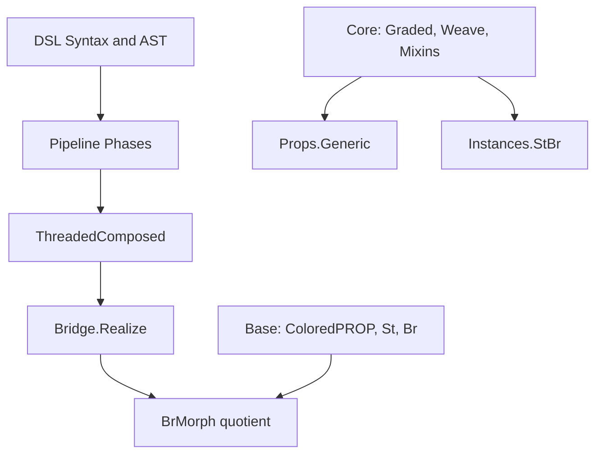
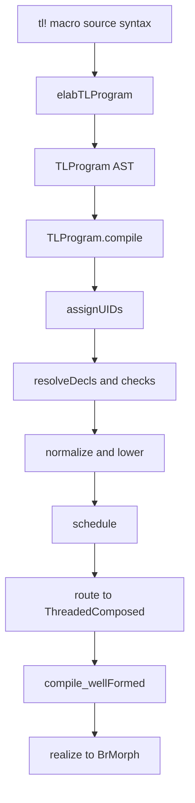
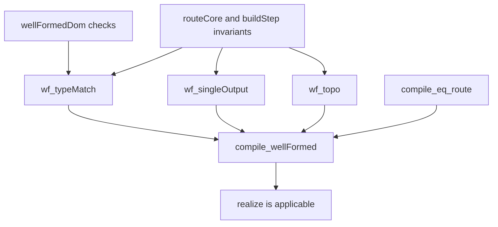

# LeanNCD Code Walkthrough: Compilation Pipeline, Category Theory, and Proofs

This document is a guided walkthrough of the Lean 4 code in `leanncd/`, aimed at programmers who know functional programming but are new to Lean.

The central story is:

1. parse tensor-logic syntax,
2. compile through a staged pipeline,
3. produce a routed presentation (`ThreadedComposed`),
4. realize it as a formal `BrMorph` in the categorical model.

---

## 1) How to read this guide

Use this in two passes:

- **Pass A (systems view):** read Sections 2–5 quickly to understand the architecture and dataflow.
- **Pass B (proof/category view):** read Sections 6–8 and follow the file pointers.

Two running examples are threaded throughout:

- **Example A (matmul):** `Y[i,j] := W[i,k] · X[k,j]`
- **Example B (scan recurrence):**
  - affine: `S[j, 0] := X[j] ; S[j, l +1] := S[j, l] · A[j, k]`
  - nonlinear: `S[j, l +1] := relu(S[j, l] · A[j, k])`

Primary test anchors:

- `leanncd/test/DSL/CompileExamplesTest.lean`
- `leanncd/test/DSL/Pipeline/ScanAffineTest.lean`
- `leanncd/test/DSL/Pipeline/RouteWeaveTest.lean`

---

## 2) Codebase structure (where things live)

Start with `leanncd/LeanNCD.lean`. Its top-level comment explains the major split:

- **Track 1:** categorical/noncomputable math tower
- **Track 2:** executable/computable DSL + pipeline
- **Bridge:** converts executable presentation to formal categorical morphism

### 2.1 Directory map



### 2.2 What each main directory does

| Directory | Role | Key files to start with |
|---|---|---|
| `LeanNCD/DSL` | surface syntax, AST, elaboration, compile entrypoint | `Syntax.lean`, `Elab.lean`, `Ast.lean`, `Compile.lean`, `Target.lean` |
| `LeanNCD/DSL/Pipeline` | phase-by-phase lowering/routing | `Types.lean`, `Structural.lean`, `Lowering.lean`, `RouteSpec.lean` |
| `LeanNCD/Base` | categorical foundations (`ColoredPROP`, `St`, `Br`) | `ColoredPROP.lean`, `St.lean`, `Br.lean` |
| `LeanNCD/Bridge` | convert routed presentation to formal morphisms; agreement results | `Realize.lean`, `Agreement.lean`, `SBr.lean`, `AcsetCodec.lean` |
| `LeanNCD/Core`, `Mixins`, `Props`, `Instances` | graded structure, temporal mixins, generic propositions, flagship instance | `Graded.lean`, `Weave.lean`, `Temporal.lean`, `Generic.lean`, `StBr.lean` |
| `LeanNCD/Eval` | reference evaluator path over scheduled program | `Eval.lean`, `Scan.lean`, `Contract.lean` |
| `leanncd/test` | executable spec of intended behavior | `test/DSL/*`, `test/Bridge/*`, `test/Base/*`, `test/Core/*` |

### 2.3 High-value files and their primary jobs

| File | Primary functions/types |
|---|---|
| `DSL/Syntax.lean` | declares grammar categories (`tl_program`, `tl_stmt`, `tl_rhs`, etc.) |
| `DSL/Elab.lean` | syntax-to-value elaborators (`elabTLProgram`, `elabTLStmt`, `elabTLRHS`, `elabTLIdxExpr`) |
| `DSL/Ast.lean` | IR data types (`TLProgram`, `Stmt`, `RHSExpr`, `IdxExpr`, `Nonlin`, `LHSSlot`) |
| `DSL/Compile.lean` | `TLProgram.compile`, `TLProgram.compileToScheduled`, `tl!{...}` macro |
| `DSL/Pipeline/Structural.lean` | early phases: UID assignment, decl/rank/dtype checks, axis unification, arithmetic lowering prep |
| `DSL/Pipeline/Lowering.lean` | nonlinearity split, scheduling, routing (`buildExtIndex`, `buildNameToStep`, `buildStep`, `routeCore`, `route`) |
| `DSL/Target.lean` | computable presentation types: `BrBaseP`, `StMatP`, `Wire`, `ThreadedComposed` + well-formedness predicates |
| `Bridge/Realize.lean` | presentation-to-formal bridge: `realizeBrBaseP`, `realizeDom`, `realize` |
| `Bridge/Agreement.lean` | compilation correctness bridge theorem: `compile_wellFormed` |
| `Base/St.lean` | affine index morphisms (`StMat`) + `ColoredPROP` instance for shape/index maps |
| `Base/Br.lean` | free strict SMC (raw `Hom` + quotient `Rel`) and `BrMorph` laws |

---

## 3) Lean concepts you will see immediately

As concepts first appear below, they are linked again in context. Keep these references handy:

- `inductive` and constructor-driven data modeling:
  - [Inductive Types (TPiL4)](https://leanprover.github.io/theorem_proving_in_lean4/Inductive-Types/)
  - [Lean reference: inductive declarations](https://lean-lang.org/doc/reference/latest/)
- `structure` and record types:
  - [Structures and Records (FPiL)](https://leanprover.github.io/functional_programming_in_lean/)
- pattern matching:
  - [Pattern Matching](https://lean-lang.org/doc/reference/latest/Terms/Pattern-Matching/)
- macros + syntax categories:
  - [Defining New Syntax](https://lean-lang.org/doc/reference/latest/Notations-and-Macros/Defining-New-Syntax/)
  - [Macros](https://lean-lang.org/doc/reference/latest/Notations-and-Macros/Macros/)
- elaboration stages:
  - [Elaboration and Compilation](https://lean-lang.org/doc/reference/latest/Elaboration-and-Compilation/)
- typeclasses:
  - [Type Classes](https://lean-lang.org/doc/reference/latest/Type-Classes/)
- quotients:
  - [Quotients](https://lean-lang.org/doc/reference/latest/The-Type-System/Quotients/)
- tactic-oriented proofs:
  - [Tactic Proofs](https://lean-lang.org/doc/reference/latest/Tactic-Proofs/)
  - [Tactic Reference](https://lean-lang.org/doc/reference/latest/Tactic-Proofs/Tactic-Reference/)

---

## 4) Compilation pipeline walkthrough (stagewise)

This is the core “source to routed/formal morphism” path.

### 4.1 Big-picture flow



### 4.2 Stage 0-1: grammar and elaboration

- Syntax categories are declared in
  [`DSL/Syntax.lean`](https://github.com/william-macready/pyncd/blob/agents/tutorial-lean4-compilation-guide/leanncd/LeanNCD/DSL/Syntax.lean#L21-L40).
- Parsing/elaboration functions in
  [`DSL/Elab.lean`](https://github.com/william-macready/pyncd/blob/agents/tutorial-lean4-compilation-guide/leanncd/LeanNCD/DSL/Elab.lean#L110-L284) build `TLProgram` values from syntax.

Code anchors:

- Grammar entrypoint for programs:
  [`tl_program` rule](https://github.com/william-macready/pyncd/blob/agents/tutorial-lean4-compilation-guide/leanncd/LeanNCD/DSL/Syntax.lean#L175-L175)
- Elaborators:
  [`elabTLIdxExpr`](https://github.com/william-macready/pyncd/blob/agents/tutorial-lean4-compilation-guide/leanncd/LeanNCD/DSL/Elab.lean#L110-L118),
  [`elabTLStmt`](https://github.com/william-macready/pyncd/blob/agents/tutorial-lean4-compilation-guide/leanncd/LeanNCD/DSL/Elab.lean#L246-L250),
  [`elabTLProgram`](https://github.com/william-macready/pyncd/blob/agents/tutorial-lean4-compilation-guide/leanncd/LeanNCD/DSL/Elab.lean#L259-L284)

What the code actually does:

- `declare_syntax_cat ...` introduces the DSL grammar categories (`tl_program`, `tl_stmt`, `tl_rhs`, etc.).
- `syntax ... : tl_*` rules encode precedence/associativity for arithmetic, boolean predicates, products/sums, and statement syntax.
- `elabTLProgram` iterates over parsed children and dispatches each child to declaration or statement elaboration.
- `elabTLStmt` lowers `name[slots] := rhs` into `Stmt.assign` (scatter classification is deferred to lowering).
- `elabTLIdxExpr` canonicalizes index arithmetic into `IdxExpr` constructors (`axis`, `const`, `scale`, `shift`, `affine`).

**Lean concept:** syntax quotations and elaboration (`Syntax -> MetaM α`)  
**Where:** `elabTLProgram`, `elabTLStmt`, `elabTLRHS`  
**Docs:** [Defining New Syntax](https://lean-lang.org/doc/reference/latest/Notations-and-Macros/Defining-New-Syntax/), [Macros](https://lean-lang.org/doc/reference/latest/Notations-and-Macros/Macros/)

### 4.3 Stage 2: AST model

[`DSL/Ast.lean`](https://github.com/william-macready/pyncd/blob/agents/tutorial-lean4-compilation-guide/leanncd/LeanNCD/DSL/Ast.lean#L12-L127) defines the compiler IR:

- `TLProgram` (decls + stmts),
- `Stmt` (`assign`, `scatter`, `recurMorphism`),
- `IdxExpr`, `RHSExpr`, `Nonlin`, `AggOp`, etc.

Code anchors:

- [`AxisSpec`](https://github.com/william-macready/pyncd/blob/agents/tutorial-lean4-compilation-guide/leanncd/LeanNCD/DSL/Ast.lean#L12-L16),
  [`Decl`](https://github.com/william-macready/pyncd/blob/agents/tutorial-lean4-compilation-guide/leanncd/LeanNCD/DSL/Ast.lean#L18-L23),
  [`RHSExpr`](https://github.com/william-macready/pyncd/blob/agents/tutorial-lean4-compilation-guide/leanncd/LeanNCD/DSL/Ast.lean#L97-L101),
  [`LHSSlot`](https://github.com/william-macready/pyncd/blob/agents/tutorial-lean4-compilation-guide/leanncd/LeanNCD/DSL/Ast.lean#L103-L109),
  [`Stmt`](https://github.com/william-macready/pyncd/blob/agents/tutorial-lean4-compilation-guide/leanncd/LeanNCD/DSL/Ast.lean#L116-L121),
  [`TLProgram`](https://github.com/william-macready/pyncd/blob/agents/tutorial-lean4-compilation-guide/leanncd/LeanNCD/DSL/Ast.lean#L123-L126)

What the code actually does:

- `AxisSpec` carries source-level axis identity (`name`, `uid`, `kind`).
- `Decl` separates tensor/predicate/linear/axis declarations.
- `RHSExpr` separates algebraic body (`SumExpr`) from nonlinear/reduction behavior (`nonlin`, `agg`).
- `LHSSlot` encodes free axes, scan slots (`iterAt` / `iterNext`), and affine scatter slots.
- `Stmt.recurMorphism` is the escape hatch for supplying a pre-built routed fragment.

**Lean concept:** `inductive` and `structure` as ADT/record backbone  
**Docs:** [Inductive Types](https://leanprover.github.io/theorem_proving_in_lean4/Inductive-Types/), [Pattern Matching](https://lean-lang.org/doc/reference/latest/Terms/Pattern-Matching/)

### 4.4 Stage 3: compile entrypoint and macro

[`DSL/Compile.lean`](https://github.com/william-macready/pyncd/blob/agents/tutorial-lean4-compilation-guide/leanncd/LeanNCD/DSL/Compile.lean#L19-L43):

- `TLProgram.compile` chains phases in `FreshM`
- `TLProgram.compileToScheduled` stops before `route`
- `tl!{ ... }` does parse+compile at elaboration time and embeds the result

Code anchors:

- [`TLProgram.compile`](https://github.com/william-macready/pyncd/blob/agents/tutorial-lean4-compilation-guide/leanncd/LeanNCD/DSL/Compile.lean#L19-L29)
- [`TLProgram.compileToScheduled`](https://github.com/william-macready/pyncd/blob/agents/tutorial-lean4-compilation-guide/leanncd/LeanNCD/DSL/Compile.lean#L34-L35)
- [`tl!{...}` macro elaborator](https://github.com/william-macready/pyncd/blob/agents/tutorial-lean4-compilation-guide/leanncd/LeanNCD/DSL/Compile.lean#L39-L43)

What the code actually does:

- `TLProgram.compile` is a concrete `do` chain; each pass returns a stronger-invariant intermediate program.
- `compileToScheduled` exists because eval uses scan bodies before route-collapse.
- The `elab "tl!{ ... }"` macro calls `elabTLProgram`, runs `TLProgram.compile`, and embeds the resulting `ThreadedComposed` with `Lean.toExpr`.

Pipeline chain (exact order):

1. `assignUIDs`
2. `resolveDecls`
3. `checkReadRanks`
4. `checkDtypes`
5. `unifyAxes`
6. `lowerArith`
7. `finalizeScans`
8. `splitNonlins`
9. `schedule`
10. `route`

**Lean concept:** monadic sequencing (`do`, bind, Kleisli composition)  
**Docs:** [Elaboration and Compilation](https://lean-lang.org/doc/reference/latest/Elaboration-and-Compilation/), [Monads in Lean](https://leanprover.github.io/functional_programming_in_lean/)

### 4.5 Stage 4: structural normalization/checking

In [`DSL/Pipeline/Structural.lean`](https://github.com/william-macready/pyncd/blob/agents/tutorial-lean4-compilation-guide/leanncd/LeanNCD/DSL/Pipeline/Structural.lean#L87-L409):

- `assignUIDs`: canonical per-name axis identities
- `resolveDecls`: declaration env + external name classification
- `checkReadRanks`: read arity consistency
- `checkDtypes`: axis-kind and predicate constraints
- `unifyAxes`: name-based UID coequalization

This is where malformed programs fail early with `CompileError`.

Code anchors:

- [`assignUIDs`](https://github.com/william-macready/pyncd/blob/agents/tutorial-lean4-compilation-guide/leanncd/LeanNCD/DSL/Pipeline/Structural.lean#L87-L98)
- [`resolveDecls`](https://github.com/william-macready/pyncd/blob/agents/tutorial-lean4-compilation-guide/leanncd/LeanNCD/DSL/Pipeline/Structural.lean#L126-L136)
- [`checkReadRanks`](https://github.com/william-macready/pyncd/blob/agents/tutorial-lean4-compilation-guide/leanncd/LeanNCD/DSL/Pipeline/Structural.lean#L184-L209)
- [`checkDtypes`](https://github.com/william-macready/pyncd/blob/agents/tutorial-lean4-compilation-guide/leanncd/LeanNCD/DSL/Pipeline/Structural.lean#L228-L249)
- [`unifyAxes`](https://github.com/william-macready/pyncd/blob/agents/tutorial-lean4-compilation-guide/leanncd/LeanNCD/DSL/Pipeline/Structural.lean#L265-L305)
- Lowering-prep stages:
  [`lowerArith`](https://github.com/william-macready/pyncd/blob/agents/tutorial-lean4-compilation-guide/leanncd/LeanNCD/DSL/Pipeline/Structural.lean#L307-L403),
  [`finalizeScans`](https://github.com/william-macready/pyncd/blob/agents/tutorial-lean4-compilation-guide/leanncd/LeanNCD/DSL/Pipeline/Structural.lean#L404-L453)

What the code actually does:

- `assignUIDs`
  - collects all axis names (`TLProgram.axisNames`),
  - mints one non-zero UID per distinct name (`freshNonZero`),
  - traverses and relabels every `AxisSpec` (`TermTraversable.traverseUID`).
- `resolveDecls`
  - builds `DeclEnv` from declaration list,
  - computes produced names from statement LHS,
  - computes `extNames` as “read but never produced”.
- `checkReadRanks`
  - checks declared reads against declared rank,
  - checks undeclared externals for internal consistency,
  - checks produced-but-undeclared intermediates against producer rank (`stmtLhsRank`).
- `checkDtypes`
  - enforces nat-kind for scan iteration axes,
  - enforces real-kind for norm axes,
  - enforces predicate outputs use identity nonlinearity and sum aggregation.
- `unifyAxes`
  - computes `(axis name, uid)` pairs (`collectAxisNameUID`),
  - coequalizes same-name axes to canonical UID and substitutes across program.

### 4.6 Stage 5: lowering, scans, scheduling, routing

In [`DSL/Pipeline/Lowering.lean`](https://github.com/william-macready/pyncd/blob/agents/tutorial-lean4-compilation-guide/leanncd/LeanNCD/DSL/Pipeline/Lowering.lean#L59-L588):

- `splitNonlins`: separate linear compute from nonlinear ops
- `schedule`: stable topological order (`topoSort`)
- `buildExtIndex`, `buildNameToStep`: pass-1 indexing maps
- `buildStep`: construct one `BrBaseP` step + input wires
- `routeCore` / `route`: produce final `ThreadedComposed`

**Lean concept:** proof-producing helper lemmas around data constructors  
Example lemmas: `dedupByUid_uid_nodup`, `idxToRow_fst_length`, `reindexing_wellFormed`

What the code actually does:

- `splitNonlins`
  - if statement nonlinearity is non-identity, emits two statements:
    1) linear pre-activation into fresh `%nl...` tensor,
    2) nonlinearity-only readback step.
- `finalizeScans` (same pipeline namespace)
  - groups `iterAt`/`iterNext` recurrence patterns into `ScanStmt.scan`.
- `schedule`
  - stable Kahn-style topological sort (`topoSortFuel`),
  - explicit cyclic-dataflow failure (`CompileError.cyclicDataflow`),
  - computes `explicitSizes` from `axis ... = n` declarations.
- `buildExtIndex`
  - indexes external read names in first-seen read order.
- `buildNameToStep`
  - maps produced tensor names to producing step/slot.
- `buildStep`
  - computes `degree`, weaves, reindexings, and routing wires for one scheduled statement.
- `routeCore`
  - mapM over scheduled statements with `buildStep`,
  - returns aligned `(steps, routing)` lists.
- `route`
  - packages `routeCore` output into `ThreadedComposed`,
  - checks `wellFormedDom`,
  - sets `nExternal := extNames.card`.

Code anchors:

- [`splitNonlins`](https://github.com/william-macready/pyncd/blob/agents/tutorial-lean4-compilation-guide/leanncd/LeanNCD/DSL/Pipeline/Lowering.lean#L59-L63)
- [`schedule`](https://github.com/william-macready/pyncd/blob/agents/tutorial-lean4-compilation-guide/leanncd/LeanNCD/DSL/Pipeline/Lowering.lean#L150-L166)
- [`buildExtIndex`](https://github.com/william-macready/pyncd/blob/agents/tutorial-lean4-compilation-guide/leanncd/LeanNCD/DSL/Pipeline/Lowering.lean#L340-L362)
- [`buildNameToStep`](https://github.com/william-macready/pyncd/blob/agents/tutorial-lean4-compilation-guide/leanncd/LeanNCD/DSL/Pipeline/Lowering.lean#L474-L480)
- [`buildStep`](https://github.com/william-macready/pyncd/blob/agents/tutorial-lean4-compilation-guide/leanncd/LeanNCD/DSL/Pipeline/Lowering.lean#L482-L553)
- [`routeCore`](https://github.com/william-macready/pyncd/blob/agents/tutorial-lean4-compilation-guide/leanncd/LeanNCD/DSL/Pipeline/Lowering.lean#L573-L579)
- [`route`](https://github.com/william-macready/pyncd/blob/agents/tutorial-lean4-compilation-guide/leanncd/LeanNCD/DSL/Pipeline/Lowering.lean#L583-L588)

### 4.7 Stage 6: routed artifact (`ThreadedComposed`)

In [`DSL/Target.lean`](https://github.com/william-macready/pyncd/blob/agents/tutorial-lean4-compilation-guide/leanncd/LeanNCD/DSL/Target.lean#L12-L158):

- `BrBaseP`, `StMatP`, `AxisP` are computable presentation types.
- `Wire` is an explicit sum type (`external` or `internal step slot`).
- `ThreadedComposed` stores `steps`, `routing`, `nExternal`.
- `wellFormedDom` and `WellFormed` capture routing/type/topology invariants required by realization.

This is the executable artifact representing the program graph.

What the code actually does:

- `StMatP` gives first-order affine maps (`domLen`, `codLen`, `coeffs`, `bias`) plus `wellFormed`/`validate`.
- `BrOp` provides typed operation tags (contract/maxreduce/scatter/relu/softmax/scan/scanAffine/etc.).
- `ThreadedComposed.externalPort` finds first consuming port for external slot `k`.
- `ThreadedComposed.wellFormedDom` enforces external-slot referencedness and rank consistency across all consumers.
- `ThreadedComposed.WellFormed` strengthens this with producer/consumer type match, output-arity, and topological membership.

Code anchors:

- [`StMatP`](https://github.com/william-macready/pyncd/blob/agents/tutorial-lean4-compilation-guide/leanncd/LeanNCD/DSL/Target.lean#L12-L33)
- [`BrOp`](https://github.com/william-macready/pyncd/blob/agents/tutorial-lean4-compilation-guide/leanncd/LeanNCD/DSL/Target.lean#L54-L88)
- [`Wire`](https://github.com/william-macready/pyncd/blob/agents/tutorial-lean4-compilation-guide/leanncd/LeanNCD/DSL/Target.lean#L106-L109)
- [`ThreadedComposed`](https://github.com/william-macready/pyncd/blob/agents/tutorial-lean4-compilation-guide/leanncd/LeanNCD/DSL/Target.lean#L114-L118)
- [`externalPort`](https://github.com/william-macready/pyncd/blob/agents/tutorial-lean4-compilation-guide/leanncd/LeanNCD/DSL/Target.lean#L128-L134)
- [`wellFormedDom`](https://github.com/william-macready/pyncd/blob/agents/tutorial-lean4-compilation-guide/leanncd/LeanNCD/DSL/Target.lean#L142-L153)
- `WellFormed` strengthening:
  [`ThreadedComposed.WellFormed`](https://github.com/william-macready/pyncd/blob/agents/tutorial-lean4-compilation-guide/leanncd/LeanNCD/Bridge/Realize.lean#L139-L147)

### 4.8 Stage 7: from routed presentation to formal Br morphism

In [`Bridge/Realize.lean`](https://github.com/william-macready/pyncd/blob/agents/tutorial-lean4-compilation-guide/leanncd/LeanNCD/Bridge/Realize.lean#L50-L253):

- `realizeBrBaseP`: realize one presentation step into dependent `BrBase`.
- `realizeDom`: reconstruct external domain object.
- `realize`: fold routed steps into one formal `BrMorph`.

In [`Bridge/Agreement.lean`](https://github.com/william-macready/pyncd/blob/agents/tutorial-lean4-compilation-guide/leanncd/LeanNCD/Bridge/Agreement.lean#L19-L383):

- `compile_wellFormed`: every compiled program satisfies realization preconditions.

So the endpoint is:

`TLProgram.compile` -> `ThreadedComposed` -> `compile_wellFormed` -> `realize` -> formal `BrMorph`.

What the code actually does:

- `realizeAxis`, `realizeStObj`, `realizeStMat` map presentation-level objects/matrices into dependent math-tower forms.
- `realizeBrBaseP` realizes each routed primitive into a `BrBase dom cod` (dependent on weave targets).
- `wirePlan`, `stepPiece`, `interpUpto`, and `finalPiece` assemble a single composed `BrMorph` using routing-driven wiring and tensor/comp composition.
- `compile_eq_route` decomposes a successful compile run into scheduled-program + routed-core facts.
- `compile_wellFormed` combines route facts (`wf_typeMatch`, `wf_singleOutput`, `wf_topo`) to discharge `realize` preconditions for compiled programs.

Code anchors:

- [`realizeBrBaseP`](https://github.com/william-macready/pyncd/blob/agents/tutorial-lean4-compilation-guide/leanncd/LeanNCD/Bridge/Realize.lean#L50-L61)
- [`realizeDom`](https://github.com/william-macready/pyncd/blob/agents/tutorial-lean4-compilation-guide/leanncd/LeanNCD/Bridge/Realize.lean#L68-L73)
- [`realize`](https://github.com/william-macready/pyncd/blob/agents/tutorial-lean4-compilation-guide/leanncd/LeanNCD/Bridge/Realize.lean#L250-L253)
- Bridge theorem chain:
  [`compile_eq_route`](https://github.com/william-macready/pyncd/blob/agents/tutorial-lean4-compilation-guide/leanncd/LeanNCD/Bridge/Agreement.lean#L19-L43),
  [`compile_wellFormed`](https://github.com/william-macready/pyncd/blob/agents/tutorial-lean4-compilation-guide/leanncd/LeanNCD/Bridge/Agreement.lean#L379-L383)

---

## 5) Running examples through the pipeline

### 5.1 Example A: matmul

Source:

```lean
tl!{ Y[i,j] := W[i,k] · X[k,j] }
```

Observed in tests:

- `nExternal == 2` (`W`, `X`)
- `steps.length == 1`
- output weave has one contracted (`tiled`) axis (`k`)

See `test/DSL/CompileExamplesTest.lean`.

### 5.2 Example B: scan vs scanAffine

From `test/DSL/Pipeline/ScanAffineTest.lean`:

- identity-nonlinearity recurrence routes as `BrOp.scanAffine`
- nonlinear recurrence (`relu`) routes as `BrOp.scan`

This cleanly demonstrates a semantic split produced by `splitNonlins` + scan lowering.

### 5.3 Routing sanity example

Use this as the primary “walk routing + scheduling” example:

```lean
tl!{
  H[i,k] := W1[k,d] · X[i,d]
  Y[i,j] := relu(W2[j,k] · H[i,k])
}
```

Anchor:
[`test/DSL/Pipeline/RouteWeaveTest.lean#L6-L11`](https://github.com/william-macready/pyncd/blob/agents/tutorial-lean4-compilation-guide/leanncd/test/DSL/Pipeline/RouteWeaveTest.lean#L6-L11)

Expected routed wiring from the test:

```lean
[[Wire.external 0, Wire.external 1],
 [Wire.external 2, Wire.internal 0 0],
 [Wire.internal 1 0]]
```

How to read this:

1. **Step 0** computes `H` from externals `W1` and `X`.
2. **Step 1** computes the linear pre-activation for `Y` from external `W2` and internal `H` (`Wire.internal 0 0`).
3. **Step 2** applies `relu` to Step 1 output (`Wire.internal 1 0`).

Why this is a good walkthrough:

- It shows **scheduling** (producer `H` before consumer `Y`).
- It shows **routing** from external and internal sources.
- It shows **nonlinearity splitting** into an extra stage (linear step + relu step).

---

## 6) Category-theory mapping to implementation

### 6.1 Mapping table

| Implementation artifact | Categorical meaning | File(s) |
|---|---|---|
| `ColoredPROP` | strict symmetric monoidal category interface over colored objects | `Base/ColoredPROP.lean` |
| `StObj`, `StMat` | index/shape PROP with affine maps | `Base/St.lean` |
| `BrBase`, `BrMorph` | free strict SMC on broadcast generators (quotiented syntax) | `Base/Br.lean` |
| `Hom` + `Rel` + quotient | raw syntax + equations -> semantic morphisms | `Base/Br.lean` |
| `DGradedColoredPROP` | graded PROP with action/coherence data | `Core/Graded.lean` |
| `Weave` | factorization witness `g = lam ; [f,P] ; rho` | `Core/Weave.lean` |
| `TemporalGraded` | scan/temporal mixin over graded structure | `Mixins/Temporal.lean` |
| `Algebra` | strong symmetric monoidal, equivariant semantics functor | `Algebra/Algebra.lean` |
| `ThreadedComposed` | computable routed presentation of a Br program | `DSL/Target.lean` |
| `realize` | presentation -> formal `BrMorph` | `Bridge/Realize.lean` |

### 6.2 Why there are multiple representations

There are three intentionally distinct worlds:

1. **Math tower (`Base/*`)** for categorical reasoning.
2. **Computable presentation (`DSL/Target`)** for compilation/runtime representation.
3. **ACSet/table representation (`Acset/*`)** for interop.

`LeanNCD.lean` explains this split directly.

### 6.3 Important conceptual nuance

The routed DAG (`ThreadedComposed`) is not yet the final quotient-level morphism.
It becomes a formal `BrMorph` only after `realize`.

---

## 7) Proof roadmap (what is proved, what drives compiler trust)

### 7.1 Compiler-to-bridge trust chain



### 7.2 Key theorem clusters

1. **Routing structural specs**
   - `DSL/Pipeline/RouteSpec.lean`
   - gives per-index facts from `routeCore sp = .ok (...)`.

2. **Lowering/routing internal invariants**
   - `DSL/Pipeline/Lowering.lean`
   - e.g. reindexing shape/well-formed lemmas.

3. **Bridge well-formedness theorem**
   - `Bridge/Agreement.lean`
   - `compile_wellFormed`: compiled outputs satisfy `ThreadedComposed.WellFormed`.

4. **Realization correctness shape**
   - `Bridge/Realize.lean`
   - constructs formal `BrMorph` using `WellFormed` assumptions.

5. **Foundational algebraic laws**
   - `Base/St.lean`, `Base/Br.lean`
   - category/tensor/symmetry laws used by bridge/proof layers.

### 7.3 Open/deferred proof areas (important for readers)

Current intentional gaps include (see `leanncd/SORRY_INVENTORY.md`):

- `Core/Weave.lean`: `weave_unique`
- `Instances/StBr.lean`: many signature fields (`act`, `δ`, `α`, etc.)
- `Base/St.lean`: some hexagon fields
- `Base/Br.lean`: `brCancelPoint` obligation

This means:

- executable pipeline is strong and test-backed,
- full categorical completion remains staged in specific modules.

---

## 8) Lean concept callouts at encounter points

Use this as a “jump table” while reading code.

| Encounter in code | Lean concept | Reference |
|---|---|---|
| `DSL/Ast.lean` inductive IR | ADTs via `inductive` | [Inductive Types](https://leanprover.github.io/theorem_proving_in_lean4/Inductive-Types/) |
| `DSL/Elab.lean` syntax elaborators | syntax trees + elaboration monads | [Elaboration and Compilation](https://lean-lang.org/doc/reference/latest/Elaboration-and-Compilation/) |
| `DSL/Syntax.lean` grammar | syntax categories/macros | [Defining New Syntax](https://lean-lang.org/doc/reference/latest/Notations-and-Macros/Defining-New-Syntax/) |
| `DSL/Compile.lean` + `FreshM` | monadic pipelines | [Functional Programming in Lean](https://leanprover.github.io/functional_programming_in_lean/) |
| `Base/*` + `Core/*` classes/instances | typeclasses, instance search | [Type Classes](https://lean-lang.org/doc/reference/latest/Type-Classes/) |
| `Base/Br.lean` quotiented morphisms | `Quotient`, setoids | [Quotients](https://lean-lang.org/doc/reference/latest/The-Type-System/Quotients/) |
| `RouteSpec/Agreement` proofs | tactics (`simp`, `rw`, `cases`, `induction`) | [Tactic Proofs](https://lean-lang.org/doc/reference/latest/Tactic-Proofs/) |

---

## 9) Suggested reading itinerary (fast to deep)

1. `LeanNCD.lean` (top comment)
2. `DSL/Syntax.lean` -> `DSL/Elab.lean` -> `DSL/Ast.lean`
3. `DSL/Compile.lean`
4. `DSL/Pipeline/Types.lean` -> `Structural.lean` -> `Lowering.lean`
5. `DSL/Target.lean`
6. `test/DSL/CompileExamplesTest.lean`, `test/DSL/Pipeline/*`
7. `Bridge/Realize.lean` -> `Bridge/Agreement.lean`
8. `Base/St.lean`, `Base/Br.lean`
9. `Core/Graded.lean`, `Props/Generic.lean`, `Instances/StBr.lean`
10. `SORRY_INVENTORY.md` for current proof status

---

## 10) Practical checkpoints while reading

After Section 4:

- Can you explain why `compileToScheduled` exists separately from `compile`?
- Can you locate where external tensor names are inferred?

After Section 6:

- Can you map `ThreadedComposed` fields to categorical inputs/outputs/composition?

After Section 7:

- Can you trace how `compile_wellFormed` discharges `realize` preconditions?

---

## 11) Figure summary

This walkthrough used three diagrams:

1. **Architecture map** (Section 2)
2. **Stagewise compile flow** (Section 4)
3. **Proof dependency chain to `compile_wellFormed`** (Section 7)

You can render these Mermaid blocks directly in Markdown-capable viewers.

---

## 12) Closing note

If you keep one mental model, use this:

> The DSL compiler is a sequence of structure-preserving normalizations that convert tensor logic into a routed presentation (`ThreadedComposed`), and the bridge turns that routed presentation into a formal categorical morphism (`BrMorph`) once routing/type/topology invariants are proved.

That single sentence captures the executable path, the category-theory connection, and why the proofs are arranged the way they are.
