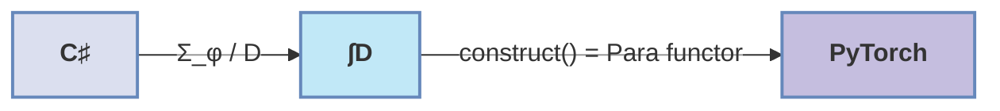
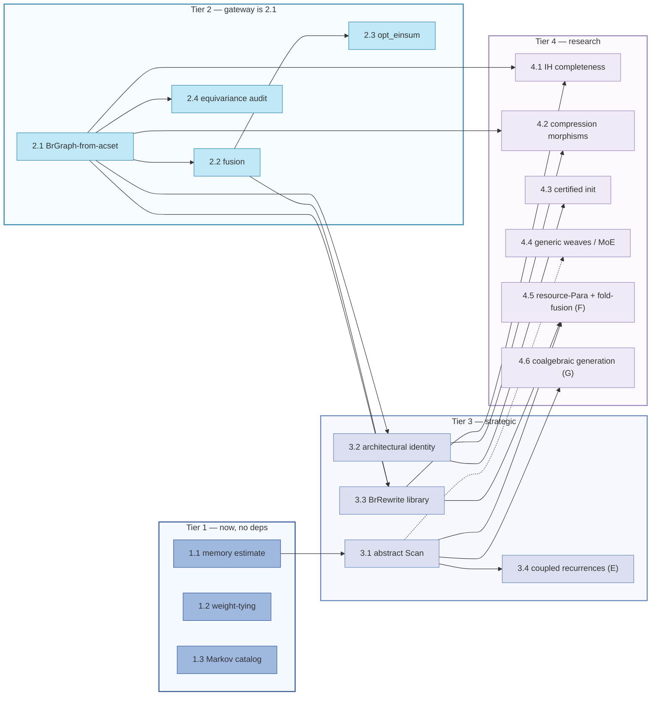

# Future Ideas: A Unified View of pyncd's Categorical Architecture

This document fuses three lines of thinking developed in [theory.md](theory.md) (the Weaves/Wires/Morphisms categorical framework), [acset.md](acset.md) (the structure/data separation via acsets), and [prop_ideas.md](prop_ideas.md) (PROP algebras and the internal-language view). Each document approaches the pyncd pipeline through a different mathematical lens. Read together they describe **one object from three angles**, and the overlaps are not coincidental — they are the same construction named three ways. This document makes those identifications explicit, expands on the consequences, and prioritizes the resulting implementation opportunities by impact.

---

## Contents

1. [Bird's-Eye View: One Pipeline, Three Vocabularies](#1-birds-eye-view-one-pipeline-three-vocabularies)
   - [The three-arrow pipeline](#11-the-three-arrow-pipeline)
   - [The same object under three names](#12-the-same-object-under-three-names)
   - [Why the triangulation matters](#13-why-the-triangulation-matters)
2. [Layer I — Structural Foundations](#2-layer-i--structural-foundations)
   - [Autoalignment is the pushout is the cup morphism](#21-autoalignment-is-the-pushout-is-the-cup-morphism)
   - [The weave is a Grothendieck element is the initial algebra](#22-the-weave-is-a-grothendieck-element-is-the-initial-algebra)
   - [BrGraph and SBrInstance are dual views of one DAG](#23-brgraph-and-sbrinstance-are-dual-views-of-one-dag)
   - [Weaves are the cartesian-lift datum of a graded PROP](#24-weaves-are-not-a-br-thing--they-are-the-cartesian-lift-datum-of-a-graded-prop)
3. [Layer II — Compilation and the Para Functor](#3-layer-ii--compilation-and-the-para-functor)
   - [construct() is a Para functor over the Grothendieck integral](#31-construct-is-a-para-functor-over-the-grothendieck-integral)
   - [Shape inference is the right Kan extension is partial evaluation](#32-shape-inference-is-the-right-kan-extension-is-partial-evaluation)
   - [Lifts are left Kan extensions are natural transformations](#33-lifts-are-left-kan-extensions-are-natural-transformations)
4. [Layer III — Optimization Passes](#4-layer-iii--optimization-passes)
   - [Fusion: one equation, three justifications](#41-fusion-one-equation-three-justifications)
   - [Markov laws underwrite three existing features](#42-markov-laws-underwrite-three-existing-features)
   - [Static memory estimation from the acset alone](#43-static-memory-estimation-from-the-acset-alone)
5. [Layer IV — Verification and Analysis](#5-layer-iv--verification-and-analysis)
   - [Architectural identity as schema-morphism restriction](#51-architectural-identity-as-schema-morphism-restriction)
   - [Weight tying: comonoid, Para morphism, acset parameter group](#52-weight-tying-comonoid-para-morphism-acset-parameter-group)
   - [Equivariance from StrideCategory representation theory](#53-equivariance-from-stridecategory-representation-theory)
   - [Masked operators and output-wire predicates](#54-masked-operators-and-output-wire-predicates)
6. [Layer V — Speculative Frontiers](#6-layer-v--speculative-frontiers)
   - [The Bool semiring and Interacting Hopf Algebras](#61-the-bool-semiring-and-interacting-hopf-algebras)
   - [Model compression as approximate algebra morphisms](#62-model-compression-as-approximate-algebra-morphisms)
   - [Free algebras and certified initialization](#63-free-algebras-and-certified-initialization)
   - [Stacking levels: weaves over models (MoE, ensembles)](#64-stacking-levels-weaves-over-models-mixture-of-experts-ensembles)
   - [Swapping the index: `D` as a dial across ML](#65-swapping-the-index-d-as-a-dial-across-ml)
7. [The Deepest Structural Connection](#7-the-deepest-structural-connection)
8. [Prioritized Implementation Roadmap](#8-prioritized-implementation-roadmap)
   - [Tier 1 — High impact, low cost, foundations exist](#tier-1--high-impact-low-cost-foundations-exist)
   - [Tier 2 — High impact, moderate cost](#tier-2--high-impact-moderate-cost)
   - [Tier 3 — Strategic, larger investment](#tier-3--strategic-larger-investment)
   - [Tier 4 — Research-grade, open-ended](#tier-4--research-grade-open-ended)
9. [References](#9-references)

---

## 1. Bird's-Eye View: One Pipeline, Three Vocabularies

pyncd compiles a tensor-logic (TL) program into an executable PyTorch module. The pipeline has three stages, and each of the three source documents describes the *same* three stages in a different mathematical language. The central insight of this document is that these are not three parallel theories — they are three coordinate systems on one manifold, and translating between them turns informal engineering claims into theorems.

### 1.1 The three-arrow pipeline

```mermaid
%%{init: {'theme': 'default', 'themeVariables': {'edgeLabelBackground': '#ffffff00'}}}%%
graph LR
    TL["TL program"]
    C["<b>C♯</b><br/>structural skeleton<br/><i>what is connected</i>"]
    ID["<b>∫D</b><br/>data-filled morphism<br/><i>what, with what values</i>"]
    PT["<b>PyTorch</b><br/>nn.Module<br/><i>running code</i>"]

    TL -->|"parse · axis unification (Context)"| C
    C -->|"attach sizes/weights<br/>Σ_φ / D-functor<br/>= specialize to ground colors"| ID
    ID -->|"construct()<br/>= Para functor<br/>Para(Br) → Para(PyTorch)"| PT

    classDef obj fill:#ffffff,stroke:#555555,stroke-width:1px
    classDef skel fill:#DBDFEF,stroke:#6688bb,stroke-width:2px
    classDef data fill:#C1E8F7,stroke:#6688bb,stroke-width:2px
    classDef exec fill:#C5BEDF,stroke:#6688bb,stroke-width:2px
    class TL obj
    class C skel
    class ID data
    class PT exec
```



- **C♯ — the structural skeleton.** Which arrays exist, which axes connect them, which axes are tiled versus contracted, in what order operators apply. No sizes, no weights, no numerical content. This is what `bc_signature()` produces before any datatype or size information is attached, what an `SBrInstance`'s C-set part records, and what `prop_ideas.md` calls the *initial algebra* of the architecture PROP.

- **∫D — the data-filled morphism.** The Grothendieck integral of a data functor `D` over `C♯`: each structural object is paired with a compatible data assignment (axis sizes, coefficients, datatypes, and — once weights are present — parameter tensors). This is a fully-specified `Broadcasted`/`Composed` term in pyncd.

- **PyTorch — the executable.** The image under the algebra functor `F = construct()`, mapping abstract parameterized morphisms to concrete `nn.Module` objects with `nn.Parameter` weights.

Each arrow has a name in each vocabulary. The first arrow (skeleton → data) is **left Kan extension Σ_φ** in acset terms, the **D-functor evaluation** in Grothendieck terms, and **specialization to ground colors** in PROP terms. The second arrow (data → code) is `construct()` in pyncd terms and a **Para functor** `Para(Br) → Para(PyTorch)` in PROP terms.

### 1.2 The same object under three names

The single most important observation across the three documents is that the structural skeleton appears in all three under different names, and the relationship `C = ∫D` appears in all three as different equations:

| Concept | `acset.md` | `theory.md` | `prop_ideas.md` |
| --- | --- | --- | --- |
| Structure without values | Structural skeleton `C♯` | abstract `Broadcasted` (pre-size) | initial algebra of `P_arch` |
| Structure + data | Grothendieck integral `∫D` | `Broadcasted` with `Weave` sizes | algebra of `P_arch` in FVect |
| The compilation step | left Kan extension `Σ_φ` | `bc_signature()` + `construct()` | Para functor `Para(Br) → Para(PyTorch)` |
| The composition operation | pushout / colimit | `@` / `Context` UID unification | compact-closed cup composition |
| Shape inference | right Kan extension `Π_φ` | `Context.apply()` size propagation | partial evaluation to ground colors |
| Axis identity mechanism | shared UID in `axis_sizes` | `UID` + `EqualityClass` | wire color matching |
| The navigational view | `SBrInstance` tables | morphism term tree | `BrGraph` DAG |

Reading down any column gives one document's self-consistent story. Reading across any row reveals that the three documents are describing the same mathematics — and that a result proved in one column transports to the others for free.

### 1.3 Why the triangulation matters

Triangulation converts informal claims into theorems and locates the cheapest implementation route:

1. **Correctness becomes provable.** `theory.md` describes compiler passes (fusion, lift) operationally. `prop_ideas.md` shows they are natural transformations in `Para(Br)`, hence correct by construction. `acset.md` shows the underlying composition is a colimit with a universal property. A pass justified in all three columns needs no per-case correctness argument.

2. **Implementation routes multiply.** A feature `prop_ideas.md` calls "not yet implemented" because it needs a `BrGraph` may already be computable from the `SBrInstance` tables that `acset.md` defines — the data is present, only the access path differs. Static memory estimation (§4.3) is the cleanest example.

3. **The Lean formalization compounds.** `acset.md`'s closing section encodes `SBrInstance` as a strict monoidal functor into a Lean category `Br`. Every identification in this document means a Lean proof about one vocabulary discharges obligations in the others. `pullback_comp` (proved categorically) is simultaneously the soundness of `Context` unification (theory), the associativity of the pushout (acset), and compact closedness of the cup morphism (PROP).

The remainder of the document is organized by **layer of the pipeline** rather than by source document, because the fused view is layer-oriented. Within each layer, every idea is cross-referenced to all three vocabularies.

---

## 2. Layer I — Structural Foundations

This layer concerns `C♯` — the structural skeleton — and the operations that build and compose it. These are the foundations on which every later optimization and verification rests.

### 2.1 Autoalignment is the pushout is the cup morphism

**The three framings.**

- `theory.md` ([§Autoalignment](theory.md#autoalignment)): the `@` operator composes two morphisms `f ; g` with automatic axis alignment. When `cod(f)` and `dom(g)` differ in axis count, identities are inserted; then axes are paired positionally, added to `EqualityClass`es, and `Context.apply` substitutes canonical UIDs throughout. Shape-based matching handles cross-`TL`-instance composition by matching `(name, size)` signatures.

- `acset.md` ([§Theoretical Advantages](acset.md#theoretical-advantages), "Colimit-based composition"): composition of two instances is a **pushout** — the smallest instance into which both factor compatibly, identifying shared boundary axes. This gives composition a universal property, so associativity and identity laws are immediate from the categorical axioms rather than proved by hand.

- `prop_ideas.md` ([§TL as the Internal Language](prop_ideas.md#tl-as-the-internal-language-of-br), row 2): contraction over a shared index is the **cup morphism** of a compact closed category; the data-flow edges in a `ThreadedComposed` are cup/cap pairs.

**The identification.** The `Context` union-find over UIDs *is* the pushout's coequalizer, computed concretely. When `@` unifies `cod(f)` with `dom(g)`, it is computing the colimit cocone: the canonical representative of each `EqualityClass` is the pushout's universal vertex. The cup morphism of the compact closed structure is exactly the boundary identification that the pushout performs.

**Expansion — what this buys us.** Three things follow that no single document states:

1. **Associativity of `@` is free.** Because composition is a pushout and pushouts compose associatively (the pasting lemma for colimits), `(f @ g) @ h = f @ (g @ h)` holds without a manual proof over the `Context` machinery. This should be the *first* property formalized in Lean, because every later rewrite depends on it.

2. **Shape-based matching is a colimit-completion heuristic.** When two morphisms come from separate `TL()` instances, their UIDs differ even at matching `(name, size)`. The shape-signature match in `composition()` is reconstructing which axes *should* be identified — i.e., guessing the pushout's identification map from metadata. This is sound precisely when the `(name, size)` signature uniquely determines the axis, which is the condition under which the pushout is well-defined. Documenting this gives a precise correctness criterion: shape-based matching is valid iff no two distinct axes in the boundary share a `(name, size)` signature.

3. **A failed alignment is a failed pushout.** When `@` raises because boundaries don't match, the categorical statement is that the pushout does not exist (the spans don't have a common extension). This means error messages can be made precise: report *which* span fails to admit a cocone, i.e., which axis on one side has no compatible partner on the other.

### 2.2 The weave is a Grothendieck element is the initial algebra

**The three framings.**

- `theory.md` ([§Weaves](theory.md#weaves)): a weave is a boolean family `(w_i)` partitioning an array's axes into target (operated on directly) and tiling (looped over by the degree `P`). In pyncd it is the `_shape` field of `Weave`, with each slot either a concrete `Axis` (target) or `WeaveMode.TILED` (tiling).

- `acset.md` ([§The Grothendieck Construction](acset.md#the-grothendieck-construction)): the full category `C` is recovered from its structural skeleton `C♯` and a data functor `D` via the Grothendieck integral `∫D`. Objects are (structural-object, data-assignment) pairs.

- `prop_ideas.md` ([§Free Algebras](prop_ideas.md#4-free-algebras-and-architecture-initialization); [§A Br Graph API](prop_ideas.md#a-br-graph-api)): the `BrGraph` *is* the initial (symbolic) algebra of the architecture PROP — structure without numerical content, through which every concrete algebra factors.

**The identification.** All three name the same object. The structural part of a weave (which slots are `TILED` versus a concrete axis — i.e., the *pattern* with axis identities and sizes erased) is an object of `C♯`, equivalently a generator of the initial PROP algebra. The data part (the concrete `Axis` objects, their UIDs, their sizes) is the value `D` assigns. A fully-instantiated `Weave` is therefore precisely an element of the Grothendieck integral `∫D`: a structural slot pattern paired with a compatible axis assignment.

**Expansion.** This identification clarifies *why* `bc_signature()` produces well-typed morphisms, which `theory.md` asserts but does not explain. `bc_signature()` reads the contraction structure from the equation's UID graph (which axes are retained → `TILED`, which are contracted → concrete target) and produces the weave. In the fused vocabulary: it computes the structural skeleton from the UID graph, then re-attaches the axis data — exactly the construction of the element of `∫D` corresponding to the equation. The well-typedness is the statement that the construction lands in the integral (the data assignment is compatible with the structural slot), which holds because the same `Axis` objects are used for both the skeleton's slot pattern and the data assignment — there is no opportunity for incompatibility.

A practical consequence: the structural skeleton can be extracted from any `Weave` by replacing each concrete `Axis` with a canonical placeholder keyed only by its *position and target/tiling status*. Two morphisms have the same skeleton iff these placeholder patterns are equal. This is the concrete computation behind "architectural identity" (§5.1) and is cheaper than full graph isomorphism because the weave already linearizes the structure.

### 2.3 BrGraph and SBrInstance are dual views of one DAG

**The tension `prop_ideas.md` identifies.** The [§A Br Graph API](prop_ideas.md#a-br-graph-api) section argues that the existing `UIDHypergraph` is the wrong substrate for a `BrGraph` because it cannot see the `ThreadedComposed` routing table — it wraps `ThreadedComposed` and `Scan` as opaque leaves, so the data-flow connectivity carried by the routing table is invisible. Since `BrGraph`'s purpose is data-flow analysis, this is fatal.

**The resolution from `acset.md`.** The `SBrInstance` schema *already encodes the routing table*. The `Sample` rows (`src`, `tgt`, `coeff`, `reindexing_slot`) and the per-equation array slots carry exactly the data-flow connectivity that `BrGraph` needs. The routing table inside a `ThreadedComposed` — `routing[i][j]` = live-pool index for input `j` of step `i` — is the same information as the `Sample`/`reindexing_slot` graph keyed by `equation_idx`. The live pool's "output of step `i` lives at slot `n_external + i`" convention is the topological ordering recorded by `EquationRow.equation_idx`.

**The identification.** `SBrInstance` is the **relational (acset) view** and `BrGraph` is the **navigational (graph) view** of the same categorical object — the structural skeleton `C♯` with its data-flow edges. They are formally dual in the database sense: the acset is the normalized table form, the graph is the pointer-chasing form, and each is derivable from the other.

**Expansion — three concrete consequences.**

1. **Build `BrGraph.from_morphism()` by routing through the acset, not the display layer.** Rather than extending `UIDHypergraph` (which is optimized for spatial layout and misses `ThreadedComposed`), derive `BrGraph` from `from_tensor_program()`'s `SBrInstance`. The `Sample` table gives directed edges directly; `ThreadedComposed`'s routing table is reconstructed from `reindexing_slot` foreign keys. `Scan` becomes a nested scope keyed by a sub-instance. This sidesteps the entire gap `prop_ideas.md` flags.

2. **Offline analysis becomes possible.** Because `SBrInstance` serializes to CSV (per `acset.md`'s `write_sbr`/`read_sbr`), every `BrGraph`-based analysis — equivariance audit, weight-tying check, fusion candidate detection — can run on the CSV form without the Python runtime or PyTorch. This is strictly more than `prop_ideas.md` envisions, where `BrGraph` is a runtime structure.

3. **Wire colors are `ArrayRow` attributes.** `BrGraph`'s wire-color requirement (`Array[Datatype, shape]` plus optional predicate) maps onto `ArrayRow`'s `datatype_tag`, the axis sizes via `ArrayAxisRow`/`axis_sizes`, and `iverson_expr` for Bool/masked wires. The graph API's `color(wire)` and `predicate(wire)` methods are projections of the acset tables.

**The fused data model.** The recommended `BrNode` carries: its `operator_tag` (from `ArrayRow`), its degree (the `is_target = False` axes sorted by `position`), and its input/output weaves (reconstructed from `ArrayAxisRow.is_target`). The recommended `Wire` carries the full Br color and, for `Bool` and masked-operator wires, the `iverson_expr` string. Both are pure functions of the `SBrInstance` tables — no new data, only a new access path.

### 2.4 Weaves are not a Br thing — they are the cartesian-lift datum of a graded PROP

`theory.md` introduces weaves exclusively as a feature of Br. But nothing in the construction is Br-specific; the weave is the right level of abstraction *one level up*, and seeing this clarifies what weaves are for and suggests where else they apply. The full categorical formalization of this generalization — the **`D`-graded colored PROP**, with St→Br as one instantiation — is developed as a Lean-formalizable structure in [graded_prop.md](graded_prop.md); this section is its informal motivation.

**What a weave abstractly is.** Strip the Br language and a weave on a single wire is two pieces of data:

1. A **partition** of the wire's *sub-wires* into `target` (the base operation acts on them) and `tiling` (the degree loop carries them).
2. A **permutation** `Ω_w` relating the canonical split order (targets first, tilings second) to the actual interleaved memory order.

The second piece is pure symmetric-monoidal structure — the symmetry morphisms `σ` of any PROP supply `Ω_w` for free. The genuinely structural piece is the first: the target/tiling labelling. And it only makes sense if a single wire *has sub-wires to partition*. In Br this holds because a Br color — an array `[a, A]` — is itself a product of St objects (the axes of `A`); the weave classifies those axes. The weave therefore lives not in Br alone but **at the interface between two levels**: Br's colors are St's objects.

**The condition for generalization.** A colored PROP `C` admits weave machinery exactly when:

1. **Thick wires.** Each color of `C` is an object of an underlying symmetric monoidal *index* category `D`, so every wire factors as a product of sub-colors `c = d₁ ⊗ ⋯ ⊗ dₙ` with `dᵢ ∈ D`. (In Br: `D = St`, sub-colors = axes.)
2. **A lift / broadcast structure.** `C` carries a batch lift `[−, P]` for degree objects `P ∈ D`, satisfying the naturality law `[f,P] ; [Y,p] = [X,p] ; f` (theory.md Eq. 3 / Def 11) — equivalently, `C` is *graded over* `D` and the lift is the reindexing functor, with per-input reindexings `ηᵢ : P → Qᵢ` in `D`.

Given (1) and (2), a weave on color `c` relative to degree `P` is exactly a map `sub-wires(c) → {target, tiling}` plus the induced `Ω_w`: tiling sub-wires are those supplied by the reindexing `ηᵢ`, target sub-wires are those the base morphism sees. This is the Br definition *verbatim*, with "axis" replaced by "sub-color in `D`." The proper name for the resulting setting is a **`D`-graded symmetric monoidal PROP**, and **the weave is the cartesian-lift datum of the grading fibration `C → D`** — the bookkeeping witnessing how each `C`-color sits over a `D`-object under the lift.

**The sanity check that confirms the condition discriminates.** St itself does *not* admit weaves, and it shouldn't: St's colors are axis *lengths*, which are atomic — a single St wire carries one axis with no internal product, so condition (1) fails and there is nothing to partition. Weaves require *thick* wires (Br), not *thin* ones (St). The two-level St→Br structure is precisely what makes Br thick. This is a useful negative test for any future level: a PROP whose colors are atomic gets no weaves.

**What does not generalize.** Two parts of `theory.md`'s weave story are interpretation, not categorical structure, and must not be carried over blindly:

- **The GPU reading** ("tiling = distributed across cores, target = fits in SMEM") is a property of the specific algebra `F : Br → PyTorch`, not of the weave. A different algebra could read the same partition differently.
- **The reindexing arithmetic** (strides, affine `Λ^η`) is St-specific — St morphisms happen to be affine. A different index category `D` has different reindexings; only the *naturality law* of the lift is universal.

**Connection to §2.2.** The two halves of the weave-as-Grothendieck-element identification (§2.2) split cleanly along this generalization. The **structure/data half** — a weave is an element of `∫D`, structure paired with axis data — is generic to *any* acset schema; `acset.md`'s Grothendieck construction never assumes Br. The **target/tiling half** is the extra ingredient contributed by the lift: it is exactly the part of `C♯` that records the grading of `C` over `D`. So weaves are where the two halves of the pipeline (§1.1) meet — simultaneously a Grothendieck element (acset) and the cartesian-lift datum of the `C → D` fibration (lift structure). That is why the same object surfaces under three names.

**Expansion — concrete consequences.** Unlike the speculative third level below, these follow immediately for the *current* codebase:

1. **A litmus test for "weave vs. dedicated construction rule."** The two conditions above are a decision procedure for any new operator or axis: (i) does its wire decompose into sub-wires (thick)? (ii) does the lift over the new axis satisfy the naturality law `[f,P] ; [Y,p] = [X,p] ; f` (Eq. 3)? If both hold, it is a weave and inherits autoalignment (§2.1), lifts (§3.3), and fusion (§4.1) for free. If (ii) fails, it needs its own construction rule. This applies *now*, to every operator one might add — not only at the speculative `D = Br` level.

2. **It explains and generalizes the `Scan` exception.** `theory.md` notes that `Scan` violates Eq. 3 for its recurrence axis and must therefore be a separate construction rule rather than a `Broadcasted` with the recurrence as a tiling axis. The litmus test converts that from an ad hoc observation into an instance of condition (ii): `Scan` simply fails the test. The framing then *predicts* which future constructs need `Scan`-like rules rather than weaves — any axis with cross-position dependency: cumulative sums, prefix scans, IIR filters, beam search. Each will fail Eq. 3 for the same reason `Scan` does. This is a concrete checklist, retroactively justified by an existing design decision.

3. **Lean-formalization economy.** If the weave lemmas are proved once at the generic `D`-graded-SMC level, the St→Br instance — and any future instance — share the proof, exactly as §2.1's free associativity and §1.3's `pullback_comp` compound across vocabularies. Formalize the cartesian-lift bookkeeping abstractly, instantiate per `D`.

4. **A typing invariant.** Weaves are never constructed over atomic colors. The St non-example becomes a cheap assertion: a `Weave` built directly over a `StrideMorphism`'s colors is a type error, because St wires have no sub-wires to partition.

**The payoff is a third level** — developed as a speculative frontier in §6.4: because `D` is a parameter, taking `D = Br` (colors are whole arrays-with-operators) yields weaves that *tile over models*, the natural home for mixture-of-experts and ensembles. Formalizing weaves generically over any `D`-graded SMC, rather than hard-coding St→Br, would make that third level inherit lifts, autoalignment, and the Layer III–IV analyses for free.

---

## 3. Layer II — Compilation and the Para Functor

This layer concerns the arrows: how `C♯` is filled with data and then mapped to executable code. The unifying insight is that `construct()` is a **Para functor**, and the data-attachment step is a **Kan extension**.

### 3.1 construct() is a Para functor over the Grothendieck integral

**The framings.**

- `theory.md`: `construct()` compiles a `Broadcasted`/`Composed` term to an `nn.Module`. Operators map to module classes; weaves and reindexings determine the broadcasting contraction.

- `prop_ideas.md` ([§The Para Refinement](prop_ideas.md#the-para-refinement)): the learned layers make the algebra *parameterized*. `construct()` is not merely a functor `F: Br → PyTorch` on weight-free structure — it is a functor `Para(Br) → Para(PyTorch)`, mapping abstract parameterized morphisms (`Multilinear`/`Linear` weight tensors bundled with forward maps) to concrete parameterized modules. A trained model is a section of this parameterized algebra; gradient descent is a path in the section space.

- `acset.md` ([§Grothendieck Construction](acset.md#the-grothendieck-construction)): the data functor `D` assigns to each structural object its set of valid data assignments; `∫D` recovers the full category. When the data includes weights, the fiber over a structural object is the parameter space.

**The fused statement.** Combining the two: the Para fibration sits over the Grothendieck integral. The structural skeleton `C♯` is the base; the Grothendieck integral `∫D` attaches the *non-learned* data (sizes, coefficients, datatypes); the Para structure attaches the *learned* data (weight tensors) as an additional fiber. A trained model is a section of the Para fibration over `∫D`, and gradient descent is a vector field on that fiber.

**Expansion — why compiler passes are correct.** This is the payoff `prop_ideas.md` gestures at and `theory.md` leaves implicit. A compiler optimization is *correct* iff it is a natural transformation in `Para(Br)` — it commutes with the parameter structure, transforming the forward map while leaving the weight space unchanged. Three existing/proposed passes are exactly such natural transformations:

- **Fusion** (§4.1) merges two `Broadcasted` nodes into one einsum. It changes the forward map (one kernel instead of two) but not the parameter objects (the same weight tensors feed the fused einsum). Natural transformation ✓.

- **Scan strategy selection** (eager / checkpointing / vmap) implements the same abstract `Scan` morphism with different resource trade-offs. In Para terms it is a reparameterization exchanging stored-activation parameter for recomputation cost — a Para morphism, not just a natural transformation, because it manipulates the resource fiber.

- **Normalization simplification** (§4.2) drops a constant additive term. It changes the forward map (one fewer input wire) and, because the dropped term carried no weights along the norm axis, leaves the parameter space unchanged. Natural transformation ✓.

The unifying criterion — "a pass is correct iff it is a Para natural transformation" — is a single check that replaces per-pass correctness arguments. A proposed pass that *fails* this check (e.g., one that silently re-initializes a weight) is rejected without needing a counterexample.

### 3.2 Shape inference is the right Kan extension is partial evaluation

**The framings.**

- `theory.md`: shape inference happens implicitly during `@` composition via `Context` size propagation; the document does not say why it is canonical.

- `acset.md` ([§Schema Morphisms](acset.md#schema-morphisms-and-data-migration)): the right Kan extension `Π_φ` computes the *tightest compatible* extension — the unique consistent size assignment given a set of constraints. This is shape inference, framed as a Kan extension so it composes correctly and is provably canonical.

- `prop_ideas.md` ([§Br → PyTorch improvements](prop_ideas.md#br--pytorch-compiler-improvements)): axis sizes are fixed at `construct()` time, making the functor a *specialization* of the abstract PROP expression to ground colors — partial evaluation.

**The identification.** `Context`-mediated size propagation computes `Π_φ` on the `axis_sizes` attribute table. The "ground colors" of the PROP partial evaluation are the output of `Π_φ`. All three describe the same step: given the structural skeleton and a partial size assignment (from declarations or concrete axes), find the unique tightest total assignment.

**Expansion.** Two consequences:

1. **`opt_einsum` is only well-defined post-`Π_φ`.** `prop_ideas.md` proposes optimal contraction ordering via `opt_einsum`, which needs concrete axis sizes. The fused view makes the ordering precise: `Π_φ` must run first (producing ground colors), *then* `opt_einsum` computes the contraction tree over those sizes. The two passes have a forced order, and the right Kan extension is the formal precondition for the second.

2. **Symbolic shape inference is `Π_φ` over `Numeric` rather than `ℕ`.** pyncd's axis sizes are `Numeric` expressions (possibly `FreeNumeric` variables), not just integers. The right Kan extension over the semiring of `Numeric` expressions is still canonical — it produces the tightest *symbolic* assignment. This means shape inference works before sizes are bound, and the canonicity guarantee from `acset.md` carries over to the symbolic case. A practical test: composing two morphisms with a shared symbolic axis should unify the symbolic sizes, and `Π_φ` guarantees the result is the unique tightest symbolic shape.

### 3.3 Lifts are left Kan extensions are natural transformations

**The framings.**

- `theory.md` ([§Lift Operations](theory.md#lift-operations)): four lifts — object-object `[X,P]`, object-morphism `[X,η]`, batch lift `[f,P]`, broadcasted-stride lift — extend a Br object or morphism by an St shape or morphism. They distribute over composition and products: `[f;g, P] = [f,P];[g,P]`.

- `acset.md` ([§Schema Morphisms](acset.md#schema-morphisms-and-data-migration)): the left Kan extension `Σ_φ` freely extends an instance along a schema morphism — e.g., adding a batch axis to every array.

- `prop_ideas.md` ([§StrideCategory representation theory](prop_ideas.md#the-stridecategory-as-a-representation-theoretic-object)): lifts are natural transformations in the PROP algebra, which is why they distribute over composition.

**The identification.** The batch lift `[f,P]` is `Σ_φ` along the schema morphism that prepends `P` to every array's shape. The distribution laws (`[f;g,P] = [f,P];[g,P]`, `[f⊗g,P] = [f,P]⊗[g,P]`) are functoriality of the left Kan extension, equivalently naturality in the PROP.

**Expansion.** The four lifts of `theory.md` are four schema morphisms; each comes with its adjoint triple `Σ_φ ⊣ φ* ⊣ Π_φ` *automatically* (acset.md's central guarantee). This means:

- The **batch lift** (`Σ_φ`, prepend `P`) has a right adjoint `Π_φ` that *removes* a batch axis by computing the tightest debatched shape — useful for recognizing when a batched operation can be specialized to a single instance.
- The **restriction** `φ*` is "forget the batch axis, keep connectivity" — exactly the operation needed to extract the per-instance structural skeleton from a batched morphism for equivariance analysis (§5.3).

No single document notes that the lifts come with these adjoints for free. The practical upshot is that "add a batch dimension" and "remove a batch dimension" are not separate hand-written operations — they are `Σ_φ` and `Π_φ` along one schema morphism, sharing all their correctness properties.

---

## 4. Layer III — Optimization Passes

These are the concrete compiler wins. Each is grounded in a categorical law that guarantees soundness, and several are already implemented — the contribution here is to name the law and locate the cheapest route.

### 4.1 Fusion: one equation, three justifications

**The pass.** Merge two adjacent `Broadcasted` contractions in a `Composed` chain into a single `torch.einsum`, eliminating the intermediate tensor, whenever the intermediate is consumed by exactly one downstream morphism.

**The three justifications, now unified.**

- `theory.md` ([§Operator Fusion](theory.md#operator-fusion)) gives three conditions: no branching (intermediate consumed once), operator compatibility (`br1.operator` fuses inline — `Identity` or `Elementwise`, never across a `SoftMax`/`Normalize` reduction boundary), shape coherence (`cod(br1) = dom(br2)`, guaranteed post-`@`).

- `prop_ideas.md` names the licensing PROP equation: `Composed(ProductOfMorphisms(f_j, id_C), f_k) = f_{jk}` — a compact-closed equation (the contractions are cup morphisms) whose validity rests on SMC structure.

- `acset.md` provides the detection query over the structural tables.

**The fused implementation recipe.** Each `theory.md` condition is an `SBrInstance` query:

| `theory.md` condition | `SBrInstance` query |
| --- | --- |
| No branching | the intermediate `ArrayRow` appears as input (`is_input = True`) in exactly one downstream equation — count rows in `arrays.csv` with that `name` and `is_input = True` |
| Operator compatibility | upstream `ArrayRow.operator_tag ∈ {IDENTITY, ELEMENTWISE}` |
| Shape coherence | shared axis UIDs across the boundary (guaranteed by prior `@`; verifiable by UID equality in `axis_sizes`) |

The soundness is the compact-closed equation; the detection is the acset query; the rewrite is a `BrRewrite` (per §2.3's graph API) whose `equation` field records the PROP equation. **All three layers contribute exactly one piece**, and the fusion `fuse()` pass — which `theory.md` notes "does not exist in pyncd today" — becomes a short pass once `BrGraph` is built from the acset (§2.3).

**Expansion — composing with `opt_einsum`.** Per §3.2, after fusion enlarges each maximal einsum, `Π_φ` produces ground colors and `opt_einsum` orders the contraction. The combined pipeline — fuse, infer sizes, order — is strictly better than any single pass: fusion enlarges `opt_einsum`'s search space, and `opt_einsum`'s ordering is canonical over the inferred sizes. The forced order (fuse → `Π_φ` → `opt_einsum`) falls directly out of the Kan-extension precondition.

### 4.2 Markov laws underwrite three existing features

**The observation.** Three features now implemented in pyncd are *all consequences of a single Markov-category law* — shift invariance — and no document states that they share a root.

- **Norm-axis-invariant term dropping.** `prop_ideas.md` ([§Normalization simplification](prop_ideas.md#normalization-simplification-via-markov-laws)) gives the law `normalize(f + g) = normalize(f)` when `g` is constant along the normalization axis. This is implemented in `TL._register_entry()`: additive terms whose free-index set is disjoint from the `NormAxis` UID are dropped before `bc_signature()`. (See `tensorLogicNCDIntegration.md` for the implementation.)

- **Masked softmax/normalize via `where=`.** `softmax(expr, where=pred)` and `normalize(expr, where=pred)` produce `MaskedSoftMax`/`MaskedNormalize` operators. In Markov terms, this is a Markov kernel restricted to the sub-object selected by `pred` — the support of the output distribution is the predicate's truth set.

- **`Normalize` semantics = L1 renormalization.** `Normalize` compiles to `x / x.sum(dim)`, not LayerNorm — the correct Markov semantics where the output is a distribution summing to 1 over the normalization axis. The earlier LayerNorm implementation produced zero-mean/unit-variance output and broke causal masks.

**The fused statement.** All three are instances of: *the normalization operator is a Markov kernel, and operations that do not change the kernel's distribution (adding a norm-axis-constant, restricting the support) commute with or simplify under it.* Shift invariance handles the additive constant; support restriction handles `where=`; the L1 semantics is the requirement that the kernel actually be a probability kernel (sums to 1) rather than a normalization of a different kind.

**Expansion — the open frontier and what it gates.** `prop_ideas.md` flags that the Markov row of the internal-language table is the *least settled*: Fritz's Markov categories lack an agreed term calculus. This matters because the `.`-normalization features are exactly the ones whose rewrites are currently justified informally. Two concrete near-term actions:

1. **Catalog the Markov rewrites already relied upon** as a closed list with their preconditions, even absent a full term calculus. The three above, plus: `softmax` composition with a deterministic map (pushforward), and the masked-then-renormalize equivalence (`softmax(f, where=p) = normalize(softmax(f) ⊙ p)` in exact arithmetic, which is the equivalence `prop_ideas.md` notes is numerically unstable). Each is a candidate `BrRewrite`.

2. **Tie output-wire support to the predicate** (§5.4): the masked operators' `iverson_expr` records the kernel's support, which is exactly the Markov-categorical data needed to reason about composition of restricted kernels.

### 4.3 Static memory estimation from the acset alone

**The claim `prop_ideas.md` defers.** Static memory estimation is listed as "not yet implemented." It needs (a) liveness analysis on the dependency graph, (b) tensor sizes from Br color information.

**The resolution.** `acset.md`'s `SBrInstance` already carries both, and the computation needs no `BrGraph` and no PyTorch:

- **The dependency graph** is the `Sample`/`EquationRow` structure. Equations are topologically ordered by `equation_idx`; each equation's inputs are the `is_input = True` `ArrayRow`s, linked to producers by name.
- **Tensor sizes** are products of axis sizes: for each `ArrayRow`, multiply the `axis_sizes[uid]` over its `ArrayAxisRow`s.
- **Liveness** is a backward scan over `EquationRow`s: a tensor is live from its producing equation until its last consuming equation. Peak live-set size, weighted by tensor size, is the activation-memory lower bound.

**Expansion — the full recipe.** A forward pass over `equations.csv` (in `equation_idx` order) maintains a live set. At each equation: add the output tensor; remove any input whose last use is this equation (computable in one backward pre-scan). The weighted peak cardinality is the bound. This runs entirely on five CSV files — no model instantiation, no `BrGraph`, no runtime. It is the single cleanest example of §2.3's thesis: a feature blocked in the `prop_ideas.md` graph vocabulary is *already computable* in the `acset.md` table vocabulary.

This bound then feeds Scan strategy selection (§3.1): if the estimated peak exceeds a budget, `construct()` selects gradient checkpointing; if it fits, eager unrolling. The memory estimate and the strategy choice are both Para-level decisions made at `construct()` time.

---

## 5. Layer IV — Verification and Analysis

These are correctness audits that run at `construct()` time, before training. Each reduces to a query on the structural skeleton, expressible over either `SBrInstance` tables or the `BrGraph` view.

### 5.1 Architectural identity as schema-morphism restriction

**The question** (`prop_ideas.md`, [§Generators-and-Relations](prop_ideas.md#1-generators-and-relations-presentations-of-architectures)): do two independently-written TL programs define the same architecture? The proposed answer is equality in the quotient PROP.

**The fused mechanism.** Combine three pieces:

- Each architecture is a **schema morphism** `φ_arch: S_Br → S_arch` restricting the `operator_tag` range to the architecture's generator set (`acset.md`'s schema morphisms).
- Checking whether an `SBrInstance` satisfies the architecture contract is **restriction along `φ_arch`** (`φ*`).
- Two instances define the same architecture iff their restrictions are **isomorphic as acset instances** — i.e., their C-set parts are graph-isomorphic (`acset.md`'s "two instances are structurally isomorphic iff their entity sets are in bijection preserving all schema maps; decidable independent of attribute values").

**Expansion.** This is more concrete than `prop_ideas.md`'s "equality in the quotient PROP," because acset isomorphism is decidable and finite. The structural skeleton extracted in §2.2 (weave patterns with axes replaced by position/role placeholders) is the canonical form; two architectures match iff their canonical forms are equal. This converts an abstract PROP equality into a concrete table comparison. Practically: serialize both programs to `SBrInstance`, strip the data attributes (sizes, names, weights), and compare the structural C-set parts for isomorphism. GPT-2-small and GPT-2-large produce isomorphic skeletons (same architecture, different sizes); a pre-norm and post-norm transformer produce non-isomorphic skeletons (the `norm`/`add` adjacency differs).

### 5.2 Weight tying: comonoid, Para morphism, acset parameter group

**The three framings converge.**

- `theory.md`: within a `TL` instance, `tl.W_Q` accessed in multiple equations returns the same node; `to_morphism()` threads it through the live pool via the comonoid copy structure.
- `prop_ideas.md`: weight sharing is a comonoid copy morphism `Δ`, visible in `BrGraph` as explicit copy nodes and verifiable as `parameter_groups()` equality; it is a Para morphism collapsing two parameter objects to one via the diagonal.
- `acset.md`: the same `DynamicName` appearing at `slot > 0` in multiple equations is recorded structurally in `arrays.csv`.

**The fused check.** Weight tying is verifiable as a query on `arrays.csv`: group all `(name, is_input = True)` rows by `name`; for each group, assert the compiled `nn.Parameter` objects are identical under Python `is` (not merely numerically equal). A failure — two structurally-distinct parameter nodes where one was intended — is catchable at `construct()` time, before training.

**Expansion — the cross-instance hazard.** `prop_ideas.md` correctly identifies the dangerous case: a weight-tied *stack* where a body constructor is called `L` times instead of reused, producing `L` Python-distinct `Multilinear` objects that train independently and silently defeat the tying. The fused diagnosis: the comonoid copy `Δ` must be a *single* node feeding `L` consumers; if instead there are `L` independent nodes, the Para morphism that should collapse them to one diagonal is absent. The check is exactly §5.1's structural comparison restricted to parameter nodes: in the correct tied stack, all `L` steps reference one `ArrayRow` for the shared weight; in the broken version, they reference `L` distinct rows. The acset makes the distinction a row-count query.

### 5.3 Equivariance from StrideCategory representation theory

**The framings.**

- `prop_ideas.md` ([§StrideCategory as Representation-Theoretic Object](prop_ideas.md#the-stridecategory-as-a-representation-theoretic-object); [§Equivariance breaking](prop_ideas.md#equivariance-breaking-static-detection-from-wire-colors)): StrideCategory is a colored PROP whose algebras in FVect are "index representations"; an equivariant architecture is one whose algebra functor commutes with axis-permutation group actions. Equivariance breaks exactly at wires whose color carries a non-symmetric predicate (the causal mask's `i ≤ j`).
- `acset.md`: `Π_φ` along a schema morphism encoding a symmetry computes the tightest size assignment compatible with that symmetry.
- `theory.md`: `[a,·]` is the contravariant functor `St → Br`; reindexings are its morphism action.

**The fused statement.** An equivariant architecture is one whose algebra functor `F: Br → PyTorch` factors through the quotient of StrideCategory by the symmetry group — equivalently, the restriction `φ*` along the symmetric sub-schema is an isomorphism. The equivariance audit is a `BrGraph`/acset query: walk all wires, inspect predicates (the `iverson_expr` on Bool/masked wires), and report which group actions each predicate is *not* invariant under.

**Expansion.** For a transformer the audit correctly reports: equivariant in batch (the batch axis is never contracted or permuted by any generator — `prop_ideas.md`'s "batch equivariance theorem"), equivariant in head dimension, *not* equivariant in sequence position (the causal mask wire carries `i ≤ j`, not symmetric under permutation). The fused mechanism makes this a pure table query: for each `ArrayRow` with a non-empty `iverson_expr`, parse the predicate and test invariance under each candidate axis permutation; report the generators consuming non-invariant wires. The batch-equivariance theorem becomes a checkable invariant: assert no `ArrayRow` contracts over the batch axis (no `is_target = True` batch `ArrayAxisRow`); a violation (e.g., batch normalization aggregating over batch) is flagged as non-batch-equivariant and not trivially parallelizable.

### 5.4 Masked operators and output-wire predicates

**The sharpened tension.** Both `MaskedSoftMax` and `MaskedNormalize` store their Iverson predicate in the `iverson_expr` field of the *output* `ArrayRow`. This means an **output wire** carries a predicate annotation — not just the Bool *input* wires that `prop_ideas.md`'s graph API currently models.

**Why it matters — three consequences.**

1. **Markov support tracking.** The output predicate records the support of the normalization kernel: positions where the mask was False have zero weight. This is precisely the Markov-categorical data (§4.2) needed to reason about composing restricted kernels — e.g., whether a masked softmax feeding another masked operation produces compatible supports.

2. **Composition safety.** Two masked operations composed sequentially may produce incompatible supports (the second masks positions the first already zeroed, or vice versa). The acset records both predicates; a composition-safety check compares the output predicate of `br1` with the mask predicate of `br2`.

3. **Equivariance.** A masked operator's output is not symmetric under the masked-out positions, so it breaks equivariance exactly as §5.3 describes — and now the breaking wire is an *output*, which the audit must cover. The positive reading (via the Categorical Deep Learning lens — see [graded_prop.md §11](graded_prop.md#11-relation-to-categorical-deep-learning) and Prop 8.4): a causal mask does not break *all* symmetry, it selects a *different* one. The predicate `i ≤ j` makes the operator equivariant for the **order monad** (order-preserving endomaps of the sequence axis), not the symmetric-group monad — so "which symmetry does this layer respect?" is precisely "which monad is it an algebra for?" The audit should report the respected symmetry, not only the broken one.

**Expansion — the required API change.** `prop_ideas.md`'s `BrGraph.predicate(wire)` is specified for Bool *input* wires only. The fused view requires it to cover *output* wires of masked operators. Since the predicate lives on the output `ArrayRow.iverson_expr` in the acset, building `BrGraph` from the acset (§2.3) gets this for free — the predicate is an `ArrayRow` attribute regardless of `is_input`. This is a further argument for the acset-routed `BrGraph` construction: the display-layer `UIDHypergraph` has no notion of output-wire predicates, but the acset does.

Note also (`acset.md`, [§Known limitations](acset.md#csv-serialization)) that `mask_alignments` — the compile-time permutation aligning the materialized mask with the score tensor — is *not* stored in the acset; it is recomputable from `_compute_mask_alignment(predicate, lhs_axes)`. So the acset is complete for *detection* (the predicate is present) but requires the term layer (or a recomputation) for *reconstruction* of the compiled operator. This is the dual-view pipeline's boundary made precise for masked operators: detection on the acset, reconstruction needs the recomputation step.

---

## 6. Layer V — Speculative Frontiers

These are the research-grade opportunities. They are less certain but, if they land, open genuinely new capabilities. All three are from `prop_ideas.md`'s Creative Opportunities, reframed with the acset and theory vocabularies.

### 6.1 The Bool semiring and Interacting Hopf Algebras

**The conjecture** (`prop_ideas.md`, [Opportunity 3](prop_ideas.md#3-the-bool-semiring-and-interacting-hopf-algebras)): the Bool semiring operations in `BroadcastedCategory` (∃ as addition, ∧ as multiplication) might be an instance of the Interacting Hopf Algebras PROP `IH_Bool`, which has a *completeness theorem* — every true equation in Boolean linear algebra is derivable from two graphically-presented Hopf structures.

**The fused investigation route.** Per §2.3, extract the Bool-colored subgraph via the acset: filter `ArrayRow`s with `datatype_tag = BOOL`. Identify which nodes correspond to IH generators (copy `Δ`, delete `ε`, merge `∇`, unit `η`, and duals). Verify whether the IH axioms hold as `BrRewrite` equations over that subgraph. The acset's `datatype_tag` makes the subgraph extraction a one-line filter; the predicate inspection (§5.4) supplies the relational content.

**What it would buy.** If the Bool operations close under IH, then masked attention, reachability, and transitive closure get a *complete* graphical calculus — every valid simplification is derivable, analogous to ZX-calculus completeness for quantum circuits. This is the most mathematically surprising candidate for genuinely new theory, and the acset/BrGraph substrate is the prerequisite for even checking it.

### 6.2 Model compression as approximate algebra morphisms

**The framing** (`prop_ideas.md`, [Opportunity 5](prop_ideas.md#5-model-compression-as-approximate-algebra-morphisms)): knowledge distillation is finding an algebra morphism `φ: F_large → F_small` that *approximately* commutes with all operations. The PROP structure distinguishes "same architecture, different capacity" (morphism between algebras of the same PROP) from "different architecture" (morphism between algebras of different PROPs).

**The fused mechanism.** A compression morphism is a structure-preserving map between two `BrGraph` instances (equivalently, two `SBrInstance`s) respecting wire colors and operator types, approximately in the numerical sense. Using §5.1's architectural-identity machinery: if `F_large` and `F_small` have isomorphic structural skeletons (same architecture, restricted via the same `φ_arch`), the compression is a *within-architecture* morphism — only the size attributes differ, and `φ` is a per-axis dimension reduction. If the skeletons differ, it is a *cross-architecture* morphism requiring structural change.

**Expansion.** This yields a *typed hierarchy* of compression strategies that current distillation literature lacks: within-architecture (quantization, low-rank factorization — change `D` values, keep `C♯`), and cross-architecture (layer dropping, width changes — change `C♯` itself). The acset makes the distinction operational: compare structural skeletons (§5.1); if isomorphic, the compression is a fiber map over `∫D`; if not, it is a base change in `C♯`.

### 6.3 Free algebras and certified initialization

**The framing** (`prop_ideas.md`, [Opportunity 4](prop_ideas.md#4-free-algebras-and-architecture-initialization)): the free algebra on a PROP is the "no-parameter" model — architecture without weights — through which every concrete model factors uniquely. Any initialization scheme is a morphism from the free algebra.

**The fused identification.** The free/initial algebra *is* the structural skeleton `C♯` *is* the `BrGraph` with no numerical content *is* the `SBrInstance`'s C-set part (§2.2). `construct()` is the graph homomorphism from this skeleton to the PyTorch computation graph. The factorization is inspectable: compare a `BrGraph` against a target architecture-PROP skeleton (§5.1) to certify structural conformance *before any weights are instantiated*.

**What it buys.** An initialization scheme can be certified to respect the architecture: the claim "this random init produces a valid GPT-2" becomes the structural check "the skeleton is isomorphic to the GPT-2 architecture skeleton," verifiable on the acset tables before training. This is initialization correctness as a static, pre-training audit.

### 6.4 Stacking levels: weaves over models (mixture-of-experts, ensembles)

**The framing.** §2.4 makes a weave the cartesian-lift datum of a PROP `C` graded over an index category `D` — Br being the instance with `D = St` (sub-wires = axes). That construction generalizes two complementary ways: **vertically**, by *stacking* it (this section), and **horizontally**, by *swapping* the index `D` (§6.5). The **vertical generalization of §2.4** grades a PROP over Br *itself* — Br is already graded over St — so the colors of the new top-level PROP are whole Br objects (arrays-with-operators), a wire's sub-wires are **entire sub-morphisms**, and tiling loops the degree over a family of *models* rather than over axis coordinates. The worked example below makes this concrete; the general pattern and its payoff follow it.

**Worked example — a 2-expert MoE layer.** Take two experts `E₀, E₁ : [ℝ, m] → [ℝ, m]`, each a full Br morphism (say `Linear ; ReLU ; Linear`), a batch of independent items `H : [ℝ, i ⊗ m]`, and a gate `g : [ℝ, i ⊗ e]` (a softmax over the expert axis `e ∈ [0..2)`). The **items** are whatever the layer routes independently — in a transformer they are sequence tokens, but equally image patches, graph nodes, set elements, or plain samples; the construction is indifferent to which. At the model level `D = Br`, the *base operation* is "apply one expert to one item," and the new degree axis is the expert index `e`. The two routing regimes fall on opposite sides of the §2.4 litmus test.

**Symbols.** `[ℝ, A]` is the Br color of a real-valued array of shape `A` (the `Array[Reals, A]` of theory.md), and `⊗` joins axes into a shape. The axes and arrays here:

| Symbol | Meaning |
| --- | --- |
| `i` | item axis — the independent inputs the layer routes (transformer tokens, image patches, graph nodes, set elements, samples); `H[i, ·]` is one item |
| `m` | feature dimension — the per-item representation axis |
| `e` | expert-index axis, of size `E` (here `E = 2`); `[0..E)` is its index set |
| `H : [ℝ, i ⊗ m]` | input — a batch of `i` items, each an `m`-vector |
| `E_e : [ℝ, m] → [ℝ, m]` | expert `e`, a full Br morphism applied to a single item |
| `g : [ℝ, i ⊗ e]` | gate weights; `g[i, e]` = item `i`'s affinity for expert `e`, softmax-normalized over `e` |
| `Y : [ℝ, i ⊗ m]` | the layer output |
| `P` | the degree (the loop domain of the broadcasted operation) |
| `η` | a reindexing (which slice each input contributes per degree coordinate); `η = ()` is the deletion that broadcasts an input across the whole degree |
| `r(i)` | the hard routing function `r(i) = argmax_e g[i, e]` (sparse case only) |

*Dense (soft) MoE — a genuine weave.* Run every expert on every item and combine by the gate:

```text
Y[i, m] = Σ_e  g[i, e] · E_e( H[i, ·] )
```

In graded-PROP terms: degree `P = (i, e)`; the input reindexing `η_H = ()` *deletes* `e`, so the same item's feature vector is delivered to every expert — exactly as `η = ()` broadcasts a shared input across a batch one level down. The expert axis `e` is **tiling** (looped by `P`); the gate contracts it in the output weave (a weighted `AdditionOp`). Point-evaluation holds — slicing the output at expert `e` equals running `E_e` then slicing — so **Eq. 3 is satisfied**: dense MoE *is* a weave over models.

*Sparse (top-1) MoE — the obstruction.* Now route each item to the single expert chosen by the gate:

```text
Y[i, m] = E_{r(i)}( H[i, ·] ) ,     r(i) = argmax_e g[i, e]
```

Here the reindexing `η` — which expert item `i` reads, written `r(i)` in the equation above (so `η(i) = r(i)`, the `D = Br` analogue of the dense `η_H`, except it *selects* one expert per item rather than deleting the expert axis) — *depends on the input values* `g`, so it is not a fixed `D`-morphism. **Eq. 3 fails** for the same reason it fails for `Scan`'s recurrence axis: you cannot slice-then-apply, because *which* slice (expert) is read is decided at runtime, not by the degree coordinate. By the litmus test (§2.4; [graded_prop.md Prop 8.6](graded_prop.md#34-the-temporal-grading-and-making-scan-first-class)) sparse routing is therefore **not** a weave and needs its own construction rule — call it `Route` — exactly as recurrence needed `Scan`. Its positive home is the analogue of [graded_prop.md §3.4 / Prop 8.7](graded_prop.md#34-the-temporal-grading-and-making-scan-first-class): a `Route` generator whose semantics is a data-dependent coproduct injection `[0..E) → experts`, with the gate as a `Para` parameter.

So the dividing line is one criterion: **whether the routing reindexing is data-independent** — decidable from the gate's dependency structure, not a matter of taste. Dense MoE passes (it is a weave); sparse MoE fails (it is a `Route` generator, like `Scan`). That single criterion organizes the whole space of "run-several-sub-models" constructs, below.

**The general pattern.** To place any "run several sub-models and combine" construct, ask three questions: (i) does the looped axis index whole computations (thick wires = sub-morphisms)? (ii) is the routing **data-independent** (→ a genuine weave, like dense MoE), **data-dependent** (→ a `Route` generator, like sparse MoE), or **recurrent** — the model feeding itself along the axis (→ a `Scan` generator, [graded_prop.md §3.4](graded_prop.md#34-the-temporal-grading-and-making-scan-first-class))? (iii) what is the **output weave** — the rule combining the per-model results? (The router/selector is a reindexing in `D = Br`, exactly as a stride is a reindexing in `D = St` one level down.)

*Data-independent — genuine weaves.* These all ride the existing weave machinery and differ only in the **output weave** — the one degree of freedom across the family:

| Construct | sub-model tiled over | output weave |
| --- | --- | --- |
| **Dense (soft) MoE** — the worked example above | expert axis | gate-contract (softmax mix) |
| **Deep ensembles** | member axis (independent weights, or tied via §5.2) | average (`AdditionOp` + scale) |
| **MC-dropout / variational nets** | sample axis (random mask, *not* input-dependent) | average |
| **Test-time augmentation, multi-scale** | augmentation / scale axis (fixed transforms) | average / max |
| **Multi-task heads** | task axis (shared trunk → per-task head) | concatenate |
| **Mixture-density heads** | component axis | gate-contract — *MoE with a non-FFN expert* |
| **Products of experts** | expert axis | multiply — *MoE with a multiplicative weave* |
| **Grouped / depthwise conv, grouped-query attention** | group axis (fixed grouping) | concatenate groups |
| **Federated averaging (forward), bagging** | client / bag axis | average — *FedAvg = the ensemble weave* |
| **Self-consistency (sample-K-then-vote)** | independent-sample axis | majority vote |

*Data-dependent — `Route` generators.* Routing depends on input values, so Eq. 3 fails (as for sparse MoE): **sparse / top-k / Switch MoE**, **multi-LoRA or adapter-bank serving** with per-request selection, **hard attention**. Each needs a `Route` generator and pays bespoke cost in every pass.

*Recurrent — `Scan` generators (not parallel weaves).* The sub-model feeds itself along the axis — the temporal grading of [graded_prop.md §3.4](graded_prop.md#34-the-temporal-grading-and-making-scan-first-class), not a §6.4 lift: **weight-tied deep stacks** (Universal Transformer, ALBERT) tile one block over depth *with feedback* → `Scan` (contrast deep ensembles, which replicate *independently* → a weave); **beam search, particle filters / SMC, speculative decoding** are *compound* — a weave/`Scan` propagate step plus a data-dependent prune/resample/accept step (`Scan` + `Route`).

*Not lifts — Para.* **Hypernetworks** compute another model's weights: a Para reparameterization (§3.1), not a lift over a degree. **Model / pipeline parallelism** is the same lift at the *execution* layer (degree = devices) — the algebra-specific "GPU reading" of §2.4, not architecture.

*Experiment-layer lifts (same structure, different layer).* Some constructs are data-independent lifts with an averaging/selecting output weave but tile a whole **training run** rather than a forward morphism, and aggregate an **estimator** rather than producing a deployed computation — so they live one layer up, beside model parallelism, not in the forward-pass table. **k-fold cross-validation**: degree = the fold axis; the fold partition is a *fixed* split of the data indices (data-independent → a weave, not a `Route`); each sub-computation is "train on K−1 folds, evaluate on the held-out fold"; output weave = average the K metrics. The same pattern covers **hyperparameter / grid / random search** (output weave = `argmax`/`max` over the metric — select-best), **nested CV** (two stacked experiment-level lifts), and **learning-curve / seed-variance studies**. They differ only in the output weave, exactly as the inference-layer family does — but because the tiled thing is an optimization (an `argmin`, not a `Broadcasted`) and the output is a generalization estimate, they are *experiment-level* instances of the lift, not forward-pass architecture.

The taxonomy earns its keep by unifying constructs usually treated separately: **mixture-density heads = MoE with a non-FFN expert; products-of-experts = MoE with a multiplicative output weave; FedAvg = the ensemble output weave; Universal Transformer = the `Scan`, not the weave, version of "stack a block."**

**What it buys, and what's open.** Because §2.4's two conditions (thick wires + a lift with naturality) are the *only* requirements, a `D = Br` PROP inherits every pass built for the St→Br level — but only once that machinery is *written* generically over `D`. Today `Weave`/`Broadcasted`/`bc_signature()` are hard-coded for `D = St`, so "inherits for free" means *no MoE-specific code*, **not** *works today*: the cost is one refactor, after which dense MoE's marginal cost is ~zero (it is a weave, not a new construction rule). What is inherited, with honest grades:

- **Batching (strongest, fully real).** `[MoE, batch]` is the same `Σ_φ` that batches a `Linear`; extra/nested batch axes and the GPU tiling decision come from the existing lift, and batch-equivariance is automatic ([graded_prop.md Prop 8.4](graded_prop.md#8-propositions-the-synthesis-organizes)). No hand-written batching law.
- **Autoalignment (real).** An MoE layer composes into a `Composed`/TL chain via the same `@`/`Context` pushout as any `Broadcasted` (§2.1); interface discovery at `D = Br` must generalize as part of the refactor.
- **Fusion (partial; the pass is itself roadmap 2.2).** The experts' `Linear ; ReLU ; Linear` and a trailing residual-add fuse under the §4.1 conditions, but the **gate softmax is a fusion barrier** like any normalization — the whole layer does *not* collapse to one kernel.

Beyond these three, a weave inherits *every* pass — equivariance audit (§5.3), shape inference (`Π_φ`, §3.2), dead-code elimination, serialization, the `BrGraph` analyses — with no per-pass work, whereas a generator pays bespoke cost in each (exactly what `Scan` does today). That is §6.4's practical content as a **design signal**: data-independent routing is free; data-dependent routing is expensive everywhere — prefer the former when an architecture should ride the existing infrastructure rather than extend it.

What remains is therefore one refactor and one design choice. The refactor abstracts the reindexing layer over `D` — `St`'s reindexings are affine `StrideMorphism`s, whereas `D = Br`'s are themselves Br morphisms (the gate). The design choice is the shape of the `Route` generator ([graded_prop.md §3.4](graded_prop.md#34-the-temporal-grading-and-making-scan-first-class)): its degree, its data-dependent coproduct injection `[0..E) → experts`, and its `Para` gate-parameter — the direct analogue of designing `Scan` from the recurrence's failure of Eq. 3. This is roadmap item 4.4 ([§8](#8-prioritized-implementation-roadmap)).

### 6.5 Swapping the index: `D` as a dial across ML

The *horizontal* generalization of §2.4 keeps `C` a category of operations but grades it over an index `D` other than St — not stacking a level (§6.4) but **swapping what "an axis" is**. Choosing `D` fixes what "an axis," "a reindexing," and "broadcasting" mean, so the *same* weave/lift/fusion machinery retargets at different subfields of ML:

| `D` | "axis" is | reindexing is | recovers |
| --- | --- | --- | --- |
| `St` | integer axis | affine stride | tensor programs, CNNs (translation-equivariant) |
| group `BG` / `Rep(G)` | group element / orbit | group translation | equivariant & steerable nets — group convolution is a weave |
| graph / incidence cat. | node | gather-along-edge | GNNs, meshes, molecules |
| metric / enriched cat. | point | distance kernel | continuous conv, point clouds, neural fields |
| partition lattice | cluster | assignment map | pooling, coarsening, slot / capsule routing |
| Markov cat. (`Stoch`) | sample space | Markov kernel | sampling, VAE, MC / SMC |
| resource monoid | budget | store-vs-recompute | checkpointing, scheduling (roadmap 4.5) |
| `Br` | whole model | router / gate | MoE, ensembles (above) |

Two observations make this more than a list. First, **St is the translation instance of the group row** — affine strides on `ℤⁿ` *are* discrete translations, so CNNs are already "group convolution over `D` = the translation group"; `D = Rep(G)` generalizes only by swapping the group (rotations, `SE(n)`, gauge) and is St's natural extension to symmetries it cannot encode. This is a *grading*-based route to geometric deep learning, complementary to the monad-algebra route of [graded_prop.md §11](graded_prop.md#11-relation-to-categorical-deep-learning) — whether the two coincide (the symmetry monad `T` of [graded_prop.md Prop 8.4](graded_prop.md#8-propositions-the-synthesis-organizes) versus the choice `D = BG`) is an open question.

Second, **one law cuts across every row**: a *structural / fixed* reindexing → a weave that inherits all passes; a *data-dependent* one → a `Route` generator; a *recurrent* one → `Scan`. CNN vs deformable conv, fixed-graph vs input-dependent-graph GNN, dense vs sparse MoE, reparameterized vs resampled stochastic layer — all the same split, one level apart, at different `D`.

Honest scope: only St (and the translation/permutation fragment of the group row) is implemented; every other row is a conceptual instance, each needing its own reindexing layer — all gated on the same `D`-genericity refactor (roadmap 4.4) that unlocks MoE in §6.4. The claim is structural, not yet executable: GDL, GNNs, neural fields, pooling, and stochastic layers are not separate frameworks but the *same graded-PROP machinery at different `D`*. (What such a weave inherits — batching, fusion, and the per-pass cost a generator pays instead — is exactly as §6.4 develops for `D = Br`.)

---

## 7. The Deepest Structural Connection

Stepping back, the three documents are three coordinate charts on a single three-stage pipeline. The pipeline is:



and the correspondence table that organizes everything is:

| Pipeline stage | `acset.md` | `theory.md` | `prop_ideas.md` |
| --- | --- | --- | --- |
| The object `C♯` | structural skeleton (C-set part) | abstract `Broadcasted` | initial PROP algebra / `BrGraph` |
| The object `∫D` | Grothendieck integral | sized `Broadcasted`/`Composed` | algebra in FVect |
| The first arrow | left Kan extension `Σ_φ` | `bc_signature()` | specialization to ground colors |
| The second arrow | (data migration) | `construct()` | Para functor `Para(Br)→Para(PyTorch)` |
| Composition | pushout / colimit | `@` / `Context` | compact-closed cup |
| Shape inference | right Kan extension `Π_φ` | `Context.apply()` | partial evaluation |
| The relational view | `SBrInstance` (CSV tables) | — | — |
| The navigational view | — | morphism term tree | `BrGraph` (DAG) |

Two entries are conspicuously *single-sourced*, and that is precisely where the synergy pays off:

- The **relational view** (`SBrInstance`) exists only in `acset.md`. The **navigational view** (`BrGraph`) exists only in `prop_ideas.md`. §2.3's thesis — these are dual views of one DAG — means each document supplies what the other lacks: `acset.md` gives `BrGraph` a serializable, runtime-free substrate; `prop_ideas.md` gives `SBrInstance` a query/rewrite API. Building `BrGraph` from `SBrInstance` (rather than from the term tree or the display hypergraph) realizes the duality and unblocks every analysis in Layers III–V.

The single sentence that captures the whole document: **pyncd compiles by extending a structural skeleton to a data-filled morphism and then applying a parameter-preserving functor to code; the three source documents describe the skeleton, the extension, and the functor in three vocabularies, and naming their identity turns engineering claims into theorems and reveals that several "unimplemented" analyses are already computable in a vocabulary the proposing document did not use.**

---

## 8. Prioritized Implementation Roadmap

Ideas are ranked by **impact ÷ cost**, accounting for how much foundation already exists. Each entry states the win, the cost, the categorical justification, and the prerequisite.

### Tier 1 — High impact, low cost, foundations exist

These can be built now against existing data structures with minimal new infrastructure.

**1.1 — Static memory estimation from `SBrInstance` (§4.3).**
*Win:* activation-memory lower bound before any model runs; feeds Scan-strategy selection.
*Cost:* low — a forward liveness scan over five existing CSV tables. No `BrGraph`, no PyTorch.
*Justification:* the dependency graph (`Sample`/`EquationRow`) and sizes (`axis_sizes`) are already in the acset.
*Prerequisite:* none. **This is the single cleanest win** — `prop_ideas.md` calls it unimplemented, but `acset.md`'s tables already contain everything needed.

**1.2 — Weight-tying verification (§5.2).**
*Win:* catch silently-broken weight tying at `construct()` time, before wasted training.
*Cost:* low — group `arrays.csv` rows by name, assert `nn.Parameter` identity per group.
*Justification:* comonoid copy / Para diagonal / acset parameter-group equality (three-way confirmed).
*Prerequisite:* none.

**1.3 — Document the Markov rewrite catalog (§4.2).**
*Win:* the three implemented `.`-normalization features get a single stated root (shift invariance) and a closed list of preconditions, removing the informal justification gap.
*Cost:* very low — documentation, no code.
*Justification:* Markov shift invariance; unifies norm-axis-term dropping, `where=` masking, and L1 semantics.
*Prerequisite:* none.

### Tier 2 — High impact, moderate cost

These need the `BrGraph`-from-acset substrate, after which several analyses fall out together.

**2.1 — `BrGraph.from_morphism()` routed through `SBrInstance` (§2.3).**
*Win:* the common substrate for fusion, equivariance audit, weight-tying graph view, and architectural identity. Serializable and runtime-free.
*Cost:* moderate — a new traversal building a DAG from `Sample`/`reindexing_slot`/`ArrayRow` tables, handling `ThreadedComposed` (routing → edges) and `Scan` (nested scope).
*Justification:* `SBrInstance` and `BrGraph` are dual views of `C♯`; the acset carries the routing table that `UIDHypergraph` misses.
*Prerequisite:* none, but it is the gateway to most of Tier 2–3. **Build this second** (after the zero-prerequisite Tier-1 wins).

**2.2 — Operator fusion `fuse()` pass (§4.1).**
*Win:* fewer intermediate tensors, better locality, smaller module graph; the canonical FlashAttention-style fusion.
*Cost:* moderate — a `BrRewrite` matching `Composed(ProductOfMorphisms(f_j, id_C), f_k)`, applied greedily over maximal contraction chains; conditions are acset queries.
*Justification:* the compact-closed PROP equation `f_{jk}`; a Para natural transformation (parameter-preserving).
*Prerequisite:* 2.1 (`BrGraph`).

**2.3 — `opt_einsum` contraction ordering (§3.2, §4.1).**
*Win:* orders-of-magnitude reduction in intermediate sizes for multi-tensor contractions.
*Cost:* low *given* fusion — call `opt_einsum.contract_path` in the fusion flush step.
*Justification:* partial evaluation post-`Π_φ`; the right Kan extension is the formal precondition.
*Prerequisite:* 2.2 (fusion enlarges the search space) and `Π_φ` size inference (already present).

**2.4 — Equivariance audit (§5.3).**
*Win:* static report — equivariant in batch/head, not in sequence (causal mask) — as documentation and correctness check; flags non-batch-equivariant ops (batch norm).
*Cost:* low–moderate — walk wires, parse `iverson_expr`, test permutation invariance.
*Justification:* StrideCategory representation theory; equivariance = algebra functor factoring through the symmetric quotient.
*Prerequisite:* 2.1, plus output-wire predicate coverage (§5.4) — which the acset-routed `BrGraph` provides for free.

### Tier 3 — Strategic, larger investment

These deliver durable architectural capabilities but need real new machinery.

**3.1 — Abstract `Scan` node + strategy selection (§3.1).**
*Win:* gradient checkpointing and `vmap` as `construct()`-time choices instead of eager unrolling; major memory wins for deep stacks.
*Cost:* moderate–high — a `Scan` class in `BroadcastedCategory`, a `strategy` arg on `construct()`, compile the body once. (Uncoupled Scans already thread through `ThreadedComposed`; coupled Scans remain unimplemented.)
*Justification:* traced monoidal trace; strategy choice is a Para morphism on the resource fiber.
*Prerequisite:* 1.1 (memory estimate drives the choice).

**3.2 — Architectural identity checking (§5.1).**
*Win:* decide whether two TL programs are the same architecture; certify architecture conformance.
*Cost:* moderate — extract structural skeleton (§2.2 canonical form), test acset isomorphism.
*Justification:* schema-morphism restriction `φ*` + acset isomorphism (decidable, finite).
*Prerequisite:* 2.1.

**3.3 — `BrRewrite` library / diagrammatic compilation (§2.3, prop_ideas Opp. 2).**
*Win:* a sound rewriting system over Br graphs; each PROP equation a named rule; confluence/termination = provably sound optimization.
*Cost:* high — the rewrite engine, the rule library, the confluence analysis.
*Justification:* PROP equations as graph rewrites; ZX-calculus analogy.
*Prerequisite:* 2.1, 2.2 (fusion is the first rule).

**3.4 — Coupled recurrences: folds over a product of states (item E; [graded_prop.md §3.4](graded_prop.md#34-the-temporal-grading-and-making-scan-first-class), Prop 8.7).**
*Win:* mutually-recursive scans (`n_states > 1`, Jacobi-style) — currently a `NotImplementedError` in `_finalize_iter`.
*Cost:* moderate — generalize the step to an endofunctor on `C^k`; the catamorphism ranges over the product of state objects, with cross-coupling between states.
*Justification:* multi-sorted catamorphism — the product generalization of finite iteration (graded_prop.md Def 3.4).
*Prerequisite:* 3.1 (abstract `Scan` node). This is a genuine capability gap, not just formalization.

### Tier 4 — Research-grade, open-ended

Genuine research, uncertain payoff, potentially high.

**4.1 — Bool semiring / Interacting Hopf Algebras completeness (§6.1).**
*Win:* a *complete* graphical calculus for masked attention, reachability, transitive closure.
*Cost:* high, research — identify IH generators in the Bool subgraph, verify IH axioms as rewrites.
*Justification:* `IH_Bool` completeness theorem.
*Prerequisite:* 2.1 (Bool-subgraph extraction), 3.3 (rewrite engine to test axioms).

**4.2 — Model compression as typed algebra morphisms (§6.2).**
*Win:* a typed hierarchy of compression strategies (within- vs cross-architecture).
*Cost:* high, research — approximate graph homomorphism search with numerical tolerance.
*Justification:* compression = approximate algebra morphism; within-architecture = fiber map over `∫D`.
*Prerequisite:* 2.1, 3.2 (architectural identity distinguishes the two strategy classes).

**4.3 — Certified initialization via free algebras (§6.3).**
*Win:* pre-training certification that an init scheme respects the architecture.
*Cost:* moderate, research — structural conformance check against a target architecture skeleton.
*Justification:* free algebra = `C♯`; `construct()` = graph homomorphism; factorization is inspectable.
*Prerequisite:* 3.2 (architectural identity is the conformance check).

**4.4 — Generic weaves over a `D`-graded PROP; MoE/ensemble level (§2.4, §6.4).**
*Win:* weaves, lifts, autoalignment, and the Layer III–IV analyses become parametric in the index category `D`; taking `D = Br` gives mixture-of-experts and ensembles as first-class top-level broadcasted operations.
*Cost:* high, research — abstract the reindexing layer (currently affine `StrideMorphism`, `D = St`-specific) over an arbitrary index category; resolve whether data-dependent routing preserves the lift naturality law (Eq. 3) or needs a `Scan`-like dedicated construction rule.
*Justification:* the weave is the cartesian-lift datum of the grading fibration `C → D`; St→Br is one instance.
*Prerequisite:* conceptual only — orthogonal to the `BrGraph` line; benefits from 3.1 (the `Scan` precedent for a non-naturality-respecting axis is the model for data-dependent routing).

**4.5 — Resource-graded `Para` + fold-fusion for `Scan` strategies (item F; [graded_prop.md §7](graded_prop.md#7-algebras-construct-and-the-para-refinement), Prop 8.7).**
*Win:* eager / checkpoint / `vmap` / associative-scan selection as principled 2-cells; scan-into-scan and map-into-scan fusion.
*Cost:* high, research — grade `Para` by a resource (memory/compute) semiring so checkpointing is a 2-cell rather than an ad hoc flag; add the fold-fusion rewrite `h ∘ cata(f) = cata(g)` (for `h` an algebra homomorphism) as a `BrRewrite`.
*Justification:* resource-enriched `Para`; the functional-programming fold-fusion law; the associative-scan path is the case where the step algebra factors through a monoid (Prop 8.7).
*Prerequisite:* 3.1 (abstract `Scan`), 3.3 (`BrRewrite` for fold-fusion).

**4.6 — Coalgebraic dual: unbounded generation via unfold/anamorphism (item G; [graded_prop.md §3.4](graded_prop.md#34-the-temporal-grading-and-making-scan-first-class); arXiv:2603.03227).**
*Win:* autoregressive decode / streaming as corecursion when the length is not known up front.
*Cost:* high, research — final coalgebras / guarded corecursion, a different completeness assumption than the finite iteration of Def 3.4.
*Justification:* the coalgebraic companion to Categorical Deep Learning (arXiv:2603.03227); dual to graded_prop.md Def 3.4.
*Prerequisite:* 3.1; conceptually the dual of the §3.4 finite-iteration structure.

### Roadmap summary

Edges point from prerequisite to dependent; tier colour encodes impact÷cost (darker = do first).



The critical path is **1.1/1.2/1.3 → 2.1 → everything else**. The three Tier-1 items have no prerequisites and deliver immediate value; `BrGraph`-from-acset (2.1) is the single gateway that unblocks the rest. The recurring lesson — that `acset.md`'s tables already hold data `prop_ideas.md` thought it needed new infrastructure for — means the cheapest path to most analyses runs *through the acset*, not around it.

---

## 9. References

This document synthesizes and cross-references three internal documents; consult them for the primary treatments:

- [theory.md](theory.md) — Weaves, Wires, and Morphisms: the categorical framework (St, Br, lifts, autoalignment, operator fusion). Based on Abbott & Zardini (MIT LIDS), arXiv:2604.07242v2.
- [acset.md](acset.md) — Separating Structure from Data in St and Br via Acsets (Grothendieck construction, schema morphisms, adjoint triples, `SBrInstance`, Lean encoding). Based on Patterson, Lynch, Fairbanks (2022), Compositionality 4(5), arXiv:2106.04703.
- [prop_ideas.md](prop_ideas.md) — PROP Algebras in pyncd (colored PROPs, internal language, Para construction, BrGraph API, creative opportunities).

External references are catalogued in the respective source documents. The most load-bearing for this synthesis:

- Joyal, Street — "The geometry of tensor calculus I", *Advances in Mathematics*, 1991 (string diagrams).
- Fritz — "A synthetic approach to Markov kernels…", *Advances in Mathematics* 370, 2020 (Markov categories; the `.`-normalization layer).
- Gavranovic et al. — "Categorical Deep Learning", arXiv:2402.15332 (the Para construction).
- Bonchi, Sobocinski, Zanasi — "Interacting Hopf Algebras", arXiv:1404.1729 (the Bool-semiring frontier).
- Smith, Gray — "opt_einsum", *JOSS* 3(26), 2018 (contraction ordering).
