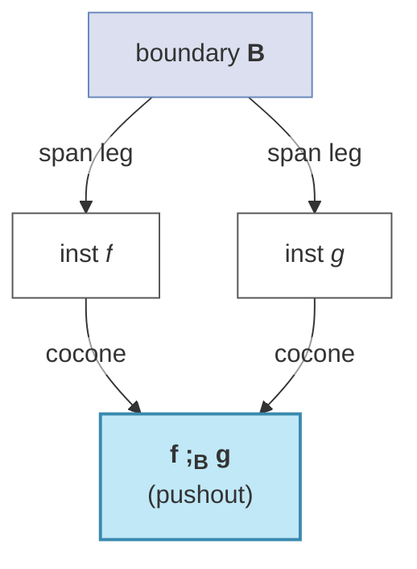

# Graded Colored PROPs: A Categorical Synthesis of St, Br, Acsets, and Algebras

This document gives a single categorical structure — the **`D`-graded colored PROP** — that subsumes the constructions described separately in [theory.md](theory.md) (St, Br, weaves, lifts), [acset.md](acset.md) (the structure/data split), and [prop_ideas.md](prop_ideas.md) (PROP algebras, the Para refinement). The synthesis identified informally in [future_ideas.md](future_ideas.md) — *one object under three names* — is here made precise as one definition with explicit axioms.

The intent is **formalizability, not formalization**. Every definition is stated as data + named laws, in the shape of a Lean `structure` with fields and proof obligations, so that a future Lean development can transcribe it directly and instantiate it twice: once with `D = St`, `C = Br`, and (speculatively) once with `D = Br` for the model-level layer of [future_ideas.md §6.4](future_ideas.md#64-stacking-levels-weaves-over-models-mixture-of-experts-ensembles). No Lean is written here.

Notation: `⊗` is monoidal product, `;` is diagrammatic-order composition (`f ; g` = first `f` then `g`), `I` is the monoidal unit, `Dᵒᵖ` the opposite category. We write `[X, P]` and `[f, P]` for the lift (defined below) to match theory.md, alongside the formal functor name `act`.

---

## Contents

1. [Design Goals](#1-design-goals)
2. [Preliminaries: Colored PROPs](#2-preliminaries-colored-props)
3. [The Central Definition: `D`-Graded Colored PROP](#3-the-central-definition-d-graded-colored-prop)
   - [Data](#31-data)
   - [Axioms](#32-axioms)
   - [Weaves as cartesian-lift data](#33-weaves-as-cartesian-lift-data)
   - [The temporal grading and making `Scan` first-class](#34-the-temporal-grading-and-making-scan-first-class)
4. [Generators, Relations, and the Structural PROP `C♯`](#4-generators-relations-and-the-structural-prop-c)
5. [The Structure/Data Split as a Grothendieck Construction](#5-the-structuredata-split-as-a-grothendieck-construction)
6. [Composition as Pushout](#6-composition-as-pushout)
7. [Algebras: `construct()` and the Para Refinement](#7-algebras-construct-and-the-para-refinement)
8. [Propositions the Synthesis Organizes](#8-propositions-the-synthesis-organizes)
9. [Instantiation](#9-instantiation)
   - [`D = St`, `C = Br`](#91-d--st-c--br)
   - [The speculative third level: `D = Br`](#92-the-speculative-third-level-d--br)
10. [Lean Formalization Notes](#10-lean-formalization-notes)
11. [Relation to Categorical Deep Learning](#11-relation-to-categorical-deep-learning)
12. [Summary](#12-summary)

---

## 1. Design Goals

The structure must satisfy five requirements, one per source-document concern:

| Requirement | Source | Captured by |
| --- | --- | --- |
| Operations are shape-typed wires, freely juxtaposed and permuted | theory.md (Br as colored PROP) | the colored-PROP base (§2) |
| Each wire decomposes into index sub-wires; broadcasting lifts a base op over a loop | theory.md (weaves, lifts) | the **lift action** `⊛` and **shape map** `sh` (§3) |
| Structure (connectivity) separates from data (sizes, weights) | acset.md (Grothendieck) | `C ≅ ∫Dat` (§5) |
| Composition unifies shared boundary | theory.md (autoalignment), acset.md (pushout) | composition-as-pushout (§6) |
| Compiling to a concrete target is a structure-preserving, parameter-carrying functor | prop_ideas.md (algebra, Para) | **algebras** and the Para refinement (§7) |

The unifying observation ([future_ideas.md §2.4](future_ideas.md#24-weaves-are-not-a-br-thing--they-are-the-cartesian-lift-datum-of-a-graded-prop)) is that the weave is not a Br-specific gadget but the **cartesian-lift datum of a grading fibration `C → D`**. Making that precise is the content of §3.

---

## 2. Preliminaries: Colored PROPs

We fix the base notion both `C` and `D` instantiate.

**Definition 2.1 (Colored PROP).** For a set of *colors* `O`, a *colored PROP over `O`* is a symmetric strict monoidal category `P` whose object monoid is the free monoid `O*` (finite lists over `O`) with `⊗` = list concatenation and `I` = the empty list. Morphisms go between lists of colors; the symmetry `σ_{c,d} : [c,d] → [d,c]` exists for all colors and satisfies the symmetric-monoidal axioms.

A colored PROP is **elemental** ([theory.md §Elemental Categories](theory.md#elemental-categories), after Def 6) if global elements separate morphisms: writing `El(X) := P(I, X)` for the set of points of `X`, for all parallel `f, g : X → Y`,

> **(Elem)** `(∀ x ∈ El(X), x ; f = x ; g) ⟹ f = g`.

Equivalently, the family of functors `{(x ; −) : P(X,Y) → P(I,Y)}_{x∈El(X)}` is jointly injective.

**Remark 2.2 (Lean shape).** A colored PROP is a `SymmetricCategory` together with a strict-monoidal identification `Ob P ≃ FreeMonoid O`. The cleanest Lean route is to *take* `Ob P := FreeMonoid O` definitionally and equip the category with a strict symmetric monoidal structure (Mathlib's `MonoidalCategory` + `SymmetricCategory`, with the associator/unitors forced to `Iso.refl` via a strictness hypothesis, or obtained by strictifying `FreeMonoidalCategory (Discrete O)`). `(Elem)` is a plain `∀`-statement over `P(I, X)` — a single `Prop`-valued field.

---

## 3. The Central Definition: `D`-Graded Colored PROP

Fix a colored PROP `D` (the *index PROP*; for pyncd, `D = St`). Its objects are *shapes*, its morphisms *reindexings*.

### 3.1 Data

**Definition 3.1.** A *`D`-graded colored PROP* is a colored PROP `C` over colors `O_C` together with:

1. **Shape map** `sh : O_C → Ob D` — each `C`-color has an underlying shape (a `D`-object, i.e. a list of `D`-colors = its *sub-wires*). It extends to a monoid homomorphism `sh* : Ob C → Ob D` by `sh*([c₁,…,cₙ]) = sh(c₁) ⊗ ⋯ ⊗ sh(cₙ)`.

2. **Lift action** `act : C × Dᵒᵖ ⥤ C`, a functor. Write `X ⊛ P := act(X, P)` on objects, `[f, P] := act(f, id_P)` for the *batch lift* of `f : X → Y` (covariant in `C`), and `[X, η] := act(id_X, η)` for the *reindexing* along `η : P → Q` (so `[X, η] : X ⊛ Q → X ⊛ P`, contravariant in `D`).

3. **Distributivity isos** — natural isomorphisms `δ_{X,Y,P} : (X ⊗ Y) ⊛ P ≅ (X ⊛ P) ⊗ (Y ⊛ P)` and `δ⁰_P : I_C ⊛ P ≅ I_C` (the lift distributes over juxtaposition).

4. **Action coherence isos** — `υ_X : X ⊛ I_D ≅ X` (unit) and `α_{X,P,Q} : (X ⊛ P) ⊛ Q ≅ X ⊛ (Q ⊗ P)` (composition of lifts; the order `Q ⊗ P` makes `⊛` a *right* action of `(D, ⊗, I_D)`).

### 3.2 Axioms

Written as named laws — each becomes one field of the Lean structure.

- **(Sh-⊛)** `sh*(X ⊛ P) = sh*(X) ⊗ P`. *(Lifting by `P` appends `P` to the shape.)*
- **(Sh-⊗)** `sh*` is a monoid homomorphism (already imposed in §3.1).
- **(Act-functor)** `act` is a functor: `[id_X, id_P] = id`, and `act` respects composition in both variables — in particular `[f ; g, P] = [f, P] ; [g, P]` (lift distributes over composition) and `[X, η ; θ] = [X, θ] ; [X, η]` (reindexings compose contravariantly).
- **(Act-unit / Act-assoc)** `υ`, `α` are natural isomorphisms satisfying the triangle and pentagon coherences of a right monoidal action — that is, `C` is a (right) **`D`-actegory**.[^actegory]
- **(Dist-nat / Dist-coh)** `δ`, `δ⁰` are natural and satisfy the interchange coherence with `υ`, `α`, and the symmetry `σ` (the lift is a *strong symmetric monoidal* action in the `C`-variable).
- **(Elem-C)** `C` is elemental (Definition 2.1).
- **(Broadcast-gen)** Let `B ⊆ C` be the wide subcategory of *degree-trivial* morphisms — those `f : X → Y` such that no `ev`-naturality (below) is needed to express them, i.e. `f` is built without `act` over a non-unit `P`. Then **every** `C`-morphism is of the form `[f, P] ; ρ` for some `f ∈ B`, `P ∈ Ob D`, and reindexing `ρ` assembled from `act(id, −)` and the coherence isos. *(`C` is generated by base operations closed under the lift.)*

**Evaluation transformations.** For a point `p : I_D → P` in `D`, define `ev_p := act(−, p) : (− ⊛ P) ⇒ (− ⊛ I_D) ≅ Id_C`, the *slice at `p`*. Because `act` is a functor (Act-functor), each `ev_p` is automatically a **natural transformation**; its naturality square at `f : X → Y` is exactly theory.md's batch-lift law

> **(Eq. 3)** `[f, P] ; (Y ⊛ p) = (X ⊛ p) ; f`.

So Eq. 3 is *built in* by functoriality of `act` — it is not a separate axiom. The genuine content lives in **(Elem-C)**: elements (hence the `ev_p`) jointly separate morphisms, which is what pins down the weave (§3.3).

### 3.3 Weaves as cartesian-lift data

**Definition 3.2 (Weave).** Given a `C`-morphism `g : X → Y`, a **weave** for `g` is a witness of the (Broadcast-gen) factorization

```
g  =  [f, P] ; ρ ,     f ∈ B ,   P ∈ Ob D ,   ρ = reindexing.
```

Per wire (each color of `X`, `Y`), the shape `sh(color) ∈ Ob D` is a list of sub-colors; the factorization partitions them into

- **target** sub-colors — those `f` acts on directly (they appear in `sh` of the base-op's domain/codomain), and
- **tiling** sub-colors — those supplied by the degree `P` through `ρ` (they appear in `P`, not seen by `f`).

The permutation relating the canonical order (targets first, tilings second) to the wire's actual sub-color order is the `Ω_w` of theory.md, recovered from the symmetry `σ`.

**This is precisely the cartesian-lift datum of the grading fibration.** The shape map and lift assemble into a functor exhibiting `C` over `D`; a weave is the choice of how a `C`-morphism's wires sit over their `D`-shapes, with the tiling part the part "pulled back" along the degree. Uniqueness of this datum is Proposition 8.2.

### 3.4 The temporal grading and making `Scan` first-class

`Scan` (theory.md's iterative recurrence) is currently a *bare generator*: Prop 8.6 shows it is **not** a weave, and Prop 8.7 *identifies* it as a catamorphism, but the structure §3.1–3.3 supplies is not enough to make either a definition. Four additions internalize what a fold needs — the index it folds along, the iteration that makes the fold exist, the typing of its output, and the law letting it compose with the lift. (Two further extensions — coupled states and a coalgebraic dual for unbounded generation — are deferred to the roadmap, [future_ideas.md §8](future_ideas.md#8-prioritized-implementation-roadmap), items E–G.)

**Definition 3.3 (Temporal object; directed action).** Distinguish a **temporal object** `L ∈ Ob D` carrying the structure of the augmented simplex `Δ_+` — equivalently a `length` grading by the monoid `(ℕ, +, 0)` — with prefix inclusions `ι_m : [0..m] ↪ [0..N]`. Equip `C` with a **directed action**: restriction natural transformations `act(−, ι_m) : (− ⊛ [0..N]) ⇒ (− ⊛ [0..m])` along the `ι_m`, satisfying the unit and composition laws of an action **but with no point-evaluation** `ev_q` for a single point `q : I → L`. The absence of point-naturality is exactly the obstruction of Prop 8.6; the present restrictions are theory.md's prefix-restriction law, now first-class data rather than a remark.

**Definition 3.4 (Finite iteration).** Require that `C` (and any target actegory `V`, §7) admit **finite iteration of parametric endofunctors**: for a parametric step endofunctor `F` (carrying the per-step inputs as parameters) and a length `N ∈ Ob D`, the `N`-fold iterate and its catamorphism `cata(step)` exist. For fixed `N` this is `N`-fold composition — no fixpoint is needed; a genuine initial algebra / natural-numbers object is required only for *unbounded* length (the corecursion extension, roadmap item G).

**Definition 3.5 (Trace).** The output of a fold is the **state history** (scanl): the object `H ⊗ L_{N+1}` (state tensored with the temporal axis). A coherence relates `cata(step)`-accumulating-the-trace to the restrictions of Definition 3.3 — truncating the trace along `ι_m` agrees with running the `m`-fold. This types `Scan`'s codomain `(*state, N+1)` from the framework rather than declaring it in `ConstructedScan`.

- **(Lift–fold distributivity)** For an ordinary (non-temporal) degree `P` *orthogonal* to `L`, the actegory lift distributes through the fold: `act(Scan, P) ≅ Scan(act(step, P))`. *(theory.md's "`[Scan, P]` for an independent batch axis `P` runs the scan independently per `p`, and Eq. 3 holds over `P`," now an axiom; its consequence is Proposition 8.8.)*

With Definitions 3.3–3.5 and the distributivity law, **`Scan := cata(step)`** is a *definition* over the temporal grading (Prop 8.7): the prefix law is then a corollary of the catamorphism universal property, and `Scan` composes with broadcasting and batching (Prop 8.8) — so it sits in `ThreadedComposed` and admits the `vmap`/batch strategies like any other morphism, despite not being a weave along `L`. What remains open — coupled recurrences, resource-graded strategy selection with fold-fusion, and unbounded corecursion — is roadmap items E–G ([future_ideas.md §8](future_ideas.md#8-prioritized-implementation-roadmap)).

---

## 4. Generators, Relations, and the Structural PROP `C♯`

**Definition 4.1 (Generated graded PROP).** Fix a set `G` of *base generators* — degree-trivial morphisms with declared domain/codomain colors (for Br: `Linear`, `Einops`, `SoftMax`, `Elementwise`, `Embedding`, …). The *free `D`-graded colored PROP on `G`* is the closure of `G` under: PROP composition `;`, monoidal product `⊗`, symmetry `σ`, and the lift action `⊛` / reindexing — modulo only the axioms of §3.2. This is `C♯`, the **structural skeleton**: it carries connectivity and shape *symbols* but no concrete `D`-colors (sizes).

**Definition 4.2 (Architecture PROP).** A set `R` of *relations* — equations between composite `C♯`-morphisms (definitional expansions, residual-topology equations, weight-sharing identities, fusion equalities; [prop_ideas.md §Generators-and-Relations](prop_ideas.md#1-generators-and-relations-presentations-of-architectures)) — presents the quotient `C♯ / R =: P_arch`. Two `C♯`-morphisms denote the same architecture iff equal in `P_arch`.

**Lean shape.** `C♯` is the free strict symmetric monoidal category on the `G`-quiver *with the lift action freely adjoined* — i.e. `FreeMonoidalCategory` over `Discrete O_C` extended by `act`-generators, strictified. `P_arch` is its quotient by the congruence generated by `R`. Mathlib's `CategoryTheory.Quotient` handles the congruence.

---

## 5. The Structure/Data Split as a Grothendieck Construction

The `D`-colors carry numeric content (sizes). Strip it to get the structural index PROP `D♯` (colors = formal size-symbols, morphisms = symbolic reindexings). Then `C♯` is `D♯`-graded.

**Definition 5.1 (Data functor).** A *data functor* is a functor `Dat : C♯ → Set` (more precisely into a category of size-assignments valued in a fixed semiring `R` of `Numeric` expressions) sending each structural object to its set of admissible `D`-color assignments, acting trivially on morphisms (data is unconstrained by connectivity; [acset.md §Grothendieck Construction](acset.md#the-grothendieck-construction)).

**Definition 5.2 (Instance / `∫Dat`).** The **Grothendieck construction** `∫Dat` has objects `(c, d)` with `c ∈ C♯` and `d ∈ Dat(c)`, and morphisms the `C♯`-morphisms with no compatibility condition on data. Then

> **`C ≅ ∫Dat`**

recovers the fully-sized graded PROP. An **acset instance** (acset.md's `SBrInstance`) is a finite presentation of a single `∫Dat`-morphism: its `C♯`-part is the connectivity, its `Dat`-part the `axis_sizes`/coefficients/datatypes. Serialization (CSV) writes the two parts to separate tables.

**Lean shape.** Mathlib has `CategoryTheory.Grothendieck` for the Grothendieck construction of a functor into `Cat`. With `Dat` valued in (discrete categories of) size-assignments, `∫Dat` is a direct instance. The iso `C ≅ ∫Dat` is the theorem to discharge per instantiation; it is *definitional* if `C` is *built* as `∫Dat` (recommended).

---

## 6. Composition as Pushout

Autoalignment (`@`, `Context`) builds a composite from separately-constructed pieces by unifying boundary colors. Formally:

**Definition 6.1 (Open morphisms).** Work in the category `Inst(C♯)` of finite acset presentations (instances) and their morphisms (natural transformations of presentations; [acset.md §Instances as Functors](acset.md#instances-as-functors-phi_a-at-the-instance-category-level)). Composition of two instances sharing a boundary is the **pushout**



identifying the shared boundary colors `B` (the cup). The `Context` union-find computes the pushout's coequalizer on `UID`s; the canonical class representative is the universal cocone vertex ([future_ideas.md §2.1](future_ideas.md#21-autoalignment-is-the-pushout-is-the-cup-morphism)).

**Lean shape.** `Inst(C♯)` is a finitely-cocomplete category; composition-as-pushout is `CategoryTheory.Limits.pushout`. Associativity of `;` follows from the pasting lemma for pushouts (`pushout` composition coherence) — no bespoke proof over `Context` is needed ([future_ideas.md §2.1](future_ideas.md#21-autoalignment-is-the-pushout-is-the-cup-morphism), consequence 1).

---

## 7. Algebras: `construct()` and the Para Refinement

Compilation interprets the abstract structure in a concrete target.

**Definition 7.1 (Target `D`-actegory).** A *target* is a symmetric monoidal category `V` that is itself a right `D`-actegory: a functor `⊛_V : V × Dᵒᵖ ⥤ V` with the same coherences as §3. For pyncd, `V` = finite-dimensional real vector spaces / PyTorch tensors, with `T ⊛_V P` appending dimensions of the sizes named by `P`.

**Definition 7.2 (Algebra).** An *algebra* of a `D`-graded colored PROP `C` in a target `V` is a **strong symmetric monoidal functor** `F : C → V` that is **`D`-equivariant**: natural isomorphisms `F(X ⊛ P) ≅ F(X) ⊛_V P` commuting with `υ, α, δ` and preserving `ev_p`. This is `construct()`. A **morphism of algebras** `F ⇒ F'` is a monoidal natural transformation.

- **Weight tying** is a morphism of algebras collapsing two parameter objects via the diagonal ([prop_ideas.md §Weight tying](prop_ideas.md#weight-tying-static-verification-at-construct-time)).
- **Equivariance** under a group `g` acting on `D`-colors is the condition `φ_g ∘ F(θ) = F(θ) ∘ φ_g`; it holds automatically for tiling axes (the batch-equivariance theorem, Proposition 8.4) and fails exactly where a wire carries a non-`g`-invariant predicate ([prop_ideas.md §Equivariance breaking](prop_ideas.md#equivariance-breaking-static-detection-from-wire-colors)).

**Definition 7.3 (Para refinement, 2-categorically).** Following CDL (§11), take `Para(V)` as a **2-category** (Gavranović et al.): 0-cells are objects, 1-cells are parametric maps `(P, f : P ⊗ A → B)`, and 2-cells `(P, f) ⇒ (P', f')` are **reparameterizations** — maps `r : P → P'` with `f = (r ⊗ A) ; f'`. Then `construct()` is a **2-functor** `Para(C) → Para(V)`, and three notions that otherwise live in separate vocabularies collapse into one — each is a 2-cell (reparameterization) in `Para(V)`:

- **Weight tying** ([future_ideas.md §5.2](future_ideas.md#52-weight-tying-comonoid-para-morphism-acset-parameter-group)) — the 2-cell collapsing two parameter objects along the diagonal `Δ : P → P ⊗ P`.
- **Compiler-pass correctness** — a pass is correct iff it is a 2-cell: it transforms the forward map while fixing the parameter object up to reparameterization. This makes precise future_ideas.md's slogan "a pass is correct iff it is a `Para` natural transformation."
- **`Scan`-strategy selection** ([future_ideas.md §3.1](future_ideas.md#31-construct-is-a-para-functor-over-the-grothendieck-integral); eager / checkpoint / vmap) — a 2-cell exchanging stored-activation parameter for recomputation cost.

A trained model is a section of the Para fibration over `∫Dat`; gradient descent is a vector field on the fiber.

**Lean shape.** `F` is a `MonoidalFunctor` (Mathlib) plus a `D`-equivariance natural-iso field and its coherences; algebra morphisms are `MonoidalNatTrans`. The 2-categorical `Para` belongs at the *specification* level (Def 7.3); for a *formalization*, the full bicategory is heavy, so keep the lightweight encoding — `Para(V)` as a 1-category with hom `Σ (P : V), (P ⊗ A ⟶ B)` plus an explicit reparameterization relation standing in for the 2-cells — and treat the "2-cell" statements above as that relation. Note the gap explicitly rather than paying for a bicategory only the spec uses.

---

## 8. Propositions the Synthesis Organizes

These are the theorems a Lean development would prove *once*, at the graded-PROP level, and inherit at every instantiation. Stated as claims, not proved here.

**Proposition 8.1 (Lift functoriality / distribution).** `[f ; g, P] = [f, P] ; [g, P]` and `[f ⊗ g, P] = [f, P] ⊗ [g, P]`. *(Immediate from Act-functor + Dist; it is theory.md's "lifting distributes over composition and products.")*

**Proposition 8.2 (Weave uniqueness).** Under (Elem-C) and (Broadcast-gen), the weave of any `C`-morphism (Definition 3.2) is unique up to the canonical coherence isos. *(Elements separate, so the degree `P` and the target/tiling partition are determined.)* This is what makes `Weave` a well-defined datum rather than a choice.

**Proposition 8.3 (Grothendieck splitting).** `C ≅ ∫Dat` (§5), with the structural skeleton `C♯` the base and the size-data the fiber. *(The acset structure/data split is literally the Grothendieck construction.)*

**Proposition 8.4 (Equivariance, via a symmetry monad).** Fix a *symmetry monad* `T` on `D` (or on its colors). An algebra `F` is **`T`-equivariant** iff it lifts to the Eilenberg–Moore category of `T` — i.e. `F` is a morphism of `T`-algebras. This is the CDL lens (§11): equivariance = morphism of algebras for the symmetry monad, recovering geometric deep learning. Instances:

- **Axis permutation (the batch-equivariance theorem).** When `T` is the free symmetric-group action, `F` commutes with permutations of tiling sub-colors — tiling axes are never seen by base operations, so equivariance in the `⊛`-variable forces it. This is prop_ideas.md's batch-equivariance theorem, now a corollary.
- **Node permutation / translation.** The free-group monad on a node axis gives GNN permutation-equivariance; a translation monad gives convolutional equivariance — domains the bare axis-permutation statement could not express.
- **Causal order.** The **order monad** (order-preserving endomaps of a sequence axis) gives the *causal* symmetry: a masked operator (`MaskedSoftMax`/`MaskedNormalize`) is `T`-equivariant for this `T` even though it breaks the symmetric-group symmetry. This is the positive reading of the masked-wire predicate `i ≤ j` ([future_ideas.md §5.3](future_ideas.md#53-equivariance-from-stridecategory-representation-theory), [§5.4](future_ideas.md#54-masked-operators-and-output-wire-predicates)) — *which* symmetry a layer respects is *which monad it is an algebra for*.

**Proposition 8.5 (Composition associativity).** Composition in `Inst(C♯)` is associative and unital. *(Pasting lemma for pushouts, §6.)*

**Proposition 8.6 (The `Scan` obstruction).** Let `L ∈ Ob D` be an axis along which a candidate morphism `s` has cross-position dependency (output at position `ℓ` depends on positions `< ℓ`). Then `s` is **not** in the image of `act(−, L)`: the evaluation `ev_q` at a single point `q : I → L` fails to be natural for `s` (Eq. 3 fails), so `s` admits no weave over `L`. Equivalently, `s` lies in the image only of a *directed* sub-action indexed by order-preserving injections `ι_m : [0..m] ↪ [0..L]` (theory.md's prefix-restriction law), not by points. *(This formalizes [future_ideas.md §2.4](future_ideas.md#24-weaves-are-not-a-br-thing--they-are-the-cartesian-lift-datum-of-a-graded-prop) consequence 2: `Scan` — and any cumulative/prefix/recurrent operator — must be a primitive generator, not a lifted base op, and the precise reason is failure of point-naturality. It also tells the implementer to add such operators as generators in `G`, never via `⊛`.)*

**Proposition 8.7 (`Scan` as a catamorphism — the positive companion to 8.6).** The morphism `Scan` that 8.6 excludes from the lift has a positive home: it is the **catamorphism (fold)** accumulating the state trace (scanl) for the *parametric step endofunctor* `F` — carrying the per-step inputs as parameters — whose algebra structure map is the step morphism `step : F(H) → H`. Equivalently, `Scan` is a (lax) algebra for the free parametric monad on `F`, truncated at length `N` — the CDL account of recurrence (§11). Three consequences, none available from the bare generator of 8.6:

- **The prefix-restriction law is a corollary, not an axiom.** theory.md's prefix law (`Scan_N` restricted to the first `m` steps equals `Scan_m`) follows from the catamorphism universal property `cata(step) ∘ in = step ∘ F(cata(step))` and its uniqueness; it need not be posited separately.
- **It supplies the morphism notion.** Two scans are equal / composable / fuseable exactly when related by an algebra homomorphism — a notion the bare generator does not carry.
- **It explains the affine fast path.** The `ScanAffine` associative-scan optimization (tensorLogicNCDIntegration.md §6.4) is precisely the case where the step algebra factors through a **monoid** (affine maps under composition): the fold is then a monoid homomorphism, computable by parallel prefix in `O(log N)`. The affine condition is the categorical *precondition* for the optimization, not a pattern-match.

*(8.6 says `Scan` is not a weave; 8.7 says what it is instead. The dual — `Scan` as an unfold / coalgebra for streaming generation — is the lens of arXiv:2603.03227.)*

**Proposition 8.8 (`Scan` batches).** Under the lift–fold distributivity law (§3.4), `Scan` is closed under the actegory action by any degree `P` *orthogonal* to its temporal axis `L`: `act(Scan, P) ≅ Scan(act(step, P))`. *(So `Scan` participates in `ThreadedComposed` routing and the `vmap`/batch strategies despite not being a weave — 8.6's obstruction is only along `L`, never along orthogonal axes. This is what lets the compiler treat a batched recurrence as one fold run independently per batch coordinate.)*

---

## 9. Instantiation

### 9.1 `D = St`, `C = Br`

| Synthesis primitive (§3–7) | pyncd realization | Reference |
| --- | --- | --- |
| Index PROP `D` | `St` — colors = axis lengths (`ℕ`/`Numeric`), morphisms = `StrideMorphism` (affine) | [theory.md §St](theory.md#the-axis-stride-category-st) |
| Colored PROP `C` | `Br` — colors = `Array[Datatype, shape]`, morphisms = `Broadcasted`/`Composed`/… | [theory.md §Br](theory.md#the-array-broadcasted-category-br) |
| Color set `O_C` | `(Datatype, St-object)` pairs | [theory.md §Objects in Br](theory.md#objects-in-br) |
| Shape map `sh` | `sh([a, A]) = A` (the array's shape) | — |
| Lift action `act` / `[X, P]`, `[f, P]` | batch lift (Def 11) + object-morphism lift / reindexing (Def 10) + broadcasted-stride lift | [theory.md §Lift Operations](theory.md#lift-operations) |
| Distributivity `δ` | `[X ⊗ Y, P] = [X,P] ⊗ [Y,P]` | [theory.md §Batch Lift](theory.md#batch-lift-f-p-def-11) |
| `ev_p` / Eq. 3 | `[f,P] ; [Y,p] = [X,p] ; f` (the batch-lift defining property) | [theory.md Eq. 3](theory.md#batch-lift-f-p-def-11) |
| Weave (Def 3.2) | `Weave._shape`: each slot a concrete `Axis` (target) or `WeaveMode.TILED` (tiling) | [theory.md §Weaves](theory.md#weaves) |
| `(Elem-C)` | Br is elemental | [theory.md §Elemental Categories](theory.md#elemental-categories) |
| Base generators `G` | `Linear`, `Einops`, `SoftMax`, `MaskedSoftMax`, `Elementwise`, `Normalize`, `MaskedNormalize`, `Embedding`, `AdditionOp` | data_structure/Operators.py |
| `(Broadcast-gen)` | every Br morphism is a broadcasted operation (Def 13) | [theory.md §Broadcasting](theory.md#broadcasting) |
| `C♯` (structural) | `bc_signature()` pre-size; `SBrInstance` C-set part | [acset.md §Br schema](acset.md#the-schema-mathcals_br) |
| Data functor `Dat` | `axis_sizes`, coefficients, `datatype_tag`, `max_value` | [acset.md §Br schema](acset.md#the-schema-mathcals_br) |
| `∫Dat` instance | a fully-sized `Broadcasted`/`Composed` term; `SBrInstance` | [acset.md §TensorEquation as Proto-Acset](acset.md#tensorequation-as-a-proto-acset) |
| Composition as pushout | `@` / `Context` UID unification | [theory.md §Autoalignment](theory.md#autoalignment) |
| Architecture relations `R` | residual topology, weight sharing, fusion equalities | [prop_ideas.md §Generators-and-Relations](prop_ideas.md#1-generators-and-relations-presentations-of-architectures) |
| Target `D`-actegory `V` | PyTorch tensors; `⊛_V` appends dimensions | torch_compile/ |
| Algebra `F` | `ConstructedModule.construct()` | [prop_ideas.md §Direct Identification](prop_ideas.md#the-direct-identification) |
| Para refinement | `Multilinear`/`Linear` weight tensors; `construct() : Para(Br) → Para(PyTorch)` | [prop_ideas.md §Para Refinement](prop_ideas.md#the-para-refinement) |
| Proposition 8.6 obstruction | `Scan` is a separate construction rule, not a `Broadcasted` | [theory.md §Scan note](theory.md#batch-lift-f-p-def-11) |

Every row is a definitional unfolding of §3–7 with `D := St`, `C := Br`. The `Scan` extension is exactly the generator demanded by Proposition 8.6.

### 9.2 The speculative third level: `D = Br`

Taking `D := Br` (colors = whole arrays-with-operators), a top-level graded PROP `C_mod` has *models* as wires; the lift `⊛` tiles a base computation over a family of models. This is the mixture-of-experts / ensemble level ([future_ideas.md §6.4](future_ideas.md#64-stacking-levels-weaves-over-models-mixture-of-experts-ensembles)). The open question is precisely Proposition 8.6 applied here: static (fixed) routing satisfies (Eq. 3) and is a genuine weave; data-dependent (learned top-k) routing may fail point-naturality and then — by Proposition 8.6 — must be a dedicated generator, the way `Scan` is. The synthesis turns "does MoE generalize the weave?" into the decidable check "does the routing lift satisfy Eq. 3?".

---

## 10. Lean Formalization Notes

A future Lean development can proceed in this order; Mathlib coverage noted.

1. **Colored PROP** (`Def 2.1`). Define `ColoredPROP (O : Type)` as a `SymmetricCategory` with `Ob = FreeMonoid O` and a strictness hypothesis. *Available:* `CategoryTheory.MonoidalCategory`, `SymmetricCategory`, `FreeMonoidalCategory`, `Mon_`/`FreeMonoid`. *To build:* the strict-PROP packaging (strictify `FreeMonoidalCategory (Discrete O)`).

2. **`D`-graded colored PROP** (`Def 3.1`, `§3.2`). A `structure` extending `ColoredPROP` with fields: `sh`, `act : (C × Dᵒᵖ) ⥤ C`, the iso fields `δ, δ⁰, υ, α`, and `Prop`-fields for (Sh-⊛), the action/dist coherences, (Elem-C), (Broadcast-gen). *Available:* functors, natural isos, monoidal-action scaffolding can be hand-rolled (Mathlib's `Action`/actegory support is partial). *To build:* the right-actegory coherence bundle — straightforward functor+nat-iso algebra.

3. **`ev_p` and Eq. 3.** Derived, not axiomatic: `ev_p := act.map (𝟙, p)` post-composed with `υ`; naturality is `Functor.map_comp`. *Free from Mathlib.*

4. **Weave + uniqueness** (`Def 3.2`, `Prop 8.2`). A `Weave g` is a `Σ` of `(f, P, ρ)` with a factorization proof; uniqueness is a theorem from (Elem-C). *Standard.*

5. **`C♯`, `P_arch`** (`§4`). Free graded PROP on a generator quiver, then `CategoryTheory.Quotient` by `R`. *Available:* `FreeMonoidalCategory`, `CategoryTheory.Quotient`.

6. **Grothendieck splitting** (`§5`, `Prop 8.3`). Use `CategoryTheory.Grothendieck` on `Dat`. If `C` is *defined* as `∫Dat`, the iso is `Iso.refl`. *Available.*

7. **Composition as pushout** (`§6`, `Prop 8.5`). `Inst(C♯)` with `CategoryTheory.Limits.pushout`; associativity from pasting. *Available* (pushout API, pasting lemmas).

8. **Algebras + Para** (`§7`, `Prop 8.4`). `F : MonoidalFunctor C V` + a `D`-equivariance iso field; algebra morphisms `MonoidalNatTrans`. Para as a lightweight category of parameterized 1-cells. *Available:* `MonoidalFunctor`, `MonoidalNatTrans`; Para hand-rolled.

9. **The `Scan` obstruction** (`Prop 8.6`). State as: `¬ ∃ (f ∈ B) (factorization), s = [f, L]`, proved by exhibiting a point `q` and morphisms violating Eq. 3. *Standard once the action is defined.*

**Strictness strategy.** The single real friction is strict monoidal structure. Recommended: develop over `FreeMonoidalCategory` and strictify once (`MonoidalCategory.strictify`-style), so all `α/λ/ρ` are `Iso.refl` downstream and the PROP equations hold definitionally.

**Instantiation strategy.** Define `St` and `Br` as concrete `ColoredPROP`s, then provide the `GradedPROP St Br` instance by supplying `sh`, `act`, and discharging the `Prop`-fields. Because every §3–7 construction is generic, all of §8's propositions transfer to `Br` with no Br-specific proof, and a later `GradedPROP Br C_mod` instance (the MoE level) reuses the same propositions.

---

## 11. Relation to Categorical Deep Learning

The closest external framework is the **Categorical Deep Learning** (CDL) programme of Gavranović et al. (arXiv:2402.15332), which proposes the *"universal algebra of monads valued in a 2-category of parametric maps"* as a single theory of all architectures. Both CDL and the present framework are **functorial-semantics** accounts — *architecture = algebraic theory, model = structure-preserving map* — and both make **Para** the carrier of learnability. They differ in which fragment of categorical algebra they use and in what each additionally formalizes.

**Shared.**

- *Functorial semantics.* CDL: a model is a (lax) algebra; here: a model is a **PROP-algebra** (a strong symmetric monoidal functor `F : C → V`, §7). Same Lawvere-style stance — an architecture is a theory, a trained network is an algebra of it.
- *Para for learning.* CDL works in the 2-category `Para`; parametric maps and weight tying are 2-categorical data. The functor `construct() : Para(Br) → Para(PyTorch)` and "training = a section of the Para fibration" (§7) use the same construction, and the weight-tying-as-diagonal of [future_ideas.md §5.2](future_ideas.md#52-weight-tying-comonoid-para-morphism-acset-parameter-group) is CDL's 2-categorical weight tying.

**What CDL does in greater generality (this framework specializes).**

- *Equivariance.* CDL models equivariance as **monad-algebra homomorphisms** and thereby "captures the entirety of Geometric Deep Learning" — far broader than the axis-permutation equivariance here, which is a corollary of algebra-morphism commutation (Prop 8.4; [future_ideas.md §5.3](future_ideas.md#53-equivariance-from-stridecategory-representation-theory)). CDL is the general theory; this is one computable special case.
- *Recursion.* CDL derives recurrent and recursive networks as **(lax) algebras for parametric monads generated by parametric endofunctors** — the functional-programming fold view — with a coalgebraic companion in the follow-up arXiv:2603.03227. This framework handles the same phenomenon operationally with the `Scan` generator, and Prop 8.6 explains *why* `Scan` cannot be a weave (it fails the lift's point-naturality, Eq. 3). The two are compatible: `Scan` is the initial-algebra fold made concrete, and Prop 8.6 is the operational shadow of "recursion is an algebra, not a (broadcast) lift."

**What this framework adds (CDL does not address).**

- *The index grading / actegory lift (St→Br, weaves).* CDL has no shape category acting by broadcasting — no degree, tiling/target weaves, or reindexings. This is the entire `D`-graded-colored-PROP content (§3), driven by tensor *execution* (GPU tiling), a concern orthogonal to CDL's constraint-specification focus.
- *The acset structure/data split and compilation.* `C ≅ ∫Dat`, schema morphisms, shape inference as a Kan extension, and serialization (§5) are the representational and compilation machinery CDL leaves open.
- *A symmetric-monoidal (non-cartesian) base.* The colored PROP here is resource-sensitive — no free copy or discard — native to linear/tensor contraction. CDL's monad-algebra equivariance is most naturally developed over a Cartesian base and would need its monoidal generalization to sit directly on the tensor fragment.

**Net.** The `D`-graded colored PROP is a *specialization-and-extension* of the CDL philosophy: it adopts CDL's architecture-as-algebraic-theory stance and its `Para` carrier, specialized to the symmetric-monoidal/PROP fragment appropriate for tensors, and extends it with the grading/actegory lift and the acset structure/data split — the execution-and-representation layers a working tensor compiler requires. Conversely, CDL's monad-(co)algebra vocabulary is the natural setting in which to *generalize* this framework's equivariance and `Scan`: re-expressing `construct()`-domain operators as monad-algebras (and `Scan` as a lax algebra for a parametric monad, or a coalgebra à la arXiv:2603.03227) is a plausible unification direction.

---

## 12. Summary

The pieces scattered across theory.md, acset.md, and prop_ideas.md are one structure: a **`D`-graded colored PROP** — a colored PROP `C` over an index PROP `D`, equipped with a shape map `sh : O_C → Ob D`, a lift action `act : C × Dᵒᵖ ⥤ C` (batch lift + reindexing), and the elemental separation axiom. In this language:

- **Weaves** are the cartesian-lift data of the grading (§3.3); their well-definedness is a theorem (Prop 8.2), not an assumption.
- **Lifts** are the action `act`; their distribution laws are functoriality (Prop 8.1).
- **The structure/data split** is the Grothendieck construction `C ≅ ∫Dat` (§5, Prop 8.3).
- **Autoalignment** is pushout in the instance category (§6, Prop 8.5).
- **`construct()`** is a `D`-equivariant strong symmetric monoidal algebra into a target actegory; the **Para refinement** carries the weights (§7); batch equivariance is a corollary (Prop 8.4).
- **The `Scan`/MoE obstruction** is the failure of point-naturality (Eq. 3) — a decidable test for "weave vs. dedicated generator" (Prop 8.6).

`St → Br` is one instantiation (`D = St`, `C = Br`, §9.1); the model level (`D = Br`, §9.2) is another, awaiting only the Eq. 3 check for data-dependent routing. The definition is stated as data + named laws throughout, so a Lean development transcribes it as a `structure` and proves §8 once, at the graded-PROP level, inheriting it at every instantiation.

---

## References

- [theory.md](theory.md) — St, Br, weaves, lifts, autoalignment (Abbott & Zardini, arXiv:2604.07242).
- [acset.md](acset.md) — the structure/data split, Grothendieck construction, schema morphisms (Patterson, Lynch, Fairbanks, arXiv:2106.04703).
- [prop_ideas.md](prop_ideas.md) — colored PROPs, internal language, the Para construction.
- [future_ideas.md](future_ideas.md) — the informal synthesis this document formalizes; §2.4 (weaves as cartesian-lift data) and §6.4 (the third level).
- Mac Lane, *Categories for the Working Mathematician*, Ch. VII (monoidal categories), XI (symmetry).
- Fong & Spivak, *Seven Sketches in Compositionality*, Ch. 5 (PROPs and presentations).
- Capucci & Gavranović, "Actegories for the Working Amthematician", arXiv:2203.16351 (actegories / monoidal actions).
- Gavranović, Lessard, Dudzik, von Glehn, Araújo, Veličković, "Position: Categorical Deep Learning is an Algebraic Theory of All Architectures", arXiv:2402.15332 (the Para construction; monad-algebra equivariance; recursion as lax algebras for parametric monads). See §11.
- "Coalgebras for Categorical Deep Learning: Representability …", arXiv:2603.03227 (the coalgebraic companion to the above; recursion/unfolding as coalgebras).
- Mathlib4 — `CategoryTheory.Monoidal`, `CategoryTheory.Grothendieck`, `CategoryTheory.Limits`, `CategoryTheory.FreeMonoidalCategory`, `CategoryTheory.Quotient`.

[^actegory]: An **actegory** ("action" + "category") is a category acted on by a *monoidal* category — the categorification of a monoid acting on a set, or a module over a ring. Formally, for a monoidal category `(M, ⊗, I)`, a *(left) `M`-actegory* is a category `C` with an action functor `⊙ : M × C → C`, a unitor iso `λ_c : I ⊙ c ≅ c`, and a multiplicator iso `α_{m,n,c} : (m ⊗ n) ⊙ c ≅ m ⊙ (n ⊙ c)`, obeying pentagon and triangle coherences that mirror the monoidal axioms; a *right* actegory uses `C × M → C`, and "*strong*" means these maps are isomorphisms supplied as data. The ladder of examples is one categorical level apart at each rung: a monoid acts on a set, a ring acts on a module, a monoidal category acts on a category — each obeying the same `I · x ≅ x` and `(m ⊗ n) · x ≅ m · (n · x)` laws, with equalities promoted to coherent isomorphisms. Equivalently (and most Lean-friendly), an `M`-actegory is a *strong monoidal functor* `M → End(C)` into the endofunctor category `([C,C], ∘, Id)` — "a functor that is monoidal." In this document the lift makes `C` (e.g. `Br`) a right `D`-actegory: a shape `P ∈ D` acts by the batch lift `X ⊛ P = [X, P]` ("run batched over `P`"), and the two coherence isos are exactly theory.md's lift laws — `υ : X ⊛ I_D ≅ X` (lifting by the unit shape does nothing) and `α : (X ⊛ P) ⊛ Q ≅ X ⊛ (Q ⊗ P)` ("lifting twice equals lifting once by the combined shape"). The compile target `V` (PyTorch tensors) is likewise a `D`-actegory — `P` acts by appending dimensions — so `construct()` (§7) is an equivariant functor *between* actegories, which is why batch equivariance (Prop 8.4) is automatic. Naming the lift an actegory action bundles "lifting distributes over composition and products" and "lifting twice = once by the combined shape" into one off-the-shelf concept, so its laws — and a future Lean proof — come from existing theory rather than being re-derived. See Capucci & Gavranović, "Actegories for the Working Amthematician" (arXiv:2203.16351).
