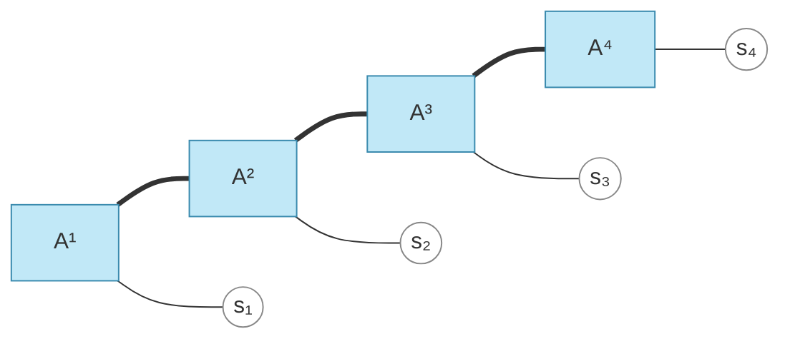

# Tensor Networks for Quantum Systems

*Can Tensor Logic and the broadcasted category **Br** describe the tensor networks physicists use to approximate quantum states? Largely yes — and along the way the framework's own structure/algebra split, and the equivariance results of [equivariance_unification.md](equivariance_unification.md), turn out to be exactly the right tools. This note lays out what transfers, the one deep connection, the natural quantum extension, and the genuine boundary.*

The companion documents are [theory.md](theory.md) (St, Br, weaves, elements), [graded_prop.md](graded_prop.md) (the `D`-graded colored PROP, the structure/algebra split), [future_ideas.md](future_ideas.md) (the index menu `D`, §6.5), [equivariance_unification.md](equivariance_unification.md) (symmetry as a grading), and [prop_ideas.md](prop_ideas.md) (PROP algebras; the ZX / Interacting-Hopf frontier).

---

## Contents

- [1. The question, and the verdict](#1-the-question-and-the-verdict)
- [2. What a tensor network is](#2-what-a-tensor-network-is)
- [3. The contraction layer: a tensor network *is* a Br morphism](#3-the-contraction-layer-a-tensor-network-is-a-br-morphism)
- [4. Structure vs algebra: where "quantum" actually enters](#4-structure-vs-algebra-where-quantum-actually-enters)
- [5. Symmetric tensor networks = the `Rep(G)` grading](#5-symmetric-tensor-networks--the-repg-grading)
- [6. The boundary: contraction is in, decomposition is out](#6-the-boundary-contraction-is-in-decomposition-is-out)
- [7. Speculative hooks](#7-speculative-hooks)
- [8. What it would take](#8-what-it-would-take)
- [9. Relation to categorical quantum mechanics](#9-relation-to-categorical-quantum-mechanics)
- [10. Summary](#10-summary)
- [References](#references)

---

## 1. The question, and the verdict

[future_ideas.md](future_ideas.md) reads the framework through machine learning. But a tensor network is *purer* tensor algebra than a neural net: it is multilinear contraction with **no** nonlinearities, which is exactly what **Br** (via `Einops`) is built to express. So tensor networks exercise the cleanest part of the framework, and three things hold:

1. **The contraction layer transfers verbatim.** A tensor-network *ansatz* (MPS, PEPS, TTN, MERA) is a `Composed`/`Einops` morphism in Br; bonds are contracted (target) axes, physical legs are retained (degree) axes, bond dimension `χ` is the axis size in St, the network topology is the acset structure and the bond dimensions are its data, and contraction-order optimization is the framework's fusion + `opt_einsum`. (§3)
2. **Symmetric (charge-conserving) tensor networks *are* the `Rep(G)` grading** of [future_ideas.md Appendix A.2](future_ideas.md#a2-d--group-bg-base-repg-fibers) — charge sectors are irreps, charge-conserving tensors are intertwiners, fusion is Clebsch–Gordan, and the relevant groups (`U(1)`, `SU(2)`, `SU(N)`) are compact, so the compact-group theorem [equivariance_unification.md §5.3 / Prop 9](equivariance_unification.md#53-continuous-g-compact-closable-vs-non-compact-open) applies directly. (§5)
3. **"Quantum" is a target swap, not a new framework.** The structural layers are datatype-agnostic; making them *quantum* means evaluating in a complex Hilbert target with a **dagger** (adjoints/unitarity) — i.e. a dagger-compact closed category, the home of categorical quantum mechanics and the ZX-calculus. (§4, §9)

The honest boundary: Br describes the **network and its contraction**, not the **algorithms that manipulate it** — SVD/QR, canonical forms, truncation to bond dimension `χ`, DMRG/TEBD. Those are non-multilinear matrix factorizations, outside the contraction core, exactly as nonlinearities are in the ML reading. The *approximation* — the entire physical payoff of tensor networks — lives in that boundary. (§6)

---

## 2. What a tensor network is

A quantum state of `N` particles lives in a space of dimension `dᴺ` — exponential, hence intractable to store directly. A **tensor network** represents the amplitude tensor `ψ(s₁,…,s_N)` as a contraction of many small tensors over auxiliary **bond** (virtual) indices, with the **physical** indices `sᵢ` left open. The **bond dimension** `χ` (the size of the bond indices) controls how much entanglement the ansatz can carry; for states obeying an *area law* (gapped 1D systems, say) a modest `χ` already gives an excellent approximation, which is why the representation is efficient.

The standard families:

- **MPS** (Matrix Product State / DMRG): a 1D chain. `ψ(s₁…s_N) = Σ A^{s₁}_{a₀a₁} A^{s₂}_{a₁a₂} ⋯ A^{s_N}_{a_{N-1}a_N}` — each site carries one physical leg and two bonds.
- **PEPS** (Projected Entangled Pair States): a 2D lattice; each site tensor has a physical leg and four bonds. Exact contraction is `#P`-hard in general — the cost question is central.
- **TTN** (Tree Tensor Networks): a tree of tensors.
- **MERA** (Multi-scale Entanglement Renormalization Ansatz): layers of *disentanglers* and *isometries* organized by length scale, implementing a real-space renormalization-group flow; captures critical systems (logarithmic violations of the area law).

*An MPS: tensor nodes `Aⁱ`, horizontal **bonds** (`===`, dimension `χ`, contracted), dangling **physical** legs `sᵢ` (open). These node-and-leg pictures are **Penrose / tensor-network diagrams** — string diagrams of a symmetric monoidal category, exactly the calculus of Br.*

Computations are themselves contractions: the norm `⟨ψ|ψ⟩`, an expectation value `⟨ψ|O|ψ⟩`, and the simulation of a quantum circuit (contract the network of its gates) are all tensor-network contractions evaluating to a number or a reduced tensor.

---

## 3. The contraction layer: a tensor network *is* a Br morphism

Every structural ingredient of a tensor network has a direct counterpart in [theory.md](theory.md)'s framework, and the match is tighter than for neural nets because there are no nonlinearities to factor out.

| Tensor-network notion | pyncd / Br counterpart |
| --- | --- |
| a tensor (site tensor, gate) | an array `[a, A]`, an object of [Br](theory.md#the-array-broadcasted-category-br) |
| a **bond / virtual** index (contracted) | a **target** axis in the weave — summed over by `Einops` |
| a **physical / open** leg (survives) | a **degree** axis — `WeaveMode.TILED`, in `dom`/`cod` |
| bond dimension `χ` (and physical `d`) | the axis size in [St](theory.md#the-axis-stride-category-st) (a `Numeric`) |
| the network (which tensors share which bonds) | the **structure** `C♯` — the acset C-set part; bond/physical incidence |
| the bond/physical **dimensions** | the **data** `∫Dat` — `axis_sizes` |
| contracting the whole network | a `Composed` of `Einops` morphisms; one big einsum |
| choosing a **contraction order** | the framework's operator **fusion** + `opt_einsum` path (a roadmap item) |
| Penrose diagrams | string diagrams of the (symmetric monoidal) PROP Br |

So an MPS is literally `tl.Psi[s₁,…,s_N] = tl.A1[s₁,a₁] · tl.A2[a₁,s₂,a₂] · … · tl.AN[a_{N-1},s_N]` — a Tensor-Logic program whose `bc_signature()` is a `Composed` chain of `Einops` contractions, with the `aᵢ` contracted (target) and the `sᵢ` retained (degree). PEPS, TTN, and MERA are the same with richer incidence.

**States and effects are elements and co-elements.** theory.md makes Br an *elemental* category, with elements `⟨x| : 𝟏 → X` drawn as left-pointing pentagons and co-elements `|x⟩ : X → 𝟏` as right-pointing pentagons ([§Elemental Categories](theory.md#elemental-categories)). A quantum **state** `|ψ⟩` is exactly an element `𝟏 → [ℂ, A]` (an array with all legs open is a vector); a **bra/effect** `⟨φ|` is a co-element `[ℂ, A] → 𝟏`; and an inner product `⟨φ|ψ⟩` is their composite `𝟏 → 𝟏`, a scalar — a *closed* tensor network. Expectation values `⟨ψ|O|ψ⟩` and partition functions are closed networks of this kind. The framework's element/co-element apparatus is therefore the state/effect apparatus of quantum theory.

**Contraction is the compact-closed cup.** [prop_ideas.md](prop_ideas.md) already identifies contraction over a shared index with the *cup* morphism of a compact closed category. In tensor-network terms a bond is a cup/cap pair (an "identity bond," or — over ℂ with a dagger — a maximally entangled Bell pair), and the whole network is the composite of base tensors with cups gluing the bonds. This is precisely the categorical reading of "connect the legs."

---

## 4. Structure vs algebra: where "quantum" actually enters

The cleanest way to see what carries over is the `construct() : C → V` split of [graded_prop.md §7](graded_prop.md#7-algebras-construct-and-the-para-refinement):

- The **structural skeleton `C♯`** — network topology, the bond/physical weave split, bond dimensions as the data layer — is **datatype-agnostic**. It is identical whether the tensors are real (an ML tensor program) or complex (a quantum state). The acset structure/data split is genuinely apt: *the tensor-network architecture is `C♯`, the bond dimensions are `∫Dat`*.
- The **algebra (target `V`)** is where "quantum" lives. ML uses `V = Real-Vect`. A faithful quantum tensor network needs `V =` **finite-dimensional complex Hilbert spaces with a dagger** `(†)` — adjoints, inner products, unitarity. That category, `FdHilb`, is the prototypical **dagger compact closed category**, the setting of *categorical quantum mechanics* (Abramsky–Coecke).

Two ingredients must be added to Br's *target* to reach it; the structural layers need no change:

1. **A complex datatype.** Br's `Datatype` is currently `Reals` / `Natural`. Quantum needs `Complex`, with complex conjugation. (Differentiability is not lost — Wirtinger/complex autodiff exists — so the framework's gradient orientation survives.)
2. **A dagger.** A contravariant identity-on-objects involution `(−)†` sending `f : A → B` to its adjoint `f† : B → A` (conjugate-transpose). This is what turns a ket `|ψ⟩` into a bra `⟨ψ| = |ψ⟩†` and lets one *state* unitarity (`U†U = 1`) and isometry (`W†W = 1`) — the constraints MERA and canonical MPS impose.

The compact-closed structure (cups/caps) Br already has implicitly as contractions (§3); the dagger upgrades it to *dagger-compact*, and the cups/caps become Bell states/effects. The qubit instance of this is the **ZX-calculus** — a complete diagrammatic language for stabilizer (and beyond) quantum computation — which is exactly the **Interacting Hopf Algebras / ZX frontier** flagged in [prop_ideas.md](prop_ideas.md#3-the-bool-semiring-and-interacting-hopf-algebras). So the quantum target is not a detour from the framework's stated frontiers; it is one of them.

---

## 5. Symmetric tensor networks = the `Rep(G)` grading

This is the connection that makes the equivariance machinery pay off in physics verbatim.

Physical Hamiltonians have symmetries — particle-number `U(1)`, spin `SU(2)`, `SU(N)` — and exploiting them is essential to state-of-the-art tensor-network simulation. A **symmetric (charge-conserving) tensor network** puts a representation of the symmetry group `G` on *every* index: each leg decomposes into **charge sectors** labelled by irreps of `G`, and each tensor is required to be **`G`-equivariant** (charge-conserving), which forces it to be **block-sparse** — nonzero only between matching total charge. The payoff is both physical fidelity (the simulated state has the right quantum numbers) and a large computational speedup (work per block).

Map this onto [future_ideas.md Appendix A.2](future_ideas.md#a2-d--group-bg-base-repg-fibers) (the fiber grading `D = Rep(G)`) and it is the *same object*:

| Symmetric tensor network | `Rep(G)`-graded colored PROP |
| --- | --- |
| charge sectors on a leg | the irrep decomposition of a `Rep(G)`-color |
| a charge-conserving tensor | an **intertwiner** (`G`-equivariant map) |
| block-sparsity by charge | **Schur's lemma** (the intertwiner block structure) |
| fusing two legs' charges | the **Clebsch–Gordan** tensor product (`⊗` then decompose into irreps) |
| `U(1)` charge `q`, `SU(2)` spin `j`, … | the irrep labels — the `D`-colors |

Two consequences are immediate. First, the relevant groups are **compact** (`U(1)`, `SU(2)`, `SU(N)`, finite point groups), so the compact-group result [equivariance_unification.md §5.3 (Proposition 9)](equivariance_unification.md#53-continuous-g-compact-closable-vs-non-compact-open) applies on the nose: Peter–Weyl makes `Rep(G)` semisimple with the charge sectors as generating colors, and the recognition theorem says the symmetry can be carried on the index (charge-graded legs) or as an equivariance condition interchangeably. Second, the machinery is *literally shared software*: the Clebsch–Gordan / irrep bookkeeping of `e3nn` (cited for steerable nets) is the same bookkeeping symmetric-TN libraries use for `SU(2)` fusion. Steerable equivariant networks and symmetric tensor networks are two readings of one categorical structure.

**A concrete `U(1)` example.** Take particle-number conservation, `G = U(1)`, irreps indexed by charge `q ∈ ℤ`. Each leg splits as `⊕_q (mult_q)`; a three-leg tensor `T_{abc}` is nonzero only when `q_a = q_b + q_c`. As a `Rep(U(1))`-morphism it is an intertwiner; its blocks are indexed by the conserved charge; contraction respects the grading sector-by-sector. This is exactly the `D = Rep(U(1))` instance — a graded colored PROP whose colors are the integer charges.

---

## 6. The boundary: contraction is in, decomposition is out

Br describes the *ansatz and its contraction*. It does **not**, as it stands, describe the algorithms that *build and optimize* a tensor network — and that is where the physics lives.

- **SVD / QR are not contractions.** Canonical forms (left/right-isometric MPS), Schmidt decompositions, and especially **truncation** (discarding small singular values to cap the bond dimension at `χ`) all rest on the singular-value decomposition. SVD is not a multilinear einsum — it is a matrix factorization with an orthogonality constraint, so it is not an `Einops`/Br morphism. Like `SoftMax` and `Normalize` in the ML reading, it would be an *added operator* outside the contraction core.
- **Approximation is the point, and it is algorithmic.** The value of a tensor network is that bounded `χ` approximates an exponentially large state. That approximation is performed by **truncated SVD** inside iterative algorithms — **DMRG** (variational ground-state search: sweep, locally optimize, SVD-truncate) and **TEBD** (real/imaginary time evolution: apply Trotter gates, SVD-truncate). The framework captures the network these algorithms manipulate, not the manipulation.
- **Unitarity/isometry constraints** (MERA disentanglers/isometries, canonical gauges) are constraints on the tensors that the multilinear layer does not impose; they need the dagger of §4 even to *state*.

So the honest scope is: **the ansatz, its topology and bond dimensions, its contraction and contraction order, and (strikingly) its symmetry structure are all in scope; the decomposition-and-truncation algorithms are out, pending decomposition operators and the dagger.**

---

## 7. Speculative hooks

- **Quantum-circuit simulation = Br.** Simulating a quantum circuit is contracting the tensor network of its gates; the cost is governed by the network's treewidth. A circuit simulator is therefore a Br/`Einops` program with a good contraction path — directly the framework's fusion + `opt_einsum` story, over a complex-dagger target.
- **MERA's scale axis as a `Scan` / hierarchy.** MERA's layered RG flow across length scales resembles a recurrence over a *scale* index — connecting to the temporal-grading/`Scan` machinery ([graded_prop.md §3.4](graded_prop.md#34-the-temporal-grading-and-making-scan-first-class)) and the partition-lattice / hierarchical row of the `D`-menu ([future_ideas.md §6.5](future_ideas.md#65-swapping-the-index-d-as-a-dial-across-ml)).
- **Bond gauge freedom as a groupoid.** Inserting `g g⁻¹` on a bond (`g ∈ GL(χ)`) leaves the contraction invariant — a gauge symmetry on the internal legs. It is already implicit in the bond axis being *contracted* (its basis never appears in `dom`/`cod`), and is relatable to `Context`/autoalignment; making it explicit would model canonical-form gauge fixing.
- **TN–ML hybrids already bridge the two readings.** MPS classifiers and tensor-network machine-learning models put a physics ansatz to ML use; pyncd sitting at the contraction layer is well placed for both, and the `Rep(G)` grading gives symmetry-aware models on either side.

---

## 8. What it would take

A minimal path from "describes the ansatz" to "describes quantum tensor-network practice":

1. **`Complex` datatype** (with conjugation) — a new `Datatype`; the structural layers are unchanged (§4).
2. **A dagger** on Br — the adjoint involution, giving bras from kets and the ability to state unitarity/isometry (§4). This makes Br dagger-compact, aligning it with categorical quantum mechanics and ZX.
3. **Decomposition operators** — SVD/QR (with orthogonality constraints), as generators outside the `Einops` core (§6), to express canonical forms and truncation.
4. **Symmetric networks for free** — the `Rep(G)` grading (§5) is already the developed theory; instantiating it needs the generic-`D` reindexing refactor ([future_ideas.md §6.5](future_ideas.md#65-swapping-the-index-d-as-a-dial-across-ml), roadmap 4.4).
5. **Contraction-path optimization for free** — the existing fusion + `opt_einsum` line.

Items 1–3 are genuine additions to the *target/operator* layer; 4–5 reuse machinery already planned.

---

## 9. Relation to categorical quantum mechanics

There is an established categorical account of quantum tensor networks, and pyncd is a cousin of it rather than a competitor:

- **Categorical quantum mechanics** (Abramsky–Coecke): quantum processes are morphisms in a **dagger compact closed category** (`FdHilb`); Penrose diagrams are string diagrams; states/effects are elements/co-elements; entangled pairs are cups/caps. This is §3–§4 of the present note, arrived at from the physics side.
- **ZX-calculus** (Coecke–Duncan): a complete diagrammatic rewrite system for qubit networks — the `IH`/ZX frontier of [prop_ideas.md](prop_ideas.md#3-the-bool-semiring-and-interacting-hopf-algebras).

What pyncd adds *on top of* the CQM picture is exactly the apparatus the categorical-QM literature does not emphasize: the **St grading** (bond dimensions as first-class `Numeric` data, with shape inference), the **acset structure/data split** (network topology separate from bond dimensions, serializable), the **compilation layer** (fusion, contraction-path selection, code generation), and the **`Rep(G)` grading** as a uniform account of symmetric networks. Conversely CQM brings the dagger and the complex/Hilbert structure pyncd would need to add. The natural statement: **pyncd is a compilation-oriented, index-graded relative of categorical quantum mechanics — it shares the PROP/string-diagram backbone, and "going quantum" is completing its target to a dagger-compact complex category.**

---

## 10. Summary

Tensor networks are a more native application of **Br** than neural networks: a tensor-network ansatz is a pure-contraction `Composed`/`Einops` morphism, with bonds = contracted axes, physical legs = degree axes, bond dimension = St axis size, topology = acset structure, and contraction order = the framework's fusion/`opt_einsum`. States and effects are the elements/co-elements of theory.md; bonds are compact-closed cups. **Symmetric (charge-conserving) tensor networks are the `Rep(G)` grading** of the equivariance work — charge sectors = irreps, charge conservation = intertwiners, fusion = Clebsch–Gordan — and since the symmetry groups are compact, [equivariance_unification.md Proposition 9](equivariance_unification.md#53-continuous-g-compact-closable-vs-non-compact-open) applies directly. **"Quantum" is a target swap**: evaluate the same structure in a complex Hilbert category with a dagger, i.e. dagger-compact closed — categorical quantum mechanics / ZX, already among the framework's frontiers. The boundary is sharp and familiar: contraction is in, but the **decomposition/truncation algorithms** (SVD, canonical forms, DMRG, TEBD) that make tensor networks an *approximation* method are non-multilinear and sit outside the contraction core, exactly as nonlinearities do in the ML reading.

---

## References

- [theory.md](theory.md), [graded_prop.md](graded_prop.md), [future_ideas.md](future_ideas.md), [equivariance_unification.md](equivariance_unification.md), [prop_ideas.md](prop_ideas.md) — the pyncd framework.
- White, "Density matrix formulation for quantum renormalization groups", *Phys. Rev. Lett.* 69, 1992 — DMRG.
- Vidal, "Efficient classical simulation of slightly entangled quantum computations" (TEBD), 2003; "Entanglement renormalization" (MERA), 2007.
- Verstraete, Cirac, "Renormalization algorithms for quantum-many body systems in two and higher dimensions" (PEPS), 2004.
- Orús, "A practical introduction to tensor networks: matrix product states and projected entangled pair states", *Annals of Physics* 349, 2014 — review.
- Singh, Pfeifer, Vidal, "Tensor network states and algorithms in the presence of a global U(1) symmetry", *Phys. Rev. B* 83, 2011 — symmetric tensor networks.
- Markov, Shi, "Simulating quantum computation by contracting tensor networks", *SIAM J. Comput.* 38, 2008 — circuit simulation as contraction.
- Abramsky, Coecke, "A categorical semantics of quantum protocols", LICS 2004 — dagger compact closed categories.
- Coecke, Duncan, "Interacting quantum observables: categorical algebra and diagrammatics" (ZX-calculus), *New J. Phys.* 13, 2011.
- Stoudenmire, Schwab, "Supervised learning with tensor networks", NeurIPS 2016 — TN–ML bridge.
